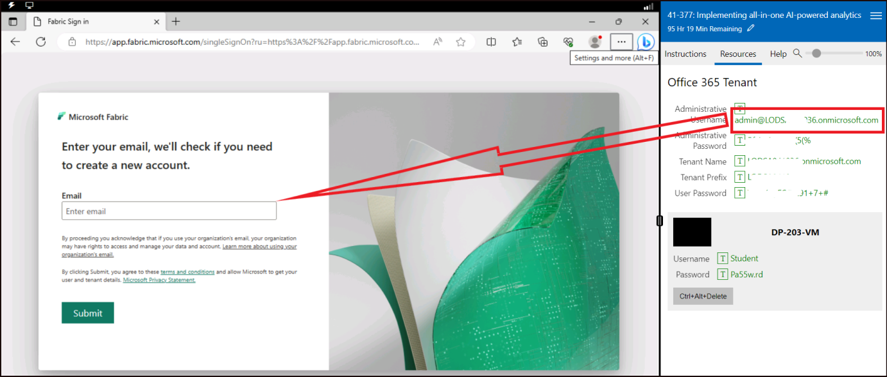
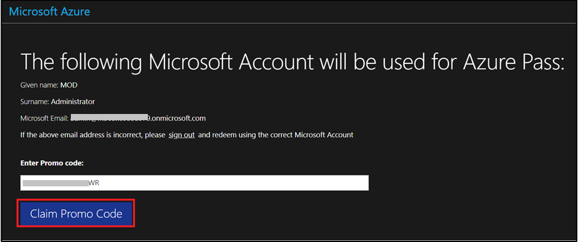
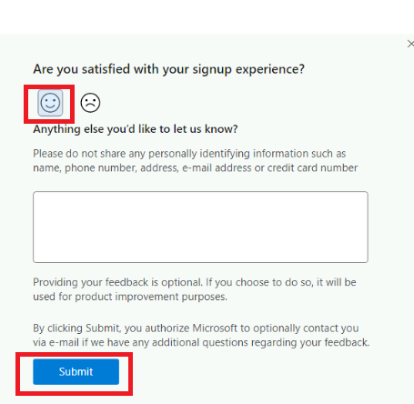

# Laboratorio 01: Ingesta de datos mediante inteligencia en tiempo real

## Introducción

En este laboratorio, comenzará generando rápidamente datos en tiempo
real y comprendiendo cómo se pueden procesar y visualizar esos datos en
Microsoft Fabric. Con los informes iniciales en su lugar, varios módulos
están disponibles que exploran el data warehousing, la arquitectura de
Data Lakehouse, Data Activator, Data Science y, por supuesto, Real-time
Analytics. Los módulos están diseñados para ser cohesivos pero
flexibles: todos implican el mismo escenario central pero tienen
dependencias limitadas para que pueda consumir los módulos que tengan
más sentido para usted.

La arquitectura básica de la solución se ilustra a continuación. La
aplicación desplegada al principio de este laboratorio (ya sea como un
contenedor Docker o ejecutándose en Jupyter notebook) publicará eventos
en nuestro entorno Fabric. Los datos se ingieren en una base de datos
KQL para la generación de informes en tiempo real en Power BI.

En este laboratorio, te pondrás manos a la obra con una empresa
financiera ficticia "AbboCost". A AbboCost le gustaría configurar una
plataforma de monitorización de acciones para monitorizar las
fluctuaciones de precios e informar sobre datos históricos. A lo largo
del taller, veremos cómo cada aspecto de Microsoft Fabric puede ser
incorporado como parte de una solución más amplia -- al tener todo en
una solución integrada, usted será capaz de integrar datos de forma
rápida y segura, construir informes, crear data warehouses y lakehouses,
pronosticar usando modelos ML, y mucho más.

  

# Objetivos

- Inscribirse en la prueba gratuita de Microsoft Fabric, canjee Azure
  Pass y configure los permisos necesarios en el portal de Azure.

- Crear capacidad de Fabric y espacio de trabajo, cuenta de
  almacenamiento y espacio de trabajo de Fabric.

- Implementar la aplicación generadora de acciones a través de Azure
  Container Instance utilizando una plantilla ARM.

- Configurar Eventstream en Microsoft Fabric para la ingesta de datos en
  tiempo real desde Azure Event Hubs, garantizando una integración
  perfecta y una vista previa de los datos para su posterior análisis.

- Crear una base de datos KQL dentro de Microsoft Fabric y enviar datos
  desde Eventstream a la base de datos KQL.

# Ejercicio 1: Configuración del entorno

Para seguir los ejercicios de laboratorio, es necesario aprovisionar un
conjunto de recursos. En el centro del escenario se encuentra el script
generador de cotizaciones bursátiles en tiempo real que genera un flujo
continuo de cotizaciones bursátiles que se utilizan a lo largo del
taller.

Recomendamos desplegar el generador de precios de acciones a través de
Azure Container Instance porque el clúster Spark por defecto consumirá
un gran número de recursos.

## Tarea 1: Inicie sesión en su cuenta de Power BI y suscríbase a la [versión de prueba gratuita de Microsoft Fabric.](https://learn.microsoft.com/en-us/fabric/get-started/fabric-trial)

1.  Abra su navegador, vaya a la barra de direcciones y escriba o pegue
    la siguiente URL: https://app.fabric.microsoft.com/ y, a
    continuación, pulse el botón **Enter**.

     

2.  En la ventana **Microsoft Fabric**, introduzca sus credenciales de
    Microsoft 365 y haga clic en el botón **Submit**.
     

     

3.  Introduzca la **contraseña administrativa** de la pestaña
    **Resources** y haga clic en el botón **Sign In.**

     

4.  En la ventana **Stay signed in?**, haga clic en el botón **Yes**.

     

5.  Será dirigido a la página de inicio de Power BI.
 
     

## Tarea 2: Iniciar la prueba de Microsoft Fabric

1.  En la página de **inicio de Power BI**, haga clic en el icono
    **Account manager for MOD Administrator** en la esquina superior
    derecha de la página. En la hoja del Account manager, navegue y
    seleccione **Start trial** como se muestra en la siguiente
    imagen.

     
2.  En el cuadro de diálogo **Upgrade to a free Microsoft Fabric**
    trial, haga clic en el botón **Activate.**

     

3.  Aparecerá un cuadro de diálogo de notificación de **Successfully
    upgraded to a free Microsoft Fabic trial**. En el cuadro de diálogo,
    haga clic en el botón **Fabric Home Page**.

     
     
## **Tarea 3: Crear un espacio de trabajo Fabric**

En esta tarea, se crea un espacio de trabajo de Fabric. El espacio de
trabajo contiene todos los elementos necesarios para este tutorial de
Lakehouse, que incluye Lakehouse, Dataflows, Data Factory pipelines, los
cuadernos, los conjuntos de datos de Power BI y los informes.

1.  Abra su navegador, vaya a la barra de direcciones y escriba o pegue
    la siguiente URL: https://app.fabric.microsoft.com/ y, a
    continuación, pulse el botón **Enter**. En la página **Microsoft
    Fabric Home**, navegue y haga clic en el mosaico **Power BI**.

     

2.  En el menú de navegación del lado izquierdo de la página **Power BI
    Home**, navegue y haga clic en **Workspaces**, como se muestra en la
    imagen siguiente.

     

3.  En el panel Workspaces, haga clic en el **botón + New workspace**

    

4.  En el panel **Create a workspace** que aparece a la derecha,
    introduzca los siguientes datos y haga clic en el botón **Apply**.

| **Name** | **+++RealTimeWorkspaceXXX+++** (XXX puede ser un número único, puede añadir más números) |
|----|----|
| **Advanced** | Seleccionar Trail |
| **Default storage format** | **Small dataset storage format** |

    
    

## **Tarea 4: Implementar la app a través de Azure Container Instances**

Esta tarea despliega la app generadora de stock en una Azure Container
Instance utilizando una plantilla ARM. La aplicación generará datos de
existencias que publicará en un Azure Event Hub, que también se
configura durante el despliegue de la plantilla ARM.

Para autoimplementar los recursos, siga estos pasos.

1.  Abra una nueva barra de direcciones e introduzca la siguiente URL.
    Si se le pide que inicie sesión, utilice sus credenciales de tenant
    de O365.

> +++https://portal.azure.com/#create/Microsoft.Template/uri/https%3A%2F%2Fraw.githubusercontent.com%2Fmicrosoft%2Ffabricrealtimelab%2Fmain%2Fresources%2Fmodule00%2Ffabricworkshop_arm_managedid.json+++

2.  En la ventana **Deployment personalizado**, en la pestaña
    **Conceptos básicos**, introduzca los siguientes datos y haga clic
    en el botón **Revisar+crear**.

<table>
<colgroup>
<col style="width: 25%" />
<col style="width: 74%" />
</colgroup>
<thead>
<tr class="header">
<th><strong>Suscription</strong></th>
<th><blockquote>

Seleccione la suscripción asignada

</blockquote></th>
</tr>
</thead>
<tbody>
<tr class="odd">
<td><strong>Resource group</strong></td>
<td>Haga clic en <strong>Create new&gt;</strong> introduzca
<strong>+++realtimeworkshop+++</strong> y seleccione
<strong>Ok</strong></td>
</tr>
<tr class="even">
<td><strong>Region</strong></td>
<td>Seleccione <strong>West US 3</strong></td>
</tr>
</tbody>
</table>
 
  
   
    
3.  En la pestaña **Review + create**, navegue y haga clic en el botón
    **Create.**
     

4.  Espere a que se complete el Deployment. La implementación tardará
    unos 10-15 minutos.

5.  Una vez completado el Deployment, haga clic en el botón **Go to
    resource**.
     

4.  En **el grupo de recursos realtimeworkshop**, compruebe que el
    **espacio de nombres Event Hub** y **Azure Container Instance
    (ACI)** se han desplegado correctamente.
      

5.  Abra el **espacio de nombres Event Hub**, que tendrá un nombre
    similar a **ehns-XXXXXX-fabricworkshop**.

     

6.  En el menú de navegación izquierdo de la página **del espacio de
    nombres Event Hub**, vaya a la sección **Settings** y haga clic en
    **Shared access policies**.

      

7.  En la página ***Shared access policies***, haga clic en
    ***stockeventhub_sas*** .**Política SAS:** el panel
    **stockeventhub_sas** aparece en el lado derecho, copie la **clave
    primaria** y el **espacio de nombres Event Hub** (como
    *ehns-XXXXXX-fabricworkshop*) y péguelos en un bloc de notas, ya que
    los necesita en la próxima tarea. En resumen, necesitará lo
    siguiente:

      
      

## **Tarea 5: Obtener datos con Eventstreams**

1.  Vuelva a Microsoft Fabric, navegue y haga clic en **Power BI** en la
    parte inferior de la página y, a continuación, seleccione
    **Real-Time Intelligence**.

      

2.  En la pagina de inicio **de Synapse Real-Time Analytics**,
    seleccione **Eventstream**. Nombre el Eventstream +++
    *StockEventStream+++, marque las **Enhanced Capabilities (preview
    y haga clic en el botón **Create**.

     
     
3.  En el Eventstreams, seleccione **Add external source**

     

4.  En Add source, seleccione **Azure *Event Hubs.***

     

5.  En la página de configuración de **Azure Event Hubs**, introduzca
    los siguientes datos y haga clic en el botón **Add**.

<!-- -->

-  Configure los ajustes de conexión: Haga clic en **New Connection** e
    introduzca los siguientes datos y, a continuación, haga clic en el
    botón **Create**.

<!-- -->

a.  En el espacio de nombres Event Hub: introduzca el nombre del Event
    Hub (los valores que ha guardado en el bloc de notas**).**

b.  Event Hub : **+++StockEventHub+++**

c.  Nombre de Shared Access Key:**+++stockeventhub_sas+++**

d.  Shared Access Key: introduzca la clave principal (el valor que ha
    guardado en el bloc de notas en la **Tarea 8).**

<!-- -->

e.  Consumer group: $Default

f.  Formato de datos: **JSON** y pulse el botón **Next**
      
      
      
      
      
6.  Verá una notificación indicando **Successfully added The source
    “StockEventHub,Azure Event Hubs”**.
      
7.  Con el Event Hub configurado, haga clic en **Test result**.
    Debería ver eventos que incluyan el símbolo de stock, el precio y la
    marca de tiempo.
     

10. En el Eventstream, seleccione **Publish.**
      
      

11. En el Eventstream, seleccione **AzureEventHub** y haga clic en el
    botón **Refreash**.
     
     

# Ejercicio 2: Configuración e ingestión de la base de datos KQL

Ahora que nuestro entorno está totalmente configurado, vamos a completar
la ingesta del Eventstreams, para que los datos sean ingeridos en una
base de datos KQL. Estos datos también se almacenarán en Fabric OneLake.

## Tarea 1: Crear base de datos KQL

KQL (Kusto Query Language) es el lenguaje de consulta utilizado por
Real-time Analytics en Microsoft Fabric junto con otras soluciones, como
Azure Data Explorer, Log Analytics, Microsoft 365 Defender, etc. Similar
a Structured Query Language (SQL), KQL está optimizado para consultas
ad-hoc sobre Big Data, series temporales de datos y transformación de
datos.

Para trabajar con los datos, crearemos una base de datos KQL y
transmitiremos los datos del Eventstream a la base de datos KQL.

1.  En el menú de navegación de la izquierda, navegue y haga clic en
    **RealTime workspaceXXX**, como se muestra en la siguiente imagen.
      
2.  En la página **Real-Time Intelligence**, vaya a la sección **+New
    item** y haga clic en, seleccione **Eventhouse** para crear
    Eventhouse.
      

3.  En el cuadro de diálogo **New Eventhouse**, introduzca
    **+++StockDB+++** en el campo **Name**, haga clic en el botón
    **Create** y abra el nuevo Eventhouse.

      
      
4.  Haga clic en el **icono del lápiz** como se muestra en la imagen de
    abajo para cambiar la configuración y seleccione el **Turno on**, a
    continuación, haga clic en el botón **Done** para habilitar el
    acceso OneLake.

      
      
      

5.  Después de habilitar OneLake, es posible que tenga que actualizar la
    página para verificar que la integración de la carpeta OneLake está
    activa.
      
      

## Tarea 2: Enviar datos del Eventstreams a la base de datos KQL

1.  En el menú de navegación de la izquierda, navegue y haga clic en
    **StockEventStream** creado en la tarea anterior, como se muestra en
    la siguiente imagen.

      
2.  En el Eventstream, haga clic en el botón **Edit**.
      
3.  Nuestros datos deberían estar llegando a nuestro Eventstream, y
    ahora vamos a configurar los datos para ser ingeridos en la base de
    datos KQL que creamos en la tarea anterior. En el Eventstream, haga
    clic en **Transform events or add destination,** luego navega y haga
    clic en **Eventhouse**.
      

4.  En la configuración de KQL, seleccione *Direct ingestion*. Si bien
    tenemos la oportunidad de procesar los datos de eventos en esta
    etapa, para nuestros propósitos, vamos a ingerir los datos
    directamente en la base de datos KQL. Establezca el nombre de
    destino en **+++KQL+++**, luego seleccione su **workspace,Eventhouse**
    y la base de datos KQL creada en la tarea anterior, luego haga clic
    en el botón **Save**.
      
5.  Pulse el botón **Publish**
     
     
     
6.  En el panel Eventstreams, seleccione **configure** en el destino
    **KQL**.
      

7.  En la primera página de configuración, seleccione **+New table** e
    introduzca el nombre *+++StockPrice+++* para la tabla que contendrá
    los datos en StockDB. Haga clic en el botón **Next**.
      
      

8.  La siguiente página nos permite inspeccionar y configurar el
    esquema. Asegúrese de cambiar el formato de TXT a **JSON**, si es
    necesario. Las columnas predeterminadas de *símbolo*, *precio* y
    *fecha y hora* deben tener el formato que se muestra en la imagen
    siguiente; a continuación, haga clic en el botón *Finish*.
      
9.  En la página **Summary**, si no hay errores, verá una **marca de
    verificación verde** como se muestra en la siguiente imagen, a
    continuación, haga clic en el botón *Close* para completar la
    configuración.
      
      
10. Pulse el botón **Refresh**
      
11. Seleccione el destino **KQL** y pulse el botón **Refresh**.
      
       

**Resumen**

En este laboratorio, se ha registrado para la prueba de Microsoft Fabric
y canjeado Azure Pass, seguido de la configuración de permisos y la
creación de los recursos necesarios en el portal de Azure, como la
capacidad de Fabric, el espacio de trabajo y la cuenta de
almacenamiento. A continuación, ha desplegado la aplicación generadora
de existencias a través de Azure Container Instance utilizando una
plantilla ARM para generar datos de existencias en tiempo real. Además,
ha configurado Eventstream en Microsoft Fabric para ingerir datos de
Azure Event Hubs y ha preparado la base de datos KQL para almacenar
estos datos de forma eficiente. En este laboratorio, ha establecido un
entorno totalmente funcional para continuar con los ejercicios de
laboratorio posteriores relacionados con el análisis en tiempo real y el
procesamiento de datos.
