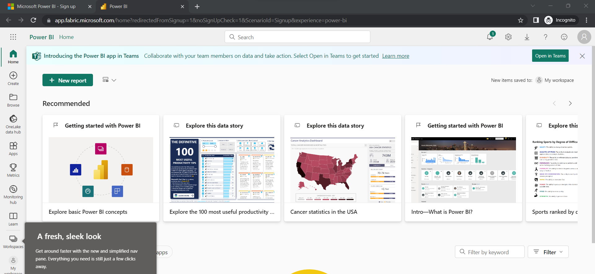
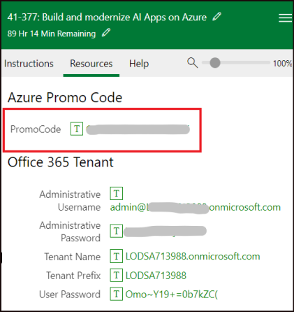

# Lab 01: Ingesting Data using Real-Time Intelligence

## Introduction

In this lab, you will start by rapidly generating real-time data and
understanding how that data can be processed and visualized in Microsoft
Fabric. With the initial reporting in place, multiple modules are
available that explore data warehousing, data lakehouse architecture,
data activator, data science, and of course, real-time analytics. The
modules are designed to be cohesive but flexible -- they all involve the
same core scenario but have limited dependencies so you can consume the
modules that make the most sense for you.

The basic architecture of the solution is illustrated below. The app
deployed in the beginning of this lab (either as a docker container or
running in Jupyter notebook) will publish events to our Fabric
environment. The data is ingested into a KQL database for real-time
reporting in Power BI.

In this lab, you’ll get hands-on with a fictitious financial company
"AbboCost." AbboCost would like to set up a stock monitoring platform to
monitor price fluctuations and report on historical data. Throughout the
workshop, we'll look at how every aspect of Microsoft Fabric can be
incorporated as part of a larger solution -- by having everything in an
integrated solution, you'll be able to quickly and securely integrate
data, build reports, create data warehouses and lakehouses, forecast
using ML models, and more.

 

# Objectives

- To sign up for the free Microsoft Fabric trial, redeem Azure Pass, and
  configure necessary permissions within the Azure portal.

- To create fabric capacity and workspace, storage account, and fabric
  workspace.

- To deploy the stock generator app via Azure Container Instance using
  an ARM template.

- To configure Eventstream in Microsoft Fabric for ingesting real-time
  data from Azure Event Hubs, ensuring seamless integration and data
  preview for subsequent analysis.

- To create a KQL database within Microsoft Fabric and send data from
  Eventstream to the KQL database.

# Exercise 1: Environment Setup

To follow the lab exercises, a set of resources must be provisioned. At
the heart of the scenario is the real-time stock price generator script
that generates a continuous stream of stock prices that are used
throughout the workshop.

We recommend deploying the stock price generator via Azure Container
Instance because the default Spark cluster will consume a large number
of resources.

## Task 1: Sign in to Power BI account and sign up for the free [Microsoft Fabric trial](https://learn.microsoft.com/en-us/fabric/get-started/fabric-trial)

1.  Open your browser, navigate to the address bar, and type or paste
    the following URL: +++https://app.fabric.microsoft.com/+++ then
    press the **Enter** button.

    

2.  In the **Microsoft Fabric** window, enter your given credentials and
    click on the **Submit** button.

     

3.  Enter the **password** from the **Resources** tab and click on the
    **Sign in** button.

     

4.  In **Stay signed in?** window, click on the **Yes** button.

     

5.  You’ll be directed to Power BI Home page.

      

## Task 2: Start the Microsoft Fabric trial

1.  On **Power BI Home** page, click on the **Account manager** **for
    MOD Administrator** icon on the top right corner of the page. In the
    Account manager blade, navigate and select **Start trial** as shown
    in the below image.

      

2.  On **Upgrade to a free Microsoft Fabric** trial dialog box, click on
    **Start trial** button**.**

     

3.  You will see a **Successfully upgraded to a free Microsoft Fabic
    trial** notification dialog box. In the dialog box, click on
    **Fabric Home Page** button.

     
     
## **Task 3: Create a Fabric workspace**

In this task, you create a Fabric workspace. The workspace contains all
the items needed for this lakehouse tutorial, which includes lakehouse,
dataflows, Data Factory pipelines, the notebooks, Power BI datasets, and
reports.

1.  Open your browser, navigate to the address bar, and type or paste
    the following URL: +++https://app.fabric.microsoft.com/+++ then
    press the **Enter** button. In the **Microsoft Fabric Home** page,
    navigate and click on **Power BI** tile.

     

2.  In the **Power BI Home** page left-sided navigation menu, navigate
    and click on **Workspaces** as shown in the below image.

     

3.  In the Workspaces pane, click on **+** **New workspace button**

      

4.  In the **Create a workspace** pane that appears on the right side,
    enter the following details, and click on the **Apply** button.

| **Name** | +++RealTimeWorkspaceXXX+++(XXX can be a unique number, you can add more numbers) |
|----|----|
| **Advanced** | Select Trail |
| **Default storage format** | **Small dataset storage format** |

   
   

## **Task 4: Deploy the app via Azure Container Instance**

This task deploys the stock generator app to an Azure Container Instance
using an ARM template. The app will generate stock data that publishes
the data to an Azure Event Hub, which is also configured during the
deployment of the ARM template.

To auto-deploy the resources, use these steps below.

1.  Open a new address bar and enter the following URL. If prompted to
    Sign in, then use your O365 tenant credentials.

> +++https://portal.azure.com/#create/Microsoft.Template/uri/https%3A%2F%2Fraw.githubusercontent.com%2Fmicrosoft%2Ffabricrealtimelab%2Fmain%2Fresources%2Fmodule00%2Ffabricworkshop_arm_managedid.json+++

2.  In the **Custom deployment** window, under the **Basics** tab, enter
    the following details and click on the **Review+create** button.

<table>
<colgroup>
<col style="width: 25%" />
<col style="width: 74%" />
</colgroup>
<thead>
<tr class="header">
<th><strong>Subscription</strong></th>
<th><blockquote>

Select the assigned subscription

</blockquote></th>
</tr>
</thead>
<tbody>
<tr class="odd">
<td><strong>Resource group</strong></td>
<td>Click on <strong>Create new</strong>&gt; enter
<strong>+++realtimeworkshop+++</strong> and select
<strong>Ok</strong></td>
</tr>
<tr class="even">
<td><strong>Region</strong></td>
<td>Select <strong>West US 3</strong></td>
</tr>
</tbody>
</table>

   
   
3.  In the **Review + create** tab, navigate and click on the **Create**
    button**.**
     

5.  Wait for the deployment to complete. The deployment will take around
    10-15 minutes.

6.  After the deployment is completed, click on the **Go to resource**
    button.

      
4.  In **realtimeworkshop** **Resource group**, verify that the **Event
    Hub Namespace **and **Azure Container Instance (ACI)** are
    successfully deployed.

     

5.  Open the **Event Hub** **namespace**, which will have a name similar
    to **ehns-XXXXXX-fabricworkshop**.

     

6.  In **Event Hub** **namespace** page left-sided navigation menu,
    navigate to **Settings** section and click on **Shared access
    policies**.

      

7.   In the **Shared access policies** page, click on
    ***stockeventhub_sas*** .**SAS Policy: stockeventhub_sas** pane
    appear on the right side, copy the **primary key** and **Event Hub
    namespace** (such as *ehns-XXXXXX-fabricworkshop*) and paste them on
    a notepad, as you need them in the upcoming task. In short, you'll
    need the following:

      
      
## **Task 5: Get data with Eventstream**

1.  Go back to the Microsoft Fabric, navigate and click on **Power BI**
    at the bottom of the page, then select **Real-Time Intelligence**.

     

2.  On the **Synapse Real-Time Analytics** home page,
    select **Eventstream**. Name the Eventstream
    **+++StockEventStream+++**, check the **Enhanced Capabilities
    (preview)*** and click on the **Create** button.

     
     
3.  On the Eventstream, select **Add external source**

     

4.  On the Add source, select **Azure *Event Hubs.***

     
5.  On the **Azure Event Hubs** configuration page, enter the below
    details and click on **Add** button.

<!-- -->

- Configure connection settings: Click on the **New connection** and
    enter the below details then click on **Create** button.

<!-- -->

a.  In Event Hub namespace-Enter Event Hub name (the values that you
    have saved in your notepad)

b.  Event Hub : **+++StockEventHub+++**

c.  Shared Access Key Name:**+++stockeventhub_sas+++**

d.  Shared Access Key- Enter Primary Key (the value that you have saved
    in your notepad in the **Task 4**)

<!-- -->

e.  Consumer group: **$Default**

f.  Data format: **JSON** and click on **Next** button

   
   
   
   
   

6.  You will see a notification stating **Successfully added The source
    “StockEventHub,Azure Event Hubs”** was added.

     

7.  With the Event Hub configured, click on ***Test result***. You
    should see events including the stock symbol, price, and timestamp.

     

8.  On the Eventstream, select **Publish.**

     
     

9.  On the Eventstream, select **AzureEventHub** and click on
    **Refresh** button.

     
     

# Exercise 2: KQL Database Configuration and Ingestion

Now that our environment is fully configured, we will complete the
ingestion of the Eventstream, so that the data is ingested into a KQL
database. This data will also be stored in Fabric OneLake.

## Task 1: Create KQL Database

Kusto Query Language (KQL) is the query language used by Real-Time
analytics in Microsoft Fabric along with several other solutions, like
Azure Data Explorer, Log Analytics, Microsoft 365 Defender, etc. Similar
to Structured Query Language (SQL), KQL is optimized for ad-hoc queries
over big data, time series data, and data transformation.

To work with the data, we'll create a KQL database and stream data from
the Eventstream into the KQL DB.

1.  In the left-sided navigation menu, navigate and click on **RealTime
    workspaceXXX**, as shown in the below image.

      

2.  In the **Real-Time Intelligence** page, navigate to **+New item**
    section and click on, select **Eventhouse** to create Eventhouse.

      

3.  In the **New Eventhouse** dialog box, enter **+++StockDB+++** in
    the **Name** field, click on the **Create** button and open the new
    Eventhouse.

      
      

4.  Select StockDB, click on the **OneLake availability** as shown in
    the below image to change the setting and, then click on the **Turn
    on** button to enable OneLake access.

       
       
       

5.  After enabling OneLake, you may need to refresh the page to verify
    the OneLake folder integration is active.

      
      

## Task 2: Send data from the Eventstream to the KQL database

1.  In the left-sided navigation menu, navigate and click on
    **StockEventStream** created in the previous task, as shown in the
    below image.

      

2.  On the Eventstream, click on the **Edit** button.

      
3.  Our data should be arriving into our Eventstream, and we'll now
    configure the data to be ingested into the KQL database we created
    in the above task. On the Eventstream, click on *Transform events or
    add destination,* then navigate and click on **Eventhouse**.

      

4.  On the KQL settings, select ***Direct ingestion***. While we have
    the opportunity to process event data at this stage, for our
    purposes, we will ingest the data directly into the KQL database.
    Set the destination name to **+++KQL+++**, then select your
    **workspace**, **Eventhouse** and KQL database created in the above
    task, then click on **Save** button.

     

5.  Click on the **Publish** button

      
      
      
6.  On the Eventstream pane, select **configure** in the **KQL**
    destination.

       

7.  On the first settings page, select **+New table** and enter the
    name **+++StockPrice+++** for the table to hold the data in
    StockDB. Click on the **Next** button.

      

      

8.  The next page allows us to inspect and configure the schema. Be sure
    to change the format from TXT to **JSON**, if necessary. The default
    columns of *symbol*, *price*, and *timestamp* should be formatted as
    shown in the below image; then click on the *Finish* button.

      

9.  On the **Summary** page, if there are no errors, you’ll see a
    **green checkmark** as shown in the below image, then click on the
    **Close** button to complete the configuration.

      
      
9.  Click on the **Refresh** button

     

10. Select the **KQL** destination and click on the **Refresh** button.

     
     

**Summary**

In this lab, you’ve signed up for the Microsoft Fabric trial and
redeemed Azure Pass, followed by configuring permissions and creating
necessary resources within the Azure portal such as Fabric Capacity,
Workspace, and Storage Account. Then, you’ve deployed the stock
generator app via Azure Container Instance using an ARM template to
generate real-time stock data. Additionally, you’ve configured
Eventstream in Microsoft Fabric to ingest data from Azure Event Hubs and
prepared the KQL Database to store this data efficiently. In this lab,
you’ve established a fully functional environment to proceed with
subsequent lab exercises related to real-time analytics and data
processing.
