# 실습 01: Real-Time Intelligence를 사용한 데이터 수집

## 소개

이 실습에서는 실시간 데이터를 빠르게 생성하고 해당 데이터를 Microsoft
Fabric에서 처리하고 시각화하는 방법을 이해하는 것부터 시작합니다. 초기
보고가 완료되면 데이터 웨어하우징, 데이터 레이크하우스 아키텍처, Data
Activator, 데이터 과학, 그리고 물론 실시간 분석을 탐색하는 여러 모듈을
사용할 수 있습니다. 모듈은 모두 동일한 핵심 시나리오를 포함하지만
종속성이 제한되어 있으므로 가장 적합한 모듈을 사용할 수 있도록 응집력이
있으면서도 유연하게 설계되었습니다.

솔루션의 기본 아키텍처는 아래에 설명되어 있습니다. 이 실습의 시작
부분에서 배포된 앱(도커 컨테이너로 또는 Jupyter notebook에서 실행 중)은
이벤트를 Fabric 환경에 게시할 것입니다. 데이터는 Power BI에서 실시간
보고를 위해 KQL 데이터베이스로 수집됩니다.

이 실습에서는 가상의 금융 회사 "AbboCost"를 직접 실습해 보겠습니다.
AbboCost는 가격 변동을 모니터링하고 과거 데이터를 보고하기 위해 주식
모니터링 플랫폼을 설정하고자 합니다. 워크샵을 통해 Microsoft Fabric의
모든 측면을 더 큰 솔루션의 일부로 통합하는 방법, 즉 모든 것을 통합
솔루션에 포함함으로써 데이터를 빠르고 안전하게 통합하고, 보고서를
작성하고, 데이터 웨어하우스 및 레이크하우스를 만들고, ML 모델을 사용한
예측 등을 할 수 있는 방법을 살펴볼 것입니다.

# 목표

- 무료 Microsoft Fabric 평가판에 등록하려면 Azure Pass를 사용하고 Azure
  Portal에서 필요한 권한을 구성합니다

- Fabric 용량 및 작업 공간, 스토리지 계정, Fabric 작업 공간을 만듭니다.

- ARM 템플릿을 사용하여 Azure Container Instance를 통해 주식 생성기 앱을
  배포합니다.

- 후속 분석을 위한 원활한 통합 및 데이터 미리 보기를 보장하고 Azure
  Event Hubs에서 실시간 데이터를 수집하기 위해 Microsoft Fabric에서
  Eventstream을 구성합니다.

- Microsoft Fabric 내에서 KQL 데이터베이스를 만들고 Eventstream에서 KQL
  데이터베이스로 데이터를 보냅니다.

# 연습 1: 환경 설정

실습을 수행하려면 일련의 Resources를 프로비저닝해야 합니다. 시나리오의
핵심은 워크숍 내내 사용되는 주가의 연속적인 흐름을 생성하는 실시간 주가
생성기 스크립트입니다.

기본 Spark 클러스터는 많은 Resources를 소비하므로 주가 생성기를 Azure
Container Instance를 통해 배포하는 것을 권장합니다.

## 작업 1: Power BI 계정에 로그인하고 무료 [Microsoft Fabric 평가판에](https://learn.microsoft.com/en-us/fabric/get-started/fabric-trial) 등록하기

1.  브라우저를 열고 주소 표시줄로 이동하여 다음 URL을 입력하거나
    붙여넣으세요: +++https://app.fabric.microsoft.com/+++ **Enter** 버튼을
    누르세요.

    

2.  **Microsoft Fabric** 창에서 Microsoft 365 자격 증명을 입력하고
    **Submit** 버튼을 클릭하세요.

     

    
3.  **Resources** 탭에서 **관리자 비밀번호를** 입력하고 **Sign in**
    버튼을 클릭하세요**.**

     

4.  **Stay signed in?** 창에서 **예** 버튼을 클릭하세요.

      

5.  Power BI 홈 페이지로 이동됩니다.

     

## 작업 2: Microsoft Fabric 평가판 시작하기

1.  **Power BI 홈** 페이지에서 페이지 오른쪽 상단의 **Account manager
    for MOD Administrator를** 클릭하세요. 아래 이미지와 같이 계정 관리자
    블레이드로 이동하여 **Start trial을** 선택하세요**.**

      

2.  **Upgrade to a free Microsoft Fabric trial** 대화 상자에서 **Start
    Trial** 버튼을 **클릭하세요.**

     

3.  **Successfully upgraded to a free Microsoft Fabic trial** 알림 대화
    상자가 표시됩니다. 대화 상자에서 **Fabric Home Page** 버튼을
    클릭하세요.

     
     

## **작업 3: Fabric 작업 공간 만들기**

이 작업에서는 Fabric 작업 공간을 만듭니다. 이 작업 공간에는 이 Lakehouse
튜토리얼에 필요한 모든 항목이 포함되어 있으며, 여기에는 레이크하우스,
Dataflows, 데이터 팩토리 파이프라인, 노트북, Power BI 데이터 세트 및
보고서가 포함됩니다.

1.  브라우저를 열고 주소 표시줄로 이동하여 다음 URL을 입력하거나
    붙여넣으세요: https://app.fabric.microsoft.com/ **입력한** 다음
    **Enter** 버튼을 누르세요. **Microsoft Fabric 홈** 페이지에서
    **Power BI** 타일을 탐색하여 클릭하세요.

      

2.  **Power BI 홈** 페이지 왼쪽 탐색 메뉴에서 아래 이미지와 같이
    **워크스페이스를** 탐색하여 클릭하세요.

       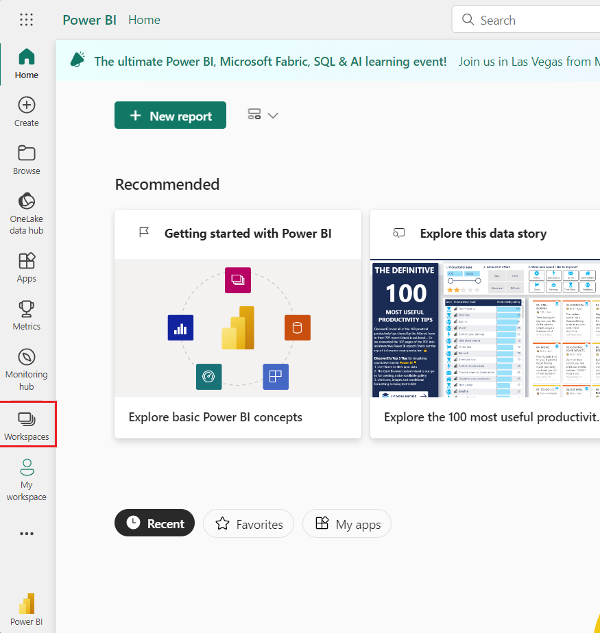

3.  작업 공간 창에서 **+ New workspace 버튼을** 클릭하세요.

     

4.  오른쪽에 표시되는 **Create a workspace** 창에서 다음 세부 정보를
    입력하고 **Apply** 버튼을 클릭하세요.

| **Name** | +++RealTimeWorkspaceXXX+++(XXX can be a unique number, you can add more numbers) |
|----|----|
| **Advanced** | Select Trail |
| **Default storage format** | **Small dataset storage format** |

  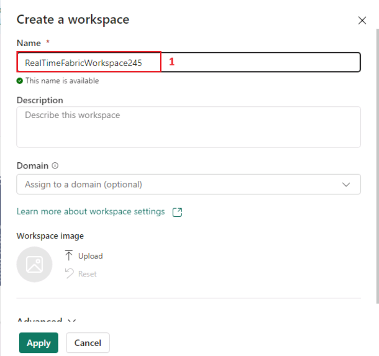
      

## **작업 4: Azure Container Instance를 통해 앱 배포하기**

이 작업은 ARM 템플릿을 사용하여 주식 생성기 앱을 Azure Container
Instance에 배포합니다. 이 앱은 주식 데이터를 생성하여 데이터를 Azure
Event Hub에 게시하며, 이 데이터는 ARM 템플릿을 배포하는 동안에도
구성됩니다.

Resources를 자동 배포하려면 아래 단계를 따르세요.

1.  새 주소창을 열고 다음 URL을 입력하세요. 로그인하라는 메시지가
    표시되면 O365 테넌트 자격 증명을 사용하세요.

> +++https://portal.azure.com/#create/Microsoft.Template/uri/https%3A%2F%2Fraw.githubusercontent.com%2Fmicrosoft%2Ffabricrealtimelab%2Fmain%2Fresources%2Fmodule00%2Ffabricworkshop_arm_managedid.json+++

2.  **Custom deployment** 창의 **Basics** 탭에서 다음 세부 정보를
    입력하고 **Review+create** 버튼을 클릭하세요.

|               |                                                                |
|---------------|----------------------------------------------------------------|
|Subscription   |Select the assigned subscription	                               |
|Resource group |Click on Create new> enter +++realtimeworkshop+++ and select Ok	|
|Region         |Select West US 3	|
   
    

3.  **Review + create** 탭에서 탐색하여 **Create** 버튼을
    **클릭하세요.**

     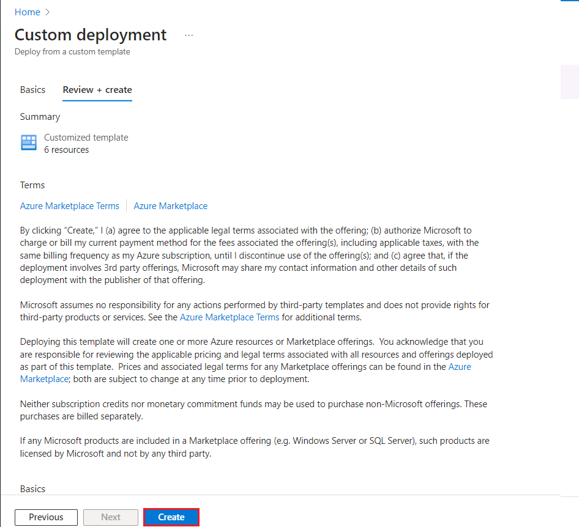

4.  배포가 완료될 때까지 기다리세요. 배포에는 약 10~15분이 걸립니다.

5.  배포가 완료되면 **Go to resource** 버튼을 클릭하세요.

     

6.  **realtimeworkshop Resource group**에서 **Event Hub Namespace** 및
    **Azure Container Instance (ACI)**가 성공적으로 배포되었는지
    확인하세요.

     

7.  **Event Hub Namespace 를** 열면 ***ehns-XXXXXX-fabricworkshop과***
    비슷한 이름의 **네임스페이스가** 열립니다.

      

6.  **Event Hub namespace** 페이지의 왼쪽 탐색 메뉴에서 **Settings**
    섹션으로 이동하여 **Shared access policies를** 클릭하세요.

      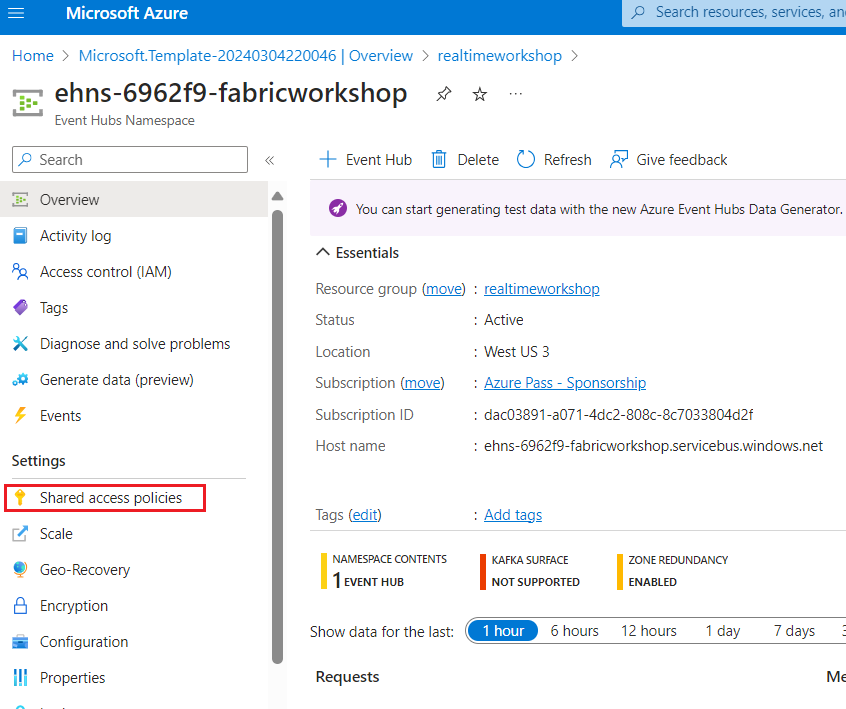

7.  **Shared access policies** 페이지에서 ***stockeventhub_sas***
    .**SAS policy: stockeventhub_sas** 창이 오른쪽에 나타나면 **primary
    key**와 **Event Hub 네임스페이스**(예:
    *ehns-XXXXXX-fabricworkshop*)를 **복사하여** 향후 작업에 필요한 대로
    메모장에 붙여넣으세요. 간단히 말해, 다음이 필요합니다:

     

     

## **작업 5: Eventstream으로 데이터 가져오기**

1.  Microsoft Fabric으로 돌아가서 페이지 하단의 **Power BI를** 탐색하여
    클릭한 다음 **Real-Time Intelligence를** 선택하세요.

     

2.  **Synapse Real-time Analytics** 홈 페이지에서 **Eventstream을**
    선택하세요. **eventstream**의 이름을 +++StockEventStream+++으로
    지정하고, **향상된 기능(미리 보기)을** 확인한* 다음 **create**
    버튼을 클릭하세요.

    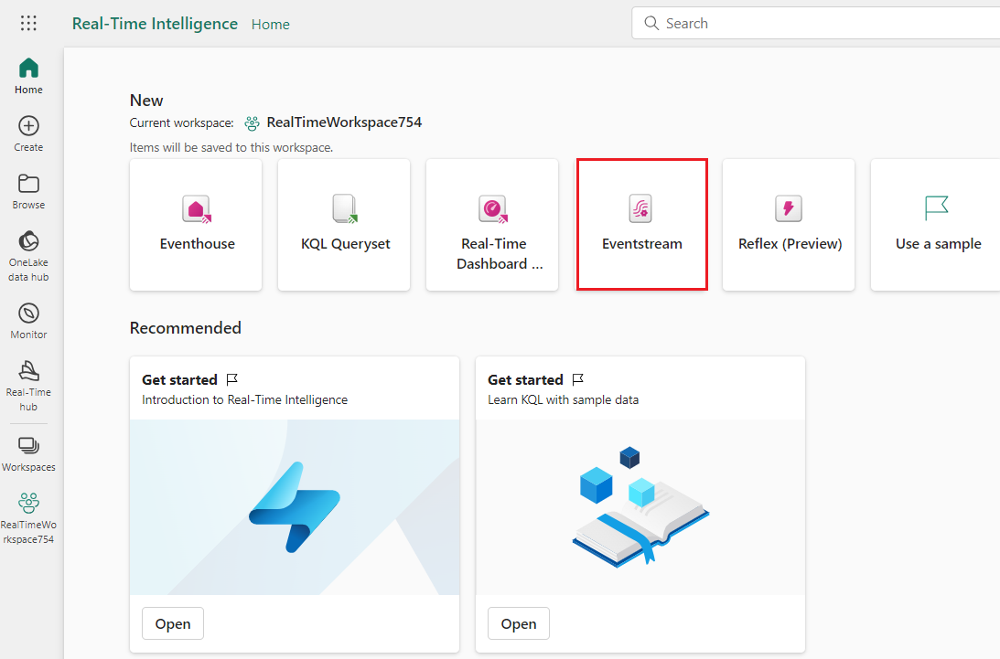

    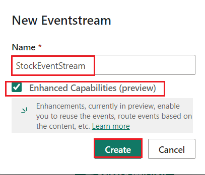

3.  Eventstream에서 **Add external source를** 선택하세요.

    

4.  Add source에서 **Azure *Event Hubs를 ***선택하세요***.***

     

5.  **Azure Event Hubs** 구성 페이지에서 아래 세부 정보를 입력하고
    **Add** 버튼을 클릭하세요.

&nbsp;

a.  연결 설정을 구성하세요: **New connection을** 클릭하고 아래 세부
    정보를 입력한 다음 **Create** 버튼을 클릭하세요.

&nbsp;

b.  Event Hub namespace에서 - 이벤트 허브 이름(메모장에 저장한 값**)**을
    입력하세요**.**

c.  Event Hub : **+++StockEventHub+++**

d.  Shared Access Key Name:**+++stockeventhub_sas+++**

e.  Shared Access Key- 기본 키(**작업 8의** 메모장에 저장한 값**)를
    입력하세요.**

&nbsp;

-  소비자 그룹: ***$Default*** 

-.  데이터 형식: **JSON을** 입력하고 **next** 버튼을 클릭하세요.
      
      
      
      
      

8.  **Successfully added The source “StockEventHub,Azure Event Hubs”
    라는** 알림이 표시됩니다.

     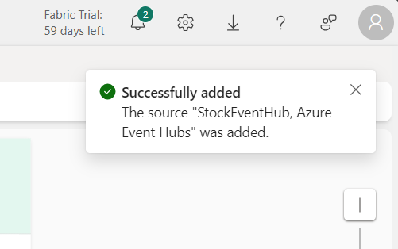

9.  Event Hub를 구성한 상태에서 ***Test result를*** 클릭하세요. 주식
    심볼, 가격 및 타임스탬프를 포함한 이벤트가 표시됩니다.

     

10. Eventstream에서 **Publish를** 선택하세요**.**

    

    

11. Eventstream에서 **AzureEventHub를** 선택하고 **Refresh** 버튼을
    클릭하세요.

    

    

# 연습 2: KQL 데이터베이스 구성 및 수집

이제 환경이 완전히 구성되었으므로, **eventstream**의 수집을 완료하여
데이터가 KQL 데이터베이스로 수집되도록 합니다. 이 데이터는 또한 Fabric
OneLake에 저장됩니다.

## 작업 1: KQL 데이터베이스 만들기

KQL(Kusto Query Language)은 Microsoft Fabric의 Real-time analytics에
사용되는 쿼리 언어로, Azure Data Explorer, Log Analytics, Microsoft 365
Defender 등과 같은 여러 다른 솔루션과 함께 사용됩니다. Structured Query
Language (SQL)와 마찬가지로 KQL은 빅 데이터, 시계열 데이터 및 데이터
변환에 대한 애드혹 쿼리에 최적화되어 있습니다.

데이터로 작업하기 위해 KQL 데이터베이스를 생성하고 Eventstream의
데이터를 KQL DB로 스트리밍합니다.

1.  왼쪽 탐색 메뉴에서 아래 이미지와 같이 **RealTime workspaceXXX를**
    탐색하여 클릭하세요.

     

2.  **Real-Time Intelligence** 페이지에서 **New section으**로 이동한 후
    **Eventhouse를** 클릭하여 이벤트하우스를 만드세요.

     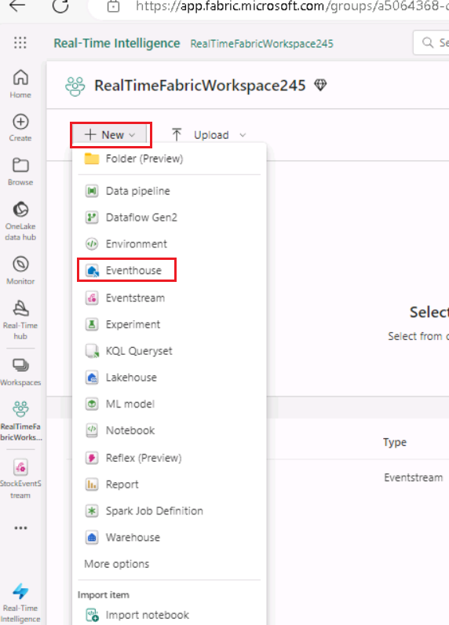

3.  **New Eventhouse ** 대화 상자에서 Name 필드에 +++StockDB+++를
    입력하고 **create** 버튼을 클릭한 다음 새 이벤트하우스를 여세요.

    
    

4.  아래 이미지와 같이 **OneLake availability** icon을 클릭하여 설정을 변경하고
    **Turn on** 선택한 다음 **완료** 버튼을 클릭하면 OneLake 액세스를
    활성화할 수 있습니다.

     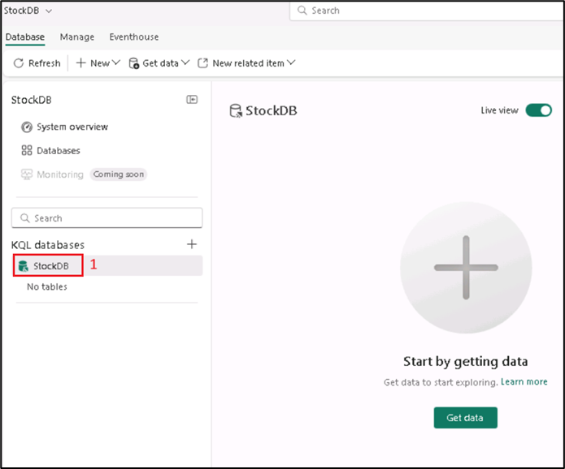
     
     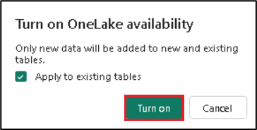

5.  OneLake를 활성화한 후 페이지를 새로 고쳐서 OneLake 폴더 통합이
    활성화되었는지 확인 할 수 있습니다.

     

     

## 작업 2: Eventstream에서 KQL 데이터베이스로 데이터 보내기

1.  왼쪽 탐색 메뉴에서 아래 이미지와 같이 이전 작업에서 만든
    **StockEventStream을** 탐색하여 클릭하세요.

     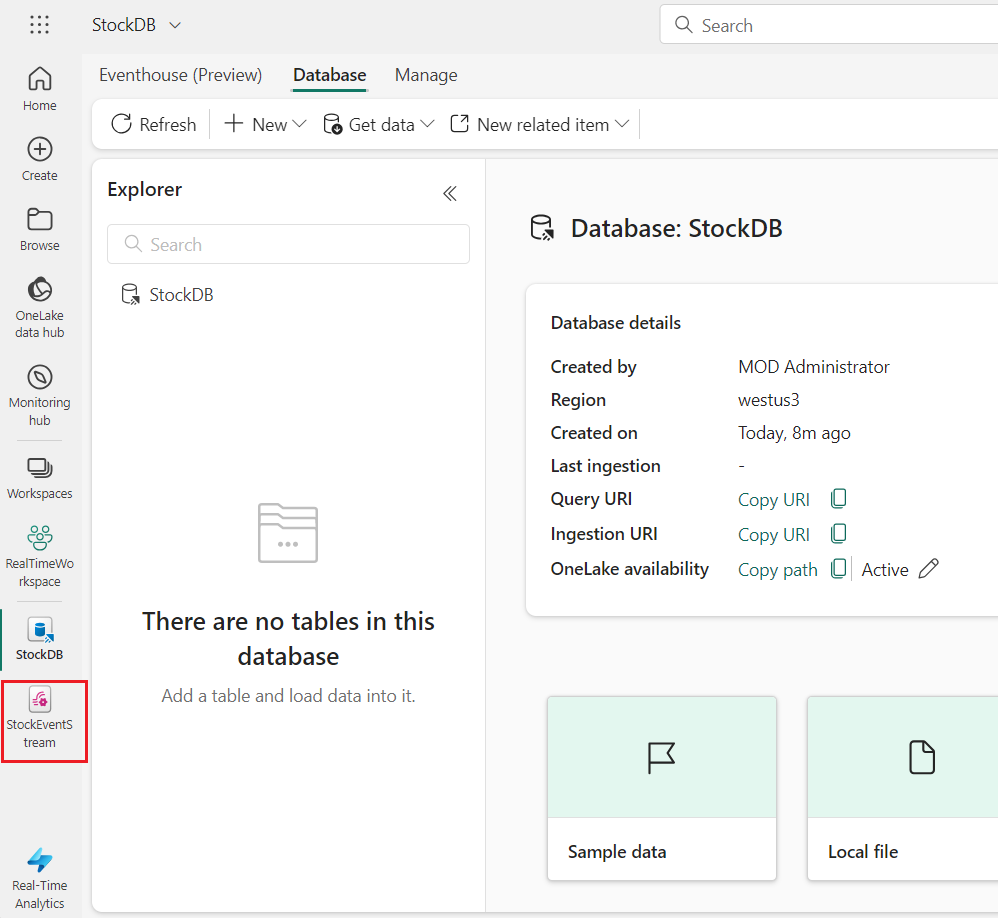

2.  Eventstream에서 **Edit** 버튼을 클릭하세요.

     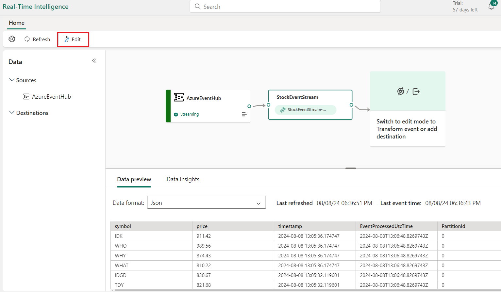

3.  이제 데이터가 Eventstream에 도착할 것이며, 위 작업에서 만든 KQL
    데이터베이스로 데이터를 수집하도록 구성하겠습니다. Eventstream에서
    *Transform events or add destination을 클릭한* 다음, **KQL
    Database를** 탐색하여 클릭하세요.

      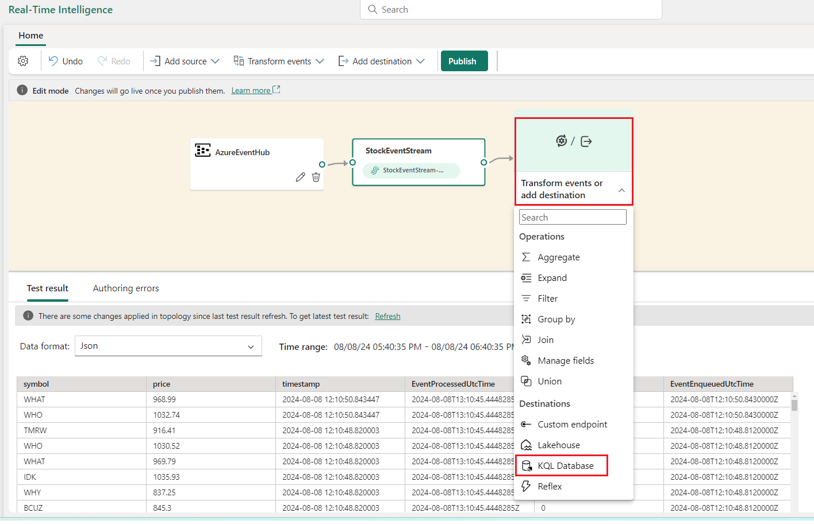

4.  KQL 설정에서 *직접 수집을* 선택하세요. 이 단계에서는 이벤트 데이터를
    처리할 수 있지만, 여기서는 KQL 데이터베이스로 직접 데이터를
    수집하겠습니다. 대상 이름을 *+++KQL+++로* 설정한 다음, 위 작업에서
    생성한 **작업** 공간과 KQL 데이터베이스를 선택한 다음 Save 버튼을
    클릭하세요.

     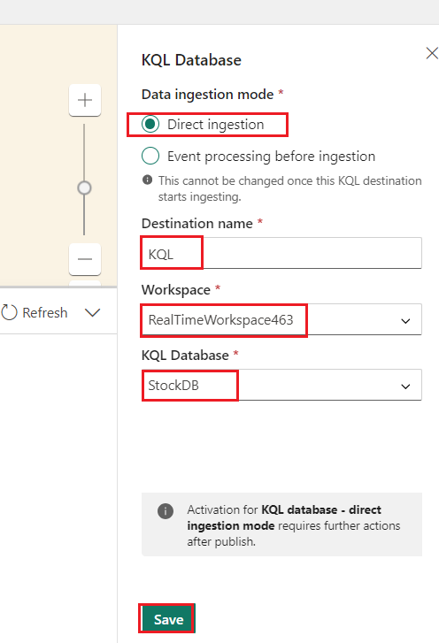

5.  **Publish** 버튼을 클릭하세요.

    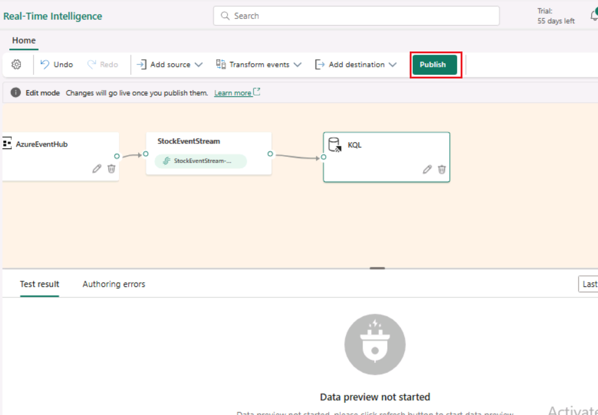

    

    

6.  Eventstream 창에서 **KQL** 대상에서 **configure를** 선택하세요.

     

7.  첫 번째 설정 페이지에서 **+New table을** 선택하고 StockDB에 데이터를
    저장할 테이블의 이름을 **+++StockPrice+++**로 입력합니다. **Next**
    버튼을 클릭하세요.
     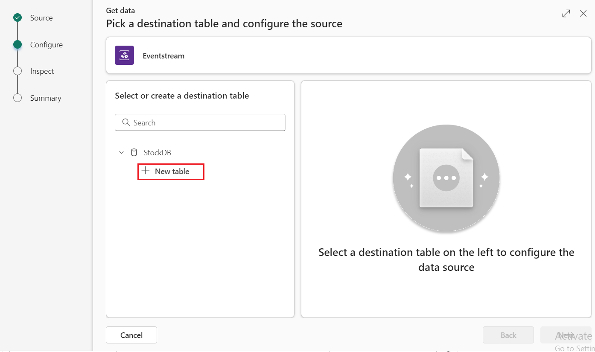

     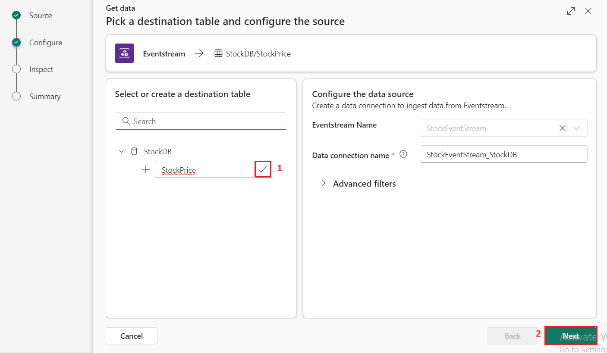

8.  다음 페이지에서는 스키마를 검사하고 구성할 수 있습니다. 필요한 경우
    형식을 TXT에서 **JSON으로** 변경해야 합니다. *symbol, price,
    및 timestamp의* 기본 열은 아래 이미지와 같이 형식을 지정한 다음
    *Finish* 버튼을 클릭하세요.

     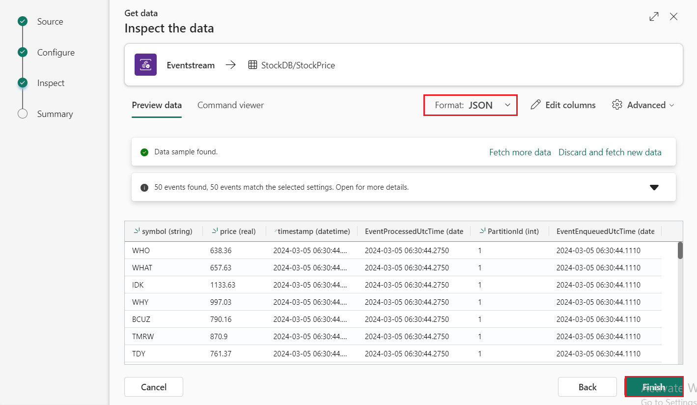

9.  **Summary** 페이지에서 오류가 없으면 아래 이미지와 같이 **녹색 확인
    표시가** 표시되고 *close* 버튼을 클릭하여 구성을 완료하세요.

     

     

10.  **Refresh** 버튼을 클릭하세요.

      
11. **KQL** 대상을 선택하고 **Refresh** 버튼을 클릭하세요.

     

     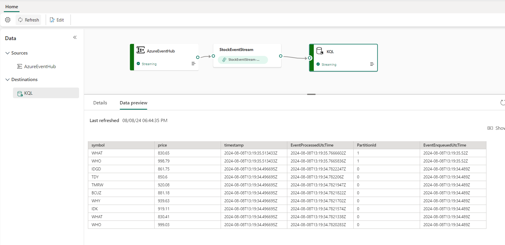

**요약**

이 실습에서는 Microsoft Fabric 평가판에 등록하고 Azure Pass를 사용한
다음, 사용 권한을 구성하고 Azure Portal에서 Fabric 용량, 작업 공간 및
스토리지 계정과 같은 필요한 Resources를 생성했습니다. 그런 다음 실시간
재고 데이터를 생성하기 위해 ARM 템플릿을 사용하여 Azure Container
Instance를 통해 재고 생성기 앱을 배포했습니다. 또한, Azure Event
Hubs에서 데이터를 수집하도록 Microsoft Fabric에서 Eventstream을 구성하고
이 데이터를 효율적으로 저장하기 위해 KQL 데이터베이스를 준비했습니다. 이
실습에서는 실시간 분석 및 데이터 처리와 관련된 후속 실습을 진행할 수
있는 완전한 기능을 갖춘 환경을 구축했습니다.
