# 實驗室 01：使用即時智慧輸入資料

## 導言

在本實驗室中，您將從快速生成即時資料開始，瞭解如何在 Microsoft Fabric
中處理和 Visualization
這些資料。有了初始報告，就可以使用多個模組來探索資料倉庫、資料 Lakehouse
架構、資料
Activator、資料科學，當然還有即時分析。這些模組的設計既具有內聚性，又具有靈活性--它們都涉及相同的核心方案，但依賴性有限，因此您可以使用對您最有意義的模組。

解決方案的基本架構如下圖所示。本實驗室開始時部署的應用程式（作為 docker
容器或在 Jupyter notebook 中運行）將向我們的 Fabric
環境發佈事件。資料會被攝取到 KQL 資料庫中，以便在 Power BI
中進行即時報告。

在本實驗室中，您將親手操作一家虛構的金融公司 "AbboCost"。AbboCost
希望建立一個股票監控平臺，以監控價格波動並報告歷史資料。在整個研討會中，我們將探討如何將
Microsoft Fabric 的各個方面整合為更大解決方案的一部分 --
通過將所有內容整合到一個集成解決方案中，您將能夠快速安全地整合資料、構建報告、創建資料倉庫和
Lakehouse、使用 ML Model 進行預測等。

# 目標

- 要註冊免費試用 Microsoft Fabric，兌換 Azure 通行證，並在 Azure Portal
  門戶內配置必要的許可權。

- 創建 Fabric 容量和工作區、存儲帳戶和 Fabric 工作區。

- 使用 ARM 範本通過 Azure Container Instance 部署股票生成器應用程式。

- 在 Microsoft Fabric 中配置 Eventstream，以便從 Azure Event Hubs
  接收即時資料，確保無縫集成和資料預覽，以便進行後續分析。

- 在 Microsoft Fabric 中創建 KQL 資料庫，並將資料從 Eventstreams 發送到
  KQL 資料庫。

# 練習 1：環境設置

要進行實驗室練習，必須配置一組資源。該場景的核心是即時股票價格生成器腳本，該腳本可生成連續的股票價格流，並在整個研討會期間使用。

我們建議通過 Azure Container Instance 部署股價生成器，因為默認的 Spark
集群會消耗大量資源。

## 任務 1：登錄 Power BI 帳戶並註冊免費的 [Microsoft Fabric 試用版](https://learn.microsoft.com/en-us/fabric/get-started/fabric-trial)

1.  打開流覽器，導航至地址欄，鍵入或粘貼以下
    URL：+++https://app.fabric.microsoft.com/+++，然後按 **Enter** 鍵。

     

2.  在 **Microsoft Fabric** 視窗中，輸入您的 Microsoft 365
    憑據，然後按一下 "**提交**" 按鈕。

     

3.  從 "**資源** "選項卡中輸入**管理密碼**，然後按一下 "**登錄
    "**按鈕**。**

      

4.  在 "**保持登錄狀態？**"視窗中，按一下 "**是** "按鈕。

     

5.  您將進入 Power BI 主頁。

     

## 任務 2：啟動 Microsoft Fabric 試用版

1.  在 **Power BI 主頁**上，點擊頁面右上角的 **MOD
    管理員帳戶管理器圖示**。在 "帳戶管理器 "刀片中，導航並選擇
    **"開始試用"，**如下圖所示**。**

     

2.  在 **"升級到免費 Microsoft Fabric** 試用版 "對話方塊中，按一下
   **"開始試用"**按鈕。

      

3.  您將看到 "**成功升級到免費 Microsoft Fabic 試用版**
    "通知對話方塊。在對話方塊中，按一下**織物主頁**按鈕。

      
 
      

## **任務 3：創建織物工作區**

在此任務中，您將創建一個 Fabric 工作區。該工作區包含本 Lakehouse
教程所需的所有項目，其中包括 Lakehouse、資料流程、Data Factory
管道、筆記本、Power BI 資料集和報表。

1.  打開流覽器，導航到地址欄，鍵入或粘貼以下
    URL：+++https://app.fabric.microsoft.com/+++，然後按 **Enter** 鍵。在
    **Microsoft Fabric 主頁**中，導航並按一下 **Power BI** 磁貼。

     

2.  在 **Power BI
    主頁**左側導航菜單中，導航並點擊**工作空間**，如下圖所示。

     

3.  在工作區窗格中，點擊 **+ 新建工作區按鈕**

     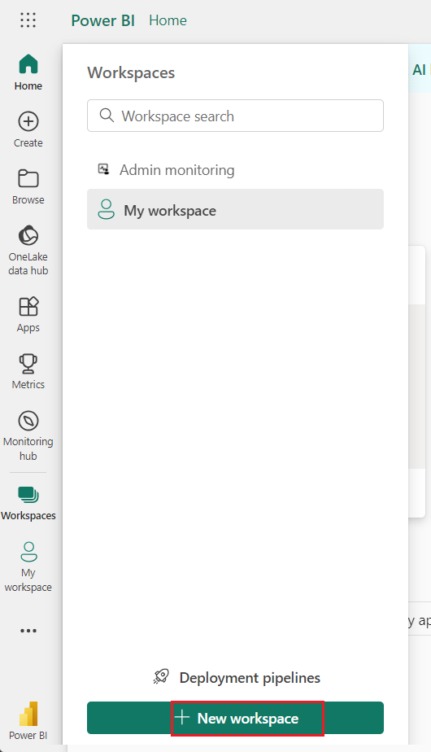
4.  在右側顯示的 "**創建工作區** "窗格中，輸入以下詳細資訊，然後按一下
    "**應用** "按鈕。

      |  |  |
      |----|----|
      |名稱 |	+++即時工作區 XXX+++（XXX 可以是一個唯一的數位，也可以添加更多數字）|
      |高級	|選擇路徑|
      |預設存儲格式 |	小資料集存儲格式|

       
         

## **任務 4：通過 Azure 容器實例部署應用程式**

此任務使用 ARM 範本將股票生成器應用程式部署到 Azure Container
Instance。該應用程式將生成股票資料，並將資料發佈到 Azure Event
Hubs，Azure Event Hubs 也是在部署 ARM 範本時配置的。

要自動部署資源，請使用以下步驟。

1.  打開新的位址欄並輸入以下 URL。如果提示登錄，請使用您的 O365
    租戶憑據。

+++https://portal.azure.com/#create/Microsoft.Template/uri/https%3A%2F%2Fraw.githubusercontent.com%2Fmicrosoft%2Ffabricrealtimelab%2Fmain%2Fresources%2Fmodule00%2Ffabricworkshop_arm_managedid.json+++

2.  在 "**自訂部署** "視窗的 "**基礎**
    "選項卡下，輸入以下詳細資訊，然後按一下 "**審核+創建** "按鈕。
      |  |  |
      |----|----|
      |訂閱	|選擇指定的訂閱 |
      |資源組	| 按一下 "新建"> 輸入 +++realtimeworkshop+++ 並選擇 "確定|
      |地區	| 選擇美國西部 3|
 
      
      
      

3.  在 "**審核+創建** "選項卡中，導航並按一下 "**創建 "**按鈕**。**

    

5.  等待部署完成。部署大約需要 10-15 分鐘。

6.  部署完成後，按一下 "**轉到資源** "按鈕。

     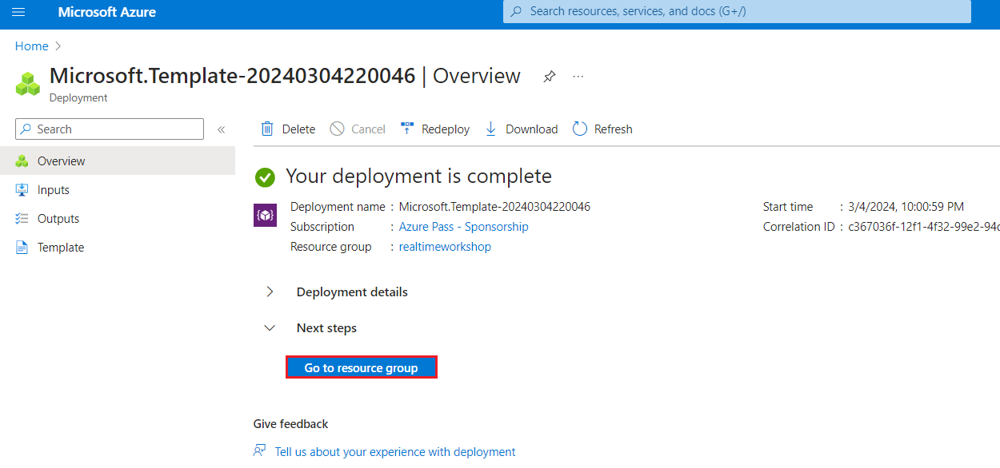

7.  在 **realtimeworkshop 資源組中**，驗證是否已成功部署 **Event Hub
    命名空間**和 **Azure Container Instance (ACI)**。

     

8.  打開 **Event Hub 命名空間**，其名稱類似於
    ***ehns-XXXXXX-fabricworkshop***。

      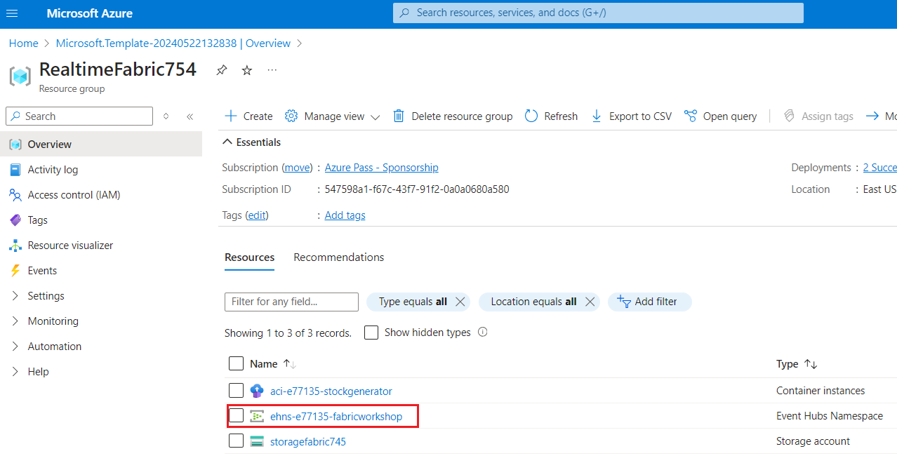

9.  在 **Event Hub
    命名空間**頁面左側導航功能表中，導航至**設置**部分並按一下**共用訪問策略**。

     

10.  在***共用訪問策略***頁面，按一下 ***stockeventhub_sas*** .**SAS
    策略：**右側出現 **stockeventhub_sas** *窗格*，複製**主鍵**和
    **Event Hub 命名空間**（如
    **ehns-XXXXXX-fabricworkshop**）並粘貼到記事本上，因為在接下來的任務中需要它們。簡而言之，您需要以下內容：

      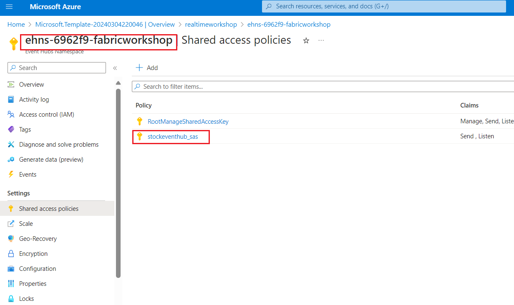
      
      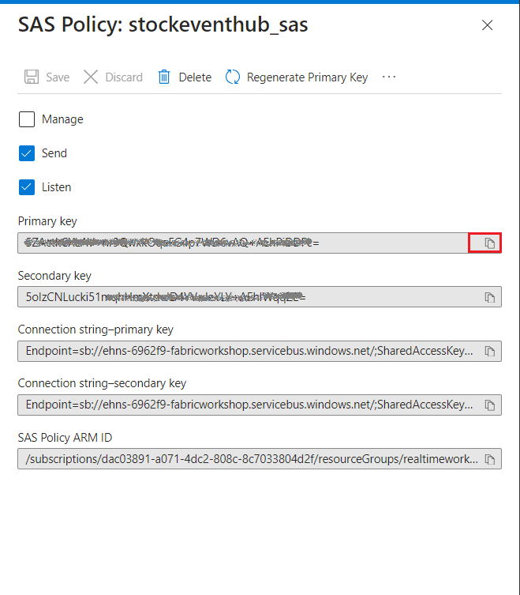
## **任務 5：使用 Eventstreams 獲取資料**

1.  返回 Microsoft Fabric，導航並點擊頁面底部的 **Power
    BI**，然後選擇**即時智能**。

     

2.  在 **Synapse Real-Time Analytics** 主頁上，選擇 **Eventstreams**。將
    Eventstreams 命名為 **+++StockEventStream+++**，選中**增強功能（預覽）**，然後按一下**創建**按鈕。

     

    

3.  在 Eventstreams 上，選擇**添加外部源**

    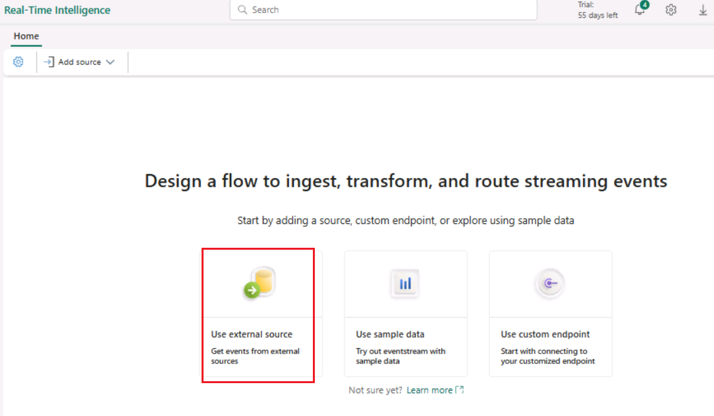

4.  在添加源上，選擇 **Azure Event Hubs**

     

5.  在 "**Azure Event Hubs "**配置頁面，輸入以下詳細資訊，然後按一下
    "**添加** "按鈕。

      a.  配置連接設置：點擊**新建連接**，輸入以下詳細資訊，然後點擊**創建**按鈕。
      
      b.  在 Event Hub 名稱空間--輸入 Event Hub 名稱（您在記事本中保存的值）
      
      c.  Event Hub : **+++StockEventHub++++**
      
      d.  共用訪問金鑰名稱：**+++stockeventhub_sas+++**
      
      e.  共用訪問金鑰- 輸入主金鑰（您在**任務 8** 的記事本中保存的值）
               
      f.  消費群：**$Default** 
      
      g.  資料格式：**JSON** 並按一下 "**下一步** "按鈕

     
        
     
      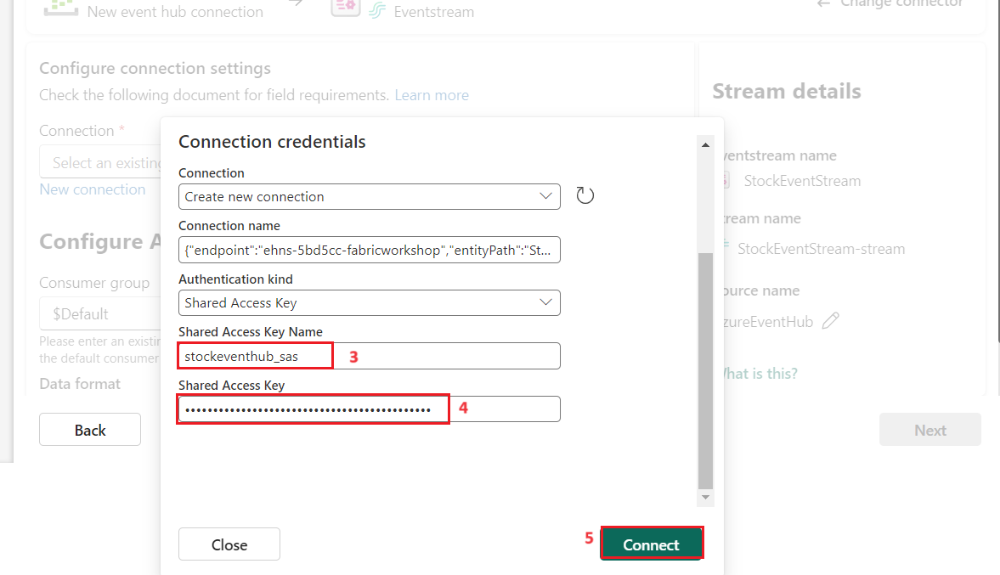
        
     
      
     

8.  您將看到一條通知，說明 已成功添加源 **"StockEventHub,Azure Event
    Hubs"**。

     

9.  配置好 Event Hub
    後，點擊**測試結果**。您應該能看到包括股票代碼、價格和時間戳記在內的事件。

     

10. 在 Eventstreams 上，選擇 "**發佈"。**

     

     

11. 在 Eventstreams 上，選擇 **AzureEventHub** 並按一下 "**刷新**
    "按鈕。

     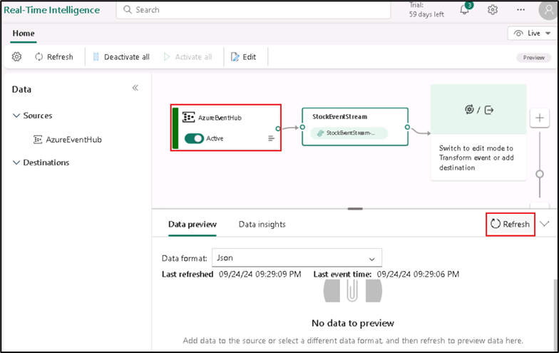

     

# 練習 2：KQL 資料庫配置和輸入

現在，我們的環境已經完全配置完畢，我們將完成 Eventstreams
的攝取，以便將資料攝取到 KQL 資料庫中。這些資料也將存儲在 Fabric OneLake
中。

## 任務 1：創建 KQL 資料庫

Kusto Query Language (KQL) 是 Microsoft Fabric
即時分析以及其他幾個解決方案（如 Azure Data Explorer、Log
Analytics、Microsoft 365 Defender 等）使用的查詢語言。與 Structured
Query Language (SQL) 類似，KQL 針對 Big Data、時間序列資料和資料
Transformation 的臨時查詢進行了優化。

為了處理資料，我們將創建一個 KQL 資料庫，並將 Eventstreams
中的資料流程導入 KQL DB。

1.  在左側導航菜單中，導航並按一下**即時工作區 XXXX**，如下圖所示。

     

2.  在 "**即時智慧 "**頁面，導航至 "**新建** "部分，點擊選擇
    **Eventhouse**，即可創建 Eventhouse。

     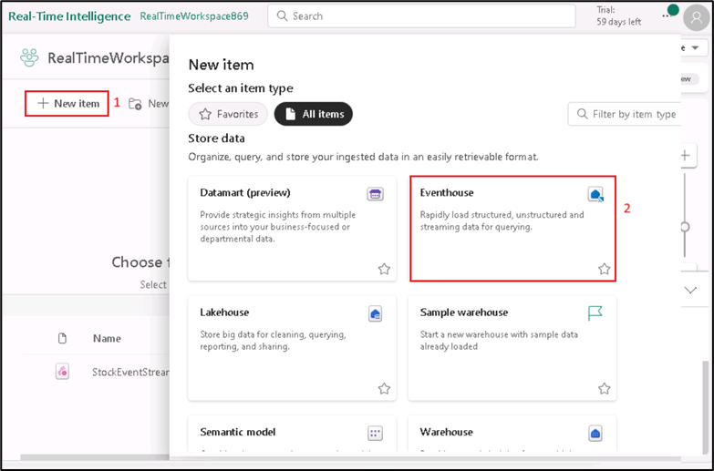

3.  在 "**新建活動房屋** "對話方塊中，在 "**名稱** "欄位中輸入
    **+**++StockDB+++，按一下 "**創建** "按鈕並打開新活動房屋。

      
      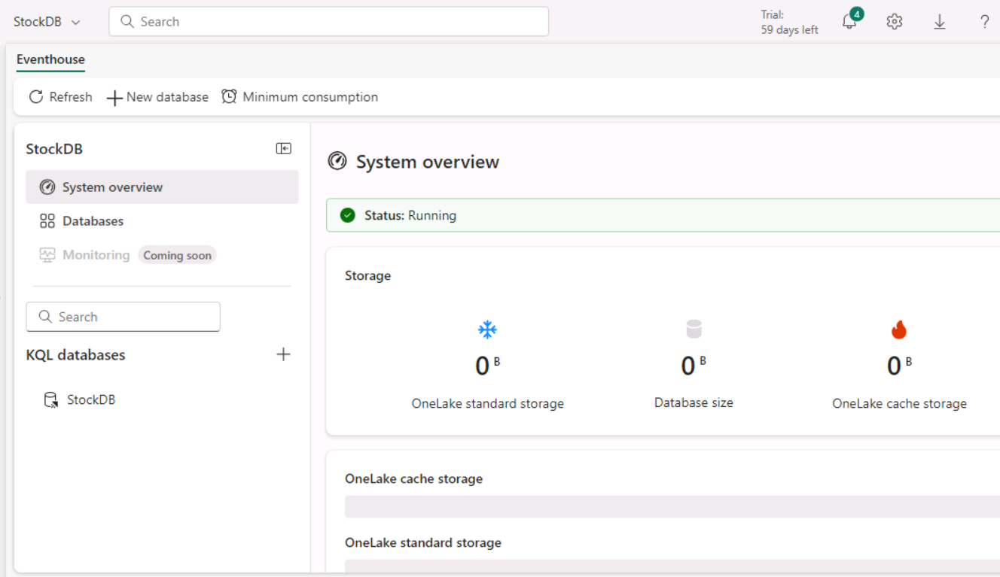

4.  點擊下圖所示的**鉛筆圖示**更改設置並選擇 "**啟動**"，然後點擊
    "**完成** "按鈕啟用 OneLake 訪問。

     
      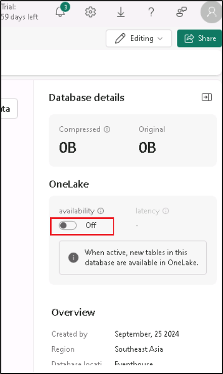
     
5.  啟用 OneLake 後，您可能需要刷新頁面以驗證 OneLake
    資料夾集成是否啟動。

      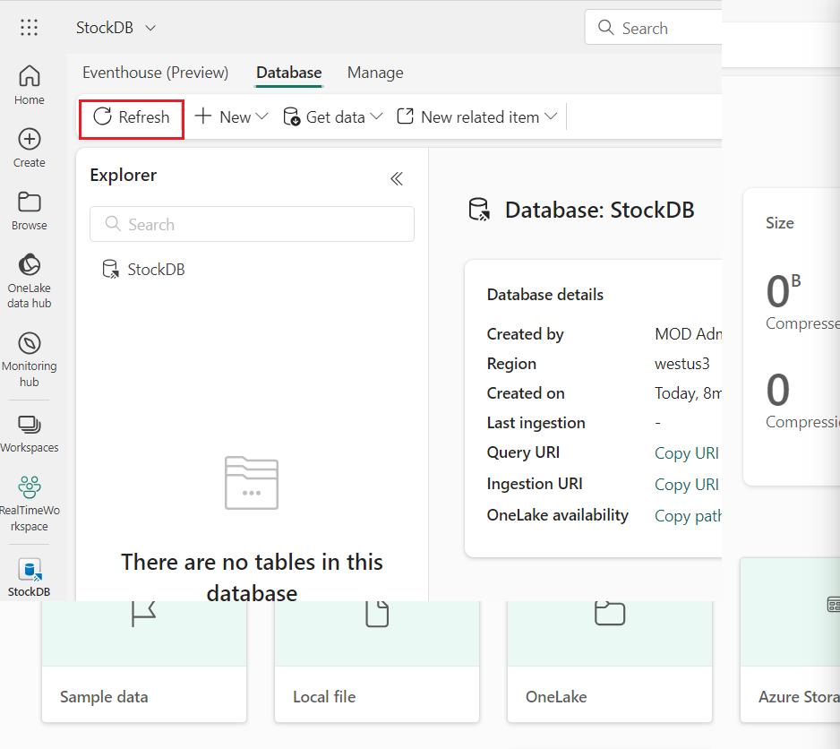
      
      

## 任務 2：將資料從 Eventstreams 發送到 KQL 資料庫

1.  如下圖所示，在左側導航功能表中，導航並點擊上一個任務中創建的
    **StockEventStream**。

     

2.  在 Eventstreams 上，按一下 **編輯** 按鈕。

     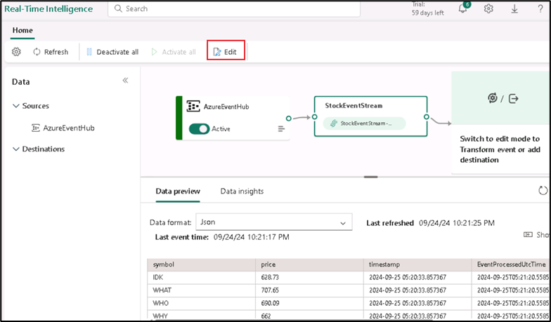

3.  我們的資料應該已經到達
    Eventstreams，現在我們將對資料進行配置，以便將其攝取到我們在上述任務中創建的
    KQL 資料庫中。在 Eventstreams 上，按一下 "*轉換事件 "或
    "添加目標*"*，*然後導航並按一下 "**Eventhouse 資料庫**"。

      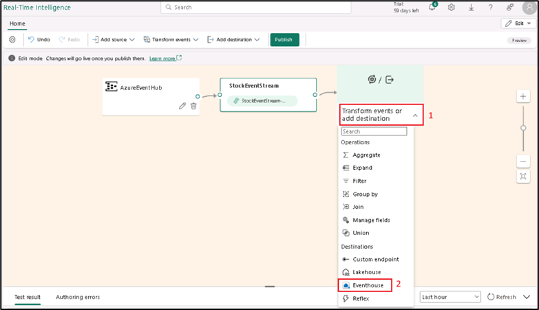

4.  在 KQL
    設置中，選擇*直接攝取*。雖然我們有機會在此階段處理事件資料，但出於我們的目的，我們將直接把資料攝取到
    KQL 資料庫中。將目標名稱設置為
    +++KQL+++，然後選擇在上述任務中創建的**工作區**和 KQL
    資料庫，然後點擊**保存**按鈕。

     

5.  點擊 **發佈**按鈕

     

     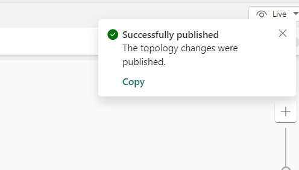

      

6.  在 Eventstreams 窗格中，選擇 **KQL** 目標中的**配置**。

     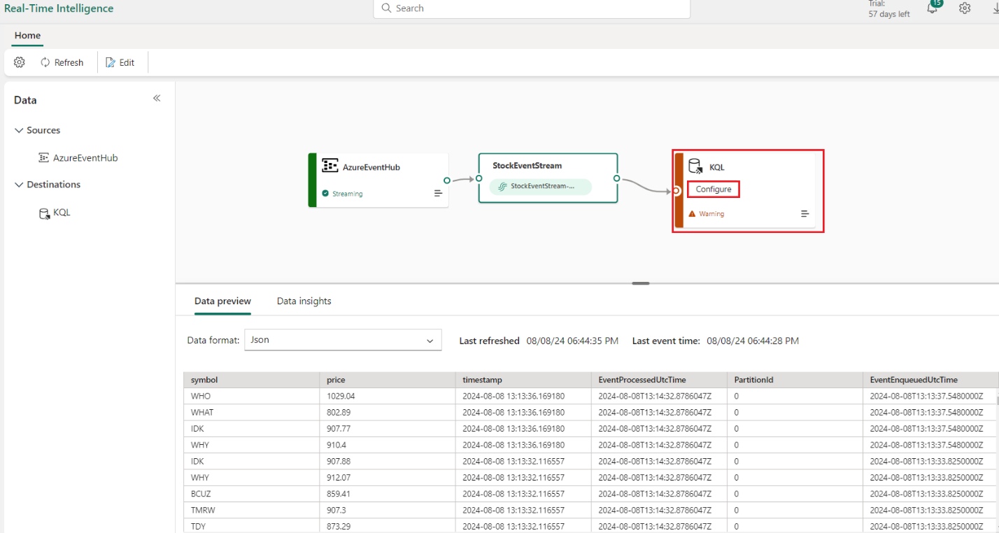

7.  在第一個設置頁面，選擇 "**+**+**新建表**"，然後輸入名稱
    **+++StockPrice+++** 作為在 StockDB 中保存資料的表。點擊 "**下一步**
    "按鈕。

     

     

8.  下一頁允許我們檢查並配置模式。如有必要，請務必將格式從 TXT 更改為
    **JSON**。預設的*符號*、*價格*和*時間戳記*列的格式應如下圖所示；然後按一下
    "*完成* "按鈕。

     

9.  在 "**摘要**
    "頁面，如果沒有錯誤，你會看到一個**綠色核取記號**，如下圖所示，然後點擊
    "**關閉** "按鈕完成配置。

      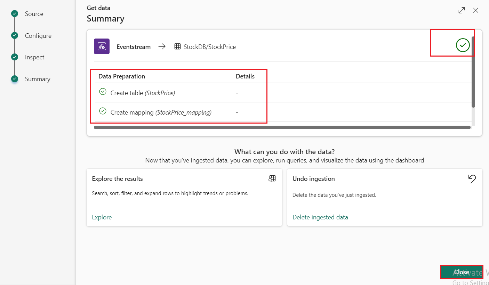

      

9.  點擊**刷新**按鈕

    

10. 選擇 **KQL** 目的地，然後點擊**刷新**按鈕。

      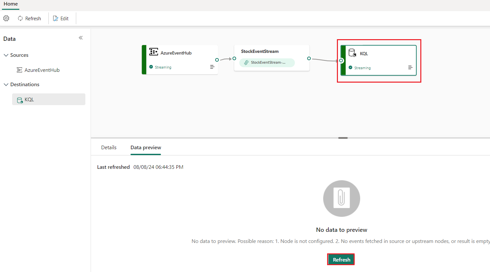

      

**摘要**

在本實驗室中，您註冊了 Microsoft Fabric 試用版並兌換了 Azure
通行證，隨後在 Azure Portal 門戶中配置了許可權並創建了必要的資源，如
Fabric 容量、工作空間和存儲帳戶。然後，使用 ARM Templates 通過 Azure
Container Instance
部署股票生成器應用程式，以生成即時股票資料。此外，您還在 Microsoft
Fabric 中配置了 Eventstreams 以從 Azure Event Hubs 獲取資料，並準備了
KQL
資料庫以高效存儲這些資料。在本實驗室中，您已經建立了一個功能齊全的環境，可以繼續進行與即時分析和資料處理相關的後續實驗練習。
