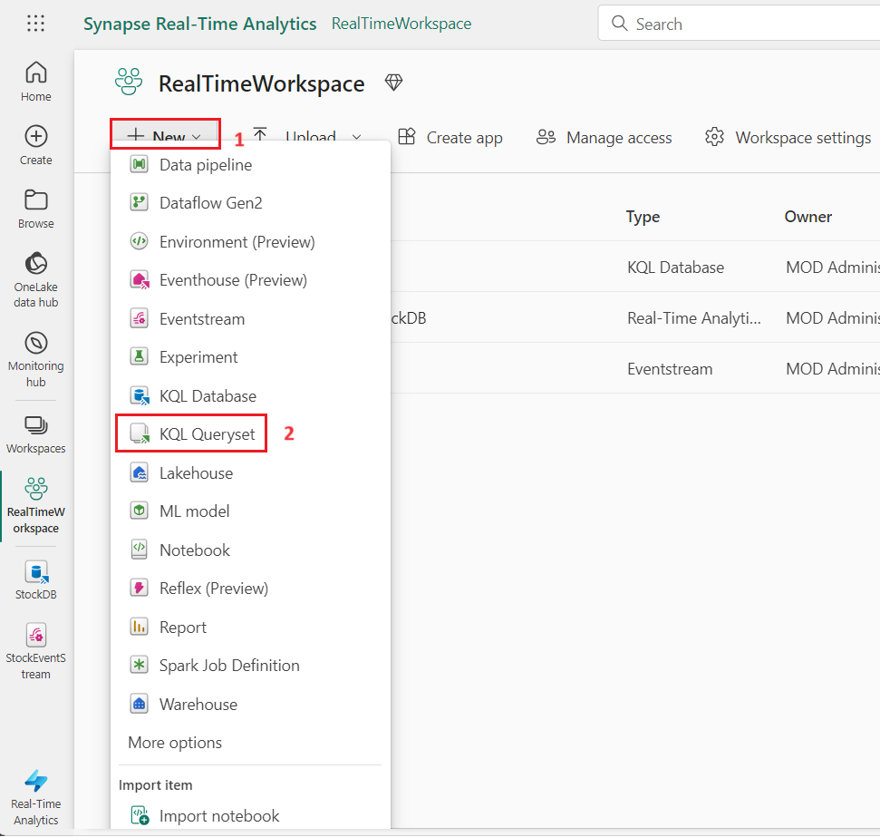
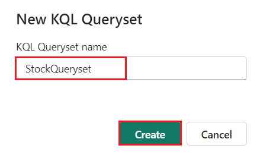
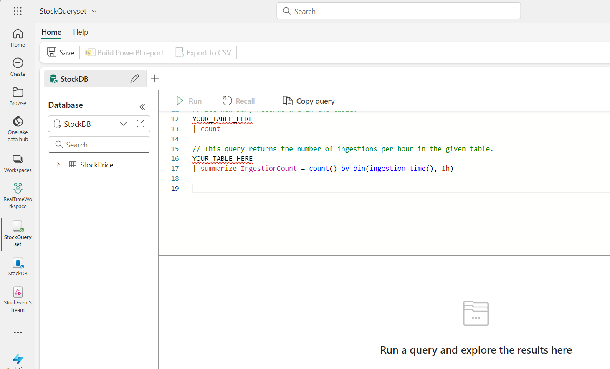
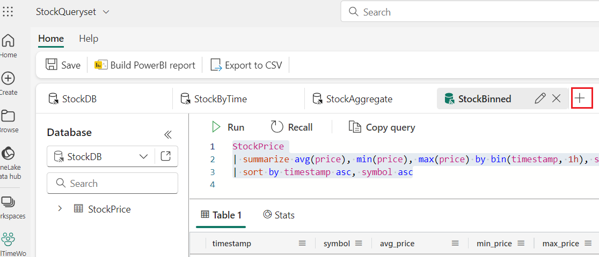
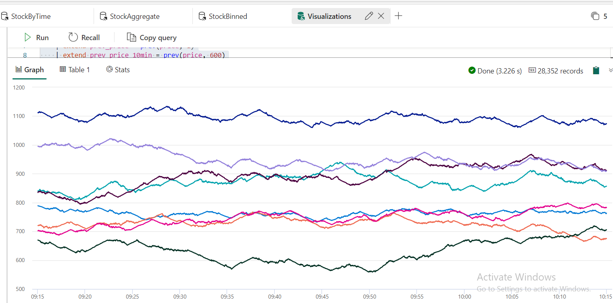
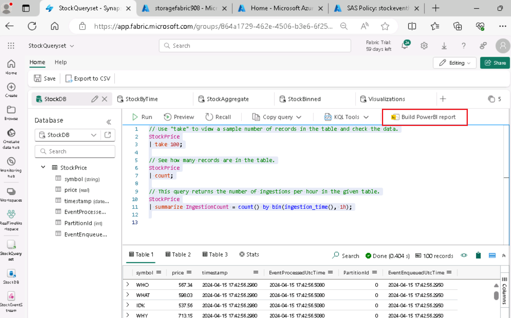
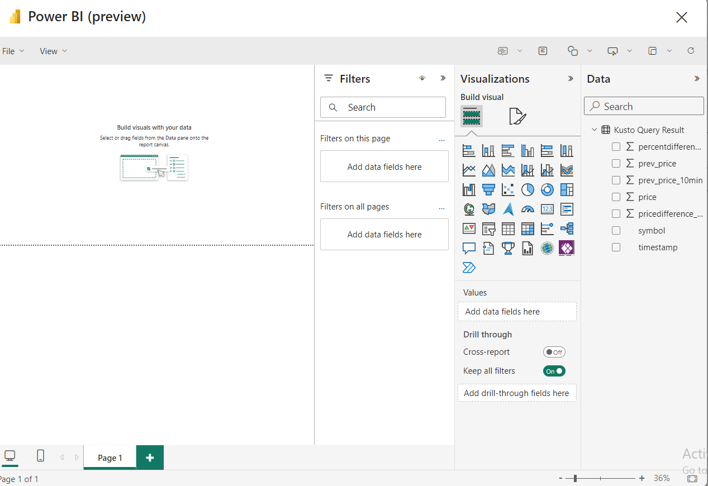
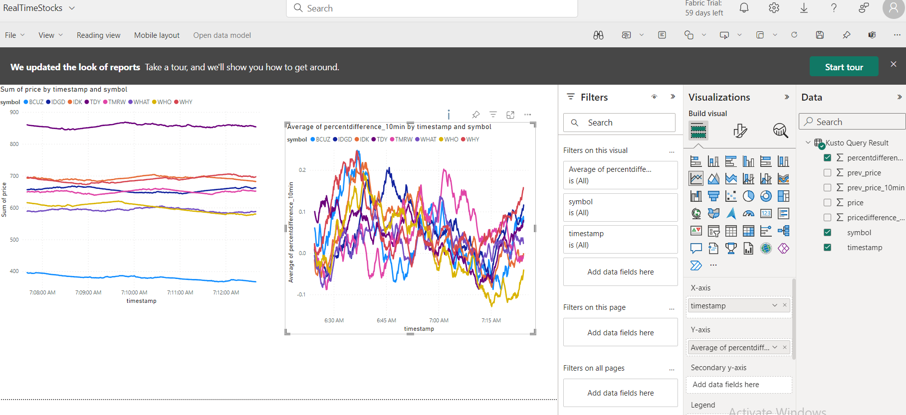
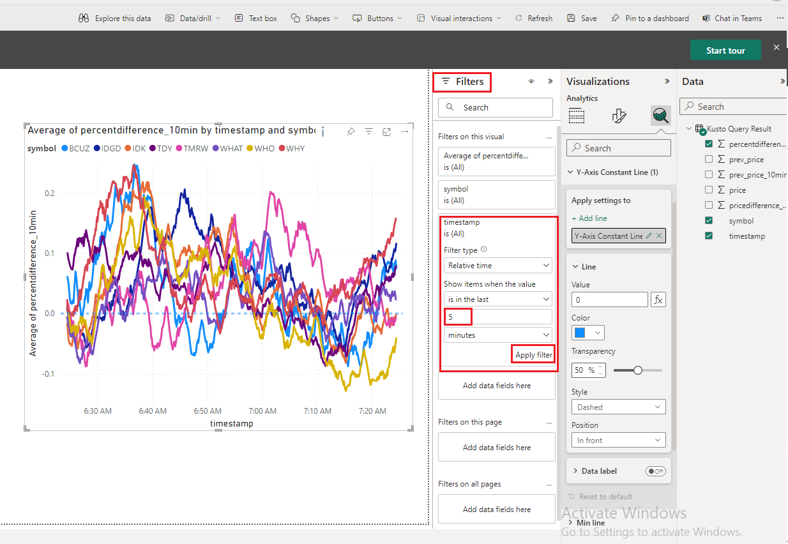
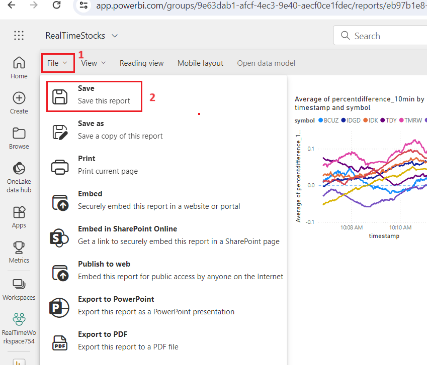

# 실습 02: KQL 사용하고 보고서 작성

**소개**

이제 데이터가 KQL 데이터베이스로 스트리밍되고 있으므로 데이터를 쿼리하고
탐색하기 시작하여 KQL을 활용하여 데이터에 대한 인사이트를 얻을 수
있습니다. KQL 쿼리 세트는 KQL 데이터베이스에서 쿼리를 실행하고, 데이터를
보고, 변환하는 데 사용됩니다. 다른 아티팩트와 마찬가지로 KQL 쿼리 세트는
워크스페이스의 컨텍스트 내에 존재합니다. 쿼리 세트에는 각각 탭에 저장된
여러 쿼리가 포함될 수 있습니다. 이 연습에서는 다양한 비즈니스 용도를
지원하기 위해 복잡성이 증가하는 여러 개의 KQL 쿼리를 만들어 보겠습니다.

**목표**

- KQL을 사용하여 주가 데이터를 탐색하고, 추세를 분석하고, 가격 차이를
  계산하고, 데이터를 시각화하여 실행 가능한 인사이트를 얻을 수 있는
  쿼리를 점진적으로 개발합니다.

- Power BI를 활용하여 분석된 재고 데이터를 기반으로 동적 실시간 보고서를
  작성하고, 자동 새로 고침 설정을 구성하여 적시에 업데이트하고, 시각화를
  개선하여 정보에 입각한 의사 결정을 내릴 수 있습니다.

# 연습 1: 데이터 탐색

이 연습에서는 다양한 비즈니스 용도를 지원하기 위해 복잡성이 증가하는
여러 개의 KQL 쿼리를 생성할 것입니다.

## 작업 1: KQL 쿼리세트 만들기: StockQueryset

1.  왼쪽 탐색 창에서 **RealTimeWorkspace를** 클릭하세요.

     

2.  작업 영역에서 아래 이미지와 같이 **+ New** KQL queryset를**
    클릭하세요. **New KQL Queryset** 대화 상자에서
    +++StockQueryset+++을 입력한 다음 **Create** 버튼을 클릭하세요.

     

     

3.  StockDB를 선택하고 **Connect** 버튼을 클릭하세요.
      

4.  KQL 쿼리 창이 열리고 데이터를 쿼리할 수 있습니다.

     

5.  기본 쿼리 코드는 아래 이미지에 표시된 코드와 같으며, 3개의 고유한
    KQL 쿼리가 포함되어 있습니다. **StockPrice** 테이블 대신
    *YOUR_TABLE_HERE가* 표시될 수 있습니다. 이를 선택하여 삭제합니다.

      

6.  쿼리 편집기에서 다음 코드를 복사하여 붙여넣으세요. 전체 텍스트를
    선택하고 ***Run*** 버튼을 클릭하여 쿼리를 실행합니다. 쿼리가
    실행되면 결과를 볼 수 있습니다.

      **복사**
      ```
      // Use "take" to view a sample number of records in the table and check the data.
      StockPrice
      | take 100;
      
      // See how many records are in the table.
      StockPrice
      | count;
      
      // This query returns the number of ingestions per hour in the given table.
      StockPrice
      | summarize IngestionCount = count() by bin(ingestion_time(), 1h);
      ```

***참고:** 편집기에 여러 개의 쿼리가 있을 때 단일 쿼리를 실행하려면 쿼리
텍스트를 강조 표시하거나 커서가 쿼리의 컨텍스트(예: 쿼리의 시작 또는
끝)에 위치하도록 커서를 놓으면 현재 쿼리가 파란색으로 강조 표시되어야
합니다. 쿼리를 실행하려면 도구 모음에서* Run을 *클릭하세요. 3개의 쿼리를
모두 실행하여 결과를 3개의 서로 다른 테이블에 표시하려면 아래와 같이 각
쿼리 뒤에 세미콜론(;)을 붙여야 합니다.*
     

8.  결과는 아래 이미지와 같이 3개의 다른 표로 표시됩니다. 각 테이블 탭을
    클릭하여 데이터를 검토하세요.

     

      
 
      

## 작업 2: StockByTime의 새로운 쿼리

1.  아래 이미지와 같이 **+** 아이콘을 클릭하여 쿼리 세트 내에 새 탭을
    만드세요. 이 탭의 이름을 +++StockByTime+++로 변경하세요.

      
 
      
 
      

2.  시간 경과에 따른 변화를 계산하는 등 자체 계산을 추가할 수 있습니다.
    예를 들어, windowing 함수의 일종인
    [prev()](https://learn.microsoft.com/en-us/azure/data-explorer/kusto/query/prevfunction)
    함수를 사용하면 이전 행의 값을 볼 수 있으므로 이를 사용하여 가격
    변화를 계산할 수 있습니다. 또한 이전 가격 값은 주식 기호별로
    다르므로 계산할 때 데이터를
    [분할할](https://learn.microsoft.com/en-us/azure/data-explorer/kusto/query/partition-operator)
    수 있습니다.

3.  쿼리 편집기에서 다음 코드를 복사하여 붙여넣으세요. **Run** 버튼을
    클릭하여 쿼리를 실행하세요. 쿼리가 실행되면 결과를 볼 수 있습니다.

    복사
    ```
    StockPrice
    | where timestamp > ago(75m)
    | project symbol, price, timestamp
    | partition by symbol
    (
        order by timestamp asc
        | extend prev_price = prev(price, 1)
        | extend prev_price_10min = prev(price, 600)
    )
    | where timestamp > ago(60m)
    | order by timestamp asc, symbol asc
    | extend pricedifference_10min = round(price - prev_price_10min, 2)
    | extend percentdifference_10min = round(round(price - prev_price_10min, 2) / prev_price_10min, 4)
    | order by timestamp asc, symbol asc
    ```
      

4.  이 KQL 쿼리에서는 먼저 결과가 가장 최근 75분으로 제한됩니다.
    궁극적으로 행을 지난 60분으로 제한하지만, 초기 데이터 세트에는 이전
    값을 조회하기에 충분한 데이터가 필요합니다. 그런 다음 데이터를
    분할하여 기호별로 데이터를 그룹화하고, 이전 가격(1초 전의 가격)과
    10분 전의 이전 가격을 살펴봅니다. 이 쿼리는 데이터가 1초 간격으로
    생성된다고 가정한다는 점에 유의하세요. 데이터의 목적상 미묘한 변동은
    허용됩니다. 그러나 이러한 계산에 정밀도가 필요한 경우(예: 9:59 또는
    10:01이 아닌 정확히 10분 전)에는 다른 방식으로 접근해야 합니다.

## 작업 3: StockAggregate

1.  아래 이미지와 같이 **+** 아이콘을 클릭하여 쿼리 세트 내에 또 다른
    새 탭을 만듭니다. 이 탭의 이름을 **+++StockAggregate+++로**
    변경하세요.

      
 
      

2.  이 쿼리는 각 주식에 대해 10분 동안 가장 큰 가격 상승과 그 상승률이
    발생한 시간을 찾습니다. 이 쿼리는 지정된 매개 변수(이 경우 *기호*)를
    기준으로 입력 테이블을 그룹으로 집계하는 테이블을 생성하는
    [summarize](https://learn.microsoft.com/en-us/azure/data-explorer/kusto/query/summarizeoperator)
    operator를 사용하며,
    [arg_max는](https://learn.microsoft.com/en-us/azure/data-explorer/kusto/query/arg-max-aggregation-function)
    가장 큰 값을 반환합니다.

3.  쿼리 편집기에서 다음 코드를 복사하여 붙여넣으세요. **Run** 버튼을
    클릭하여 쿼리를 실행하세요. 쿼리가 실행되면 결과를 볼 수 있습니다.

      > **복사**
      ```
      StockPrice
      | project symbol, price, timestamp
      | partition by symbol
      (
          order by timestamp asc
          | extend prev_price = prev(price, 1)
          | extend prev_price_10min = prev(price, 600)
      )
      | order by timestamp asc, symbol asc
      | extend pricedifference_10min = round(price - prev_price_10min, 2)
      | extend percentdifference_10min = round(round(price - prev_price_10min, 2) / prev_price_10min, 4)
      | order by timestamp asc, symbol asc
      | summarize arg_max(pricedifference_10min, *) by symbol
      ```
    

    

## 작업 4: StockBinned

1.  아래 이미지와 같이 **+** 아이콘을 클릭하여 쿼리 세트 내에 또 다른
    새 탭을 만드세요. 이 탭의 이름을 **+++StockBinned+++로**
    변경하세요.

     

     

2.  KQL에는 bin 매개변수를 기반으로 결과를 버킷화하는 데 사용할 수 있는
    [bin()
    함수도](https://learn.microsoft.com/en-us/azure/data-explorer/kusto/query/bin-function)
    있습니다. 이 경우 1시간의 타임스탬프를 지정하면 결과가 매 시간마다
    집계됩니다. 기간은 분, 시간, 일 등으로 설정할 수 있습니다.

3.  쿼리 편집기에서 다음 코드를 복사하여 붙여넣습니다. **실행** 버튼을
    클릭하여 쿼리를 실행합니다. 쿼리가 실행되면 결과를 볼 수 있습니다.

      **복사**
      ```
      StockPrice
      | summarize avg(price), min(price), max(price) by bin(timestamp, 1h), symbol
      | sort by timestamp asc, symbol asc
      ```
      
      

4.  이는 장기간에 걸쳐 실시간 데이터를 집계하는 보고서를 만들 때 특히
    유용합니다.

## 작업 5: 시각화

1.  아래 이미지와 같이 **+** 아이콘을** 클릭하여 쿼리 세트 내에 최종 새
    탭을 만드세요. 이 탭의 이름을 **+++Visualizations+++로**
    바뀌세요**.** 이 탭을 사용하여 데이터 시각화를 탐색하겠습니다.

      
 
      

2.  KQL은 **render Operator**를 사용하여 많은 수의
    [시각화를](https://learn.microsoft.com/en-us/azure/data-explorer/kusto/query/render-operator?pivots=fabric)
    지원합니다. StockByTime 쿼리와 동일하지만 *render operation*이
    추가된 아래 쿼리를 실행하세요:

3.  쿼리 편집기에서 다음 코드를 복사하여 붙여넣으세요. **Run** 버튼을
    클릭하여 쿼리를 실행하세요. 쿼리가 실행되면 결과를 볼 수 있습니다.

    > 복사
    ```
    StockPrice
    | where timestamp > ago(75m)
    | project symbol, price, timestamp
    | partition by symbol
    (
        order by timestamp asc
        | extend prev_price = prev(price, 1)
        | extend prev_price_10min = prev(price, 600)
    )
    | where timestamp > ago(60m)
    | order by timestamp asc, symbol asc
    | extend pricedifference_10min = round(price - prev_price_10min, 2)
    | extend percentdifference_10min = round(round(price - prev_price_10min, 2) / prev_price_10min, 4)
    | order by timestamp asc, symbol asc
    | render linechart with (series=symbol, xcolumn=timestamp, ycolumns=price)
    ```

      

4.  그러면 아래 이미지와 같이 라인 차트가 렌더링됩니다.

      
  
# 연습 2: Power BI 보고 효율성 최적화하기

데이터베이스에 데이터가 로드되고 초기 KQL 쿼리 세트가 완료되면 실시간
대시보드용 시각화 제작을 시작할 수 있습니다.

## 작업 1: 새로 고침 빈도 구성하기

더 자주 업데이트할 수 있도록 Power BI 테넌트를 구성해야 합니다.

1.  이 설정을 구성하려면, **Fabric 포털의** 오른쪽 상단에 있는
    **settings** 아이콘을 클릭하여 Power BI 관리자 포털로 이동하세요.
    Governance and insights 섹션으로 이동한 다음 **Admin portal을**
    클릭하세요.

     

2.  **Admin portal** 페이지에서 **Capacity settings로** 이동하여 클릭한
    다음 **평가판** 탭을 클릭하세요. 용량 이름을 클릭하세요.

      

3.  아래로 스크롤하여 ***Power BI workloads를** 클릭하고 **Semantic
    Models** (최근 *데이터 세트에서* 이름이 변경됨)에서 **Automatic
    page refresh**를 **On**로 구성하고, **minimum refresh interval을
    1초로** 설정하세요. 그런 다음 **Apply** 버튼을 클릭하세요.

**참고**: 관리 권한에 따라 이 설정을 사용하지 못할 수도 있습니다. 이
변경을 완료하는 데 몇 분 정도 걸릴 수 있습니다.
      
     

4.  **Update your capacity workloads** 대화 상자에서 **Yes** 버튼을
    클릭하세요.

     

## 작업 2: 기본 Power BI 보고서 만들기

1.  왼쪽의 **Microsoft Fabric** 페이지 메뉴 모음에서 **StockQueryset을**
    선택하세요.

      

2.  이전 모듈에서 사용한 **StockQueryset** 쿼리 세트에서
    **StockByTime** 쿼리 탭을 선택하세요.

      

3.  쿼리를 선택하고 실행하여 결과를 확인하세요. 명령줄에서 ***Build
    Power BI report*** 버튼을 클릭하여 이 쿼리를 Power BI로 가져오세요.

     

     

4.  보고서 미리보기 페이지에서 초기 차트를 구성하고 디자인 표면에 **라인
    차트를** 선택한 다음 다음과 같이 보고서를 구성할 수 있습니다. 아래
    이미지를 참조하세요.

- Legend: **기호**

- X축: **타임스탬프**

- Y축: **가격**

     

5.  Power BI(미리 보기) 페이지의 리본에서 **File을** 클릭하고 **Save를**
    선택하세요.

      

6.  **Name your file in Power BI** 대화 상자의 **Name your file in Power
    BI** 필드에 *+++RealTimeStocks+++를* 입력하세요. **작업 영역에
    저장** 필드에서 드롭다운을 클릭하고 **RealTimeWorkspace를**
    선택하세요. 그런 다음 **continue** 버튼을 클릭하세요.

      

7.  Power BI(미리 보기) 페이지에서 **Open the file in Power BI to view,
    edit and get a shareable link**을 클릭하세요.

      

8.  RealTimeStock 페이지에서 명령줄의 **Edit** 버튼을 클릭하여 보고서
    편집기를 여세요.

     

9.  보고서에서 라인 차트를 선택하세요. 이 설정을 사용하여 지난 5분
    동안의 데이터를 표시하도록 **Timestamp에** 대한 **Filter를**
    구성합니다:

- 필터 유형: 상대 시간

- 값이 지난 5분 이내일 때 항목 표시

***Apply filter을*** 클릭하여 필터를 활성화하세요. 아래 이미지와 비슷한
유형의 출력이 표시됩니다.

  

## 작업 3: 변화율에 대한 두 번째 시각적 자료 만들기

1.  두 번째 라인 차트를 만들고 **Visualizations에서 라인 차트를**
    선택하세요.

2.  현재 주가를 플롯하는 대신 현재 가격과 10분 전 가격의 차이에 따라
    양수 또는 음수 값인 ***percentdifference_10min*** 값을 선택합니다.
    이 값을 차트에 사용합니다:

- Legend: **기호**

- X축: **타임스탬프**

- Y축: **percentdifference_10min의 평균**

     

     

3.  **Visualization에서** 아래 이미지와 같이 돋보기 모양의 아이콘으로
    표시된 **Analytics를** 선택한 다음 **Y-Axis Constant Line(1)을**
    클릭하세요**. 설정 적용 대상 섹션에서 +Add line를 클릭한** 다음
    **Value 0을** 입력하세요.

      

4.  보고서에서 라인 차트를 선택하세요. 이 설정을 사용하여 지난 5분
    동안의 데이터를 표시하도록 Timestamp***에*** 대한 **Filter를**
    구성하세요:

- 필터 유형: 상대 시간

- 값이 최근 5분 이내인 경우 항목 표시

     

## 작업 4: 보고서를 자동 새로 고치도록 구성하기

1.  차트를 선택 해제하세요. **Visualizations** 설정에서  기본 설정에
    따라 1~2초마다 자동으로 **Page refresh를** 사용하도록 설정하세요.
    물론 현실적으로 새로 고침 빈도, 사용자 요구 및 시스템 리소스가
    성능에 미치는 영향의 균형을 맞춰야 합니다.

2.  **Format your report** **page** 아이콘을 클릭하고 탐색하여 **Page
    refresh를** 클릭하세요. 토글을 On하세요. 아래 이미지와 같이 자동
    페이지 새로 고침 값을 **2초로** 설정하세요.

     

3.  Power BI(미리 보기) 페이지의 리본에서 **파일을** 클릭하고 **저장을**
    선택하세요.

     

**요약**

이 실습에서는 KQL(Kusto Query Language)을 사용하여 주가 데이터에 대한
포괄적인 탐색에 착수했습니다. "StockQueryset"이라는 KQL 쿼리 세트를
만드는 것으로 시작하여 점점 더 복잡해지는 일련의 쿼리를 실행하여
데이터의 다양한 측면을 분석했습니다. 샘플 레코드 보기부터 시간 경과에
따른 가격 차이 계산 및 상당한 가격 상승 식별에 이르기까지, 각 쿼리는
주가의 역학 관계에 대한 귀중한 인사이트를 제공합니다. 윈도우 기능, 집계
기법, 데이터 파티셔닝을 활용하면 주가 추세와 변동을 더 깊이 이해할 수
있습니다.

그런 다음, 새로 고침 빈도를 구성하고 실시간 대시보드에 대한 동적
시각화를 제작하여 Power BI 보고 효율성을 최적화하는 데 초점을
맞췄습니다. Power BI 관리 포털에서 새로 고침 빈도를 구성하고 이전에
정의한 KQL 쿼리를 기반으로 Power BI 보고서를 생성함으로써 적시에
업데이트를 보장하고 주가 데이터를 통찰력 있게 시각화할 수 있게
되었습니다. 변화율에 대한 시각화 만들기 및 자동 새로 고침 설정 구성과
같은 작업을 통해 Power BI의 잠재력을 최대한 활용하여 정보에 기반한 의사
결정과 향상된 비즈니스 인텔리전스 기능을 추진했습니다.
