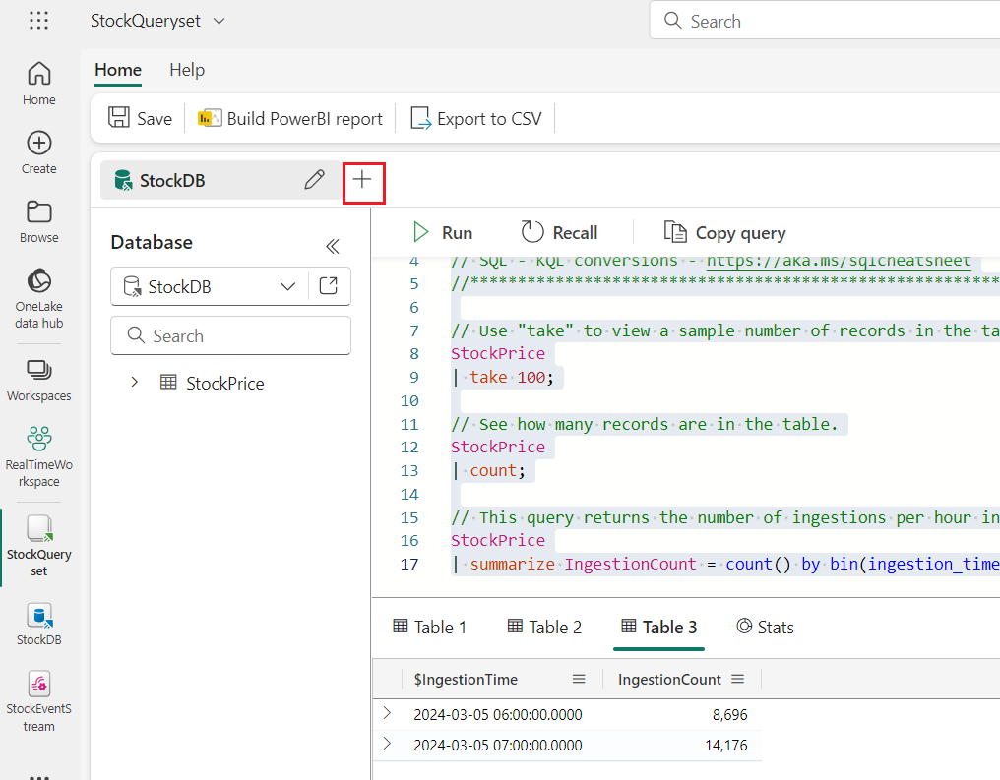
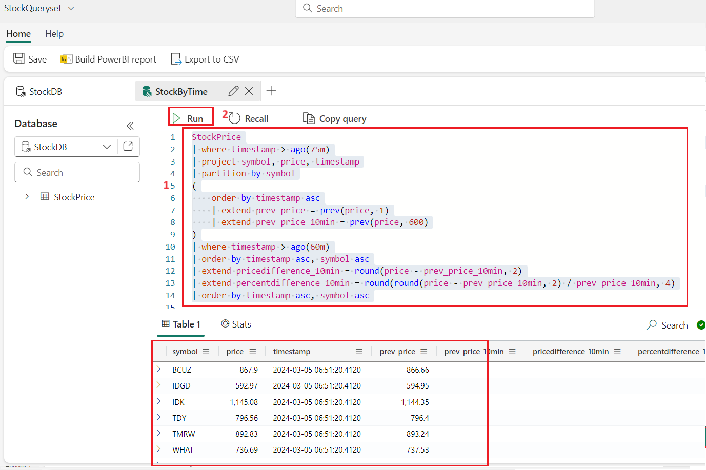
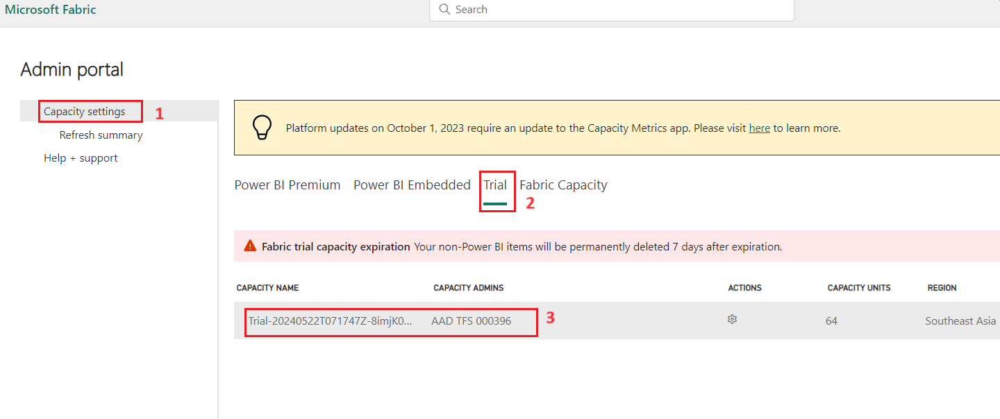
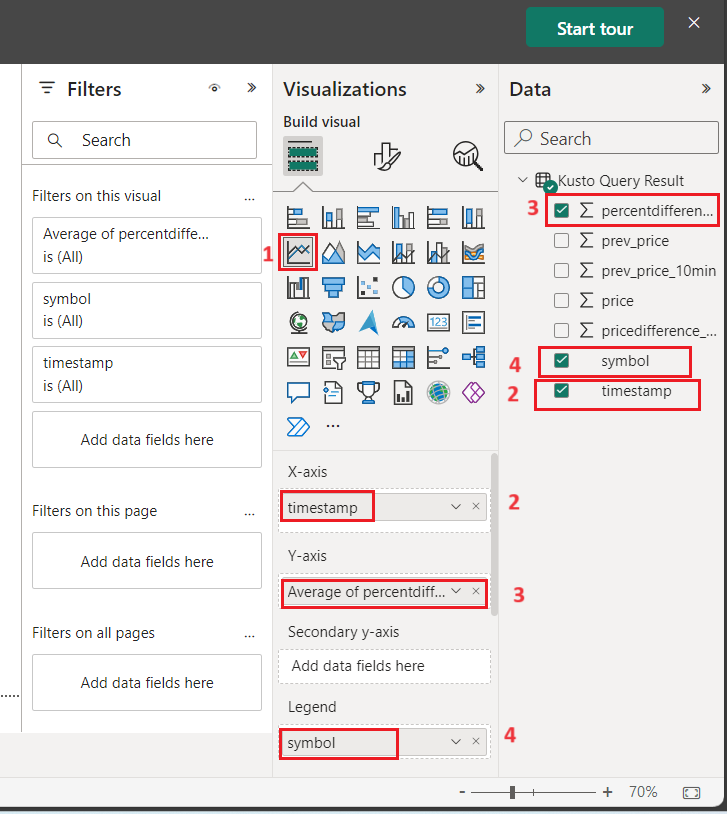
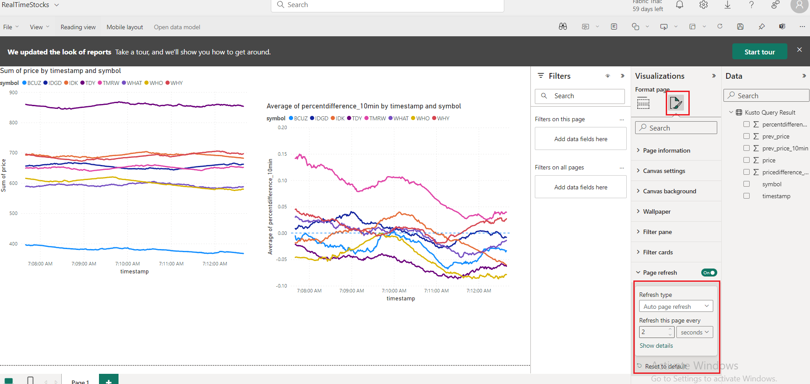

# 實驗室 02：使用 KQL 和構建報告

**導言**

現在，我們的資料已經流入 KQL 資料庫，我們可以開始查詢和探索資料，利用
KQL 深入瞭解資料。KQL 查詢集用於運行查詢、查看和轉換 KQL
資料庫中的資料。與其他工件一樣，KQL
查詢集存在于工作區的上下文中。一個查詢集可以包含多個查詢，每個查詢存儲在一個選項卡中。在本練習中，我們將創建多個複雜度不斷增加的
KQL 查詢，以支持不同的業務用途。

**目標**

- 使用 KQL 探索股票價格資料，逐步開發查詢，以分析趨勢、計算價格差異和
  Visualization 資料，從而獲得可操作的見解。

- 利用 Power BI
  根據分析後的庫存資料創建動態、即時的報告，配置自動刷新設置以實現及時更新，並增強視覺化功能以做出明智決策。

# 練習 1：探索資料

在本練習中，您將創建幾個複雜程度不斷增加的 KQL
查詢，以支持不同的業務用途。

## 任務 1：創建 KQL 查詢集：股票查詢集

1.  按一下左側功能窗格中的 **RealTimeWorkspace**。

2.  如下圖所示，在工作區中點擊 ***+* New *\>* KQL Queryset**。在 "**新建
    KQL 查詢集** "對話方塊中，輸入 *+++StockQueryset+++* ，然後點擊
    "**創建** "按鈕。

3.  選擇 ***StockDB*** 並點擊**連接**按鈕。 

4.  將打開 KQL 查詢視窗，允許您查詢資料。

> 

5.  默認查詢代碼如下圖所示，其中包含 3 個不同的 KQL 查詢。您可能會看到
    *YOUR_TABLE_HERE* 而不是 ***StockPrice*** 表。選擇並刪除它們。

6.  

7.  在查詢編輯器中，複製並粘貼以下代碼。選中整個文本，點擊***運行***按鈕執行查詢。執行查詢後，您將看到結果。

**複製**

// 使用 "抽取 "查看表中的記錄樣本數並檢查資料。

股票價格

| 取 100；

// 查看表中有多少條記錄。

股票價格

| 計數；

// 該查詢返回給定表中每小時的攝取次數。

股票價格

| summarize IngestionCount = count() by bin(ingestion_time(), 1h)；

***注意：**要在編輯器中有多個查詢時運行單個查詢，可以高亮顯示查詢文本，或將游標置於查詢的上下文中（例如，查詢的開頭或結尾）--當前查詢應高亮顯示為藍色。要運行查詢，請按一下工具列中的
"*運行"*。如果想運行所有 3 個查詢，以便在 3
個不同的表中顯示結果，則每個查詢的語句後都需要有一個分號（;），如下所示。*

8.  結果將顯示在 3
    個不同的表格中，如下圖所示。點擊每個表格標籤查看資料。

> 
>
> 

## 任務 2：StockByTime 的新查詢

1.  如下圖所示，點擊
    "***+***"**圖示**，在查詢集內創建一個新標籤頁。將該選項卡重命名為
    +++StockByTime++++

> 
>
> 
>
> 

2.  我們可以開始添加自己的計算，例如計算隨時間的變化。例如，[prev()](https://learn.microsoft.com/en-us/azure/data-explorer/kusto/query/prevfunction)
    函數是一種視窗函數，允許我們查看前幾行的數值；我們可以用它來計算價格變化。此外，由於之前的價格值是特定於股票代碼的，因此我們可以在計算時對資料進行
    [Partitioning](https://learn.microsoft.com/en-us/azure/data-explorer/kusto/query/partition-operator)。

3.  在查詢編輯器中，複製並粘貼以下代碼。按一下**運行**按鈕執行查詢。執行查詢後，您將看到結果。

複製

股票價格

| 其中 timestamp \> ago(75m)

| 專案符號、價格、時間戳記

| 按符號分區

(

按時間戳記昇冪排列

| 擴展 prev_price = prev(price, 1)

| 擴展 prev_price_10min = prev(price, 600)

)

| 其中 timestamp \> ago(60m)

| 按時間戳記昇冪、符號昇冪排列

| 擴展 pricedifference_10min = round(price - prev_price_10min, 2)

| extend percentdifference_10min = round(round(price - prev_price_10min,
2) / prev_price_10min, 4)

| 按時間戳記昇冪、符號昇冪排列

4.  在這個 KQL 查詢中，查詢結果首先限於最近的 75
    分鐘。雖然我們最終將行限制為最近 60
    分鐘，但我們的初始資料集需要足夠的資料來查詢之前的值。然後對資料進行
    Partitioning，按符號對資料進行分組，我們查看前一個價格（1 秒前）以及
    10 分鐘前的前一個價格。請注意，該查詢假設資料以 1
    秒鐘為間隔生成。就我們的資料而言，細微的波動是可以接受的。但是，如果您需要這些計算的精確度（例如精確到
    10 分鐘前，而不是 9:59 或 10:01），則需要採用不同的方法。

## 任務 3：庫存匯總

1.  按一下
    "***+***"**圖示**，在查詢集內創建另一個新標籤頁，如下圖所示。將此選項卡重命名為
    **+++StockAggregate++++**

> 
>
> 

2.  該查詢將找出每檔股票在 10
    分鐘內的最大價格漲幅，以及漲幅發生的時間。該查詢使用了[匯總](https://learn.microsoft.com/en-us/azure/data-explorer/kusto/query/summarizeoperator)運算子，可生成一個表格，根據指定的參數（本例中為*符號*）將輸入表匯總成組，而
    [arg_max](https://learn.microsoft.com/en-us/azure/data-explorer/kusto/query/arg-max-aggregation-function)
    則返回最大值。

3.  在查詢編輯器中，複製並粘貼以下代碼。按一下**運行**按鈕執行查詢。執行查詢後，您將看到結果。

> **複製**
>
> 股票價格
>
> | 專案符號、價格、時間戳記
>
> | 按符號分區
>
> (
>
> 按時間戳記昇冪排列
>
> | 擴展 prev_price = prev(price, 1)
>
> | 擴展 prev_price_10min = prev(price, 600)
>
> )
>
> | 按時間戳記昇冪、符號昇冪排列
>
> | 擴展 pricedifference_10min = round(price - prev_price_10min, 2)
>
> | extend percentdifference_10min = round(round(price -
> prev_price_10min, 2) / prev_price_10min, 4)
>
> | 按時間戳記昇冪、符號昇冪排列
>
> | 按符號匯總 arg_max(pricedifference_10min，\*)

## 任務 4：庫存

1.  按一下
    "***+***"**圖示**，在查詢集內創建另一個新標籤頁，如下圖所示。將此選項卡重命名為
    ***+++StockBinned++++***

2.  KQL 還有一個 [bin()
    函數](https://learn.microsoft.com/en-us/azure/data-explorer/kusto/query/bin-function)，可用於根據
    bin 參數對結果進行分組。在本例中，通過指定 1
    小時的時間戳記，結果將按每小時匯總。時間段可以設置為分鐘、小時、天等。

3.  在查詢編輯器中，複製並粘貼以下代碼。按一下**運行**按鈕執行查詢。執行查詢後，您將看到結果。

> **複製**

股票價格

| 按 bin(時間戳記，1 小時)、符號匯總 avg(價格)、min(價格)、max(價格)

| 按時間戳記昇冪、符號昇冪排序

4.  這在創建匯總較長時間段內即時資料的報告時尤其有用。

## 任務 5：視覺化

1.  如下圖所示，點擊
    "***+***"**圖示**，在查詢集內創建最後一個新標籤頁。將此選項卡重命名為
    +++視覺化+***+***+**。**我們將使用該選項卡探索 Data Visualization。

> 
>
> 

2.  通過使用*呈現*操作符，KQL
    支持大量[視覺化](https://learn.microsoft.com/en-us/azure/data-explorer/kusto/query/render-operator?pivots=fabric)操作。運行下面的查詢，該查詢與
    StockByTime 查詢相同，但增加了一個*渲染*操作：

3.  在查詢編輯器中，複製並粘貼以下代碼。按一下**運行**按鈕執行查詢。執行查詢後，您將看到結果。

> 複製

股票價格

| 其中 timestamp \> ago(75m)

| 專案符號、價格、時間戳記

| 按符號分區

(

按時間戳記昇冪排列

| 擴展 prev_price = prev(price, 1)

| 擴展 prev_price_10min = prev(price, 600)

)

| 其中 timestamp \> ago(60m)

| 按時間戳記昇冪、符號昇冪排列

| 擴展 pricedifference_10min = round(price - prev_price_10min, 2)

| extend percentdifference_10min = round(round(price - prev_price_10min,
2) / prev_price_10min, 4)

| 按時間戳記昇冪、符號昇冪排列

| 渲染折線圖（系列=符號，xcolumns=時間戳記，ycolumns=價格）

4.  這將呈現如下圖所示的折線圖。

# 練習 2：優化 Power BI 報告效率

在資料庫中載入資料並完成初始 KQL
查詢集後，我們就可以開始製作即時儀錶盤的 Visualization 了。

## 任務 1：配置刷新率

我們的 Power BI 租戶需要進行配置，以便更頻繁地更新。

1.  要配置此設置，請按一下 **Fabric 門戶**右上角的 "***設置***
    "**圖示**導航到 Power BI 管理門戶。導航到 "治理和洞察力
    "部分，然後按一下 "**管理門戶**"。

2.  在**管理門戶**頁面，導航並按一下**容量設置***，*然後按一下**試用**選項卡。按一下您的容量名稱。

> 

3.  向下滾動並按一下 ***Power BI
    工作負載***，在***語義模型***（***Semantic
    Models***，最近由*資料集*更名而來）下，將***自動頁面刷新***配置***為開***，**最小刷新間隔**為
    **1 秒**。然後，點擊**應用**按鈕。

**注意**：根據您的管理許可權，此設置可能不可用。請注意，這項更改可能需要幾分鐘才能完成。

4.  在 **"更新容量工作負載** "對話方塊中，按一下 "**是** "按鈕。

## 任務 2：創建基本 Power BI 報告

1.  在 **Microsoft Fabric** 頁面左側的功能表列中，選擇
    **StockQueryset**。

2.  從上一模組中使用的 ***StockQueryset*** 查詢集中，選擇
    ***StockByTime*** 查詢選項卡。

3.  選擇查詢並運行以查看結果。按一下命令列中的 "***構建 Power BI 報告***
    "按鈕，將此查詢帶入 Power BI。

4.  在報告預覽頁面，我們可以配置初始圖表，選擇一個**折線圖**作為設計面，並對報告進行如下配置。請參考下圖。

- 圖例：**符號**

- X 軸：**時間戳記**

- Y 軸**：價格**

5.  在 Power BI（預覽）頁面，從功能區點擊**檔**並選擇**保存**。

> 

6.  在 **"只需一些細節 "**對話方塊**的第一個**對話方塊中，在 **"在 Power
    BI 中命名檔** "欄位**中**輸入
    ++*+*RealTimeStocks+++。在**保存到工作**區欄位中，按一下下拉式功能表並選擇
    ***RealTimeWorkspace***。然後，點擊 "**繼續** "按鈕**。**

7.  在 Power BI（預覽）頁面，點擊**在 Power BI
    中打開檔，即可查看、編輯並獲得可共用連結。**

8.  在 RealTimeStock 頁面上，按一下命令列中的 "**編輯**
    "按鈕打開報告編輯器。

> 

9.  選擇報告中的折線圖。使用這些設置配置***時間戳記*篩選器**，以顯示最近
    5 分鐘的資料：

- 篩檢程式類型相對時間

- 顯示值：在最近 5 分鐘內的項目

按一下 "***應用篩檢程式*** "啟用篩檢程式。您將看到類似下圖所示的輸出。

## 任務 3：為百分比變化創建第二個視覺效果

1.  創建第二個折線圖，在**視覺化**下選擇**折線圖**。

2.  不繪製當前股價，而是選擇 ***percentdifference_10min***
    值，該值是基於當前價格與 10
    分鐘前價格之差的正值或負值。使用這些值繪製圖表：

- 圖例：**符號**

- X 軸：**時間戳記**

- Y 軸：**10 分鐘差值百分比的平均值**

3.  在 "**視覺化
    "**下**，**選擇放大鏡圖示表示的**分析（**如下圖所示**）**，然後按一下
    **Y 軸恒定線(1)。**在 "**將設置應用於 "**部分**，**點擊 **+
    添加線，**然後輸入**值 0。**

4.  選擇報告中的折線圖。使用這些設置配置***時間戳記*篩選器**，以顯示最近
    5 分鐘的資料：

- 篩檢程式類型相對時間

- 當值：在最近 5 分鐘內時顯示專案

## 任務 4：配置報告以自動刷新

1.  取消選擇圖表。在 "***視覺化*** "**設置**中，根據自己的偏好啟用
    "***頁面刷新***
    "功能，以便每隔一秒或兩秒自動刷新一次。當然，現實中我們需要平衡刷新頻率、使用者需求和系統資源對性能的影響。

2.  按一下 "**格式化報告** "**頁面圖示**，導航並按一下
    "**頁面刷新**"。打開切換開關。將自動頁面刷新值設置為 **2
    秒，**如下圖所示。

3.  在 Power BI（預覽）頁面，從功能區點擊**檔**並選擇**保存**。

**摘要**

在本實驗室中，您將使用 KQL (Kusto Query Language，KQL)
對股票價格資料進行全面探索。從創建名為 "StockQueryset "的 KQL
查詢集開始，您執行了一系列日益複雜的查詢來分析資料的各個方面。從查看樣本記錄到計算一段時間內的價格差異，再到識別價格的顯著漲幅，每個查詢都能揭示股票價格動態的寶貴資訊。通過利用視窗函數、聚合技術和資料分區，您對股票價格趨勢和波動有了更深入的瞭解。

然後，您將重點轉移到了優化 Power BI
報表效率上，您配置了刷新率，並為即時儀錶盤設計了動態視覺化。通過在 Power
BI 管理門戶中配置刷新率，並根據之前定義的 KQL Query 創建 Power BI
報告，您確保了及時更新，並實現了股票價格資料的深入視覺化。通過為百分比變化創建視覺化和配置自動刷新設置等任務，您充分發揮了
Power BI 的潛力，從而推動了知情決策並增強了商業智慧能力 (BI)。
