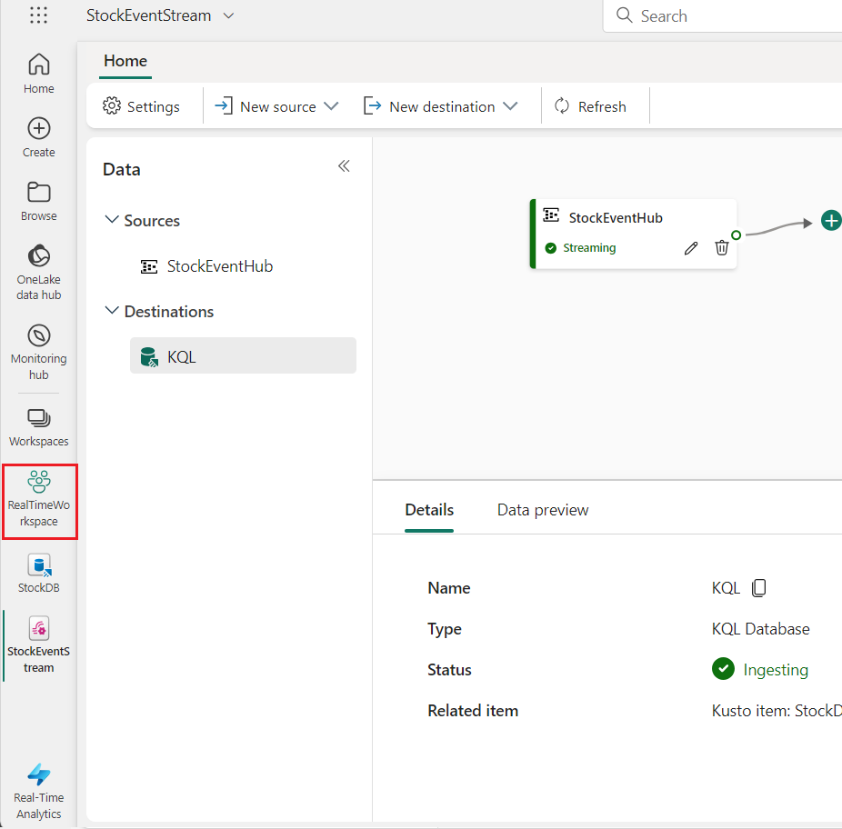
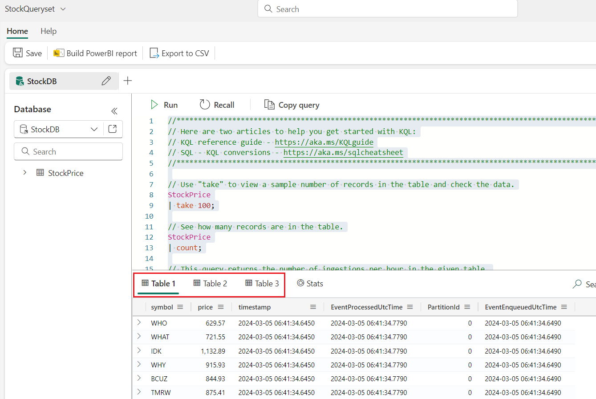
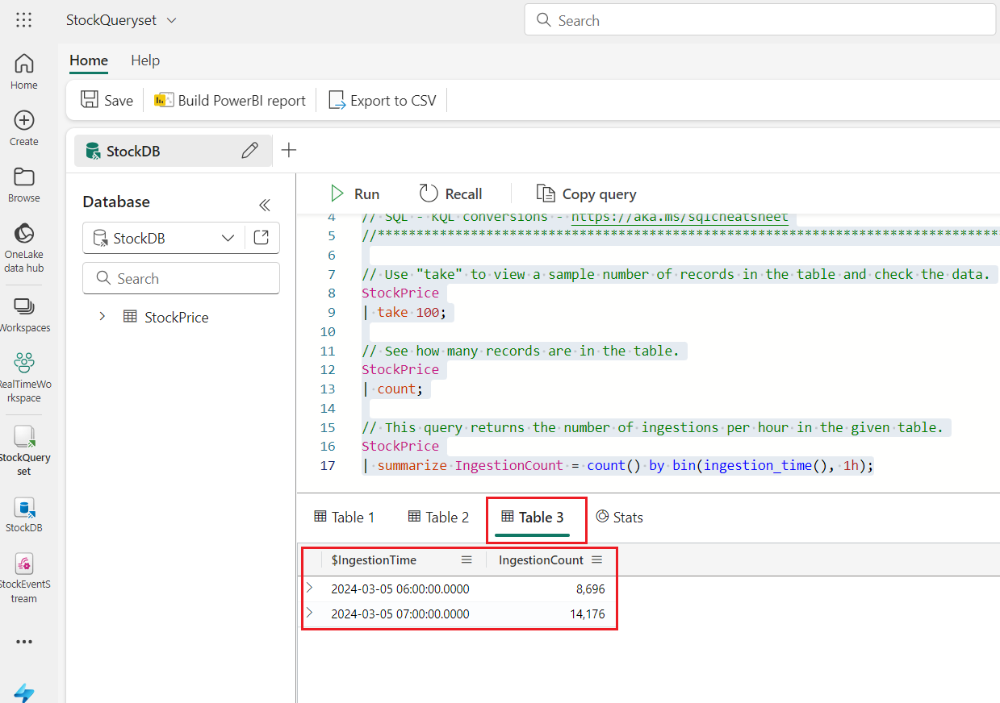
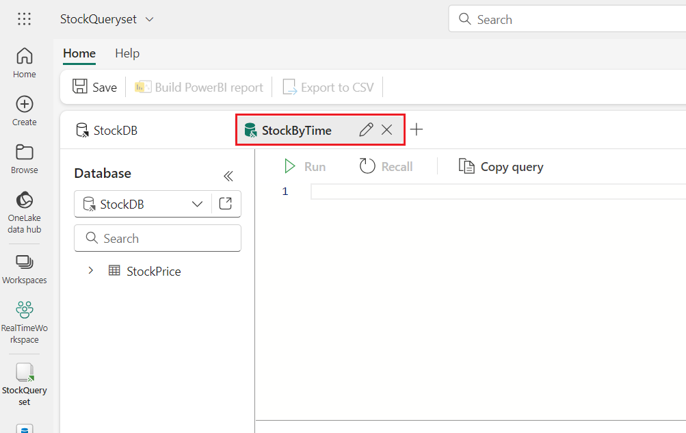
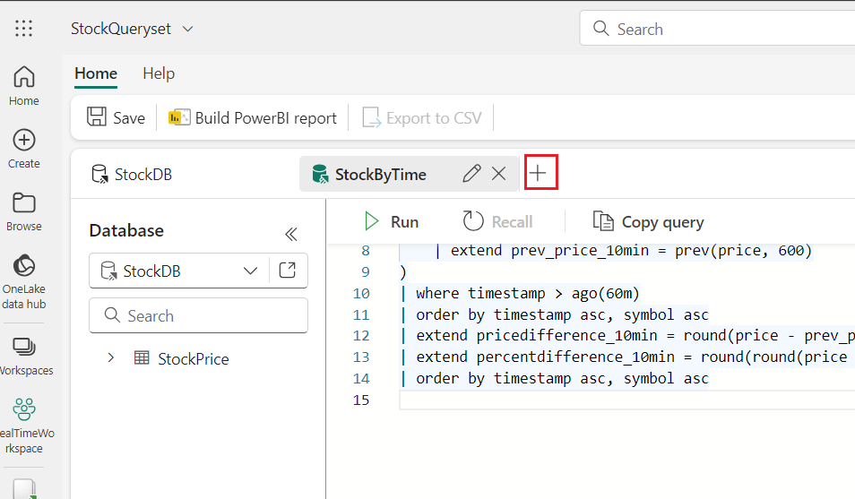
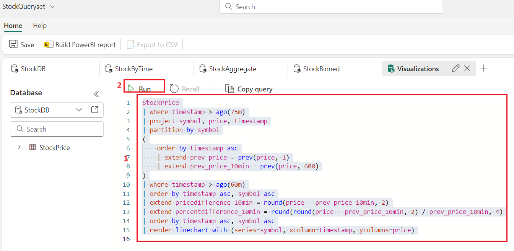
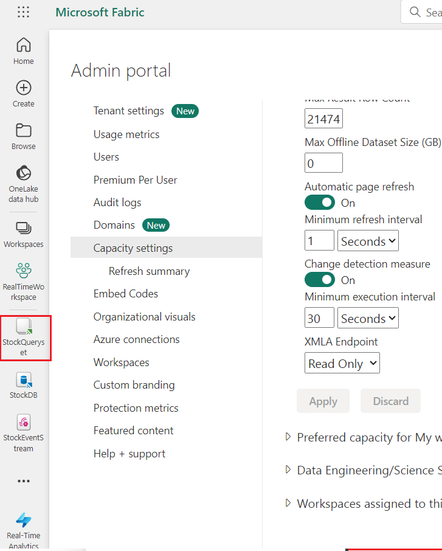
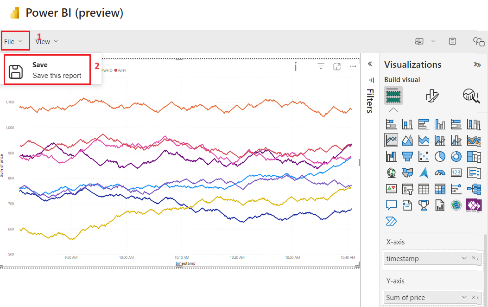
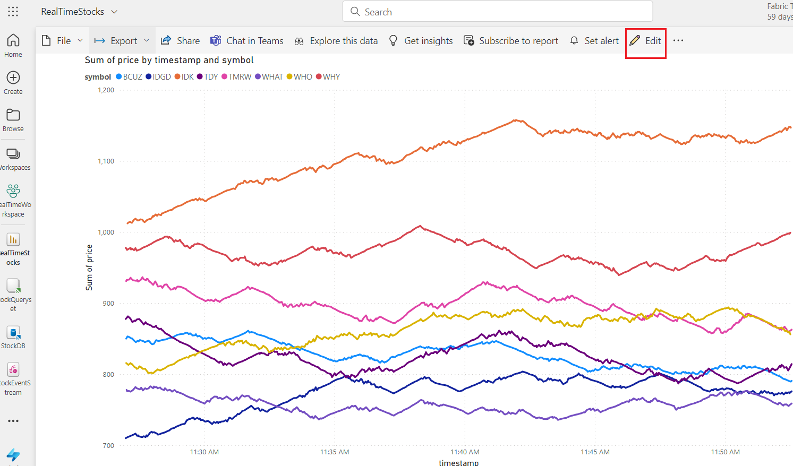

# Lab 02: Using KQL and building reports

**Introduction**

Now that our data is streaming into our KQL database, we can begin to
query and explore the data, leveraging KQL to gain insights into the
data. A KQL queryset is used to run queries, view, and transform data
from a KQL database. Like other artifacts, a KQL queryset exists within
the context of a workspace. A queryset can contain multiple queries each
stored in a tab. In this exercise, we'll create several KQL queries of
increasing complexity to support different business uses.

**Objectives**

- To explore stock price data using KQL, progressively developing
  queries to analyze trends, calculate price differentials, and
  visualize data for actionable insights.

- To leverage Power BI to create dynamic, real-time reports based on
  analyzed stock data, configuring auto-refresh settings for timely
  updates and enhancing visualization for informed decision-making.

# Exercise 1: Exploring the Data

In this exercise, you'll create several KQL queries of increasing
complexity to support different business uses.

## Task 1: Create KQL queryset: StockQueryset

1.  Click on **RealTimeWorkspace** on the left-sided navigation pane.
   
2.  From your workspace, click on **+New item** **KQL Queryset** as
    shown in the below image. In the **New KQL Queryset** dialog box,
    enter +++StockQueryset+++, then click on the **Create**
    button.

    
    
   
3.  Select the **StockDB** and click on the **Connect** button.
    

4.  The KQL query window will open, allowing you to query the data.

    
5.  The default query code will look like the code shown in the below
    image; it contains 3 distinct KQL queries. You may
    see *YOUR_TABLE_HERE* instead of the **StockPrice** table. Select
    and delete them.

    

6.  In the query editor, copy and paste the following code. Select the
    entire text and click on the **Run** button to execute the query.
    After the query is executed, you will see the results.
```
// Use "take" to view a sample number of records in the table and check the data.
StockPrice
| take 100;

// See how many records are in the table.
StockPrice
| count;

// This query returns the number of ingestions per hour in the given table.
StockPrice
| summarize IngestionCount = count() by bin(ingestion_time(), 1h);
```
**Note:** To run a single query when there are multiple queries in the
editor, you can highlight the query text or place your cursor so the
cursor is in the context of the query (for example, at the beginning or
end of the query) -- the current query should highlight in blue. To run
the query, click *Run* in the toolbar. If you'd like to run all 3 to
display the results in 3 different tables, each query will need to have
a semicolon (;) after the statement, as shown below.*
     
7.  The results will be displayed in 3 different tables as shown in the
    below image. Click on each table tab to review the data.
     
     
     
## Task 2: New Query of StockByTime

1.  Create a new tab within the queryset by clicking on the ***+*** icon
    as shown in the below image. Rename this tab as
    **+++StockByTime+++**

     
     
     

2.  We can begin to add our own calculations, such as calculating the
    change over time. For example,
    the [prev()](https://learn.microsoft.com/en-us/azure/data-explorer/kusto/query/prevfunction) function,
    a type of windowing function, allows us to look at values from
    previous rows; we can use this to calculate the change in price. In
    addition, as the previous price values are stock symbol specific, we
    can [partition](https://learn.microsoft.com/en-us/azure/data-explorer/kusto/query/partition-operator) the
    data when making calculations.

3.  In the query editor, copy and paste the following code. Click on
    the **Run** button to execute the query. After the query is
    executed, you will see the results.
   ```
   StockPrice
   | where timestamp > ago(75m)
   | project symbol, price, timestamp
   | partition by symbol
   (
       order by timestamp asc
       | extend prev_price = prev(price, 1)
       | extend prev_price_10min = prev(price, 600)
   )
   | where timestamp > ago(60m)
   | order by timestamp asc, symbol asc
   | extend pricedifference_10min = round(price - prev_price_10min, 2)
   | extend percentdifference_10min = round(round(price - prev_price_10min, 2) / prev_price_10min, 4)
   | order by timestamp asc, symbol asc
   ```
    
4.  In this KQL query, the results are first limited to the most recent
    75 minutes. While we ultimately limit the rows to the last 60
    minutes, our initial dataset needs enough data to lookup previous
    values. The data is then partitioned to group the data by symbol,
    and we look at the previous price (from 1 second ago) as well as the
    previous price from 10 minutes ago. Note that this query assumes
    data is generated at 1 second intervals. For the purposes of our
    data, subtle fluctuations are acceptable. However, if you need
    precision in these calculations (such as exactly 10 minutes ago and
    not 9:59 or 10:01), you'd need to approach this differently.

## Task 3: StockAggregate

1.  Create another new tab within the queryset by clicking on
    the **+icon** as shown in the below image. Rename this tab as
    **+++StockAggregate+++**

    
    
2.  This query will find the biggest price gains over a 10-minute period
    for each stock, and the time it occurred. This query uses
    the [summarize](https://learn.microsoft.com/en-us/azure/data-explorer/kusto/query/summarizeoperator) operator,
    which produces a table that aggregates the input table into groups
    based on the specified parameters (in this case, *symbol*),
    while [arg_max](https://learn.microsoft.com/en-us/azure/data-explorer/kusto/query/arg-max-aggregation-function) returns
    the greatest value.

3.  In the query editor, copy and paste the following code. Click on
    the **Run** button to execute the query. After the query is
    executed, you will see the results.
```
StockPrice
| project symbol, price, timestamp
| partition by symbol
(
    order by timestamp asc
    | extend prev_price = prev(price, 1)
    | extend prev_price_10min = prev(price, 600)
)
| order by timestamp asc, symbol asc
| extend pricedifference_10min = round(price - prev_price_10min, 2)
| extend percentdifference_10min = round(round(price - prev_price_10min, 2) / prev_price_10min, 4)
| order by timestamp asc, symbol asc
| summarize arg_max(pricedifference_10min, *) by symbol
```
   
   

## Task 4: StockBinned

1.  Create another new tab within the queryset by clicking on
    the **+** icon as shown in the below image. Rename this tab as
    +++StockBinned+++

     

     
 
2.  KQL also has a [bin()
    function](https://learn.microsoft.com/en-us/azure/data-explorer/kusto/query/bin-function),
    which can be used to bucket results based on the bin parameter. In
    this case, by specifying a timestamp of 1 hour, the result is
    aggregated for each hour. The time period can be set to minute,
    hour, day, and so on.

3.  In the query editor, copy and paste the following code. Click on
    the **Run** button to execute the query. After the query is
    executed, you will see the results.
     ```
     StockPrice
     | summarize avg(price), min(price), max(price) by bin(timestamp, 1h), symbol
     | sort by timestamp asc, symbol asc
      ```
      

4.  This is particularly useful when creating reports that aggregate
    real-time data over a longer time period.

## Task 5: Visualizations

1.  Create a final new tab within the queryset by clicking on
    the **+** icon as shown in the below image. Rename this tab as
    +++Visualizations+++ We'll use this tab to explore
    visualizing data.

    
    
2.  KQL supports a large number
    of [visualizations](https://learn.microsoft.com/en-us/azure/data-explorer/kusto/query/render-operator?pivots=fabric) by
    using the *render* operator. Run the below query, which is the same
    as the StockByTime query, but with an additional *render* operation
    added:

3.  In the query editor, copy and paste the following code. Click on
    the **Run** button to execute the query. After the query is
    executed, you will see the results.
```
StockPrice
| where timestamp > ago(75m)
| project symbol, price, timestamp
| partition by symbol
(
    order by timestamp asc
    | extend prev_price = prev(price, 1)
    | extend prev_price_10min = prev(price, 600)
)
| where timestamp > ago(60m)
| order by timestamp asc, symbol asc
| extend pricedifference_10min = round(price - prev_price_10min, 2)
| extend percentdifference_10min = round(round(price - prev_price_10min, 2) / prev_price_10min, 4)
| order by timestamp asc, symbol asc
| render linechart with (series=symbol, xcolumn=timestamp, ycolumns=price)
```
   
4.  This will render a line chart as shown in the below image.
    

# Exercise 2: Optimizing Power BI Reporting Efficiency

With the data loaded in the database and our initial KQL queryset
complete, we can begin to craft visualizations for real-time dashboards.

## Task 1: Configuring Refresh Rate

Our Power BI tenant needs to be configured to allow for more frequent
updating.

1.  To configure this setting, navigate to the Power BI admin portal by
    clicking on the **Settings** icon in the upper right corner of the
    **Fabric portal**. Navigate to Governance and insights section, then
    click on **Admin portal**.

      

2.  In the **Admin portal** page, navigate and click on **Capacity
    settings**,then click on **Trial** tab. Click on your capacity
    name.

      

3.  Scroll down and click on **Power BI workloads**, and
    under **Semantic Models** (recently renamed from *Datasets*),
    configure **Automatic page refresh** to **On**, with a **minimum
    refresh interval** of **1 Seconds**. Then, click on the **Apply**
    button.

**Note**: Depending on your administrative permissions, this setting may
not be available. Note that this change may take several minutes to
complete.
       
       

4.  On **Update your capacity workloads** dialog box, click on the
    **Yes** button.

      

## Task 2: Creating a basic Power BI report

1.  In the **Microsoft Fabric** page menu bar on the left side, select
    **StockQueryset**.

    

2.  From the **StockQueryset** queryset used in the previous module,
    select the **StockByTime** query tab.

   
3.  Select the query and run to view the results. Click on the
    **Build Power BI report** button in the command bar to bring this
    query into Power BI.

     
     

4.  On the report preview page, we can configure our initial chart,
    select a **line chart** to the design surface, and configure the
    report as follows. See the image below as a reference.

- Legend: **symbol**

- X-axis: **timestamp**

- Y-axis:**price**

     

5.  In the Power BI (preview) page, from the ribbon, click on
    **File** and select **Save**.
      
6.  On **Just a few details first** dialog box, in **Name your file in
    Power BI** field, enter **+++RealTimeStocks+++**. In **Save it to
    a workspace** field, click on the dropdown and select
    **RealTimeWorkspace**. Then, click on the **Continue** button.

      
7.  In the Power BI (preview) page, click on **Open the file in Power BI
    to view, edit and get a shareable link.**

      

8.  On the **RealTimeStock** page, click on the **Edit** button in the
    command bar to open the report editor.

     
9.  Select the line chart on the report. Configure a **Filter**
    for **timestamp** to display data for the last 5 minutes using
    these settings:

   - Filter type: Relative time

   - Show items when the value: is in the last 5 minutes

Click on **Apply filter** to enable the filter. You will see a similar
type of output as shown in the below image.

    

## Task 3: Creating a second visual for percent change

1.  Create a second line chart, under **Visualizations**, select **Line
    chart**.

2.  Instead of plotting the current stock price, select
    the ***percentdifference_10min*** value, which is a positive or
    negative value based off the difference between the current price
    and the value of the price from 10 minutes ago. Use these values for
    the chart:

     - Legend: **symbol**

     - X-axis: **timestamp**

    - Y-axis: **average of percentdifference_10min**

      
      

3.  Under the **Visualization,** select the **Analytics** represented by
    a magnifier-like icon as shown in the below image, then click on
    **Y-Axis Constant Line(1).** In the **Apply settings to**
    section, click on **+Add line,** then enter **Value 0.**

    

4.  Select the line chart on the report. Configure a **Filter**
    for ***timestamp*** to display data for the last 5 minutes using
    these settings:

- Filter type: Relative time

- Show items when the value: is in the last 5 minutes

   

## Task 4: Configuring the report to auto-refresh

1.  Deselect the chart. On the **Visualizations** settings,
    enable **Page refresh** to automatically refresh every second or
    two, based on your preference. Of course, realistically we need to
    balance the performance implications of refresh frequency, user
    demand, and system resources.

2.  Click on **Format your report** **page** icon, navigate and click on
    **Page refresh**. Turn on the toggle. Set the Auto page refresh
    value as **2 Seconds** as shown in the below image.

   

3.  In the Power BI (preview) page, from the ribbon, click on
    **File** and select **Save**.

   

**Summary**

In this lab, you embarked on a comprehensive exploration of stock price
data using Kusto Query Language (KQL). Starting with the creation of a
KQL queryset named "StockQueryset," you executed a series of
increasingly complex queries to analyze various facets of the data. From
viewing sample records to calculating price differentials over time and
identifying significant price gains, each query unveils valuable
insights into the dynamics of stock prices. By leveraging windowing
functions, aggregation techniques, and data partitioning, you gained a
deeper understanding of stock price trends and fluctuations.

Then, you’ve shifted the focus to optimizing Power BI reporting
efficiency, where you configured refresh rates and crafted dynamic
visualizations for real-time dashboards. By configuring refresh rates in
the Power BI admin portal and creating Power BI reports based on the
previously defined KQL queries, you ensured timely updates and enabled
insightful visualization of stock price data. Through tasks like
creating visualizations for percent change and configuring auto-refresh
settings, you harnessed the full potential of Power BI to drive informed
decision-making and enhanced business intelligence capabilities.
