# Lab 03: Data Lakehouse 구축하기

**소개**

이 실습의 대부분은 탐색적 데이터 분석, 모델 구축, 데이터 세트 시각화,
데이터 처리를 위한 업계 표준 방식인 Jupyter notebook 내에서 수행됩니다.
노트북 자체는 코드나 문서가 들어 있는 셀이라는 개별 섹션으로 분리되어
있습니다. 셀, 심지어 셀 안의 섹션도 필요에 따라 다른 언어로 변경할 수
있습니다(가장 많이 사용되는 언어는 Python이지만). 셀의 목적은 작업을
관리하기 쉬운 것으로 나누고 협업을 더 쉽게 하기 위한 것으로, 노트북의
목적에 따라 셀을 개별적으로 또는 전체적으로 실행할 수 있습니다.

청, 은, 금 레이어로 구성된 Data Lakehouse 메달리온 아키텍처에서 데이터는
일반적으로 소스에서 '있는 그대로' 원시/청동 레이어에서 수집됩니다.
데이터는 보고를 위해 선별된 금 레이어에 도달할 때까지 데이터가
점진적으로 처리되는 Extract, Load, and Transform (ELT) 프로세스를 통해
처리됩니다. 일반적인 아키텍처는 다음과 비슷할 수 있습니다:

 

이러한 레이어는 엄격한 규칙이 아니라 안내를 위한 것입니다. 레이어는 서로
다른 Lakehouse로 분리되는 경우가 많지만, 이 실습에서는 모든 레이어를
저장하는 데 동일한 Lakehouse를 사용하겠습니다. [여기에서 Fabric에서
메달리온
아키텍처를](https://learn.microsoft.com/en-us/fabric/onelake/onelake-medallion-lakehouse-architecture)
구현하는 방법에 대해 자세히 알아보세요.

**목표**

- Synapse Data Engineering Home의 Data Engineering 페르소나에서
  "StocksLakehouse"라는 이름의 Lakehouse를 생성하여 SQL 엔드포인트가
  성공적으로 생성되었음을 확인합니다.

- StockEventStream에 Data Lakehouse를 추가하려면, 이를 구성하고 데이터
  정리를 수행한 후 필수 데이터 필드를 수신하는지 확인합니다.

- 노트북 "Lakehouse 1-4"를 RealTimeWorkspace로 가져온 다음 개별적으로
  실행합니다.

- 이벤트 프로세서와 데이터 랭글링 기술을 활용하여 Data Lakehouse에
  저장된 원시 데이터를 집계하고 정리합니다. 여기에는 필터링, 데이터 유형
  변환, 필드 관리와 같은 기능을 수행하여 다운스트림 분석을 위한 데이터를
  준비하는 작업이 포함됩니다.

- 차원 모델을 구축하고 데이터 과학 활동을 지원하는 데 적합한 선별되고
  집계된 데이터 테이블을 구축합니다. 여기에는 분 단위 및 시간 단위
  집계와 같이 다양한 수준의 세분성으로 데이터를 요약하는 집계 루틴을
  만드는 것이 포함됩니다.

- 사실 및 차원 테이블을 통합하여 Lakehouse 환경 내에서 차원 모델을
  구축합니다. 이러한 테이블 간의 관계를 정의하여 효율적인 쿼리 및 보고를
  용이하게 합니다.

- 차원 모델을 기반으로 시맨틱 모델을 만들고 Power BI와 같은 도구를
  사용하여 대화형 보고서를 작성하여 집계된 데이터를 시각화 및
  분석합니다.

# 연습 1: Lakehouse 설치하기

## 작업 1: Lakehouse 만들기

먼저 Lakehouse를 만드세요.

***참고**: Data Science 모듈이나 Lakehouse를 사용하는 다른 모듈 이후에
이 실습을 완료하는 경우 해당 Lakehouse를 재사용하거나 새로 만들 수
있지만, 모든 모듈에서 동일한 Lakehouse를 공유된다고 가정합니다.*

1.  Fabric 작업 공간 내에서 아래 이미지와 같이 **Data engineering**
    persona (왼쪽 하단)로 전환하세요.

     

2.  Synapse Data Engineering 홈 페이지에서 ***Lakehouse*** 타일을
    탐색하여 클릭하세요.

      

3.  **New lakehouse** 대화상자에서 **Name** 필드에 
    +++StocksLakehouse+++를  입력한 다음 **Create** 버튼을 클릭하세요.
    **StocksLakehouse** 페이지가 나타납니다.

      
      
4.  **Successfully created SQL endpoint라는** 알림이 표시됩니다.

     **참고**: 알림이 표시되지 않는 경우 몇 분 정도 기다리세요.
      

## 작업 2. Eventstream에 Lakehouse 추가하기

아키텍처 관점에서 보면, Eventstream에서 hot path와 cold path 데이터를
분리하여 Lambda 아키텍처를 구현할 것입니다. Hot path는 이미 구성된 대로
KQL 데이터베이스로 계속 이어지며, cold path는 추가되어 원시 데이터를
Data Lakehouse에 기록합니다. 데이터 흐름은 다음과 비슷해집니다:

***참고**: Data Science 모듈 또는 Lakehouse를 사용하는 다른 모듈 이후에
이 실습을 완료하는 경우 해당 Lakehouse를 재사용하거나 새로 만들 수
있지만, 모든 모듈에서 동일한 Lakehouse가 공유된다고 가정합니다.*

1.  Fabric workspace에서 아래 이미지와 같이 **Data 엔지니어링**
    페르소나(왼쪽 하단)로 전환하세요.

     

2.  이제 왼쪽 탐색 창에서 **RealTimeWorkspace를** 클릭하고 아래 이미지와
    같이 **StockEventStream을** 선택하세요.

      

3.  Data Lakehouse를 Eventstream에 추가하는 것 외에도 Eventstream에서
    사용할 수 있는 몇 가지 기능을 사용하여 데이터를 정리해 보겠습니다.

4.  **StockEventStream** 페이지에서 **편집을** 선택하세요.

      

5.  **StockEventStream** 페이지의 이벤트스트림 출력에서 **Add
    destination을** 클릭하여 새 대상을 추가합니다. 컨텍스트 메뉴에서
    **Lakehouse를** 선택하세요.

     

6.  오른쪽에 표시되는 Lakehouse 창에서 다음 세부 정보를 입력하고
    **Save를** 클릭하세요**.**

|**Destination name** | **+++Lakehouse+++** |
|----|----|
| **Workspace** | RealTimeWorkspace |
| **Lakehouse** | StockLakehouse |
| **Delta table** | Click on **Create new**\> enter +++raw_stock_data+++ |
| **Input data format** | Json |

  
     

6.  StockEventStream과 **Lakehouse** 연결하세요
    

     

      

7.  Lakehouse를 선택하고 **Refresh** 버튼을 클릭하세요.

      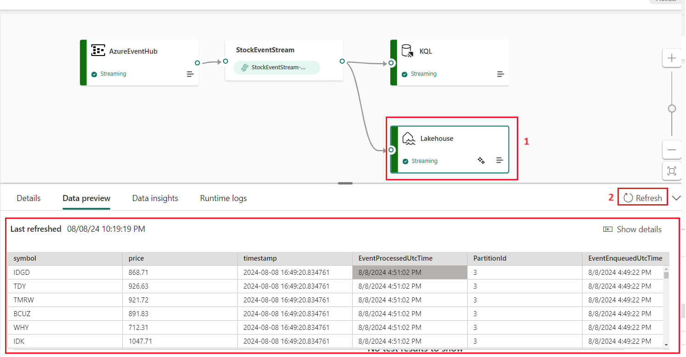

8.  **Open event processor를** 클릭하면 집계, 필터링, 데이터 유형 변경을
    수행하는 다양한 처리를 추가할 수 있습니다.

      

9.  **StockEventStream** 페이지에서 **StockEventStream을** 선택하고
    **plus(+)** 아이콘을 클릭하여 **Manage fields를** 추가하세요. 그런
    다음 Manage fields**를** 선택하세요**.**

      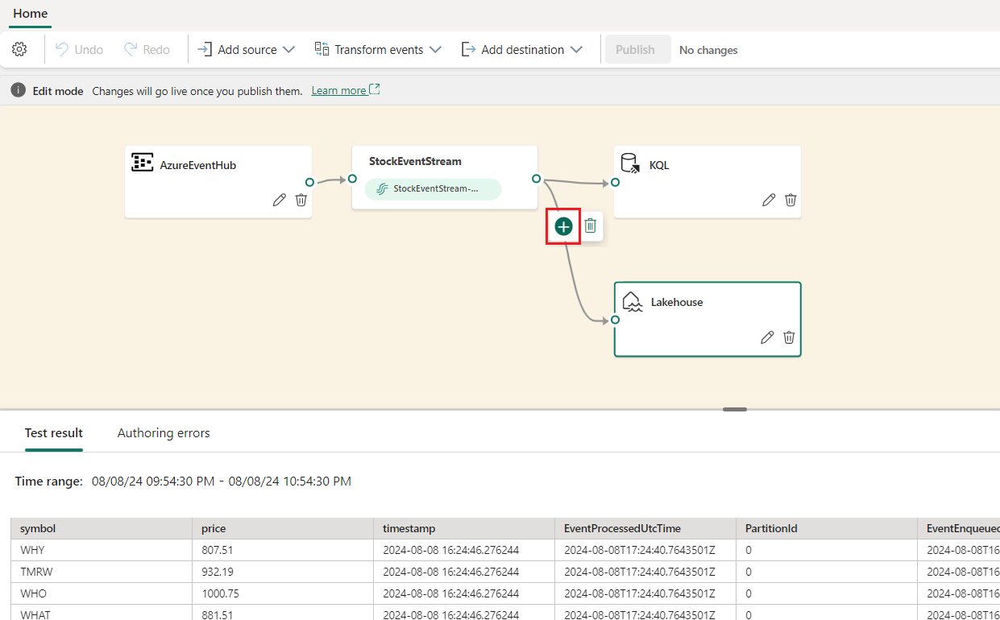

      

10. Eventstream 창에서 **Managefields1**연필 아이콘을 선택하세요.

     

11. **Manage fields**  창이 열리면 **Add all fields** **를** 클릭하여
    모든 열을 추가하세요. 그런 다음 필드 이름 오른쪽에 있는
    줄임표**(...)**를 클릭하여 **EventProcessedUtcTime**,
    **PartitionId**, 및 **EventEnqueuedUtcTime**필드를 *제거하기 위해
    Remove를* 클릭하세요*.*

      

      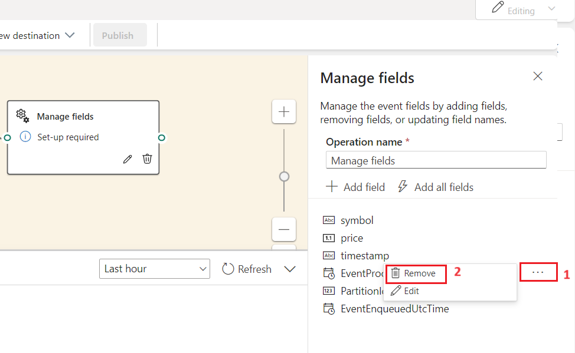

      
    
      
      

12. 이제 *타임스탬프* 열이 문자열로 분류될 가능성이 있으므로 Timestamp
    열을 *DateTime*** 로** 변경합니다. *Timestamp* **열** 오른쪽에 있는
    **줄임표(...) 세** 개를 클릭하고 *예 유형 변경을* 선택하세요. 그러면
    아래 이미지와 같이 *날짜/시간DateTime를* 선택하여 데이터 유형을
    변경할 수 있습니다. Save를 클릭하세요.

     

     

13. 이제 **Publish** 버튼을 클릭하여 이벤트 프로세서를 닫으세요.

     

     

14. 완료되면 Lakehouse는 symbol, price, 및 timestamp를 받게 됩니다.

     

이제 KQL(Hot path)과 Lakehouse(cold path)가 구성되었습니다. Data
Lakehouse에 데이터가 표시되려면 1~2분 정도 걸릴 수 있습니다.

## 작업 3. 노트북 가져오기

**참고**: 이러한 노트북을 가져오는 데 문제가 있는 경우, 노트북을
표시하고 있는 GitHub의 HTML 페이지가 아닌 원시 노트북 파일을
다운로드하고 있는지 확인하세요.

1.  이제 왼쪽 탐색 메뉴에서 **RealTimeWorkspace를** 클릭하세요.

      

2.  **Synapse Data Engineering RealTimeWorkspace** 페이지에서 이동하여
    **import** 버튼을 클릭한 다음 **노트북을** 선택하고 아래 이미지와
    같이 **From this computer를** 선택하세요.

      

3.  화면 오른쪽에 표시되는 **import status** 창에서 **upload를**
    선택하세요.

      

4.  **C:\LabFiles\Lab 04에서 Lakehouse 1-Import Data, Lakehouse 2-Build
    Aggregation, Lakehouse 3-Create Star Schema** and **Lakehouse 4-Load
    Star Schema 및 Lakehouse 4-Load Star Schema** notebooks를 탐색하여
    선택한 다음 **Open** 버튼을 클릭하세요.

      

5.  **Imported successfully라는** 알림이 표시됩니다.

      

## 작업 4. 추가 데이터 가져오기

보고서를 더 흥미롭게 만들려면 작업할 데이터가 조금 더 필요합니다.
Lakehouse와 Data Science 모듈 모두에서 이미 수집된 데이터를 보완하기
위해 추가 기록 데이터를 가져올 수 있습니다. 노트북은 테이블에서 가장
오래된 데이터를 보고 과거 데이터를 미리 추가하는 방식으로 작동합니다.

1.  **RealTimeWorkspace** 페이지에서 노트북만 보려면 페이지 오른쪽
    상단의 **filter를** 클릭한 다음 **notebook을** 선택하세요**.**

      

2.  그런 다음, **Lakehouse 1 - Import Data** notebook을 선택하세요.

      )

3.  Explorer에서 **Lakehouse를** 탐색하여 선택한 다음 아래 이미지와 같이
    **Add** 버튼을 클릭하세요*.*

> **중요 참고**: 가져온 모든 노트북에 Lakehouse를 추가해야 하며,
> 노트북을 처음 열 때마다 이 작업을 수행해야 합니다.
    

     

4.  Add Lakehouse 대화 상자에서 **Existing lakehouse** 라디오 버튼을
    선택한 다음 **Add** 버튼을 클릭하세요.

     

5.  **OneLake data hub** 창에서 StockLakehouse를 선택하고 **add** 버튼을
    클릭하세요. 
     

6.  **raw_stock_data** 테이블은 Eventstream을 구성할 때 생성되며, Event
    Hub에서 수집되는 데이터의 landing place입니다.

     

**참고**: 노트북의 셀 위에 마우스를 갖다 대면 **Run** 버튼이 표시됩니다.

7.  노트북을 시작하고 셀을 실행하려면 셀 왼쪽에 나타나는 **run**
    아이콘을 선택하세요.

      

8.  마찬가지로 셀 2와  실행하세요.

      

9.  아래 이미지와 같이 셀 4와 5을 실행하여 과거 데이터를 다운로드하고
    압축을 풀어서 Data Lakehouse 비관리 파일로 옮기세요.

     

     

10. CSV 파일을 사용할 수 있는지 확인하려면 셀 6을 선택하고 실행하세요.

    

11. 셀 7, 8, 9를 실행하세요.

     

      

      

12. 코드의 섹션을 ''commenting out' 하는 것과 비슷하지만 셀 고정은 셀의
    모든 출력도 보존된다는 점에서 강력합니다.

     
     

# 연습 2: 집계 테이블 만들기

이 연습에서는 차원 모델 구축과 Data Science에 사용하기에 적합한 선별되고
집계된 데이터를 구축합니다. 초당 빈도가 있는 원시 데이터의 경우, 이
데이터 크기는 보고나 분석에 적합하지 않은 경우가 많습니다. 또한 데이터가
정리되지 않았기 때문에 부적합한 데이터로 인해 보고서나 데이터
파이프라인에서 예상치 못한 문제가 발생할 위험이 있습니다. 이 새로운
테이블은 데이터를 분당 및 시간당 수준으로 저장합니다. 다행히 *Data
Wrangler를* 사용하면 이 작업을 쉽게 수행할 수 있습니다.

여기서 사용하는 노트북은 은 레벨 아티fact인 집계 테이블을 모두 만들
것입니다. 메달리온 레이어를 서로 다른 Data Lakehouse로 분리하는 것이
일반적이지만, 데이터의 크기가 작고 실습의 목적을 고려할 때 모든 레이어를
저장하는 데 동일한 Data Lakehouse를 사용하겠습니다.

## 작업 1: 집계 테이블 구축 노트북

잠시 시간을 내어 노트북을 스크롤해 보세요. 아직 추가하지 않았다면 기본
Lakehouse를 추가하세요.

1.  이제 왼쪽 navigation 메뉴에서 **RealTimeWorkspace를** 클릭하세요.

     

2.  **RealTimeWorkspace** 페이지에서 **Lakehouse 2 - Build Aggregation
    Tables** 노트북을 클릭하세요.

     

3.  Explorer에서 **Lakehouse를** 탐색하여 선택한 다음 **Add** 버튼을
    클릭하세요.

      

      

4.  **Add Lakehouse** 대화 상자에서 **Existing lakehouse** 대화 상자를
    선택한 다음 Add 버튼을 클릭하세요.

      

5.  **OneLake data hub** 창에서 StockLakehouse를 선택하고 **Add** 버튼을
    클릭하세요.

      

6.  집계 테이블을 구축하려면 셀1 , 2 , 3 및 4를 선택하여 실행하세요.

      

      

       

      

7.  그런 다음 5 , 6 , 7 및 8 셀을 선택하여 실행하세요.

      

      

      
      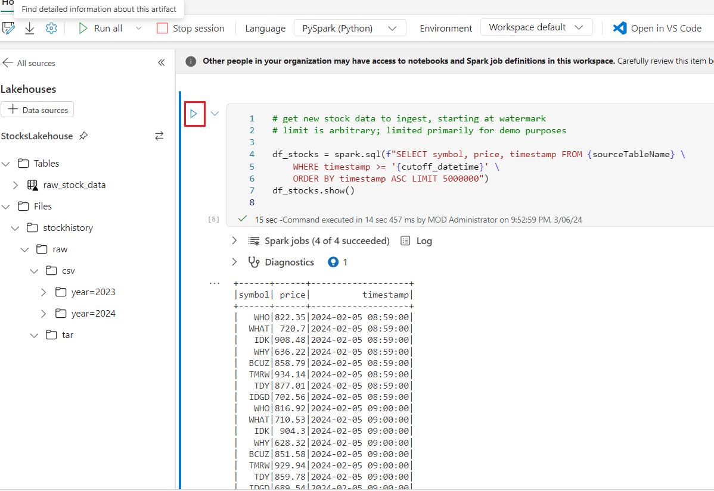

8.  Data wrangler를 추가하고, 셀 9를 선택한 다음, 드롭다운에서 **Data
    wrangler를** 탐색하세요. **anomaly_df를** 이동하고 클릭하여 Data
    wrangler에서 데이터 프레임을 로드하세요.

9.  테스트할 수 있는 몇 개의 유효하지 않은 행으로 의도적으로
    생성되었으므로 **anomaly_df를** 사용하겠습니다.

      

10. Data wrangler에서는 데이터를 처리하는 여러 단계를 기록합니다.
    데이터가 중앙 열에 시각화되어 있는 것을 볼 수 있습니다. 왼쪽 위에는
    작업이, 왼쪽 아래에는 각 단계에 대한 개요가 표시됩니다.

     

11. 빈/비어 있는 값을 제거하려면 *작업에서* **Find and replace** 옆의
    드롭다운을 클릭한 다음 **Drop missing values를** 탐색하여
    클릭하세요.

     

12. **Target columns** 드롭다운에서 ***symbol*** 및***price*** 열을
    선택한 다음 이미지와 같이 그 아래에 있는 **Apply 버튼을**
    클릭하세요.

      
      
      

13. **Operations** 드롭다운에서 **Sort and filter**를 탐색하여 클릭한
    다음 아래 이미지와 같이 **filter를** 클릭하세요.

      

14. *일치하는 행 유지를* Uncheck하고 **Price를** 대상 열로 선택한 다음
    조건을 ***Equal* to *0로*** 설정하세요**.** 필터 아래의 *작업*
    패널에서 ***Apply를*** 클릭하세요**.**

> 참고: 0이 있는 행은 삭제되므로 빨간색으로 표시됩니다(다른 행이
> 빨간색으로 표시된 경우 *일치하는 행 유지* 확인란을 선택 취소해야
> 합니다).
    
    

15. 페이지 왼쪽 상단의 **+Add code to notebook**을 클릭하세요. ***Add
    code to notebook*** 창에서 *Include pandas code이* uncheck되어
    있는지 확인하고 Add 버튼을 클릭하세요.

     

     

16. 삽입된 코드는 아래와 비슷하게 보입니다.

     

17. 셀을 실행하고 출력을 관찰하세요. 유효하지 않은 행이 제거된 것을
    확인할 수 있습니다.

     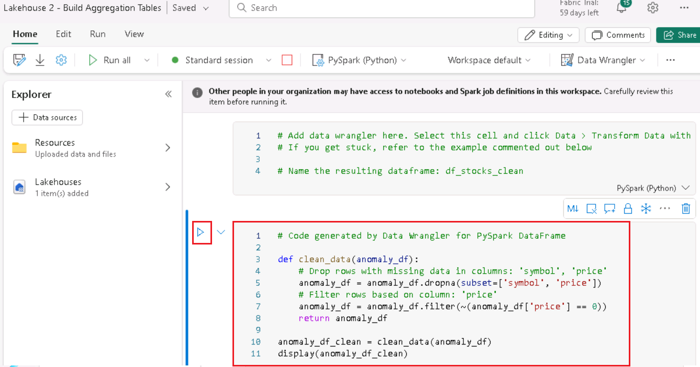

     

생성된 함수인 *clean_data에는* 모든 단계가 순서대로 포함되어 있으며
필요에 따라 수정할 수 있습니다. Data Wrangler에서 수행되는 각 단계에는
주석이 달려 있습니다. Data wrangler가 *anomaly_df로* 로드되었기 때문에
메서드는 해당 데이터 프레임을 이름으로 사용하도록 작성되었지만, 스키마와
일치하는 모든 데이터 프레임이 될 수 있습니다.

18. 함수 이름을 **clean_data에서** **remove_invalid_rows로** 수정하고,
    **anomaly_df_clean = clean_data(anomaly_df)** 을 **df_stocks_clean =
    remove_invalid_rows(df_stocks)** 로 변경하세요. 또한 기능상
    필요하지는 않지만 함수에 사용되는 데이터 프레임의 이름을 아래와 같이
    단순히 **df로** 변경할 수 있습니다.

19. 이 셀을 실행하고 출력을 관찰하세요.
```
# Code generated by Data Wrangler for PySpark DataFrame

def remove_invalid_rows(df):
    # Drop rows with missing data in columns: 'symbol', 'price'
    df = df.dropna(subset=['symbol', 'price'])
    # Filter rows based on column: 'price'
    df = df.filter(~(df['price'] == 0))
    return df

df_stocks_clean = remove_invalid_rows(df_stocks)
display(df_stocks_clean)
```
>
     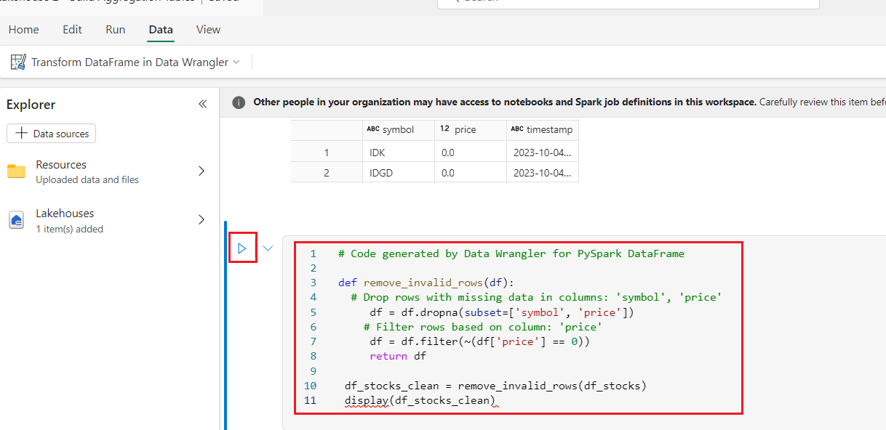

20. 이 함수는 이제 *df_stocks* 데이터 프레임에서 유효하지 않은 행을
    제거하고 *df_stocks_clean이라는* 새 데이터 프레임을 반환합니다.
    일반적으로 출력 데이터프레임에 다른 이름(예: *df_stocks_clean*)을
    사용하여 셀을 비활성화하면 원본 데이터를 다시 로드할 필요 없이 셀을
    다시 실행하고 수정하는 등의 작업을 수행할 수 있습니다.

    

## 작업 2: 집계 routine 구축

이 작업에서는 파생 열을 추가하고 데이터를 집계하는 등 Data Wrangler에서
여러 단계를 구축하기 때문에 더 많이 관여하게 될 것입니다. 문제가
발생하면 최대한 계속 진행하면서 노트북의 샘플 코드를 사용하여 나중에
문제를 해결하세요.

1.  ***Symbol/Date/Hour/Minute Aggregation 섹션**에서* 새 열 datestamp를
    추가하고 *여기에 Data wrangler 추가* 셀에 커서를 놓고 해당 셀을
    선택하세요. **Data wrangler를** 드롭다운하세요. 아래 이미지와 같이
    **df_stocks_clean으로** 이동하여 클릭하세요.

      
 
      

2.  **Data wrangler:df_stocks_clean** pane에서 **operations를** 선택한
    다음, **New column by example**선택하세요**.**

      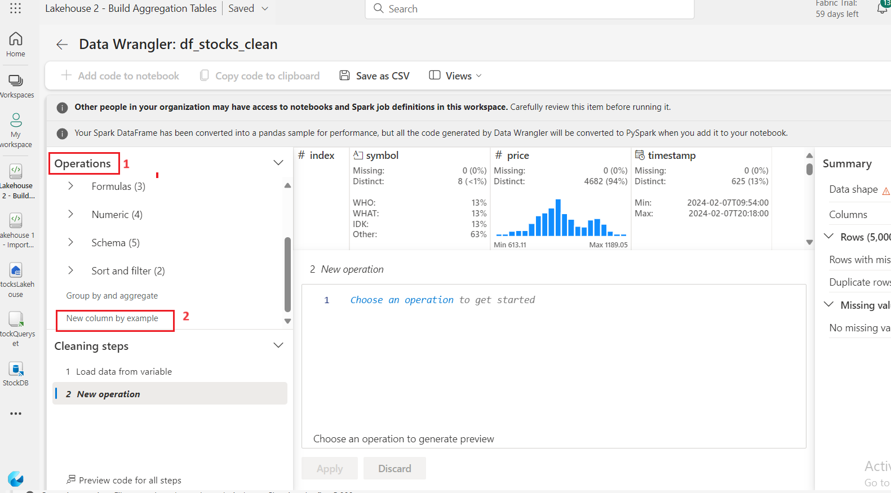

3.  ***Target columns*** 필드에서 드롭다운을 클릭하고 Timestamp***를***
    선택하세요. 그런 다음 ***Derived column** **name***  필드에
    ***+++datestamp+++를*** 입력하세요.

     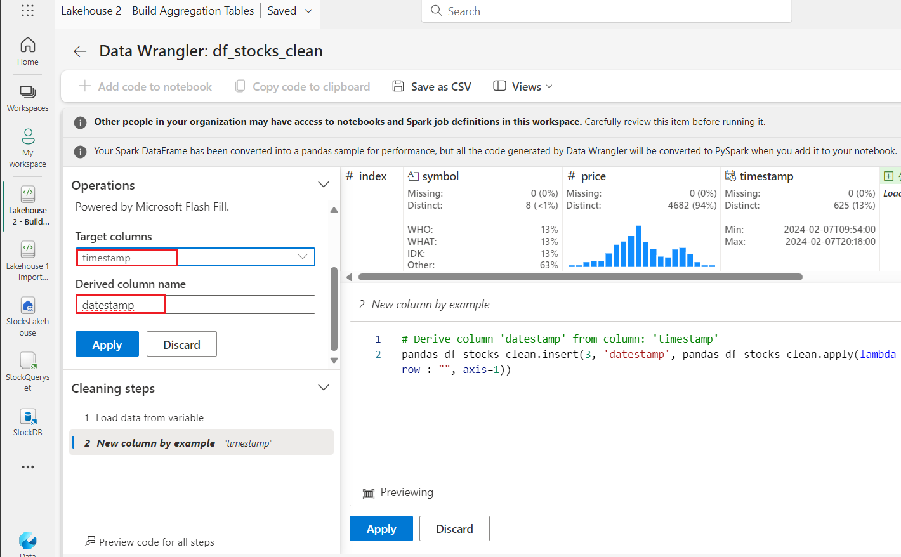

4.  새 Timestamp 열에 지정된 행에 대한 예시 값을 입력하세요. 예를 들어
    *타임스탬프가 2024-02-07 09:54:00인* 경우 ***2024-02-07을***
    입력하세요. 이를 통해 Data wrangler는 시간 구성 요소 없이 날짜를
    찾고 있다는 것을 추론할 수 있습니다. 열이 자동으로 채워지면 Apply
    버튼을 클릭합니다.
     

     

5.  위 단계에서 설명한 대로 **datestamp** 열을 추가하는 것과 유사하게
    아래 이미지와 같이 **New column by example을** 다시 클릭하세요.

      

6.  대상 열에서 **timestamp를**선택하세요. ***Derived column** 이름
    **+++hour+++을**입력하세요.

      

7.  데이터 미리 보기에 표시되는 new hour 열에 지정된 행에 시간을
    입력하되, 고유한 시간 값을 가진 행을 선택하세요. 예를 들어
    *타임스탬프가 2024-02-07 09:54:00인* 경우 ***9를*** 입력하세요.
    아래와 같이 여러 행에 대한 예제 값을 입력해야 할 수도 있습니다.
    **Apply** 버튼을 클릭하세요.

       

8.  Data Wrangler는 우리가 시간 구성 요소를 찾고 있다고 추론하고 다음과
    유사한 코드를 작성해야 합니다:
>
# Derive column 'hour' from column: 'timestamp'
def hour(timestamp):
    """
    Transform based on the following examples:
       timestamp           Output
    1: 2024-02-07T09:54 => "9"
    """
    number1 = timestamp.hour
    return f"{number1:01.0f}"

pandas_df_stocks_clean.insert(3, "hour", pandas_df_stocks_clean.apply(lambda row : hour(row["timestamp"]), axis=1))
>
     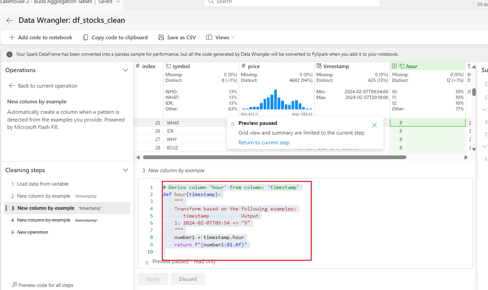

 

9.  Hour 열과 마찬가지로 ***minute*** 열을 새로 만드세요. New minute
    열에 주어진 행에 분을 입력하세요. 예를 들어 *타임스탬프가 2024-02-07
    09:54:00인* 경우 *54를* 입력하세요. 여러 행에 대해 예제 값을
    입력해야 할 수도 있습니다.

      

10. 생성된 코드는 다음과 비슷할 것입니다:
>
# Derive column 'minute' from column: 'timestamp'
def minute(timestamp):
    """
    Transform based on the following examples:
       timestamp           Output
    1: 2024-02-07T09:57 => "57"
    """
    number1 = timestamp.minute
    return f"{number1:01.0f}"

pandas_df_stocks_clean.insert(3, "minute", pandas_df_stocks_clean.apply(lambda row : minute(row["timestamp"]), axis=1))
> 
     

11. 다음으로 시간 열을 Integer로 변환하세요. Hour 열 모서리에 있는
    줄임표**(...)**를 클릭하고 **Change column type**를 선택하세요.
    ***New type*** 옆의 드롭다운을 클릭하고 ***int32를** 탐색하여*
    선택한 다음 아래 이미지와 같이 ***Apply*버튼을** 클릭하세요***.***
     

     

12. Hour에 대해 방금 수행한 것과 동일한 단계를 사용하여 minute 열을
    integer로 변환하세요. ***Minute column*** 모서리에 있는
    줄임표**(...)**를 클릭하고 ***change column type를*** 선택하세요.
    ***New type*** 옆의 드롭다운을 클릭하고 ***int32를** 탐색하여*
    선택한 다음 아래 이미지와 같이 ***Apply* 버튼을** 클릭하세요***.***

     

     

     

13. 이제 **operations** 섹션에서 아래 이미지와 같이 **Group by and
    aggregate를** 탐색하고 클릭하세요.

    

14. ***열*** 아래의 드롭다운을 클릭하여 필드별로 ***그룹화하고
    symbol*, *datestamp*, *hour*, *minute을 ***선택하세요.

     

15. **+Add aggregation을** 클릭하고 아래 이미지와 같이 총 3개의 집계를
    생성한 후 **Apply** 버튼을 클릭하세요.

- 가격: 최대

- 가격: 최소

- 가격: 마지막 값

     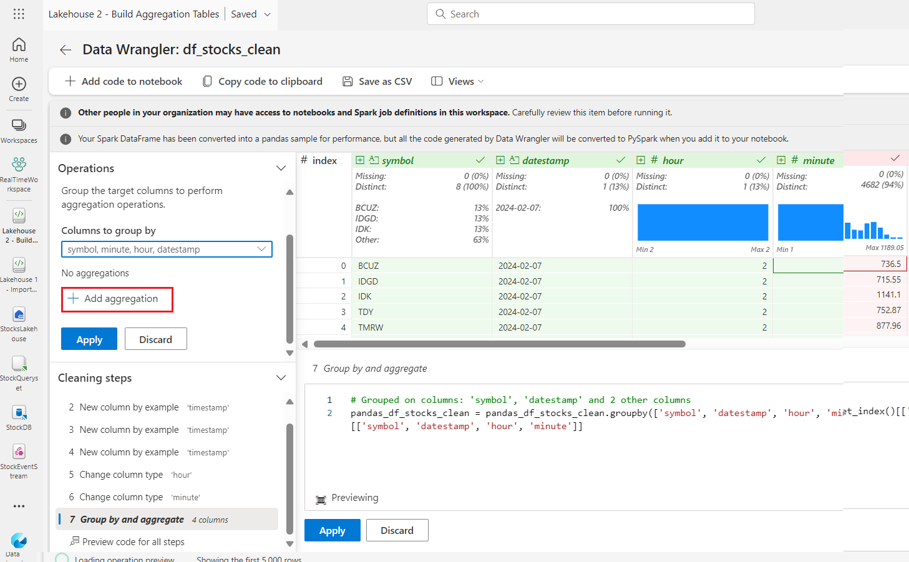

     

16. 페이지 왼쪽 상단 모서리의 **Add code to notebook를** 클릭하세요.
    ***Add code to notebook* 창에서** *Include pandas code*가
    uncheck되어 있는지 확인한 다음, Add 버튼을 클릭하세요.

     

     

     

17. 코드를 검토하고 추가된 셀의 마지막 두 줄에서 반환된 데이터 프레임의
    이름이 ***df_stocks_clean_1인*** 것을 확인할 수 있습니다. 아래와
    같이 이 이름을 ***df_stocks_agg_minute로*** 바꾸고 함수 이름을
    ***aggregate_data_minute로*** 변경하세요.

**\# old:**

def clean_data(df_stocks_clean):

...

df_stocks_clean_1 = clean_data(df_stocks_clean)

display(df_stocks_clean_1)

**\# new:**

def aggregate_data_minute(df_stocks_clean):

...

df_stocks_agg_minute = aggregate_data_minute(df_stocks_clean)

display(df_stocks_agg_minute)
>
     

18. Data wrangler가 생성한 코드가 PySpark 데이터프레임 셀에 있는 경우
    셀을 마우스오버하면 왼쪽에 나타나는 **Run** 아이콘을 선택하세요.

     

      

      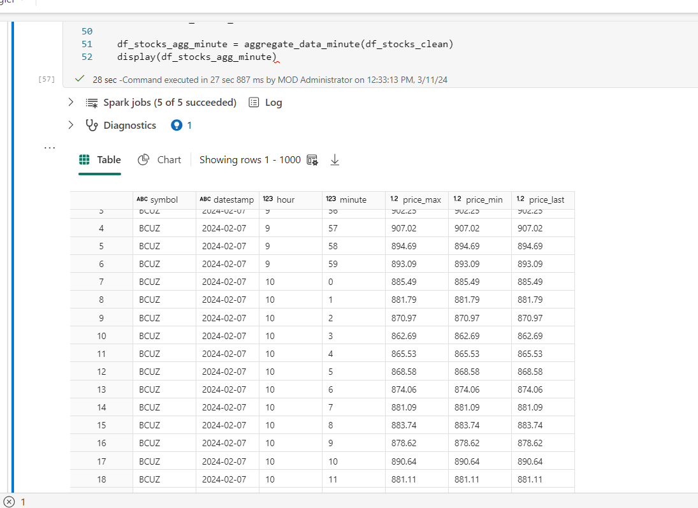

**참고**: 햇갈리는 부분이 있으면 주석에 있는 코드를 참조하세요. Data
wrangling 단계 중 일부가 올바르지 않은 것 같으면(예를 들어 정확한 시
또는 분을 얻지 못하는 경우) 주석 처리된 샘플을 참조하세요. 아래
7단계에는 도움이 될 수 있는 여러 가지 추가 고려 사항이 나와 있습니다.

**참고:** 큰 블록에 주석 달거나 주석을 제거하려면 코드 섹션을 강조
표시하거나 CTRL-A를 눌러 현재 셀의 모든 항목을 선택한 다음 CTRL-/
(컨트롤 슬래시)를 사용하여 주석 처리를 전환할 수 있습니다.

19. Merge cell에서 마우스오버 시 셀 왼쪽에 표시되는 **Run** 아이콘을
    선택하세요. 병합 함수가 데이터를 테이블에 씁니다:

> \# write the data to the stocks_minute_agg table
>
> merge_minute_agg(df_stocks_agg_minute)


## 작업 3: 시간별 집계

현재 진행 상황을 살펴보겠습니다. 초당 데이터를 정리한 다음 분당 수준으로
요약했습니다. 이렇게 하면 주식 기호당 행 수가 86,400행/일에서
1,440행/일로 줄어듭니다. 월별 데이터를 표시할 수 있는 보고서의 경우,
데이터를 시간당 빈도로 더 집계하여 주식 종목당 하루 24개 행으로 줄일 수
있습니다.

1.  **Symbol/Date/Hour** 섹션 아래의 마지막 자리 표시자에서 기존
    **df_stocks_agg_minute** 데이터 프레임을 Data wrangler에
    로드하세요.

2.  **Symbol/Date/Hour** 섹션 아래의 마지막 자리 표시자에서 *Add data
    wrangler here* 에 커서를 놓고 셀을 선택하세요. 아래 이미지와 같이
    **Data wrangler를 드롭다운하고** 탐색하여
    **df_stocks_agg_minute를** 클릭하세요.

     

     

3.  **Operations에서** Group by and aggregate를 ***선택하세요. **열**
    아래의 드롭다운을 클릭하여 필드별로 그룹**화하고
    *symbol*, *datestamp*, 및 *hour을 ***선택한 다음 **+Add
    aggregations를** 클릭하세요. 아래 이미지와 같이 다음 세 가지 집계를
    만들고 그 아래에 있는 Apply 버튼을 클릭하세요.

- price_min: Minimum

- price_max: Maximum

- price_last: Last value

    

    

4.  예제 코드는 아래와 같습니다. 함수의 이름을 *aggregate_data_hour로*
    변경하는 것 외에도 각 가격 열의 별칭도 변경하여 열 이름을 동일하게
    유지했습니다. 이미 집계된 데이터를 집계하는 것이므로 Data Wrangler는
    열의 이름을 price_max_max, price_min_min과 같이 지정하고 있으며,
    명확성을 위해 별칭을 수정하여 이름을 동일하게 유지합니다.

      

5.  페이지 왼쪽 상단 모서리의 **Add code to notebook** **를**
    클릭하세요. ***Add code to notebook* 창에서** Include pandas
    code 가 선택 uncheck되어 있는지 확인하고 **Add** 버튼을 클릭하세요.

      

      

      

6.  추가된 셀의 마지막 두 줄에서 반환된 데이터 프레임의 이름이 def
    clean_data(df_stocks_agg_minute): 인 것을 확인하고, 이 이름을 다음과
    같이 바꾸세요.

   **def aggregate_data_hour(df_stocks_agg_minute):**

7.  추가된 셀의 마지막 두 줄에서 반환되는 데이터 프레임의 이름이
    **df_stocks_agg_minute_clean = clean_data(df_stocks_agg_minute)** 인
    것을 확인할 **수 있습니다.**아래 그림과 같이 이 이름을
    **df_stocks_agg_hour = aggregate_data_hour(df_stocks_agg_minute)**로
    바꾸고, **display(df_stocks_agg_minute_clean)** 함수 이름을
    **aggregate_data_minute로** 변경하세요.

참조 코드:
```
# Code generated by Data Wrangler for PySpark DataFrame

from pyspark.sql import functions as F

def aggregate_data_hour(df_stocks_agg_minute):
    # Performed 3 aggregations grouped on columns: 'symbol', 'datestamp', 'hour'
    df_stocks_agg_minute = df_stocks_agg_minute.groupBy('symbol', 'datestamp', 'hour').agg(
        F.max('price_max').alias('price_max'), 
        F.min('price_min').alias('price_min'), 
        F.last('price_last').alias('price_last'))
    df_stocks_agg_minute = df_stocks_agg_minute.dropna()
    df_stocks_agg_minute = df_stocks_agg_minute.sort(df_stocks_agg_minute['symbol'].asc(), df_stocks_agg_minute['datestamp'].asc(), df_stocks_agg_minute['hour'].asc())
    return df_stocks_agg_minute

df_stocks_agg_hour = aggregate_data_hour(df_stocks_agg_minute)
display(df_stocks_agg_hour)
```
>
     

2.  셀을 선택하고 **실행하세요**.

     )

3.  시간 집계 데이터를 병합하는 코드는 다음 셀에 있습니다:
    **merge_hour_agg(df_stocks_agg_hour)**.

4.  셀을 실행하여 병합을 완료하세요. 하단에는 표의 데이터를 확인할 수
    있는 몇 가지 유틸리티 셀이 있습니다. 데이터를 조금 탐색하고 자유롭게
    실험해 보세요.

     

21. **Handy SQL Commands for testing** 섹션을 사용하여 테스트하고,
    테이블을 정리하여 다시 실행하는 등의 작업을 수행하세요. 이 섹션에서
    셀을 선택하고 **실행하세요**.

     

     

     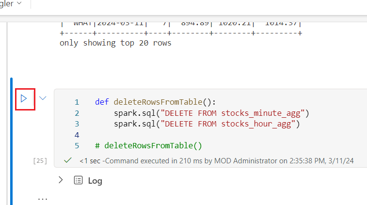

# 연습 3: 차원 모델 구축하기

이 연습에서는 집계 테이블을 더 세분화하고 fact 및 차원 테이블을 사용하여
기존의 Star schema를 만들어 보겠습니다. Data Warehouse 모듈을 완료했다면
이 모듈에서도 비슷한 결과를 얻을 수 있지만, 접근 방식이 다른 점은
노트북을 사용한다는 점입니다.

**참고**: 파이프라인을 사용해 활동을 오케스트레이션할 수도 있지만, 이
솔루션은 완전히 노트북 안에서 이루어집니다.

## 작업 1: 스키마 만들기

이 한 번 실행되는 노트북은 사실 테이블과 차원 테이블을 작성하기 위한
스키마를 설정합니다. 필요한 경우 첫 번째 셀에서 시간별 집계 테이블과
일치하도록 sourceTableName 변수를 구성하세요. 시작/종료 날짜는 날짜 차원
테이블을 위한 것입니다. 이 노트북은 모든 테이블을 다시 만들어 스키마를
다시 작성합니다. 기존 fact 및 차원 테이블은 덮어쓰기됩니다.

1.  왼쪽 탐색 메뉴에서 **RealTimeWorkspace를** 클릭하세요.

     

2.  RealTimeWorkshop 작업 공간에서 ***Lakehouse 3 – Create Star Schema**
     notebook을 선택하세요.

     

3.  Explorer에서 **Lakehouse를** 탐색하여 클릭한 다음 **Add** 버튼을
    클릭하세요.

    

    

4.  **Add lakehouse** 대화 상자에서 **existing lakehouse** 라디오 버튼을
    선택한 다음 **add** 버튼을 클릭하세요.

     

5.  OneLake data hub 창에서 StockLakehouse를 선택하고 **add** 버튼을
    클릭하세요.

      

6.  노트북이 로드되고 Lakehouse가 첨부된 상태에서 왼쪽의 스키마를
    확인하세요. **raw_stock_data** 테이블 외에도 **stocks_minute_agg**
    및 **stocks_hour_agg** 테이블이 있어야 합니다.

     

7.  각 셀의 왼쪽에 있는 **play** 버튼을 클릭하여 각 셀을 개별적으로
    실행하여 프로세스를 따라가세요.

     

     

     

     

     

     

     

     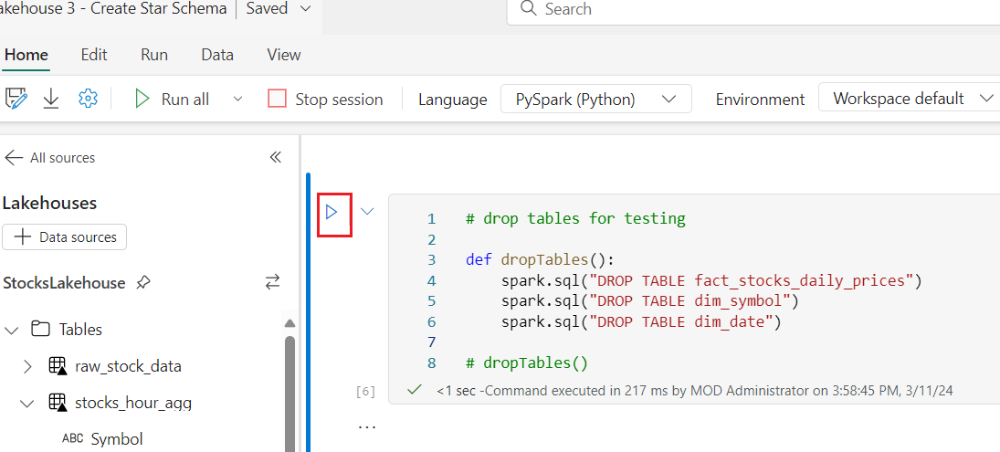

     

8.  모든 셀이 성공적으로 실행되면 **StocksLakehouse** 섹션으로 이동하여
    **Tables(...)** 옆의 가로 줄임표를 클릭한 다음 아래 이미지와
    같이***Refresh를*** 클릭하여 이동하세요.

     

9.  이제 차원 모델에 대한 **dim_symbol**, **dim_date** 및
    **fact_stocks_daily_prices** 테이블을 모두 추가로 볼 수 있습니다.

     

## 작업 2: 팩트 테이블 로드

팩트 테이블에는 일일 주가(고가, 저가, 종가)가 포함되어 있고, 차원에는
날짜 및 주식 기호(회사 세부 정보 및 기타 정보가 포함될 수 있음)가
포함되어 있습니다. 개념적으로는 단순하지만, 이 모델은 더 큰 데이터
세트에 적용할 수 있는 star schema를 나타냅니다.

1.  이제 왼쪽 navigation 메뉴에서 **RealTimeWorkspace를** 클릭하세요.

     

2.  RealTimeWorkshop 작업 공간에서 **Lakehouse 4 - Load fact table**
     notebook을 선택하세요.

      

3.  Explorer에서 **Lakehouse를** 선택한 다음 **Add** 버튼을
    클릭하세요.

    

     

4.  Add lakehouse 대화 상자에서 **Existing lakehouse** 라디오 버튼을
    선택한 다음 **Add** 버튼을 클릭하세요.

    

5.  OneLake data hub 탭에서 **StockLakehouse를** 선택하고 **Add** 버튼을
    클릭하세요.

     

6.  각 셀을 개별적으로 선택하여 실행하세요.

     

7.  함수는 테이블에 존재하지 않을 수 있는 기호를 dim_symbol에 추가하고,
    셀 2와 셀 3을 선택하여 **실행하세요**.

     

     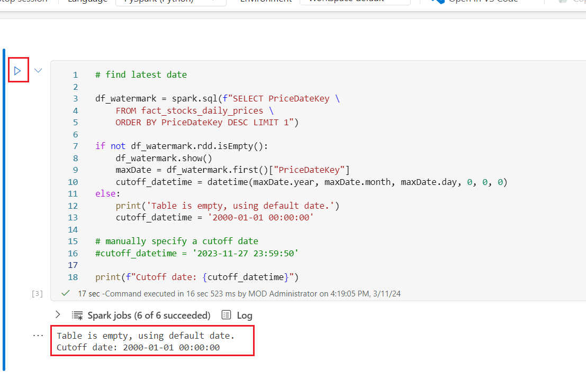

8.  새로운 주식 데이터를 수집하려면 워터마크에서 시작하여 셀 4를
    선택하고 실행하세요.

     

9.  나중에 조인할 날짜 차원을 로드하고 셀 5,6,7을 선택하여 실행하세요.

     

     

     

     

10. 집계된 데이터를 날짜 차원에 조인하려면^(th) 및^(th) 셀 8와 9를
    선택하여 실행하세요.

     

     

11. 처리하기 쉽도록 이름이 정리된 최종 보기를 만들고 셀10 , 11 및 12릏
    선택하여 실행하세요.

     

     

     

12. 결과를 얻고 그래프를 그리려면 셀 13와 14를 선택하여 **실행하세요**.

     

    

    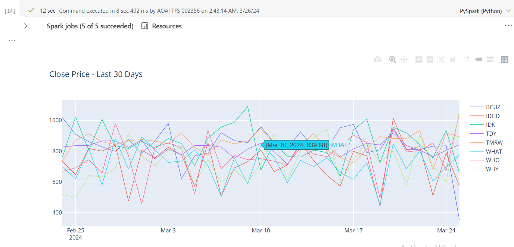

13. 생성된 **테이블의** 유효성을 검사하려면 **Tables** 옆의 가로
    줄임표(...)를 마우스 오른쪽 버튼으로 클릭한 다음 탐색하여
    **Refresh를 클릭하세요.** 테이블이 나타납니다.

     

14. 노트북을 주기적으로 실행하도록 예약하려면 **Run** 탭을 클릭하고 아래
    이미지와 같이 ***Schedule을*** 클릭하세요*.*

     

15. Lackehouse 4- Load Star Schema탭에서 아래 세부 정보를 선택하고
    **Apply** 버튼을 클릭하세요.

- Schedule run: **On**

- Repeat**: Hourly**

- Every: **4 hours**

- 오늘 날짜 선택

     

## 작업 3: 시맨틱 모델 및 간단한 보고서 작성

이 작업에서는 보고에 사용할 수 있는 새로운 시맨틱 모델을 만들고 간단한
Power BI 보고서를 만들어 보겠습니다.

1.  이제 왼쪽 탐색 메뉴에서 **StocksLakehouse를** 클릭하세요.

      

2.  ***StocksLakehouse** 창에서* 명령줄의 ***New semantic model을***
    탐색하여 클릭하세요.

     

3.  모델 이름을 ***StocksDimensionalModel로*** 지정하고
    **fact_stocks_daily_prices**, **dim_date** 및 **dim_symbol**
    테이블을 선택하세요. 그런 다음 **confirm** 버튼을 클릭하세요.

     

      

4.  시맨틱 모델이 열리면 fact 테이블과 차원 테이블 간의 관계를 정의해야
    합니다.

5.  **fact_Stocks_Daily_Prices** 테이블에서 ***Symbol_SK*** 필드를
    **dim_Symbol** 테이블의 ***Symbol_SK*** 필드에 끌어 놓아 관계를
    만드세요. **New relationship** 대화 상자가 나타납니다.

      

6.  **New relationship** 대화 상자에서:

- **From** table은 fact_Stocks_Daily_Prices와 **Symbol_SK** 열로
  채워집니다**.**

- **To** table은 dim_symbol과 **Symbol_SK의** 열로 채워집니다.

- 카디널리티: **다대일(*:1)**

- 교차 필터 방향: **단일**

- **Make this relationship active**  상자를 선택된 상태로 두세요.

- **Save를** 선택하세요.

     
     

7.  **fact_Stocks_Daily_Prices** 테이블에서 **PrinceDateKey** 필드를
    끌어 **dim_date** 테이블의 ***DateKey*** 필드에 놓아 관계를
    만드세요. **New relationship** 대화 상자가 나타납니다.

      

8.  **New relationship** 대화 상자에서:

- **From** table은 fact_Stocks_Daily_Prices와 **PrinceDateKey** 열로
  채워집니다**.**

- **To** table은 dim_date와 **DateKey의** 열로 채워집니다.

- Cardinality: **다대일(*:1)**

- 교차 필터 방향: **단일**

- **Make this relationship active**  옆의 상자를 선택된 상태로 두세요.

- **Save를** 선택하세요.

     

     

9.  **New report를** 클릭하여 Power BI에서 시맨틱 모델을 로드하세요.

     

10. **Power BI** 페이지의 **시각화에서 꺾은선형 차트** 아이콘을 클릭하여
    보고서에 **열 차트를** 추가합니다.

- **Data pane**에서 **fact_Stocks_Daily_Prices를** 확장하고
  **PriceDateKey** 옆의 확인란을 선택하세요. 그러면 열 차트가 만들어지고
  필드가 **X축에** 추가됩니다.

- **Data pane**에서 **fact_Stocks_Daily_Prices를** 확장하고 **종가**
  옆의 확인란을 선택하세요. 그러면 필드가 **Y축에** 추가됩니다.

- **Data pane**에서 **dim_Symbol을** 확장하고 **기호** 옆의 확인란을
  선택하세요. 그러면 **legend에** 필드가 추가됩니다.
      

11. **Filter에서 PriceDateKey를** 선택하고 아래 세부 정보를 입력하세요.
    필터 **Apply를** 클릭하세요.

- Filter type: **Relative date**

- 값**이 최근 45일 이내인** 경우 항목 표시

    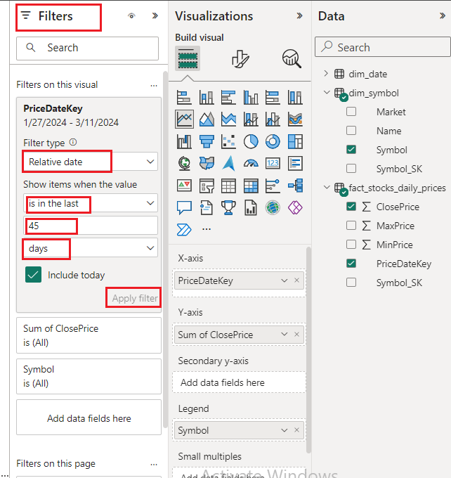

    
 
12. 리본에서 **File** \> **Save as를** 선택하세요**.**

     

13. Save your report dialog box 대화 상자에서 +++StocksDimensional+++
    을 보고서 이름으로 입력하고 **your workspace을** 선택하세요.
    **Save** 버튼을 클릭하세요.

    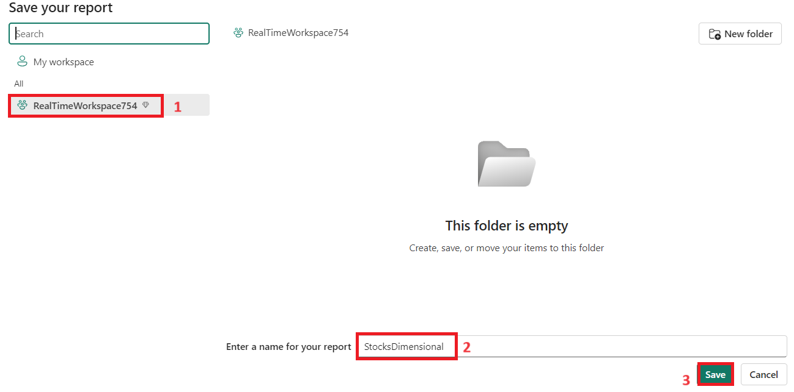

    

**요약**

이 실습에서는 실시간 및 배치 데이터 스트림을 효과적으로 처리하기 위해
포괄적인 Data Lakehouse 인프라를 구성하고 데이터 처리 파이프라인을
구현했습니다. Data Lakehouse 환경 생성부터 시작하여 hot 및 cold data
path 처리를 위한 Lambda 아키텍처 구성까지 실습을 진행합니다.

데이터 집계 및 정리 기술을 적용하여 Data Lakehouse에 저장된 원시
데이터를 다운스트림 분석을 위해 준비했습니다. 다양한 세부 수준에서
데이터를 요약하여 효율적인 쿼리 및 분석을 용이하게 하는 집계 테이블을
구축했습니다. 그 후, 팩트 테이블과 차원 테이블을 통합하여 Lakehouse 내에
차원 모델을 구축했습니다. 복잡한 쿼리 및 보고 요구 사항을 지원하기 위해
이러한 테이블 간의 관계를 정의했습니다.

마지막으로, 데이터에 대한 통합된 보기를 제공하는 시맨틱 모델을 생성하여
Power BI와 같은 시각화 도구를 사용해 대화형 보고서를 만들 수 있습니다.
이러한 전체적인 접근 방식을 통해 Data Lakehouse 환경 내에서 효율적인
데이터 관리, 분석 및 보고가 가능합니다.
