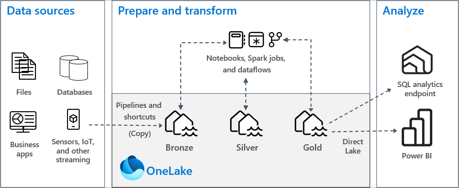
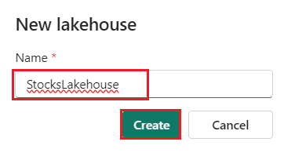
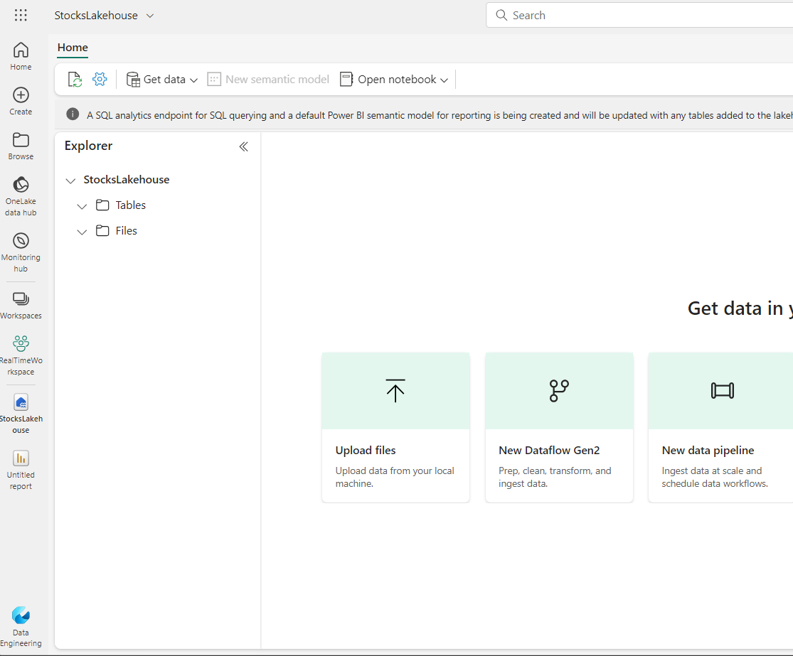
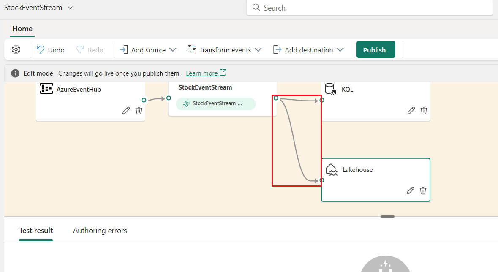
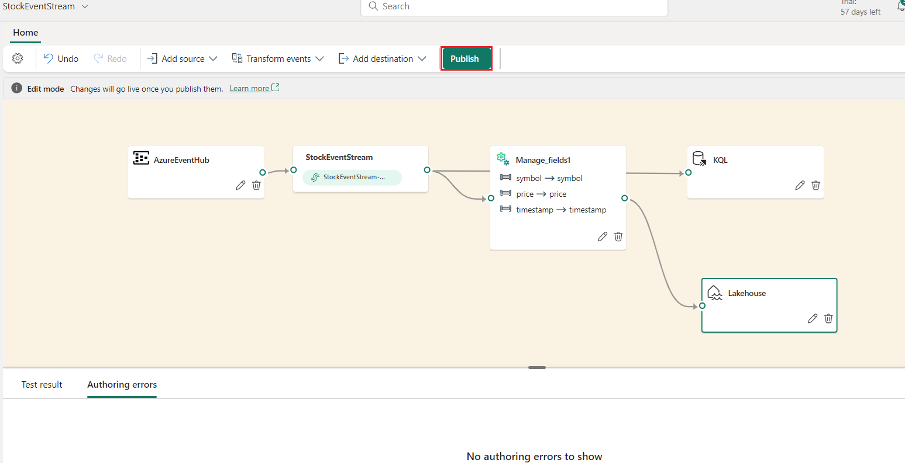
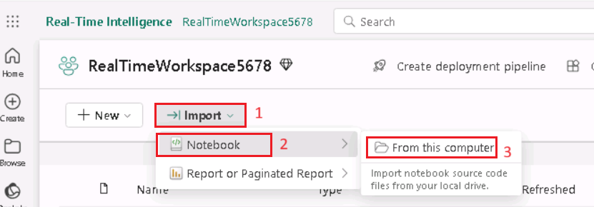
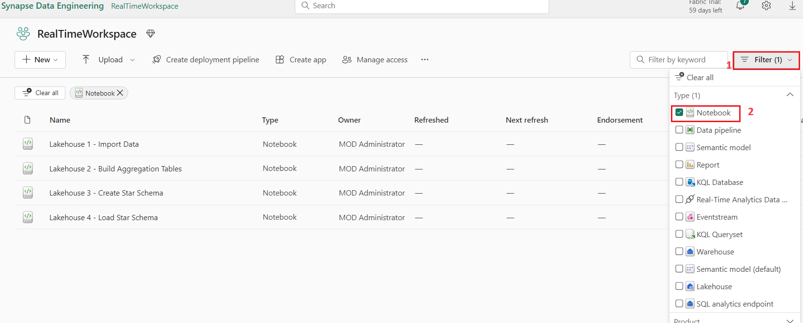
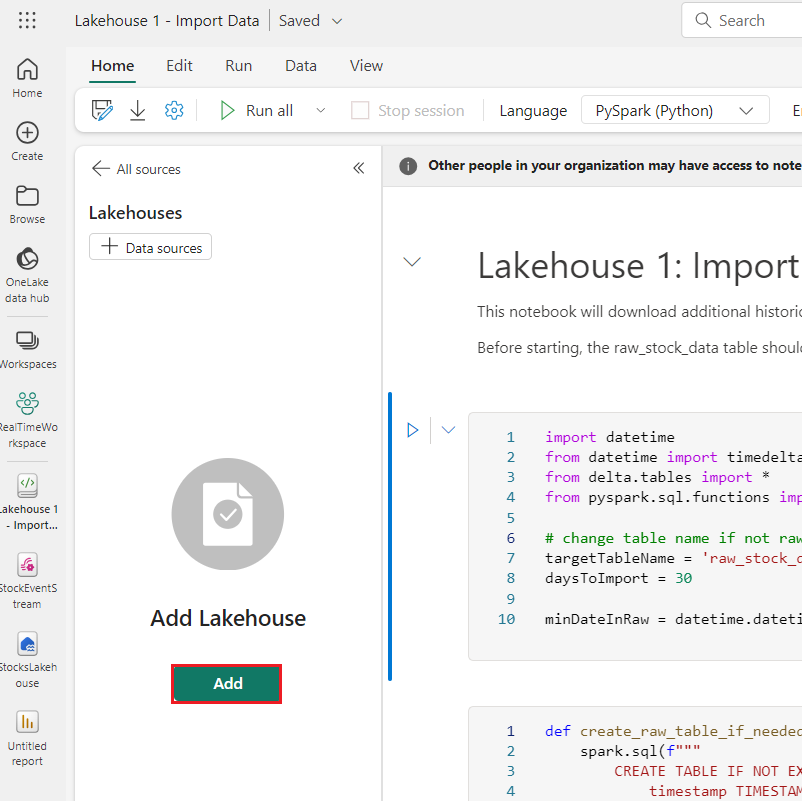
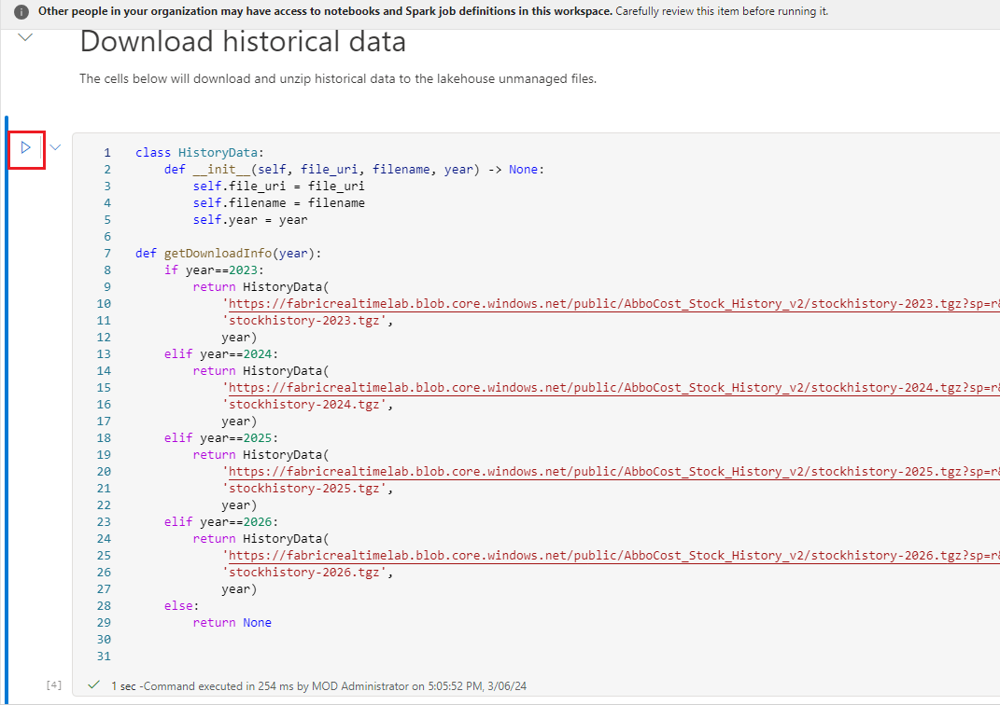

# Lab 03: Building a Data Lakehouse

**Introduction**

Most of this lab will be done within Jupyter notebooks, an industry
standard way of doing exploratory data analysis, building models,
visualizing datasets, and processing data. A notebook itself is
separated into individual sections called cells, which contain code or
documentation. Cells, and even sections within cells, can adapt to
different languages as needed (though Python is the most used language).
The purpose of the cells are to break tasks down into manageable chunks
and make collaboration easier; cells may be run individually or as a
whole depending on the purpose of the notebook.

In a Lakehouse medallion architecture (with bronze, silver, gold layers)
data is ingested in the raw/bronze layer, typically "as-is" from the
source. Data is processed through an Extract, Load, and Transform (ELT)
process where the data is incrementally processed, until it reaches the
curated gold layer for reporting. A typical architecture may look
similar to:

These layers are not intended to be a hard rule, but rather a guiding
principle. Layers are often separated into different Lakehouses, but for
the purposes of our lab, we'll be using the same Lakehouse to store all
layers. Read more on implementing a [medallion architecture in Fabric
here](https://learn.microsoft.com/en-us/fabric/onelake/onelake-medallion-lakehouse-architecture).

**Objectives**

- To create a Lakehouse named "StocksLakehouse" in the Data Engineering
  persona of Synapse Data Engineering Home, confirming successful SQL
  endpoint creation.

- To add the Lakehouse to the StockEventStream, configure it, perform
  data cleanup, and ensure the Lakehouse receives required data fields.

- To import notebooks "Lakehouse 1-4" into RealTimeWorkspace, then
  execute them individually.

- To utilize event processors and data wrangling techniques for
  aggregating and cleaning the raw data stored in the Lakehouse. This
  includes performing functions such as filtering, data type conversion,
  and field management to prepare the data for downstream analytics.

- To build curated and aggregated data tables suitable for building a
  dimensional model and supporting data science activities. This
  involves creating aggregation routines to summarize data at different
  levels of granularity, such as per-minute and per-hour aggregations.

- To build a dimensional model within the Lakehouse environment,
  incorporating fact and dimension tables. Define relationships between
  these tables to facilitate efficient querying and reporting.

- To create a semantic model based on the dimensional model and build
  interactive reports using tools like Power BI to visualize and analyze
  the aggregated data.

# Exercise 1: Setting up the Lakehouse

## Task 1: Create the Lakehouse

Start by creating a Lakehouse.

***Note**: If you are completing this lab after the data science module
or another module that uses a Lakehouse, you may re-use that Lakehouse
or create a new one, but we'll assume the same Lakehouse is shared
across all modules.*

1.  Within your Fabric workspace, switch to the **Data engineering**
    persona (bottom left) as shown in the below image.

   

2.  In Synapse Data Engineering Home page, navigate and click on
    **Lakehouse** tile.

   

3.  In the **New lakehouse** dialog box, enter **StocksLakehouse** in
    the **Name** field, then click on the **Create** button. A
    **StocksLakehouse** page will appear.

   

   

4.  You will see a notification stating - **Successfully created SQL
    endpoint**.

> **Note**: In case, you did not see the Notifications, then wait for
> few minutes.

   
## Task 2. Add Lakehouse to the Eventstream

From an architecture perspective, we'll implement a Lambda architecture
by splitting hot path and cold path data from the Eventstream. Hot path
will continue to the KQL database as already configured, and cold path
will be added to write the raw data to our lakehouse. Our data flow will
resemble the following:

***Note**: If you are completing this lab after the data science module
or another module that uses a Lakehouse, you may re-use that Lakehouse
or create a new one, but we'll assume the same Lakehouse is shared
across all modules.*

1.  Within your Fabric workspace, switch to the **Data engineering**
    persona (bottom left) as shown in the below image.

   

2.  Now, click on **RealTimeWorkspace** on the left-sided navigation
    pane and select **StockEventStream** as shown in the below image.

   

3.  In addition to adding Lakehouse to the Eventstream, we'll do some
    cleanup of the data using some of the functions available in the
    Eventstream.

4.  On the **StockEventStream** page, select **Edit**

    
5.  On the **StockEventStream** page, click on the **Add destination**
    on the output of the Eventstream to add a new destination.
    Select **Lakehouse** from the context menu.

    

6.  In the Lakehouse pane that appears on the right side, enter the
    following details and click on **Save.**

| **Destination name** | **Lakehouse** |
|----|----|
| **Workspace** | RealTimeWorkspace |
| **Lakehouse** | StockLakehouse |
| **Delta table** | Click on **Create new**\> enter +++raw_stock_data+++ |
| **Input data format** | Json |

  
  
6.  Connect **StockEventStream** and **Lakehouse**

  
  
  

7.  Select the Lakehouse and click on **Refresh** button

   

8.  After clicking **Open event processor**, various processing can be
    added that perform aggregations, filtering, and changing datatypes.

   

9.  On the **StockEventStream** page, select **stockEventStream**, and
    click the **plus (+)** icon to add a **Mange field**. Then, select
    **Mange field.**

   
   
10. In the eventstreem pane select **Managefields1** pencil icon.

   
11. In the *Manage fields* pane that opens, click ***Add all
    fields*** to add all columns. Then, remove the fields
    **EventProcessedUtcTime**, **PartitionId**, and
    **EventEnqueuedUtcTime** by clicking the **ellipsis (...)** to the
    right of the field name, and click **Remove**

  
  
  
  
  
12. Now change the *timestamp* column to a *DateTime*** **as it is
    likely classified as a string. Click the **three ellipsis (...)** to
    the right of the *timestamp*** column** and select *Yes change
    type*. This will allow us to change the datatype:
    select *DateTime***,** as shown in the below image. Click on
    **Done**

   
>
   

12. Now, click on the **Publish** button to close the event processor

  

  

13. Once it is completed, the Lakehouse will receive the symbol, price,
    and timestamp.

   
Our KQL (hot path) and Lakehouse (cold path) is now configured. It may
take a minute or two for data to be visible in the Lakehouse.

## Task 3. Import notebooks

**Note**: If you have issues importing these notebooks, be sure you are
downloading the raw notebook file and not the HTML page from GitHub that
is displaying the notebook.

1.  Now, click on **RealTimeWorkspace** on the left-sided navigation
    menu.

 

2.  In the **Synapse Data Engineering** **RealTimeWorkspace** page,
    navigate and click on **Import** button, then select **Notebook**
    and select the **From this computer** as shown in the below image.

  

3.  Select **Upload** from the **Import status** pane that appears on
    the right side of the screen.

   
4.  Navigate and select **Lakehouse 1-Import Data, Lakehouse 2-Build
    Aggregation, Lakehouse 3-Create Star Schema** and **Lakehouse 4-Load
    Star Schema** notebooks from **C:\LabFiles\Lab 04** and click on the
    **Open** button.

   
5.  You will see a notification stating **Imported successfully.**

   
## Task 4. Import additional data

In order the make the reports more interesting, we need a bit more data
to work with. For both the Lakehouse and Data Science modules,
additional historical data can be imported to supplement the data that
is already ingested. The notebook works by looking at the oldest data in
the table, prepending the historical data.

1.  In the **RealTimeWorkspace** page, to view only the notebooks, click
    on the **Filter** at the top right corner of the page, then select
    **Notebook.**

   
2.  Then, select the ***Lakehouse 1 - Import Data* **notebook.

   

3.  Under **Explorer**, navigate and select the **Lakehouse**, then
    click on the **Add* ***button as shown in the below images*.*

> **Important Note**: You’ll need to add the Lakehouse to every imported
> notebook -- do this each time you open a notebook for the first time.

   
   

4.  In the **Add Lakehouse** dialog box, select the **Existing
    lakehouse** radio button, then click on the **Add** button.

   

5.  On the **OneLake data hub** window, select **StockLakehouse** and
    click on the **Add** button.
    

6.  The **raw_stock_data** table was created when the Eventstream was
    configured, and is the landing place for the data that is ingested
    from the Event Hub.

    
**Note**: You will see the **Run** button when you hover your mouse over
the cell in the notebook.

7.  To start the notebook and execute the cell, select the **Run** icon
    that appears on the left side of the cell.

   
   
8.  Similarly, run the 2nd and 3rd cells.

   
   
9.  To download and unzip historical data to the Lakehouse unmanaged
    files, run 4th and 5th d cells as
    shown in the below images.

  
  
  

10. To verify csv files are available, select and run the 6th
    cell.

   
11. Run the 7th cell, 8th cell , and
    9th cell.

   
   
   

12. While similar to 'commenting out' sections of code, freezing cells
    is powerful in that any output of the cells are also preserved.

  

# Exercise 2: Building the Aggregation Tables

In this exercise, you’ll build curated and aggregated data suitable for
use in building our dimensional model and in data science. With the raw
data having a per-second frequency, this data size is often not ideal
for reporting or analysis. Further, the data isn't cleansed, so we're at
risk of non-conforming data causing issues in reports or pipelines where
erroneous data isn't expected. These new tables will store the data at
the per-minute and per-hour level. Fortunately, *data wrangler* makes
this an easy task.

The notebook used here will build both aggregation tables, which are
silver-level artifacts. While it is common to separate medallion layers
into different Lakehouses, given the small size of our data and for the
purposes of our lab, we'll be using the same Lakehouse to store all
layers.

## Task 1: Build Aggregation Tables notebook

Take a moment to scroll through the notebook. Be sure to add the default
Lakehouse if it is not already added.

1.  Now, click on **RealTimeWorkspace** on the left-sided navigation
    menu.

2.  In the **RealTimeWorkspace** page, click on **Lakehouse 2 – Build
    Aggregation Tables** notebook.

3.  Under Explorer, navigate and select the **Lakehouse**, then click on
    the **Add* ***button.

4.  In the **Add Lakehouse** dialog box, select the **Existing
    lakehouse** dialog box, then click on the **Add** button.

5.  On the **OneLake data hub** window, select the **StockLakehouse**,
    and click on the **Add** button.

6.  To build Aggregate Tables, select and run the 1st ,
    2nd , 3rd , and 4th cells.

7.  Then, select and run the 5th , 6th,
    7th , and 8th cells.

8.  Add data wrangler, select **9th** cell, navigate dropdown
    **Data Wrangler**. Navigate and click on **anomaly_df** to load the
    dataframe in data wrangler**.**

9.  We'll use the *anomaly_df* because it was intentionally created with
    a few invalid rows that can be tested. 

10. In data wrangler, we'll record a number of steps to process data.
    Notice the data is visualized in the central column. Operations are
    in the top left, while an overview of each step is in the
    bottom left.

11. To remove null/empty values, under *Operations*, click on the
    dropdown beside **Find and replace**, then navigate and click on
    **Drop missing values**.

12. From the **Target columns** dropdown, select
    the ***symbol*** and ***price* **columns and then click on **Apply
    button** below it as shown in the image***.***

13. Under **Operations** dropdown, navigate and click on **Sort and
    filter**, then click on **Filter** as shown in the below image. 

>  alt="A screenshot of a computer Description automatically generated" />

14. **Uncheck** *Keep matching rows*, select **price** as the target
    column, and set the condition to ***Equal* to *0*.**
    Click ***Apply* **in the *Operations* panel beneath the Filter

> Note: The rows with zero are marked red as they will be dropped (if
> the other rows are marked red, ensure to uncheck the *Keep matching
> rows* checkbox).

15. Click on **+Add code to notebook** in the upper left side of the
    page. On the ***Add code to notebook* **window, ensure that *Include
    pandas code* is unchecked and click on the **Add** button.

16. The code inserted will look similar to the below.

17. Run the cell and observe the output. You’ll observe that the invalid
    rows were removed.

> 

The function created, *clean_data*, contains all of the steps in
sequence and can be modified as needed. Notice that each step performed
in data wrangler is commented. Because data wrangler was loaded with
the *anomaly_df*, the method is written to take that dataframe by name,
but this can be any dataframe that matches the schema.

18. Modify the function name
    from **clean_data** to *remove_invalid_rows*, and change the
    line *anomaly_df_clean = clean_data(anomaly_df)* to *df_stocks_clean
    = remove_invalid_rows(df_stocks)* . Also, while not necessary for
    functionality, you can change the name of the dataframe used in the
    function to simply *df* as shown below

19. Run this cell and observe the output.

> \# Code generated by Data Wrangler for PySpark
> DataFrame
>
> def remove_invalid_rows(df):
>
> \# Drop rows with missing data in columns:
> 'symbol', 'price'
>
> df = df.dropna(subset=\['symbol', 'price'\])
>
> \# Filter rows based on column: 'price'
>
> df = df.filter(~(df\['price'\] == 0))
>
> return df
>
> df_stocks_clean =
> remove_invalid_rows(df_stocks)
>
> display(df_stocks_clean)

20. This function will now remove the invalid rows from
    our *df_stocks* dataframe and return a new dataframe
    called *df_stocks_clean*. It is common to use a different name for
    the output dataframe (such as *df_stocks_clean*) to make the cell
    idempotent -- this way, we can go back and re-run the cell, make
    modifications, etc., without having to reload our original data.

## Task 2: Build aggregation routine

In this task, you’ll be more involved because we'll build a number of
steps in data wrangler, adding derived columns and aggregating the data.
If you get stuck, continue as best you can and use the sample code in
the notebook to help fix any issues after.

1.  Add new column datestamp in the ***Symbol/Date/Hour/Minute
    Aggregation** Section*, place your cursor in the *Add data wrangler
    here* cell and select the cell. Dropdown the **Data Wrangler**.
    Navigate and click on **df_stocks_clean** as shown in the below
    image.

>  style="width:6.49167in;height:4.31667in" />
>
>  alt="A screenshot of a computer Description automatically generated" />

2.  In **Data Wrangler:df_stocks_clean** pane, select **Operations**,
    then select **New column by example.**

> 

3.  Under ***Target columns*** field, click on the dropdown and select
    ***timestamp***. Then, in the ***Derived column** **name*** field,
    enter +++***datestamp+++***

4.  In the new ***datestamp*** column, enter an example value for any
    given row. For example, if the *timestamp* is *2024-02-07
    09:54:00* enter ***2024-02-07***. This allows data wrangler to infer
    we are looking for the date without a time component; once the
    columns autofill, click on the ***Apply*** button.

5.  Similar to adding the **datestamp** column as mentioned in the above
    steps, click again on **New column by example** as shown in the
    below image.

6.  Under *Target columns*, choose ***timestamp***. Enter a ***Derived
    column** name* of +++***hour+++*.**

>  style="width:6.49167in;height:3.81667in" />

7.  In the new **hour* ***column that appear in the data preview, enter
    an hour for any given row -- but try to pick a row that has a unique
    hour value. For example, if the *timestamp* is *2024-02-07
    09:54:00* enter ***9***. You may need to enter example values for
    several rows, as shown here. Click on **Apply** button.

>  style="width:6.48333in;height:3.68333in" />

8.  Data wrangler should infer we are looking for the hour component,
    and build code similar to:

\# Derive column 'hour' from column: 'timestamp'

def hour(timestamp):

    """

    Transform based on the following examples:

       timestamp           Output

    1: 2024-02-07T09:54 =\> "9"

    """

    number1 = timestamp.hour

    return f"{number1:01.0f}"

pandas_df_stocks_clean.insert(3, "hour",
pandas_df_stocks_clean.apply(lambda row : hour(row\["timestamp"\]),
axis=1))

 

9.  Same as with the hour column, create a new ***minute* **column. In
    the new *minute* column, enter a minute for any given row. For
    example, if the *timestamp* is *2024-02-07 09:54:00* enter *54*. You
    may need to enter example values for several rows.

10. The code generated should look similar to:

\# Derive column 'minute' from column: 'timestamp'

def minute(timestamp):

    """

    Transform based on the following examples:

       timestamp           Output

    1: 2024-02-07T09:57 =\> "57"

    """

    number1 = timestamp.minute

    return f"{number1:01.0f}"

pandas_df_stocks_clean.insert(3, "minute",
pandas_df_stocks_clean.apply(lambda row : minute(row\["timestamp"\]),
axis=1))

11. Next, convert the hour column to an integer. Click on the **ellipsis
    (...)** in the corner of the *hour* column and select ***Change
    column** type*. Click on the dropdown beside ***New type***,
    navigate and select ***int32**,* then click on the ***Apply*
    button** as shown in the below image. 

12. Convert the minute column to an integer using the same steps as you
    just performed for the hour. Click on the **ellipsis (...)** in the
    corner of the ***minute* column** and select ***Change column**
    type*. Click on the dropdown beside ***New type***, navigate and
    select ***int32**,* then click on the ***Apply* button** as shown in
    the below image.

13. Now, under the **Operations** section, navigate and click on
    ***Group by and aggregate*** as shown in the below image.

14. Click on the dropdown under ***Columns to group by*** field and
    select ***symbol*, *datestamp*, *hour*, *minute***.

15. Click on +*Add aggregation*, create a total of three aggregations as
    shown in the below images and click on the ***Apply*** button.

- price: Maximum

- price: Minimum

- price: Last value

16. Click **Add code to notebook** in the upper left corner of the
    page. On the ***Add code to notebook* window**, ensure *Include
    pandas code* is unchecked, then click on the **Add** button.

17. Review the code, in the cell that is added, in the last two lines of
    the cell, notice the dataframe returned is
    named ***df_stocks_clean_1***. Rename
    this ***df_stocks_agg_minute***, and change the name of the function
    to ***aggregate_data_minute*,** as shown below.

**\# old:**

def clean_data(df_stocks_clean):

...

df_stocks_clean_1 = clean_data(df_stocks_clean)

display(df_stocks_clean_1)

**\# new:**

def aggregate_data_minute(df_stocks_clean):

...

df_stocks_agg_minute = aggregate_data_minute(df_stocks_clean)

display(df_stocks_agg_minute)

18. Code generated by Data Wrangler for PySpark DataFrame cell, select
    the **Run** icon that appears to the left of the cell upon hover.

**Note**: If you get stuck, refer to the commented-out code as a
reference. If any of the data wrangling steps don't seem to be quite
correct (not getting the correct hour or minute, for example), refer to
the commented-out samples. Step 7 below has a number of additional
considerations that may help.

**Note:** If you'd like to comment-out (or uncomment) large blocks, you
can highlight the section of code (or CTRL-A to select everything in the
current cell) and use CTRL-/ (Control *slash*) to toggler commenting.

19. In the merge cell, select the **Run** icon that appears to the left
    of the cell upon hover. The merge function writes the data into the
    table:

> \# write the data to the stocks_minute_agg
> table
>
> merge_minute_agg(df_stocks_agg_minute)

## Task 3: Aggregate hourly

Let's review current progress - our per-second data has been cleansed,
and then summarized to the per-minute level. This reduces our rowcount
from 86,400 rows/day to 1,440 rows/day per stock symbol. For reports
that might show monthly data, we can further aggregate the data to
per-hour frequency, reducing the data to 24 rows/day per stock symbol.

1.  In the final placeholder under the *Symbol/Date/Hour* section, load
    the existing ***df_stocks_agg_minute*** dataframe into data
    wrangler.

2.  In the final placeholder under the ***Symbol/Date/Hour*** section,
    place your cursor in the *Add data wrangler here* cell and select
    the cell. Dropdown the **Data Wrangler,** navigate and click on
    ***df_stocks_agg_minute*** as shown in the below image.

>  alt="A screenshot of a computer Description automatically generated" />

3.  Under ***Operations*,** select ***Group by and aggregate***. Click
    on the dropdown below **Columns to group by** field and select
    ***symbol*, *datestamp*, and *hour***, and then click on **+Add
    aggregations**. Create the following three aggregations and click on
    Apply button below it, as shown in the below image.

- price_min: Minimum

- price_max: Maximum

- price_last: Last value

4.  Example code is shown below. In addition to renaming the function
    to *aggregate_data_hour*, the alias of each price column has also
    been changed to keep the column names the same. Because we are
    aggregating data that has already been aggregated, data wrangler is
    naming the columns like price_max_max, price_min_min; we will modify
    the aliases to keep the names the same for clarity.

5.  Click **Add code to notebook** in the upper left corner of the
    page. On the ***Add code to notebook* window**, ensure *Include
    pandas code* is unchecked and click on the **Add** button.

6.  In the cell that is added, in the last two lines of the cell, notice
    the dataframe returned is named def
    clean_data(df_stocks_agg_minute):, rename
    this

> **def aggregate_data_hour(df_stocks_agg_minute):**

7.  In the cell that is added, in the last two lines of the cell, notice
    the dataframe returned is named **df_stocks_agg_minute_clean =
    clean_data(df_stocks_agg_minute).**Rename this **df_stocks_agg_hour
    = aggregate_data_hour(df_stocks_agg_minute),** and change the name
    of the function **display(df_stocks_agg_minute_clean)**
    to *aggregate_data_minute*, as shown below. 

Reference Code:

\# Code generated by Data Wrangler for PySpark DataFrame

from pyspark.sql import functions as F

def aggregate_data_hour(df_stocks_agg_minute):

\# Performed 3 aggregations grouped on columns: 'symbol', 'datestamp',
'hour'

df_stocks_agg_minute = df_stocks_agg_minute.groupBy('symbol',
'datestamp', 'hour').agg(

F.max('price_max').alias('price_max'),

F.min('price_min').alias('price_min'),

F.last('price_last').alias('price_last'))

df_stocks_agg_minute = df_stocks_agg_minute.dropna()

df_stocks_agg_minute =
df_stocks_agg_minute.sort(df_stocks_agg_minute\['symbol'\].asc(),
df_stocks_agg_minute\['datestamp'\].asc(),
df_stocks_agg_minute\['hour'\].asc())

return df_stocks_agg_minute

df_stocks_agg_hour = aggregate_data_hour(df_stocks_agg_minute)

display(df_stocks_agg_hour)

2.  Select and **Run** the cell.

3.  The code to merge the hour aggregated data is in the next cell:
    **merge_hour_agg(df_stocks_agg_hour)**

4.  Run the cell to complete the merge. There are a few utility cells at
    the bottom for checking the data in the tables -- explore the data a
    bit and feel free to experiment.

21. Use **Handy SQL Commands for testing** section for testing, cleaning
    out tables to re-run, etc. Select and **Run** the cells in this
    section.

# Exercise 3: Building the Dimensional Model

In this exercise, we'll further refine our aggregation tables and create
a traditional star schema using fact and dimension tables. If you've
completed the Data Warehouse module, this module will produce a similar
result, but is different in approach by using notebooks within a
Lakehouse.

**Note**: It is possible to use pipelines to orchestrate activities, but
this solution will be done completely within notebooks.

## Task 1: Create schema

This run-once notebook will setup the schema for building the fact and
dimension tables. Configure the sourceTableName variable in the first
cell (if needed) to match the hourly aggregation table. The begin/end
dates are for the date dimension table. This notebook will recreate all
tables, rebuilding the schema: existing fact and dimension tables will
be overwritten.

1.  Click on **RealTimeWorkspace** on the left-sided navigation menu.

2.  In the RealTimeWorkshop workspace, select the ***Lakehouse 3 –
    Create Star Schema*  **notebook.

3.  Under the Explorer, navigate and click on the **Lakehouses**, then
    click on the **Add** button*.*

4.  In the **Add Lakehouse** dialog box, select the **Existing
    lakehouse** radio button, then click on the **Add** button.

5.  On the OneLake data hub window, select **StockLakehouse**  and click
    on the **Add** button.

6.  With the notebook loaded and the Lakehouse attached, notice the
    schema on the left. In addition to the **raw_stock_data** table,
    there should be the **stocks_minute_agg** and **stocks_hour_agg**
    tables.

7.  Run each cell individually by clicking the **play** button on the
    left side of each cell to follow along with the process.

8.  When all cells have been run successfully, navigate to
    **StocksLakehouse** section, click on the horizontal ellipsis beside
    **Tables** **(...)**, then navigate and click on ***Refresh*** as
    shown in the below image.

9.  Now, you can see all additional tables ***dim_symbol*, *dim_date*,
    and *fact_stocks_daily_prices*** for our dimensional model.

## Task 2: Load fact table

Our fact table contains the daily stock prices (the high, low, and
closing price), while our dimensions are for our date and stock symbols
(which might contain company details and other information). Although
simple, conceptually, this model represents a star schema that can be
applied to larger datasets.

1.  Now, click on **RealTimeWorkspace** on the left-sided navigation
    menu.

2.  In the RealTimeWorkshop workspace, select the ***Lakehouse 4 – Load
    fact table*  **notebook.

3.  Under the Explorer, select **Lakehouse**, then click on the **Add**
    button*.*

4.  In the **Add Lakehouse** dialog box, select the **Existing
    lakehouse** radio button, then click on the **Add** button.

5.  On the OneLake data hub tab, select the **StockLakehouse**  and
    click on the **Add** button.

6.  Select and run each cell individually.

7.  Function adds symbols to dim_symbol that may not exist in table,
    select and **Run** the 2nd and 3rd cells.

8.  To get new stock data to ingest, starting at watermark, select and
    run the 4th cell.

9.  Load the date dimension for later joins, select and **Run** the
    5th, 6th, and 7th cells.

10. To join the aggregated data to the date dimension, select and
    **Run** the 8th and 9th cells.

11. Create a final view with cleaned names for processing ease, select
    and **Run** the 10th, 11th , and
    12th cells.

12. To obtain the result and plot a graph, select and
    **Run** 13th and 14th cells.

13. To validate the created tables, right click on the horizontal
    ellipsis (…) beside **Tables,** then navigate and click on
    **Refresh.** The tables will appear.

14. To schedule the notebook to run periodically, click on
    the ***Run*** tab, and click on ***Schedule*** as shown in the below
    image*.*

15. In Lackhouse 4-Load Star Schema tab, select the below details and
    click on the **Apply** button.

- Schedule run: **On**

- Repeat**: Hourly**

- Every: **4 hours**

- Select today date

## Task 3: Build semantic model and simple report

In this task, we'll create a new semantic model that we can use for
reporting, and create a simple Power BI report.

1.  Now, click on **StocksLakehouse** on the left-sided navigation menu.

2.  In the ***StocksLakehouse*** window*,* navigate and click on ***New
    semantic model*** in the command bar*.*

3.  Name the model ***StocksDimensionalModel* **and select the
    **fact_stocks_daily_prices**, **dim_date** and **dim_symbol**
    tables. Then, click on the **Confirm** button.

4.  When the semantic model opens, we need to define relationships
    between the fact and dimension tables.

5.  From the **fact_Stocks_Daily_Prices** table, drag
    the ***Symbol_SK***  field and drop it on
    the ***Symbol_SK***   field in the **dim_Symbol** table to create a
    relationship. The **New relationship** dialog box appears.

6.  In the **New relationship** dialog box:

- **From table** is populated with **fact_Stocks_Daily_Prices** and the
  column of **Symbol_SK.**

- **To table** is populated with **dim_symbol**  and the column of
  **Symbol_SK**

- Cardinality: **Many to one (\*:1)**

- Cross filter direction: **Single**

- Leave the box next to **Make this relationship active** selected.

- Select **Save.**

7.  From the **fact_Stocks_Daily_Prices** table, drag
    the **PrinceDateKey**  field and drop it on
    the ***DateKey***   field in the **dim_date** table to create a
    relationship. The **New relationship** dialog box appears.

8.  In the **New relationship** dialog box:

- **From table** is populated with **fact_Stocks_Daily_Prices** and the
  column of **PrinceDateKey.**

- **To table** is populated with **dim_date**  and the column of
  **DateKey**

- Cardinality: **Many to one (\*:1)**

- Cross filter direction: **Single**

- Leave the box next to **Make this relationship active** selected.

- Select **Save.**

9.  Click ***New Report*** to load the semantic model in Power BI.

10. In the **Power BI** page, under **Visualizations**, click to the
    **Line chart** icon to add a **Column chart** to your report.

- On the **Data** pane, expand **fact_Stocks_Daily_Prices**  and check
  the box next to **PriceDateKey**. This creates a column chart and adds
  the field to the **X-axis**.

- On the **Data** pane, expand **fact_Stocks_Daily_Prices** and check
  the box next to **ClosePrice**. This adds the field to the **Y-axis**.

- On the **Data** pane, expand **dim_Symbol** and check the box next
  to **Symbol**. This adds the field to the **Legend**.

11. Under **Filters,** select **PriceDateKey** and enter the below
    details. Click on the **Apply filte**r

- Filter type: **Relative date**

- Show items when the value: **is in the last 45 days**

12. From the ribbon, select **File** \> **Save as.**

13. In the Save your report dialog box, enter +++
    **StocksDimensional** +++ as the name of your report and select
    **your workspace**. Click on the **Save** button**.**

**Summary**

In this lab, you’ve configured a comprehensive Lakehouse infrastructure
and implemented data processing pipelines to handle real-time and batch
data streams effectively. You’ve started with the creation of the
Lakehouse environment, the lab progresses to configuring Lambda
architecture for processing hot and cold data paths.

You’ve applied data aggregation and cleansing techniques to prepare the
raw data stored in the Lakehouse for downstream analytics. You’ve built
aggregation tables to summarize data at different levels of granularity,
facilitating efficient querying and analysis. Subsequently, you’ve built
a dimensional model within the Lakehouse, incorporating fact and
dimension tables. You’ve defined the relationships between these tables
to support complex queries and reporting requirements.

Finally, you’ve generated a semantic model to provide a unified view of
the data, enabling the creation of interactive reports using
visualization tools like Power BI. This holistic approach enables
efficient data management, analysis, and reporting within the Lakehouse
environment.
