# Laboratorio 04: Introducción a la creación de un ML Model en Fabric

**Introducción**

Para refrescar el escenario, AbboCost Financial ha estado modernizando
sus informes bursátiles para sus analistas financieros. En módulos
anteriores, hemos desarrollado la solución mediante la creación de
cuadros de mando en tiempo real, un almacén de datos y mucho más.

En este módulo, a AbboCost le gustaría explorar el análisis predictivo
para ayudar a informar a sus asesores. El objetivo es analizar los datos
históricos en busca de patrones que puedan utilizarse para crear
previsiones de valores futuros. La capacidad de Data Science en
Microsoft Fabric es el lugar ideal para hacer este tipo de exploración.

**Objetivos**

- Importar y configurar cuadernos para construir y almacenar modelos de
  machine learning.

- Explorar y ejecutar el cuaderno DS 1-Build Model para construir y
  validar un modelo de predicción de existencias.

- Examinar los metadatos del modelo y las métricas de rendimiento en el
  RealTimeWorkspace.

- Abrir y explorar el cuaderno DS 2-Predecir precios de acciones para
  predecir precios de acciones.

- Ejecutar el cuaderno para la generación de predicciones y almacenarlas
  en el Lakehouse.

- Importar y explorar el cuaderno DS 3-Forecast All para generar
  predicciones y almacenarlas en el Lakehouse.

- Ejecutar el cuaderno y verificar las predicciones en el esquema de
  Lakehouse.

- Construir un modelo semántico en Power BI utilizando los datos de
  StockLakehousePredictions y crear visualizaciones en Power BI para
  analizar las predicciones bursátiles y las tendencias del mercado.

- Configurar las relaciones entre tablas y publicar el informe de
  predicción.

# Ejercicio 1: Creación y almacenamiento de un modelo ML

## Tarea -1: Importar el cuaderno

1.  En la página **StockDimensionalModel**, haga clic en
    **RealTimeWorkspace** en el menú de navegación de la izquierda.

      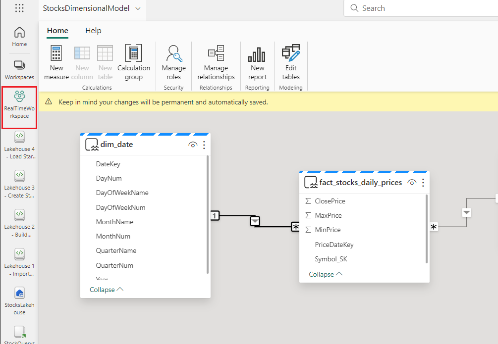

2.  En la página **RealTimeWorkspace de Synapse Data Engineering**,
    navegue y haga clic en el botón **Import**, luego seleccione
    **Notebook** y seleccione **From this computer.**

     

3.  En el panel de **Import status** que aparece a la derecha, haga clic
    en **Upload** .

      

4.  Navegue a **C:\LabFiles\Lab 05** y seleccione **DS 1-Build Model, DS
    2-Predict Stock Prices y DS 3-Forecast All** notebooks, luego haga
    click en el botón **Open**.

      

5.  Verá una notificación que dice – **Imported successfully.**

      
      
7.  En el **RealTimeWorkspace**, haga clic en el cuaderno **DS 1-Build
    Model**.

      

7.  En el Explorer, seleccione **Lakehouse** y haga clic en el **botón
    Add.**

> ***Importante*:** Tendrá que añadir el Lakehouse a cada cuaderno
> importado -- hágalo cada vez que abra un cuaderno por primera vez.
       
      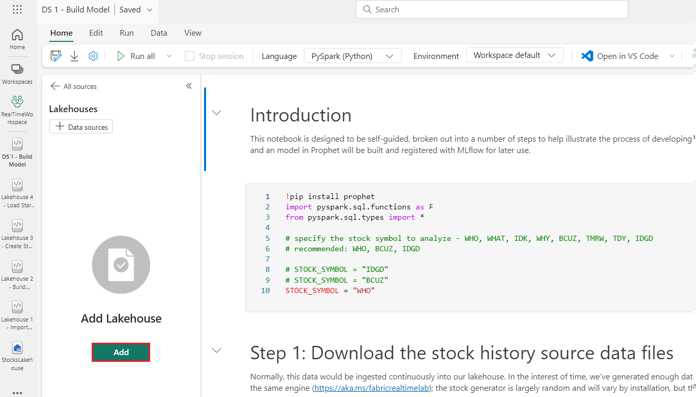

8.  En el cuadro de diálogo **Add Lakehouse**, seleccione el botón de
    opción **Existing** **Lakehouse** y, a continuación, haga clic en el
    botón **Add**.

      

9.  En la ventana del concentrador de datos OneLake, seleccione
    **StockLakehouse** y haga clic en el botón **Add**.

     

      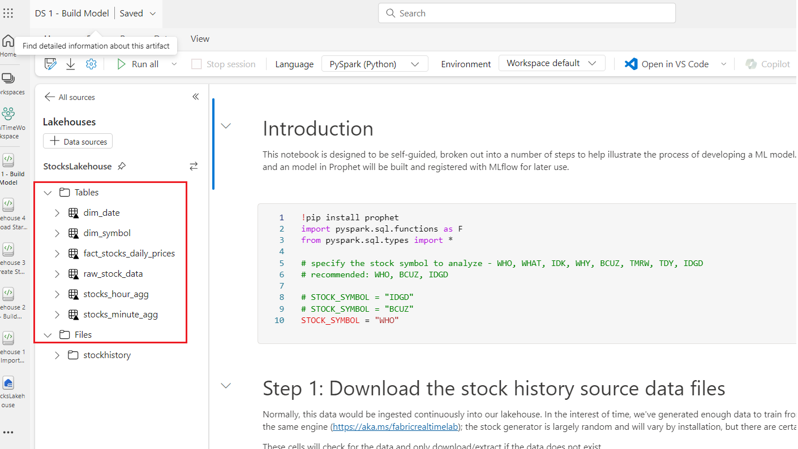

## Tarea 2: Explorar y ejecutar el bloc de notas

El cuaderno **DS 1** está documentado a lo largo de todo el cuaderno, pero
en resumen, el cuaderno lleva a cabo las siguientes tareas:

- Nos permite configurar una acción para analizar (como OMS o IDGD)

- Descarga de datos históricos para analizar en formato CSV

- Lee los datos en un marco de datos

- Realiza algunas tareas básicas de limpieza de datos

- Carga [Prophet](https://facebook.github.io/prophet/), un módulo de
  análisis y predicción de series temporales

- Construye un modelo basado en datos históricos

- Valida el modelo

- Almacena el modelo mediante MLflow

- Completa una predicción del futuro

La rutina que genera los datos de existencias es en gran medida
aleatoria, pero hay algunas tendencias que deberían surgir. Como no
sabemos cuándo vas a hacer este laboratorio, hemos generado datos de
varios años. El cuaderno cargará los datos y truncará los datos futuros
cuando construya el modelo. Como parte de una solución global,
complementaremos los datos históricos con nuevos datos en tiempo real en
nuestro Lakehouse, reentrenando el modelo según sea necesario
(diariamente/semanalmente/mensualmente).

1.  En 1 celda dest descomente el STOCK_SYMBOL="IDGD" y
    STOCK_SYMBOL="BCUZ", luego seleccione y **Ejecute** la celda.

      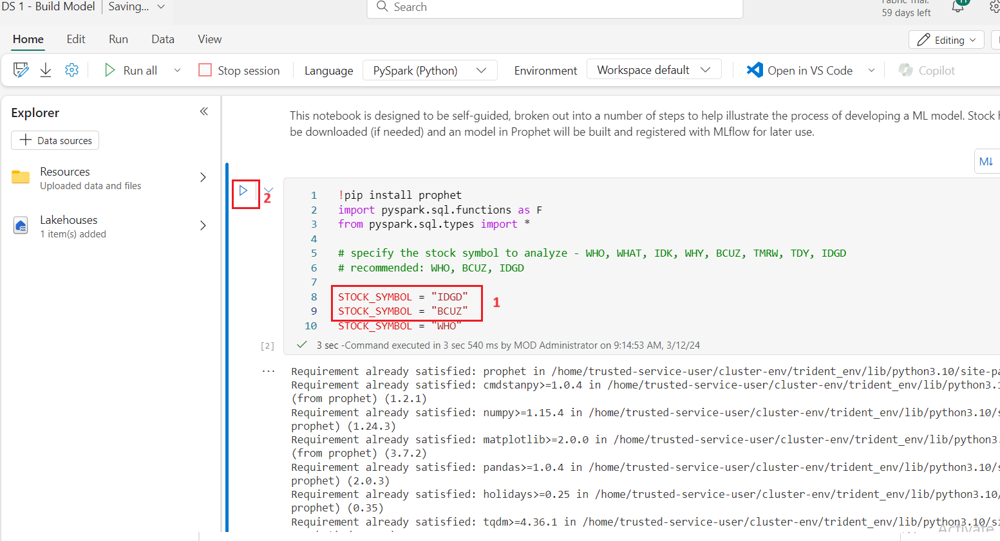

2.  Haga clic en **Run all** en la barra de herramientas superior y
    sigue el progreso del trabajo.

3.  El cuaderno tardará unos **15-20** minutos en ejecutarse -- algunos
    pasos, como el **training the model** y **cross validation**,
    llevarán tiempo.

       
       
       
       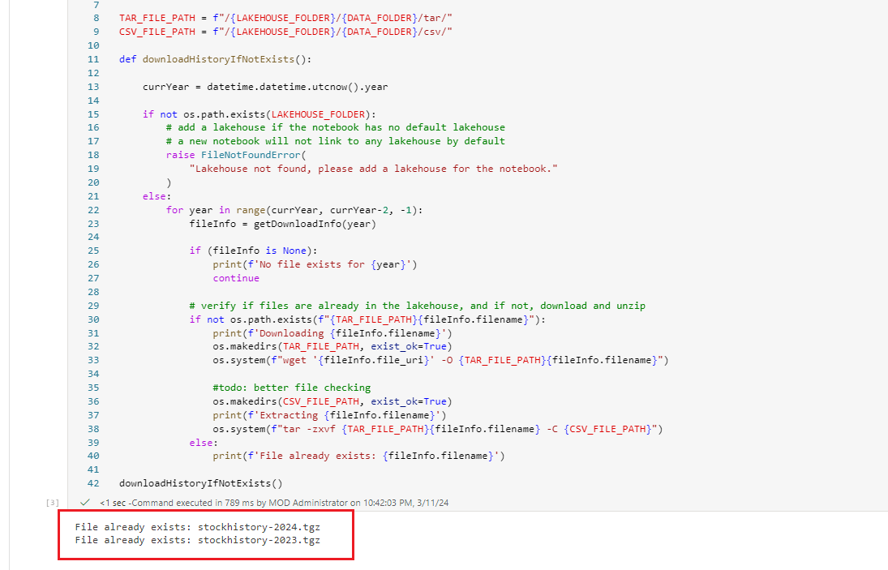
       
       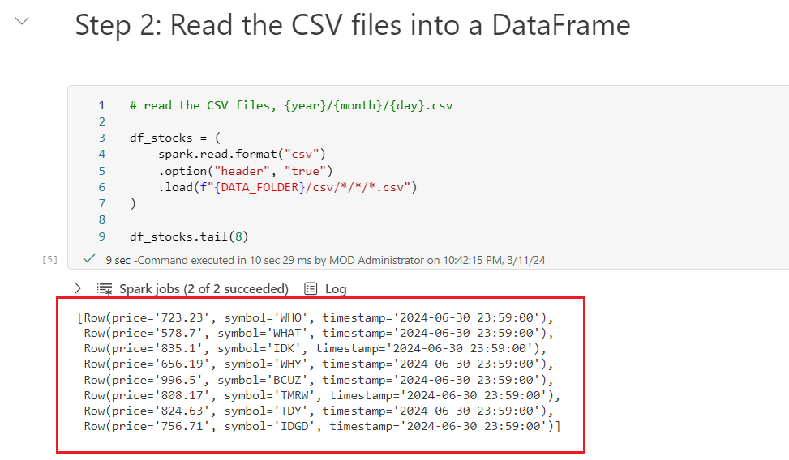
       
       
       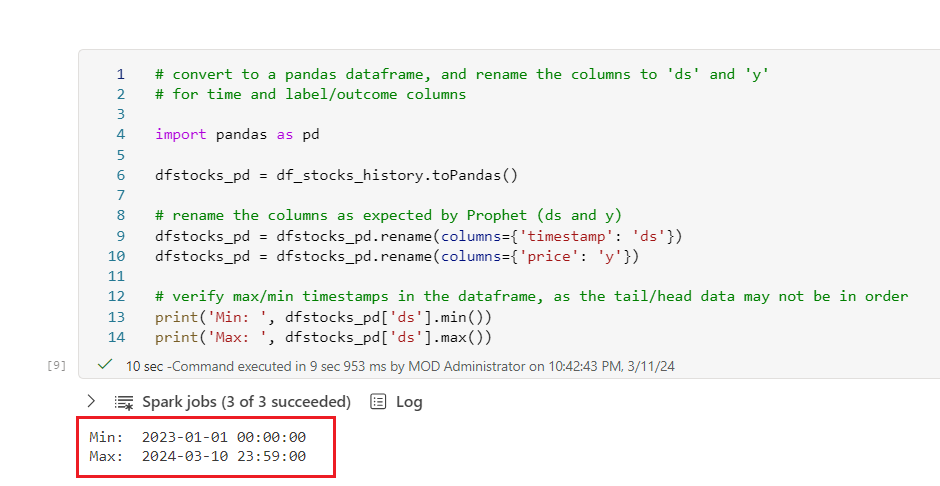
       
       
       
       
       
       
       
       
       
       
       
       
       
       
      
      
      
      
      
      
      
      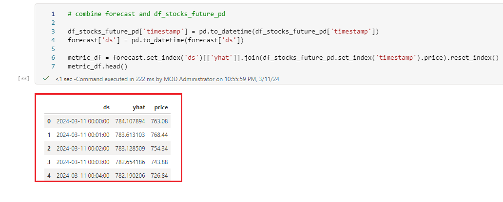
      
      
        
    
##  Tarea 3: Examinar el modelo y las ejecuciones

1.  Ahora, haga clic en **RealTimeWorkspace** en el menú de navegación
    de la izquierda.

      

2.  Los experiments y las runs pueden verse en la lista de recursos del
    espacio de trabajo.

     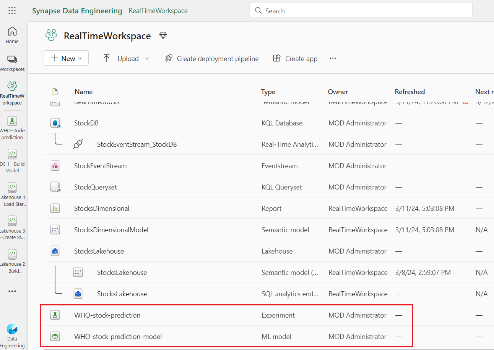 

3.  En la página **RealTimeWorkspace**, seleccione
    **WHO-stock-prediction-model** de tipo ML model.

       
      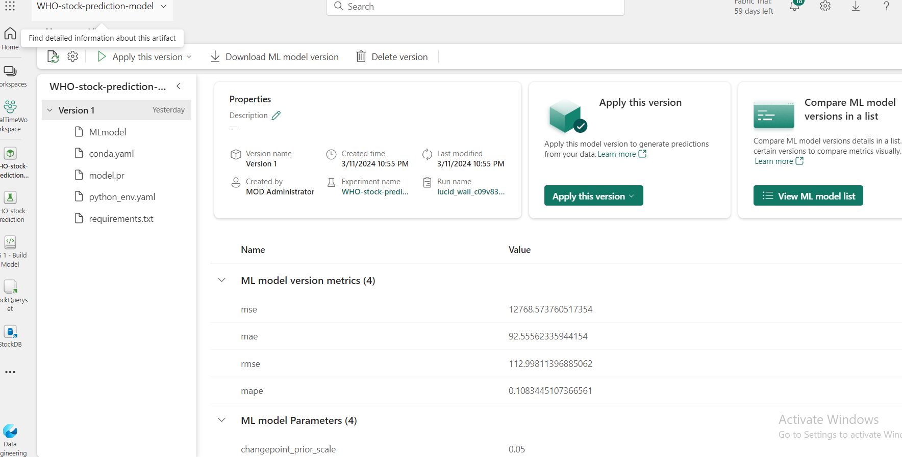 

4.  En nuestro caso, los metadatos incluyen parámetros de entrada que
    podemos ajustar a nuestro modelo, así como métricas sobre la
    precisión del modelo, como el error cuadrático medio (RMSE). El RMSE
    representa el error medio: un cero sería un ajuste perfecto entre el
    modelo y los datos reales, mientras que los números más altos
    muestran un aumento del error. Aunque los números más bajos son
    mejores, un número "bueno" es subjetivo en función del escenario.

      

# Ejercicio 2-Utilizar modelos, guardar en Lakehouse, crear un informe

## Tarea 1: Abre y explora el cuaderno Predecir cotizaciones bursátiles

El cuaderno se ha dividido en definiciones de funciones, como *def
write_predictions*, que ayudan a encapsular la lógica en pasos más
pequeños. Los cuadernos pueden incluir otras bibliotecas (como ya has
visto en la parte superior de la mayoría de los cuadernos), y también
pueden ejecutar otros cuadernos. Este cuaderno completa estas tareas a
alto nivel:

- Crea la tabla de previsiones de existencias en el Lakehouse, si no
  existe.

- Obtiene una lista de todos los símbolos bursátiles

- Crea una lista de predicciones examinando los modelos ML disponibles
  en MLflow

- Recorre los modelos ML disponibles:

  - Genera predicciones

  - Almacena las predicciones en la Lakehouse

1.  Ahora, haga clic en **RealTimeWorkspace** en el panel de navegación
    de la izquierda.

       

2.  En el **RealTimeWorkspace**, haga clic en el cuaderno **DS 2-Predict
    Stock Prices**.

      

3.  En el Explorer, seleccione el **Lakehouse** y haga clic en el botón
    **Add**

       
       

4.  En el cuadro de diálogo **Add Lakehouse**, seleccione el botón de
    opción **Existing** **Lakehouse** y, a continuación, haga clic en el
    botón **Add**.

       

5.  En la ventana del OneLake data hub, seleccione ***StockLakehouse***
    y haga clic en el botón **Add**.

      

     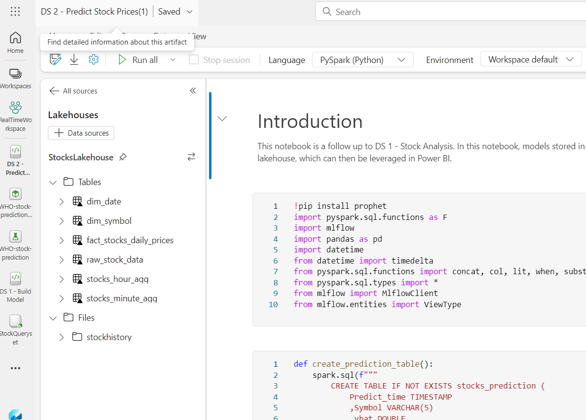 

## Tarea 2: Ejecutar el bloc de notas

1.  Crea la tabla de predicciones de stock en el Lakehouse, seleccione y
    **ejecute** las celdas 1st y 2nd .

      
      

2.  Obtiene una lista de todos los símbolos bursátiles, seleccione y
    **ejecute** las celdas 3rd y 4th .

       
       

3.  Crea una lista de predicción examinando los modelos ML disponibles
    en MLflow, seleccione y **Ejecute** las celdas 7th ,
    8th , 9th , y 10th .

      
      
     
      

5.  Para construir predicciones para cada tienda modelo en Lakehouse ,
    seleccione y **Ejecute** las 11th y 12th
    celdas.

     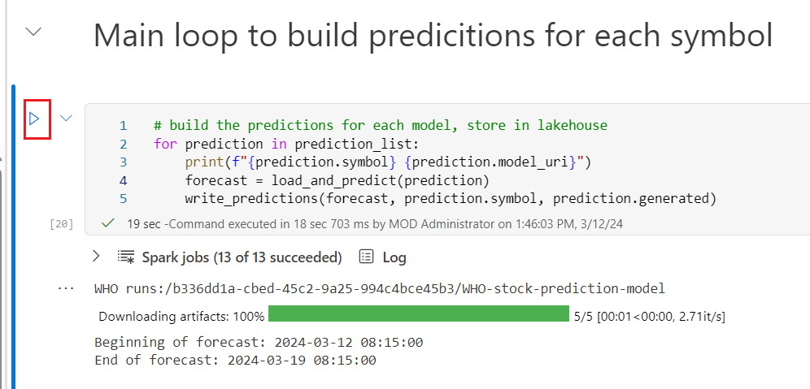 
     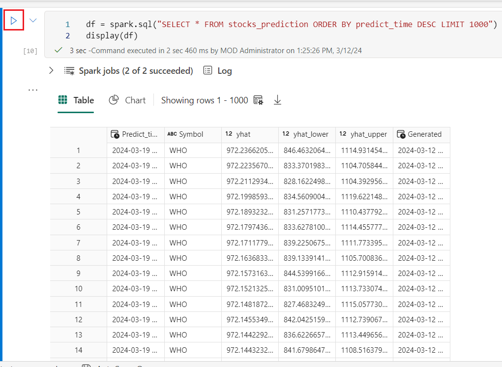 

5.  Cuando se hayan ejecutado todas las celdas, actualice el esquema
    haciendo clic en los tres puntos **(...)** junto a Tables, luego
    navegue y haga clic en **Refresh**
      
      

# Ejercicio 3: Solución práctica

Las dos primeras secciones de este módulo son enfoques comunes para
desarrollar una solución de Data Science. La primera sección abarca el
desarrollo del modelo (exploración, ingeniería de características,
ajuste, etc.), la construcción y el despliegue del modelo. La segunda
sección trata del consumo del modelo, que suele ser un proceso
independiente y que incluso puede ser realizado por diferentes equipos.

Sin embargo, en este caso concreto, la creación del modelo y la
generación de predicciones por separado no resultan muy beneficiosas, ya
que el modelo que hemos desarrollado es univariante basado en el tiempo:
las predicciones que genera el modelo no cambiarán si no se vuelve a
entrenar el modelo con nuevos datos.

La mayoría de los modelos ML son multivariantes, por ejemplo,
consideremos un estimador del tiempo de viaje que calcule el tiempo de
viaje entre dos ubicaciones dicho modelo podría tener docenas de
variables de entrada, pero dos variables principales incluirían sin duda
la hora del día y las condiciones meteorológicas. Dado que las
condiciones meteorológicas cambian con frecuencia, introduciríamos estos
datos en el modelo para generar nuevas predicciones del tiempo de viaje
(entradas: hora del día y condiciones meteorológicas, salida: tiempo de
viaje).

Por lo tanto, deberíamos generar nuestras predicciones inmediatamente
después de crear el modelo. A efectos prácticos, esta sección muestra
cómo podríamos implementar la construcción del modelo ML y la predicción
en un solo paso. En lugar de utilizar los datos históricos descargados,
este proceso utilizará las tablas de agregación construidas en el módulo
06. Nuestro flujo de datos puede visualizarse así:

## Tarea 1: Importar el cuaderno

Dedique algún tiempo a explorar el cuaderno *DS 3 - Prever todo*, y
fíjese en algunas cosas clave:

- Los datos de stock se leen de la tabla stock_minute_agg.

- Se cargan todos los símbolos y se hacen predicciones sobre cada uno de
  ellos.

- La rutina buscará en MLflow modelos que coincidan y cargará sus
  parámetros. Esto permite a los equipos de Data Science construir
  parámetros óptimos.

- Las predicciones para cada población se registran en la tabla
  stock_predicitions. No hay persistencia del modelo.

- No hay validación cruzada u otros pasos realizados en 07a. Aunque
  estos pasos son útiles para el científico de datos, no son necesarios
  aquí.

1.  Ahora, haga clic en **RealTimeWorkspace** en el menú de navegación
    de la izquierda.

      

2.  En el **RealTimeWorkspace**, haga clic en el cuaderno **DS
    3-Forecast All**.

       

3.  En el Explorer seleccione el **Lakehouse** y haga clic en el botón
    **Add**

      
      

4.  En el cuadro de diálogo **Add Lakehouse**, seleccione el botón de
    opción **Existing Lakehouse** y, a continuación, haga clic en el
    botón **Add**.

       

5.  En la ventana del concentrador de datos OneLake, seleccione
    **StockLakehouse** y haga clic en el botón **Add**.

       

6.  Seleccione y **ejecute** la celda 1st .

        

7.  Haga clic en **Run all** en el comando y siga el progreso del
    trabajo.

8.  Ejecutar el cuaderno para todos los símbolos podría llevar 10
    minutos.
      
      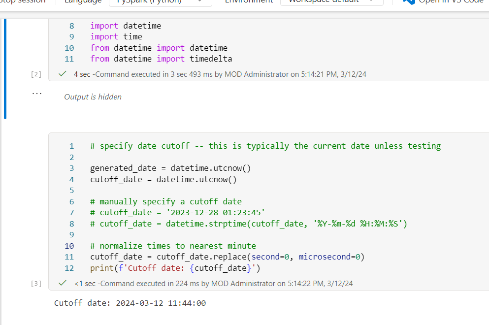
      
      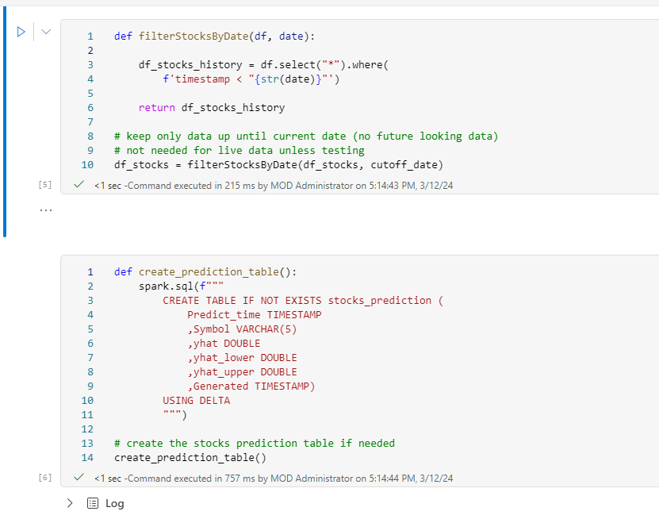
      
      
      
      
      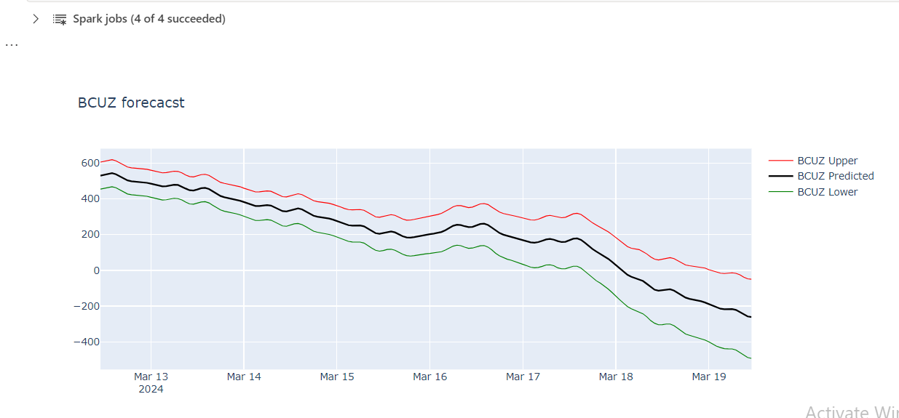
      
      
      
      
      
      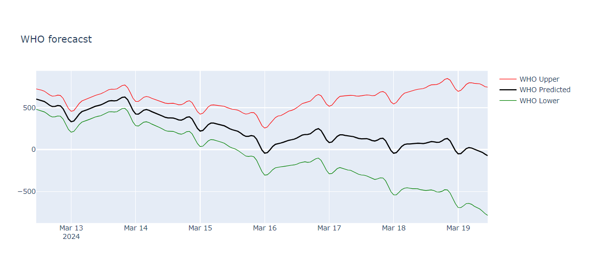
       
    
10.  Cuando se hayan ejecutado todas las celdas, actualice el esquema
    haciendo clic en los tres puntos **(...)** a la derecha de las
    **Tables**, luego navegue y haga clic en **Refresh**

      

# Ejercicio 4: Elaboración de un informe de predicción

## Tarea 1: Construir un modelo semántico

En este paso, crearemos un modelo semántico (anteriormente denominado
conjunto de datos de Power BI) para utilizarlo en nuestro informe de
Power BI. Un modelo semántico representa datos que están listos para la
generación de informes y actúa como una abstracción sobre una fuente de
datos. Típicamente, un modelo semántico será construido con un propósito
(sirviendo a una necesidad específica de reporte) y puede tener
transformaciones, relaciones y enriquecimientos como medidas para hacer
más fácil el desarrollo de reportes.

1.  Haga clic en **RealTimeWorkspace** en el menú de navegación de la
    izquierda.

      

2.  Para crear un modelo semántico, navegue y haga clic en Lakehouse, es
    decir, **StackLakehouse.**

       
       

3.  En la página **StocksLakehouse**, haga clic en **New semantic
    model** en la barra de comandos.

       

4.  En el campo **Nombre** en el panel **New semantic model**,
    introduzca el nombre del modelo como
    **StocksLakehousePredictions**, seleccione las tablas
    **stock_prediction** y **dim_symbol**. A continuación, haga clic en
    el botón **Confirm** como se muestra en la siguiente imagen.

      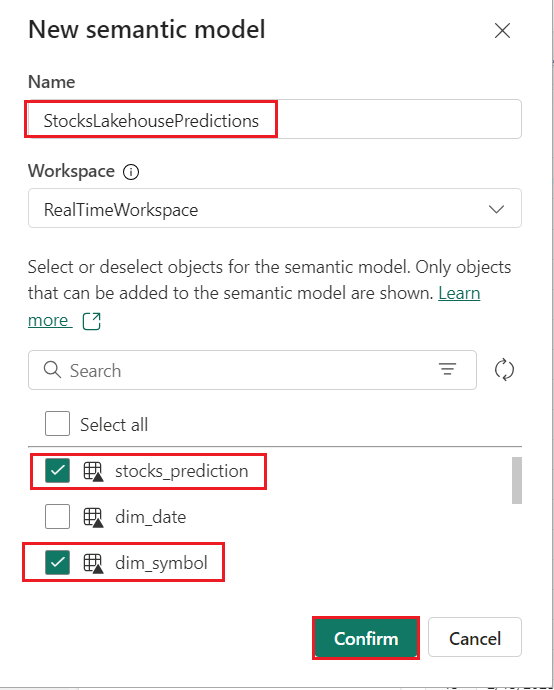 
      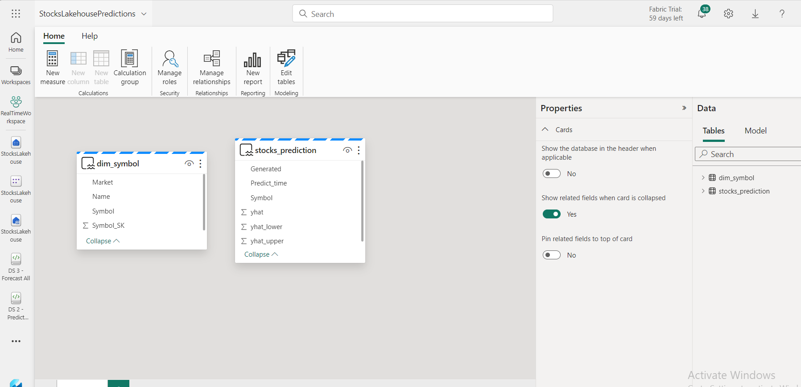 

5.  Cuando se abre el modelo semántico, tenemos que definir las
    relaciones entre las tablas stock_prediction y dim_symbol.

6.  Desde la tabla **stock_prediction**, arrastre el campo
    **Symbol** y suéltelo sobre el campo **Symbol** de la tabla
    **dim_Symbol** para crear una relación. Aparecerá el cuadro de
    diálogo **New relationship**.

       

7.  En el cuadro de diálogo **New relationship**:

- La **tabla From** se rellena con **stock_prediction** y la columna
  **Symbol.**

- **La tabla To** se rellena con **dim_symbol** y la columna de
  **Symbol.**

- Cardinalidad: **Many to one** **(:1)**

- Dirección del filtro transversal: **Single**

- Deje seleccionada la casilla junto a **Make this relationship
  active** .

- Seleccione **Save**

      
      

## Tarea 2: Crear el informe en Power BI Desktop

1.  Abra su navegador, vaya a la barra de direcciones y escriba o pegue
    la siguiente URL: <https://powerbi.microsoft.com/en-us/desktop/> ,
    después pulse el botón **Enter**.

2.  Haga clic en el botón **Download now**.

      

3.  En caso de que aparezca el cuadro de diálogo **This site is trying
    to open Microsoft Store**, haga clic en el botón **Open**.

      

4.  En **Power BI Desktop**, haga clic en el botón **Get**.

      

5.  Ahora, haga clic en el botón **Open**.

       
6.  Introduzca sus credenciales de **Microsoft Office 365 tenant** y
    haga clic en el botón **Next**.

       

7.  Introduzca la **contraseña administrativa** de la pestaña
    **Resources** y haga clic en el botón **Sign in**

        

8.  En Power BI Desktop, seleccione **Blank report.**

       

9.  En la cinta **Home**, haga clic en el **OneLake data hub** y
    seleccione **KQL database.**

      

10. En la ventana **OneLake data hub**, seleccione **StockDB** y haga
    clic en el botón **Connect**.

        

11. Introduzca sus credenciales de tenant de **Microsoft Office 365** y
    haga clic en el botón **Next**.

       

12. Introduzca la **contraseña administrativa** de la pestaña
    **Resources** y haga clic en el botón **Sign in.**

       

13. En la página Navegador, en **Display options**, seleccione Tabla de
    **StockPrice** y, a continuación, haga clic en el botón **Load**.

       

14. En el cuadro de diálogo **Connection settings**, seleccione el
    botón de opción **DirectQuery** y haga clic en el botón **Ok**.

      

15. En la cinta de **Home**, haga clic en el **OneLake data hub**y
    seleccione **Power BI semantic models** como se muestra en la
    siguiente imagen.

      

16. En la ventana **OneLake data hub**, seleccione
    **StockLakehousePredictions** de la lista y haga clic en el botón
    **Connect**.

      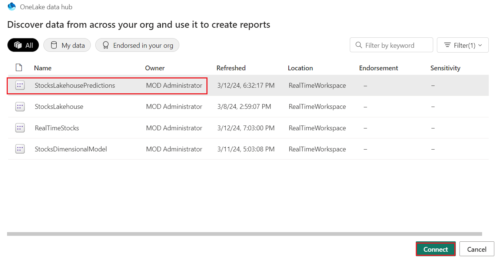 

17. En la página **Connect to your data**, seleccione **dim_symbol,
    stock_prediction** y haga clic en el botón **Submit**.

      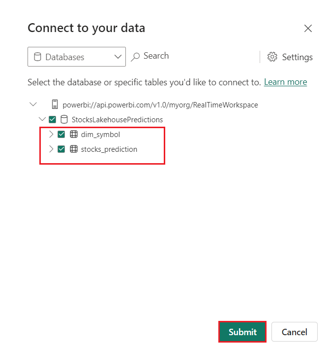 

18. En este caso, podemos descartar la advertencia de **Potential
    security risk** haciendo clic en el botón **OK**.

       
       

19. Haga clic en **Modeling** en la barra de comandos y, a
    continuación, en **Manage relationships.**

       

20. En el panel **Manage relationshpis**, seleccione **+New
    relationship** como se muestra en la siguiente imagen.

      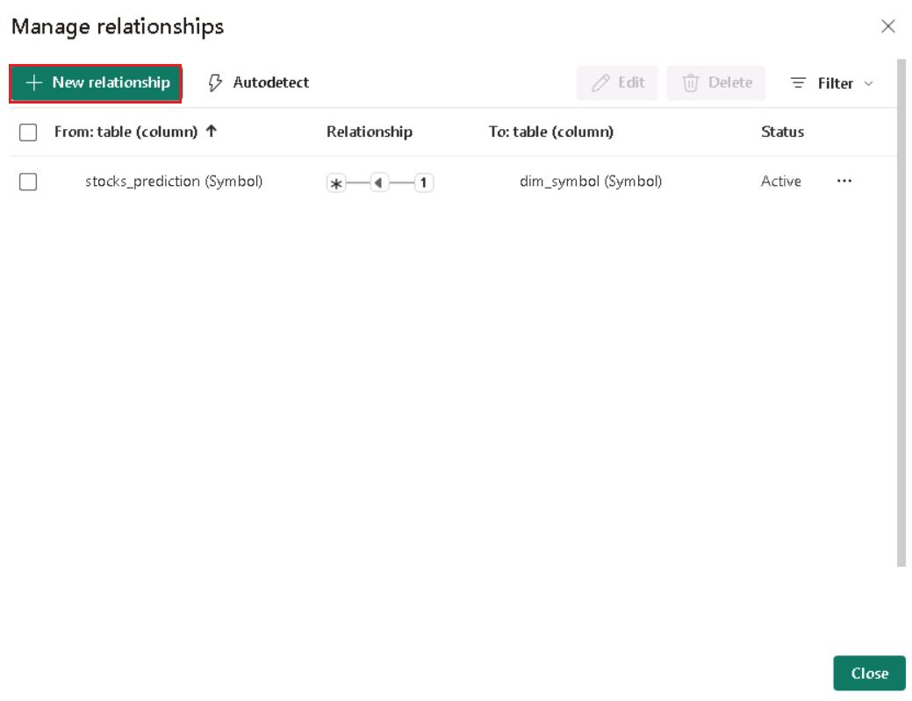 

21. Cree una **New relationship** entre la **tabla *StockPrice ***-From
    y la ***tabla stocks_prediction*** - ***To*** (después de
    seleccionar la tabla, asegúrese de seleccionar las columnas de
    símbolo en cada tabla). Establezca la dirección del filtro cruzado
    en **Both**, y asegúrese de que la cardinalidad está establecida
    en **Many-to-many**. A continuación, haga clic en el botón
    **Save**.

       

22. En la página **Mange relationships**, seleccione **StockPrice**,
    **stocks_prediction** tables y haga clic en el botón **Close**.

       

23. En la página **de Power BI**, en **Visualizations**, haga clic en el
    icono **Gráfico de líneas** para añadir un **Gráfico de columnas** a
    su informe.

- En el panel de **Data**, expanda **StockPrice** y marque la casilla
  junto a **timestamp**. Esto crea un gráfico de columnas y añade el
  campo al **eje X**.

- En el panel de **Data**, expanda **StockPrice** y marque la casilla
  junto a **Price**. Esto añade el campo al **eje Y**.

- En el panel **Data**, expanda **StockPrice** y marque la casilla junto
  a **Símbolo**. Esto añade el campo a la **Legend**.

- **Filtro**: **timestamp** to ***Relative time** is in the last* **15
  minutes**.

       

       

24. En la página de **Power BI**, en **Visualizations**, haga clic en el
    icono **Gráfico de líneas** para añadir un **Gráfico de columnas** a
    su informe.

- En el panel de **Data**, expanda **StockPrice** y marque la casilla
  junto a **timestamp**. Esto crea un gráfico de columnas y añade el
  campo al **eje X**.

- En el panel de **Data**, expanda **StockPrice** y marque la casilla
  junto a **Price**. Esto añade el campo al **eje Y**.

- En el panel **Datos**, expanda **dim_symbol** y marque la casilla
  junto a **Market**. Esto añade el campo a la **Legend**.

- **Filtro**: **timestamp** to ***Relative time** is in the last* **1
  hour**.

       
       
       
       

25. En la página **de Power BI**, en **Visualizaciones**, haga clic en
    el icono **Gráfico de líneas** para añadir un **Gráfico de
    columnas** a su informe.

- En el panel **Data**, expanda **Stock_prediction** y marque la casilla
  junto a **predict_time**. Esto crea un gráfico de columnas y añade el
  campo al **eje X**.

- En el panel **Data**, expanda **Stock_prediction** y marque la casilla
  junto a **yhat**. Esto añade el campo al **eje Y**.

- En el panel **Data**, expanda **Stock_prediction** y marque la casilla
  junto a **Symbol**. Esto añade el campo a la **Legend**.

- **Filtro**: **predict_time** a ***Relative date** in the last* **3
  days**.
       
       
       
       
   
26. En la página **de Power BI**, en **Data,** haga clic con el botón
    derecho en la tabla **stocks_prediction** y seleccione **New
    measure.**

      

27. Las medidas son fórmulas escritas en el lenguaje Data Analysis
    Expressions (DAX); para esta fórmula DAX, introduzca ***+++currdate
    = NOW()+++**

      

28. Con el gráfico de predicción seleccionado, vaya a las opciones de
    visualización adicionales, es decir, al icono de la lupa/gráfico y
    añada una **new X-Axis Constant Line**.

       

29. En **Value**, utilice el botón de fórmula **(fx)** para elegir un
    campo.

       

30. En **Value -Apply settings to** page, haga clic en el desplegable
    bajo **what field should we base this on?**, luego haga clic en el
    desplegable de **stocks_prediction**, seleccione la medida
    **currdate**. A continuación, haga clic en el botón **OK**.

      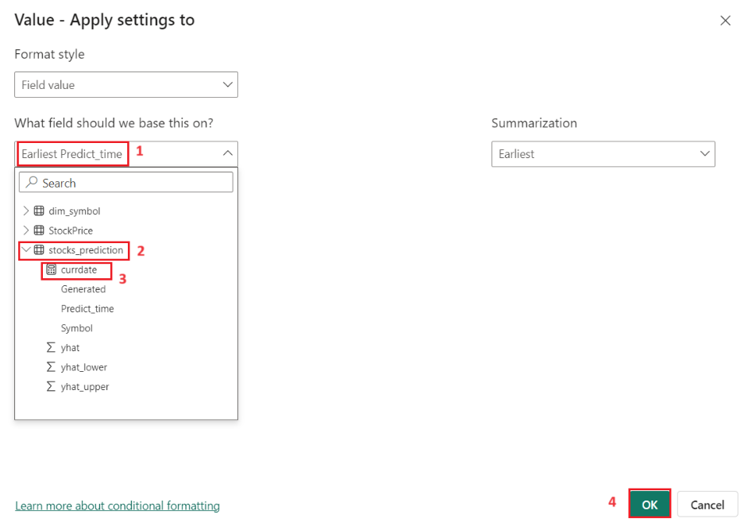 
       

31. Navegue hasta las opciones adicionales de visualización, es decir,
    el icono de la lupa/gráfico, active la **Shade
    area**.
      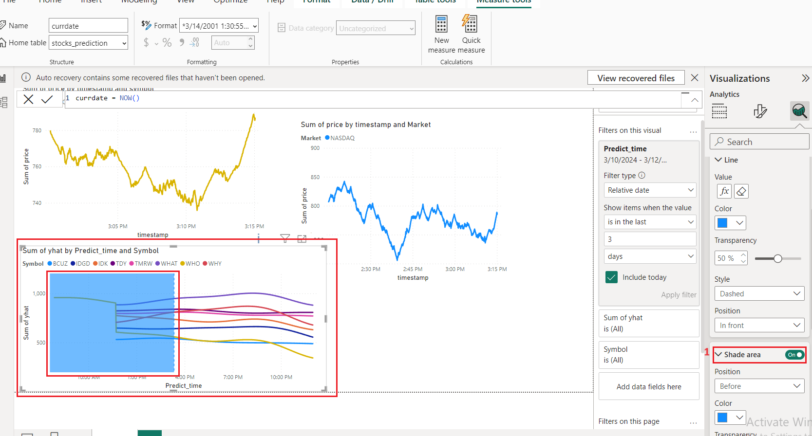 

33. Configuradas las relaciones entre tablas, todos los visuales deben
    cruzar filtros; al seleccionar un símbolo o un mercado en un
    gráfico, todos los visuales deben reaccionar en consecuencia. Como
    se muestra en la siguiente imagen, el mercado **NASDAQ** está
    seleccionado en el gráfico de mercado superior derecho:

       
       

33. Haga clic en **Publish** en la barra de comandos.

       

34. En el cuadro de diálogo **Microsoft Power BI Desktop**, haga clic en
    el botón **Save**.

      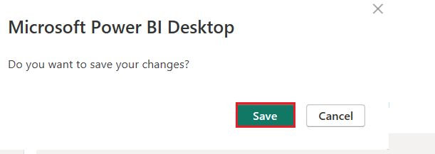 

35. En el cuadro de diálogo **Save this file**, introduzca el Nombre
    como **Prediction Report** y seleccione la ubicación. A
    continuación, pulse el botón **Save**.

       

## **Resumen**

En este laboratorio, ha aprendido cómo abordar una solución de Data
Science en Fabric importando y ejecutando un bloc de notas que procesa
datos, crea un modelo ML de los datos utilizando Prophet y almacena el
modelo en MLflow. Además, ha evaluado el modelo mediante validación
cruzada y lo ha probado con datos adicionales.

Ha seguido la creación del modelo ML consumiendo el modelo ML, generando
predicciones y almacenando esas predicciones en Lakehouse. Ha refinado
el proceso para construir un modelo y generar predicciones en un solo
paso, agilizando el proceso de creación de predicciones y
operacionalizando la generación del modelo. A continuación, ha creado un
informe (o informes) que muestra los precios actuales de las acciones
con los valores predichos, poniendo los datos a disposición de los
usuarios empresariales.
