# 실습 04: Fabric에서 ML 모델 구축 시작하기

**소개**

시나리오를 다시 한 번 설명하자면, AbboCost Financial은 재무 분석가를
위한 주식 시장 보고를 현대화하고 있습니다. 이전 모듈에서는 실시간
대시보드, 데이터 웨어하우스 등을 만들어 솔루션을 개발했습니다.

이 모듈에서 AbboCost는 자문가에게 정보를 제공하는 데 도움이 되는 예측
분석을 살펴보고자 합니다. 목표는 과거 데이터를 분석하여 미래 가치를
예측하는 데 사용할 수 있는 패턴을 찾는 것입니다. 이러한 종류의 탐색을
수행하기에 Microsoft Fabric의 Data Science 기능은 이상적인 곳입니다.

**목표**

- 머신 러닝 모델을 빌드하고 저장하기 위해 노트북을 가져오고 구성하기

- 재고 예측 모델 구축 및 검증을 위한 DS 1-Build Model 노트북을 탐색하고
  실행하기

- 리얼타임 워크스페이스의 모델 메타데이터 및 성능 메트릭을 검토하기

- 주가 예측을 위해 DS 2-주가 예측 노트북을 열고 탐색하기

- 예측을 생성하고 Lakehouse에 저장하기 위해 노트북을 실행하기

- 예측을 생성하고 Lakehouse에 저장하기 위해 DS 3-Forecast All 노트북을
  가져와서 탐색하기

- 노트북을 실행하고 Lakehouse 스키마에서 예측을 확인하기

- StockLakehousePredictions 데이터를 사용하여 Power BI에서 시맨틱 모델을
  구축하고 Power BI에서 시각화를 만들어 주식 예측 및 시장 동향을
  분석하기

- 테이블 간의 관계를 구성하고 예측 보고서를 게시하기

# 연습 1: ML 모델 구축 및 저장하기

## 작업 -1: 노트북 가져오기

1.  **StockDimensionalModel** 페이지의 왼쪽 탐색 메뉴에서
    **RealTimeWorkspace를** 클릭하세요.

     

2.  **Synapse Data Engineering RealTimeWorkspace** 페이지에서 이동하여
    **import** 버튼을 클릭한 다음 **Notebook을** 선택하고 **From this
    computer as shown in the below image를** 선택하세요**.**

     

3.  오른쪽에 표시되는 **import status** 창에서 **upload를** 클릭하세요.

      

4.  **C:\LabFiles\Lab 05로** 이동하여 **DS 1-Build Model, DS 2-Predict
    Stock DS 3-Forecast All** notebooks **예측을** 선택한 다음 **Open**
    버튼을 클릭하세요.

      

5.  **Imported successfully라는** 알림이 표시됩니다**.**

      

      

6.  **RealTimeWorkspace**에서 **DS 1-Build Model** notebook을
    클릭하세요.

      

7.  Explorer에서 **Lakehouse를** 선택하고 **Add 버튼을** 클릭하세요**.**

      > ***중요*:** 가져온 모든 노트북에 Lakehouse를 추가해야 하며, 노트북을
      > 처음 열 때마다 이 작업을 수행해야 함.
     
     

8.  **Add lakehouse** 대화 상자에서 **Existing Lakehouse** 라디오 버튼을
    선택한 다음 **Add** 버튼을 클릭하세요.

     

9.  OneLake 데이터 허브 창에서 ***StockLakehouse를*** 선택하고 **Add**
    버튼을 클릭하세요.

     

     

## 작업 2: 노트북 탐색 및 실행

*DS 1* 노트북은 노트북 전체에 걸쳐 문서화되어 있지만 간단히 요약하면
다음과 같은 작업을 수행합니다:

- 분석할 주식을 구성할 수 있습니다(예: WHO 또는 IDGD).

- CSV 형식으로 분석할 기록 데이터 다운로드합니다.

- 데이터를 데이터 프레임으로 읽습니다.

- 몇 가지 기본 데이터 정리를 완료합니다.

- 시계열 분석 및 예측을 수행하는 모듈인
  [Prophet을](https://facebook.github.io/prophet/) 로드합니다.

- 과거 데이터를 기반으로 모델 구축합니다.

- 모델 유효성 검사합니다.

- MLflow를 사용하여 모델을 저장합니다.

- 미래 예측 완료합니다

주식 데이터를 생성하는 루틴은 대부분 무작위로 이루어지지만, 몇 가지
트렌드는 반드시 나타나야 합니다. 이 실험을 언제 수행할지 모르기 때문에
몇 년치 데이터를 생성했습니다. 노트북은 데이터를 로드하고 모델을 구축할
때 향후 데이터를 잘라낼 것입니다. 그런 다음 전체 솔루션의 일부로 Data
Lakehouse에서 새로운 실시간 데이터로 과거 데이터를 보완하고 필요에
따라(일별/주별/월별) 모델을 재학습합니다.

1.  셀 1에서 STOCK_SYMBOL=”IDGD” and STOCK_SYMBOL=”BCUZ”를 uncomment하고
    셀을 선택하여 **실행하세요**.

     

2.  상단 도구 모음에서 ***Run all을*** 클릭하고 작업이 진행됨에 따라
    따라가세요.

3.  노트북을 실행하는 데 대략 15~20분 정도 소요되며, **모델 훈련** 및
    **교차 검증과** 같은 일부 단계에는 시간이 좀 걸립니다.

       
  
       
  
       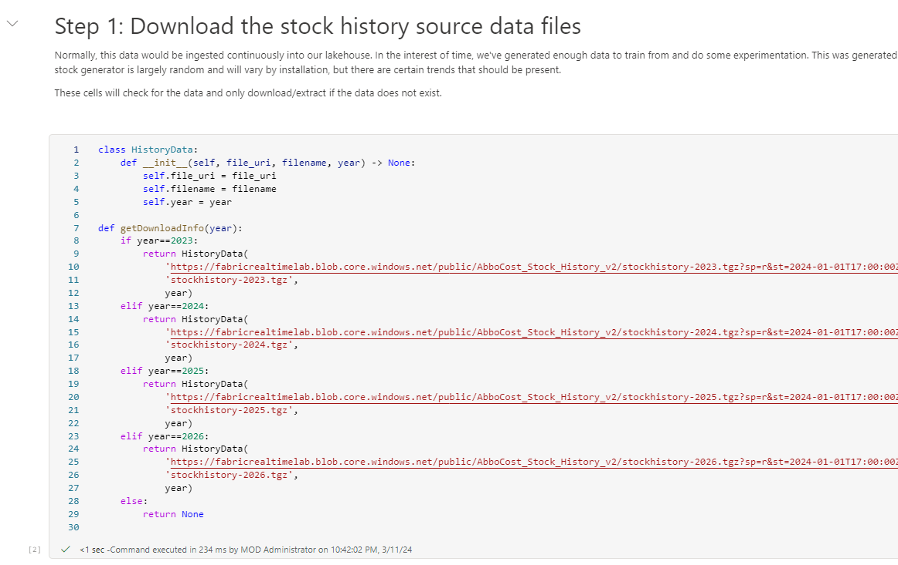
  
       
  
       
  
       
  
       
  
       
  
       
  
       
  
       
  
       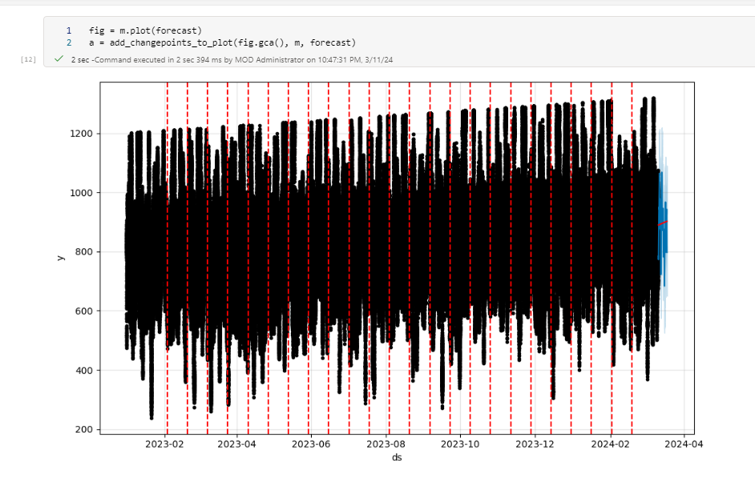
  
       
  
       
  
       
  
      
  
      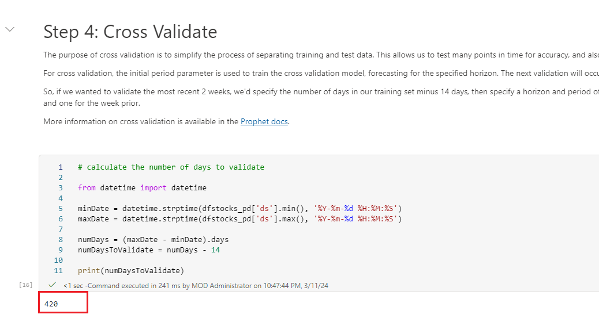
  
      
  
      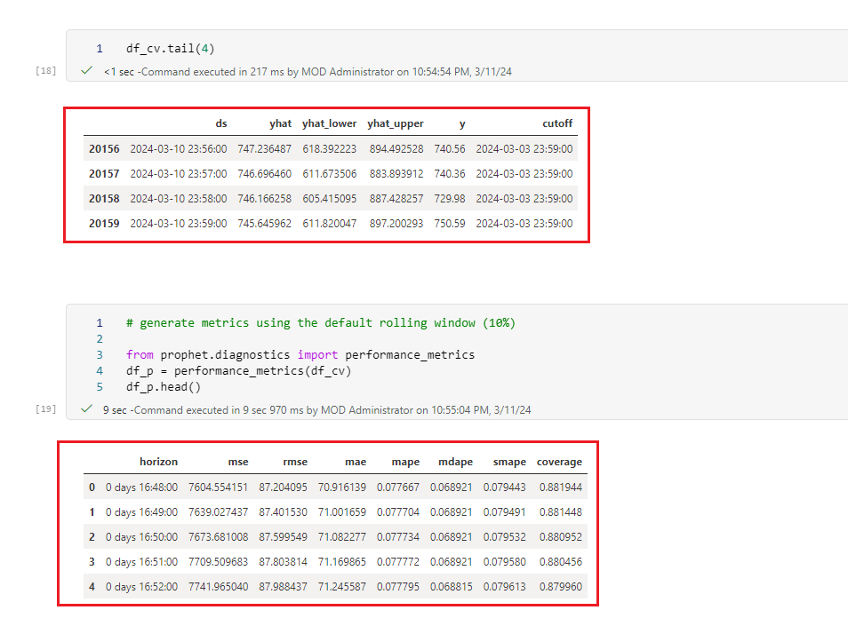
  
      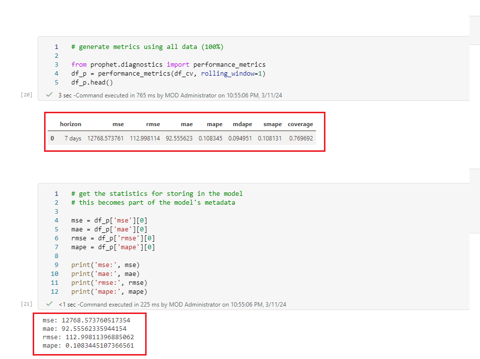
  
      
  
      
  
      
  
      
  
      
  
      
  
      
  
      
  
      
  
      
  
      
  
      
   
      
  
      

##  작업 3: 모델 및 실행 검토

1.  이제 왼쪽 탐색 메뉴에서 **RealTimeWorkspace를** 클릭하세요.

     

2.  실험 및 실행은 워크스페이스 리소스 목록에서 볼 수 있습니다.

     

3.  **RealTimeWorkspace** 페이지에서 ML 모델 유형 중
    **WHO-stock-prediction-model을** 선택하세요.

      

       

4.  메타데이터에는 모델에 맞게 조정할 수 있는 입력 매개변수와 root mean
    square error (RMSE)와 같은 모델의 정확도에 대한 지표가 포함됩니다.
    RMSE는 평균 오차를 나타내며, 0이면 모델과 실제 데이터 사이에 완벽할
    것이고, 수치가 높을수록 오차가 증가한다는 의미입니다. 수치가
    낮을수록 좋지만, "좋은" 수치는 시나리오에 따라 주관적입니다.

      

# 연습 2 - 모델 사용하기, Lakehouse에 저장하기, 보고서 작성하기

## 작업 1: 주가 예측 노트북을 열고 탐색하기

노트북은 로직을 더 작은 단계로 캡슐화하는 데 도움이 되는 *def
write_predictions와* 같은 함수 정의로 세분화되어 있습니다. 노트북은 다른
라이브러리를 포함할 수 있고(대부분의 노트북 상단에서 이미 보셨겠지만),
다른 노트북을 실행할 수도 있습니다. 이 노트북은 이러한 작업을 높은
수준에서 완성해 줍니다:

- Lakehouse에 stock predictions table이 없는 경우 생성합니다.

- 모든 주식 기호 목록을 가져옵니다.

- MLflow에서 사용 가능한 ML 모델을 검토하여 예측 목록을 생성합니다.

- 사용 가능한 ML 모델을 통해 반복합니다:

  - 예측 생성합니다

  - Lakehouse에 예측을 저장합니다.

1.  이제 왼쪽 탐색 창에서 **RealTimeWorkspace를** 클릭하세요.

      

2.  **RealTimeWorkspace**에서 **DS 2-Predict Stock Prices** notebook을
    클릭하세요.

      

3.  탐색기에서 **Lakehouse를** 선택한 다음 **Add** 버튼을 클릭하세요*.*

     

      

4.  **Add Lakehouse** 대화 상자에서 **Exsisting Lakehouse** 라디오
    버튼을 선택한 다음 **Add** 버튼을 클릭하세요.

     

5.  OneLake 데이터 허브 창에서 ***StockLakehouse를*** 선택하고 **Add**
    버튼을 클릭하세요.

      

      

## 작업 2: 노트북 실행

1.  Lakehouse에서 주식 예측 테이블을 만들고,셀 1와 셀 2를 선택하여
    **실행하세요**.

      

      

2.  모든 주식 기호 목록을 가져와서 셀3와 셀 4개을 선택하고
    **실행하세요**.

      

      

3.  MLflow에서 사용 가능한 ML 모델을 검토하여 예측 목록을 만들고, 셀7 ,
    8 , 9 , 10을 선택하여 **실행하세요**.

     

     

     

     

4.  Lakehouse 에서 각 model store에 대한 예측을 구축하려면 셀 11 및 12를
    선택하고 **실행하세요.**

     

     

5.  모든 셀이 실행되면 *테이블* 옆의 점 3개**(...)**를 클릭하여 스키마를
    새로 고친 다음, 탐색하여 ***Refresh를* 클릭하세요.**

     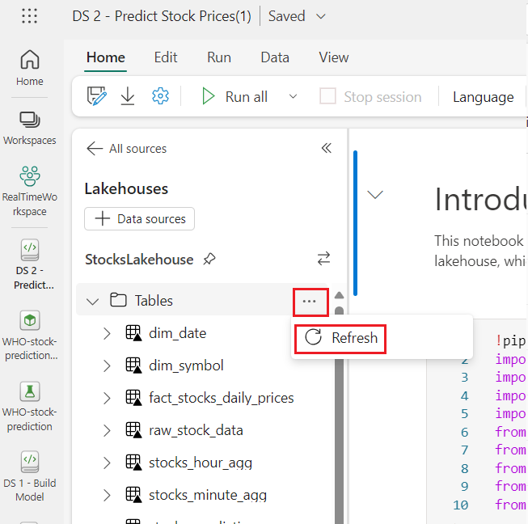

     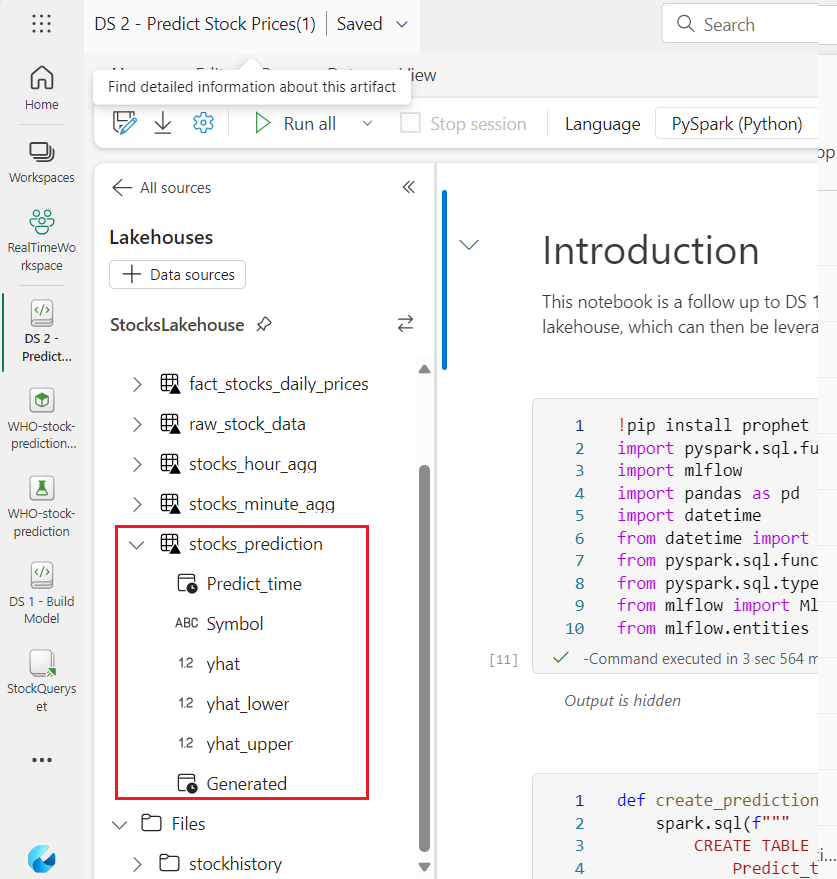

# 연습 3: 실제 솔루션

이 모듈의 처음 두 섹션은 데이터 과학 솔루션 개발에 대한 일반적인 접근
방식입니다. 첫 번째 섹션에서는 모델 개발(탐색, 기능 엔지니어링, 튜닝
등), 모델 구축 및 배포에 대해 다룹니다. 두 번째 섹션에서는 일반적으로
별도의 프로세스이며 다른 팀에서 수행할 수도 있는 모델 소비에 대해
다룹니다.

그러나 이 특정 시나리오에서는 우리가 개발한 모델이 시간 기반 단변량이기
때문에 모델을 생성하고 예측을 별도로 생성하는 이점이 거의 없으며, 새로운
데이터로 모델을 다시 학습시키지 않으면 모델이 생성하는 예측이 변경되지
않습니다.

예를 들어 두 위치 사이의 이동 시간을 계산하는 이동 시간 추정기를 예로
들면, 대부분의 ML 모델은 다변량입니다. 이러한 모델에는 수십 개의 입력
변수가 있을 수 있지만 두 가지 주요 변수는 확실히 시간대와 날씨 조건이
포함될 것입니다. 날씨가 자주 변하기 때문에 이 데이터를 모델에 전달하여
새로운 이동 시간 예측을 생성합니다(입력: 시간 및 날씨, 출력: 이동 시간).

따라서 모델을 만든 후 즉시 예측을 생성해야 합니다. 실용적인 목적을 위해
이 섹션에서는 ML 모델 구축과 예측을 한 단계로 구현하는 방법을
보여줍니다. 이 프로세스에서는 다운로드한 과거 데이터를 사용하는 대신
모듈 6에서 구축한 집계 테이블을 사용합니다. 데이터 흐름을 다음과 같이
시각화할 수 있습니다:

## 작업 1: 노트북 가져오기

*DS 3 - 전체 예측* 노트북을 살펴보고 몇 가지 주요 사항을 알아보세요:

- 주식 데이터는 stock_minute_agg 테이블에서 읽습니다.

- 모든 기호가 로드되고 각각에 대한 예측이 이루어집니다.

- 이 루틴은 MLflow에서 일치하는 모델을 확인하고 해당 매개변수를
  로드합니다. 이를 통해 Data Science 팀은 최적의 매개 변수를 구축할 수
  있습니다.

- 각 종목에 대한 예측은 stock_predicitions 테이블에 기록됩니다. 모델의
  지속성은 없습니다.

- 07a에서는 교차 유효성 검사 또는 기타 단계가 수행되지 않습니다. 이러한
  단계는 데이터 과학자에게는 유용하지만 여기서는 필요하지 않습니다.

1.  이제 왼쪽 탐색 메뉴에서 **RealTimeWorkspace를** 클릭하세요.

     

2.  RealTimeWorkspace에서 **DS 3-Forecast All** 노트북을 클릭하세요.

    

3.  탐색기에서 **Lakehouse를** 선택하고 ***Add를*** 클릭하세요***.***

     

      

4.  **Add lakehouse** 대화 상자에서 **existing Lakehouse** 라디오 버튼을
    선택한 다음 **Add** 버튼을 클릭하세요.

      

5.  OneLake data hub 창에서 ***StockLakehouse를*** 선택하고 **Add**
    버튼을 클릭하세요.

      

6.  셀 1을 선택하고 실행하세요.

     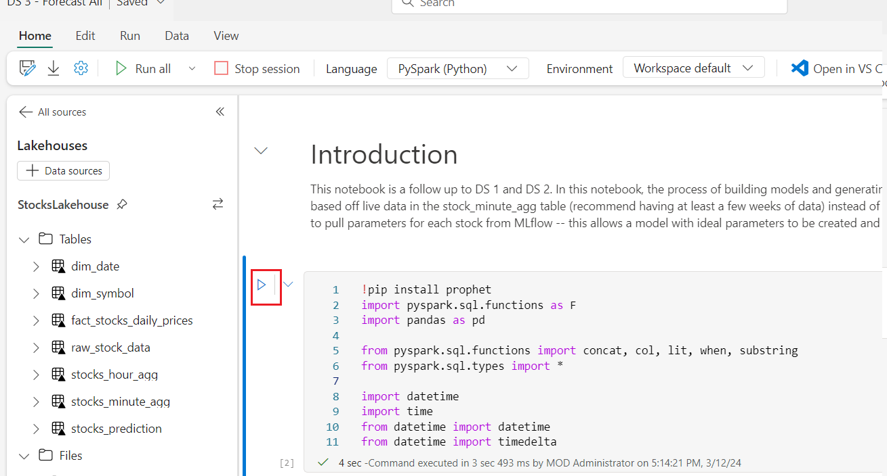

7.  명령에서 ***Run all을*** 클릭하고 작업이 진행됨에 따라 따라가세요.

8.  모든 기호에 대해 노트북을 실행하는 데 10분이 걸릴 수 있습니다.
      
  
      
  
      
  
      
  
      
  
      
  
      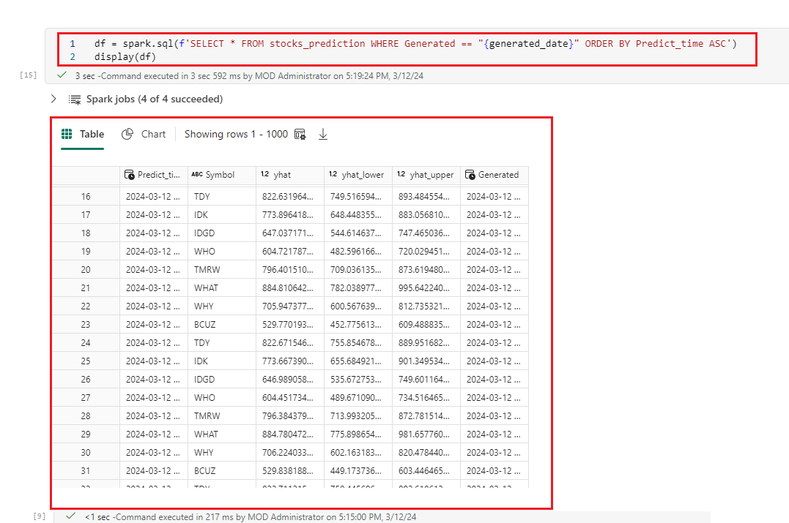
  
      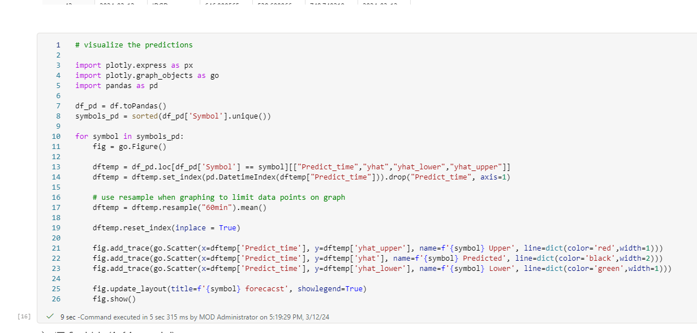
  
       
  
       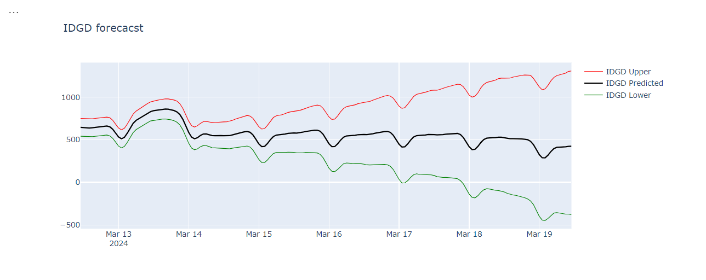
  
       
  
       
  
      
  
      
  
       
  
       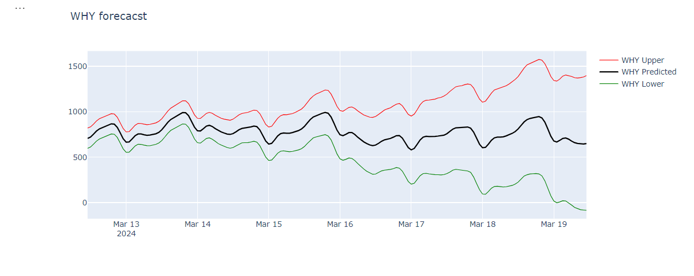

9.  모든 셀이 실행되면 *표의* 오른쪽에 있는 점**(...)** 세 개를 클릭하여
    스키마를 새로 고친 다음 탐색하여 **Refresh**를 **클릭하세요.**

    

# 연습 4: 예측 보고서 작성하기

## 작업 1: 시맨틱 모델 구축

이 단계에서는 Power BI 보고서에서 사용할 시맨틱 모델(이전에는 Power BI
데이터 집합이라고 했음)을 구축합니다. 시맨틱 모델은 보고할 준비가 된
데이터를 나타내며 데이터 소스 위에 추상화 역할을 합니다. 일반적으로
시맨틱 모델은 특정 보고 요구 사항을 충족하도록 구축되었으며 보고서
개발을 보다 쉽게 ​​하기 위한 측정과 같은 변환, 관계 및 보강 기능이 있을 수
있습니다..

1.  왼쪽 탐색 메뉴에서 **RealTimeWorkspace를** 클릭하세요.

     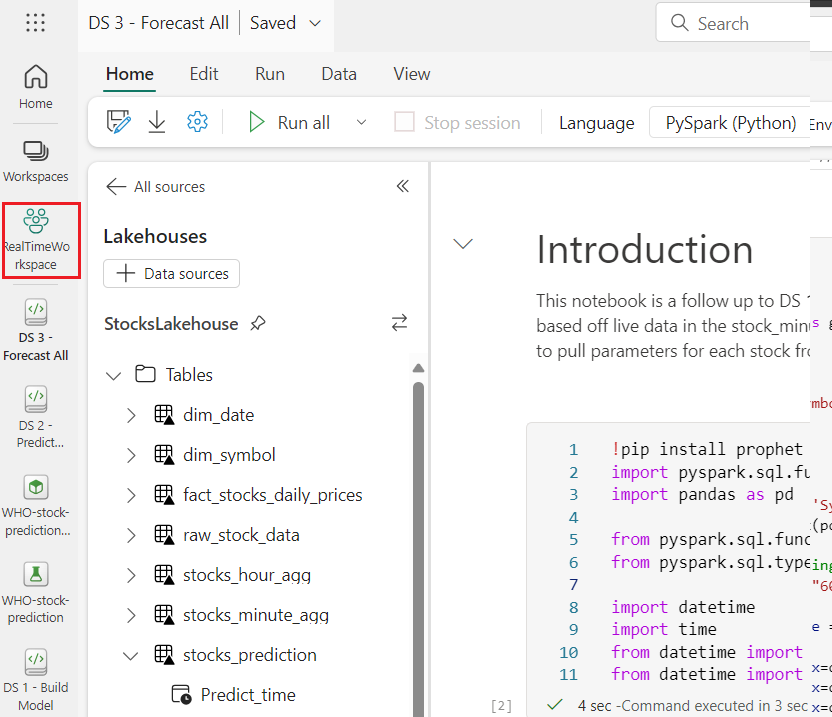

2.  시맨틱 모델을 만들려면 Lakehouse, 즉 **StackLakehouse를** 탐색하여
    클릭하세요**.**

     

     

3.  ***StocksLakehouse** 페이지의* 명령줄에서 ***New semantic model을***
    클릭하세요.

      

4.  **New semantic model** 창의 **Name** 필드에 모델 이름을
    ***StocksLakehousePredictions로*** 입력하고 **stock_prediction** 및
    **dim_symbol** 테이블을 선택하세요. 그런 다음 아래 이미지와 같이
    **Confirm** 버튼을 클릭하세요.

      

      

5.  시맨틱 모델이 열리면 stock_prediction 테이블과 dim_symbol 테이블
    간의 관계를 정의해야 합니다.

6.  **stock_prediction** 테이블에서 ***기호*** 필드를 **dim_Symbol**
    테이블의 ***기호*** 필드에 끌어 놓아 관계를 만드세요. **New
    relationship** 대화 상자가 나타납니다.

     

7.  **New relationship** 대화 상자에서:

      - **From table**은 stock_prediction과 **Symbol** 열로 채워집니다**.**
      
      - **To table**은 dim_symbol과 **Symbol** 열로 채워집니다**.**
      
      - Cardinality: **다대일(\*:1)**
      
      - 교차 필터 방향: **단일**
      
      - **Make this relationship active** 옆의 상자를 선택된 상태로 두세요.
      
      - **Save를** 선택하세요.

     

    

## 작업 2: Power BI Desktop에서 보고서 작성

1.  브라우저를 열고 주소 표시줄로 이동하여 다음 URL을 입력하거나
    붙여넣으세요: <https://powerbi.microsoft.com/en-us/desktop/> ,
    **입력** 버튼을 누르세요.

2.  **Download now** 버튼을 클릭하세요.

     

3.  **This site is trying to open Microsoft Store** 라는 대화 상자가
    나타나면 **열기** 버튼을 클릭하세요.

      

4.  **Power BI Desktop에서 가져오기** 버튼을 클릭하세요.

      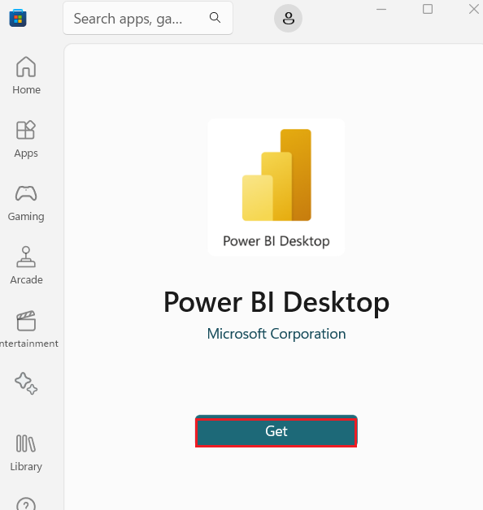

5.  이제 **Open** 버튼을 클릭하세요.

     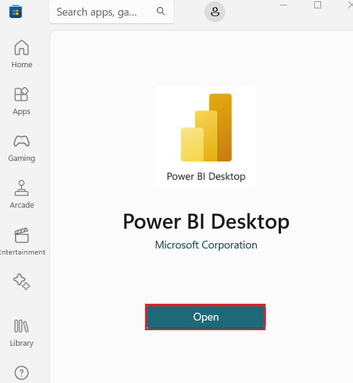

6.  **Microsoft Office 365 tenant** 자격 증명을 입력하고 **Next** 버튼을
    클릭하세요.

     

7.  **Resource** 탭에서 **Administrative password를** 입력하고 **sign
    in** 버튼을 클릭하세요**.**

     

8.  Power BI Desktop에서 **Blank report를** 선택하세요**.**

     

9.  *Home* 리본에서 **OneLake data hub를** 클릭하고 **KQL Database를**
    선택하세요.

     

10. **OneLake data hub** 창에서 StockDB를 선택하고 **connect** 버튼을
    클릭하세요.

     

11. **Microsoft Office 365** 테넌트 자격 증명을 입력하고 **Next** 버튼을
    클릭하세요.

     

12. **Resource** 탭에서 **Administrative password를** 입력하고
    **Sign-in** 버튼을 클릭하세요.

     

13. Navigator 페이지의 Display option에서 **Stockprice** table를 선택한
    다음 **Load** 버튼을 클릭하세요.

     

14. **Connection settings**대화 상자에서 **DirectQuery** 라디오
    버튼을 선택하고 **Ok** 버튼을 클릭하세요.

     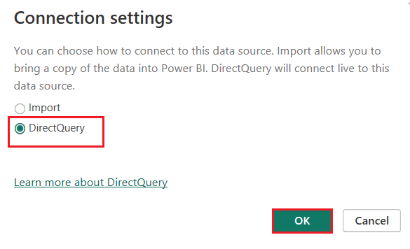

15. **Home** 리본에서 아래 이미지와 같이 **OneLake data hub를**
    클릭하고 **Power BI semantic model을** 선택하세요.

      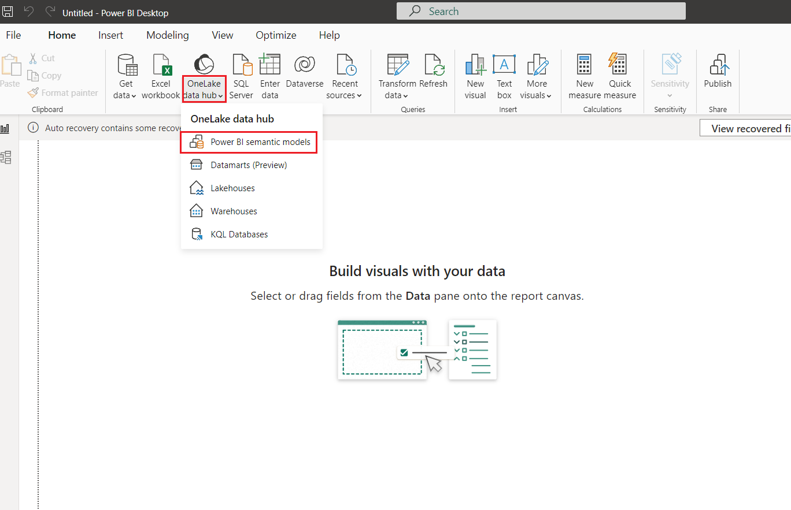

16. **OneLake data hub** 창에서 목록에서 **StockLakehousePredictions를**
    선택하고 C**onnect** 버튼을 클릭하세요.

      

17. **Connect to your data** 페이지에서 **dim_symbol,**
    stock_prediction을 선택한 다음 **Submit** 버튼을 클릭하세요.

      

18. 이 경우 **Ok** 버튼을 클릭하여 **Potential security risk** 경고를
    해제할 수 있습니다.

     

     

19. 명령 모음에서 ***Modeling을*** 클릭한 다음 Manage relationships를
    ***클릭하세요.***

     

20. **Manage relationships** 창에서 아래 이미지와 같이 **+**New
    relationship**를** 선택하세요.

     

21. ***StockPrice -From table과 stocks_prediction – To table 사이에 New
    relationship를 만드세요.*** (테이블을 선택한 후 각 테이블의 기호
    열을 선택해야 합니다). 교차 필터 방향을 ***Both로*** 설정하고
    카디널리티가 ***Many-to-many로*** 설정되어 있는지 확인하세요. 그런
    다음 **Save** 버튼을 클릭하세요.

      

22. **Mange relationships** 페이지에서 ***StockPrice***,
    ***stocks_prediction*** tables을 선택하고 **close** 버튼을
    클릭하세요.

      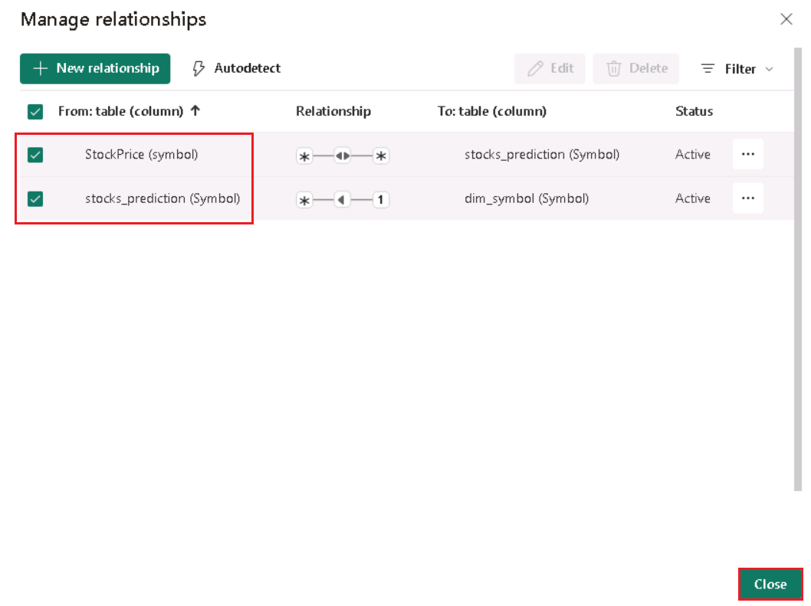

23. **Power BI** 페이지의 **시각화에서 꺾은선형 차트** 아이콘을 클릭하여
    보고서에 **열 차트를** 추가합니다.

      - **Data Pane**에서 **StockPrice를** 확장하고 **Timestamp** 옆의
        확인란을 선택하세요. 그러면 열 차트가 만들어지고 필드가 **X축에**
        추가됩니다.
      
      - **Data Pane**에서 **StockPrice를** 확장하고 **가격** 옆의 확인란을
        선택하세요. 그러면 필드가 **Y축에** 추가됩니다.
      
      - **Data Pane**에서 **StockPrice를** 확장하고 **기호** 옆의 확인란을
        선택하세요. 그러면 **Legend에** 필드가 추가됩니다.
      
      - **필터**: **timestamp** to ***Relative time**최근* **15분** *이내로
        설정됨*
       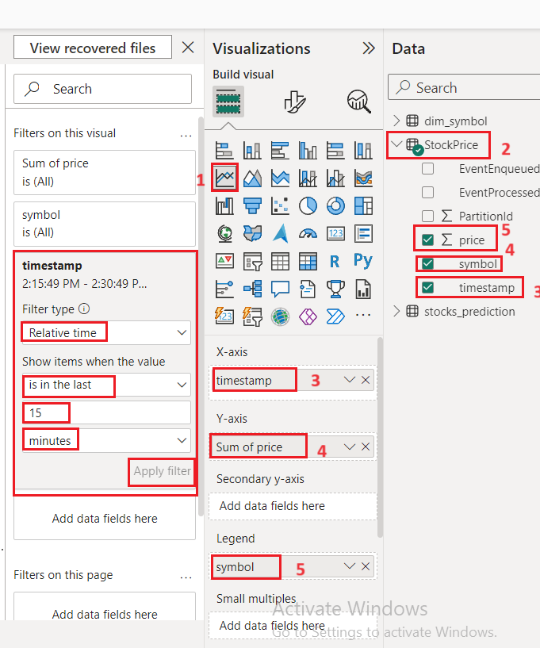

       

24. **Power BI** 페이지의 **Visualizations에서 Line chart** 아이콘을
    클릭하여 보고서에 **column chart를** 추가하세요.

      - **Data Pane**에서 **StockPrice를** 확장하고 **Timestamp** 옆의
        확인란을 선택하세요. 그러면 열 차트가 만들어지고 필드가 **X축에**
        추가됩니다.
      
      - **Data Pane**에서 **StockPrice를** 확장하고 **price** 옆의 확인란을
        선택하세요. 그러면 필드가 **Y축에** 추가됩니다.
      
      - **Data Pane**에서 **dim_symbol을** 확장하고 **Market** 옆의 확인란을
        선택하세요. 이렇게 하면 **Legend에** 필드가 추가됩니다.
      
      - **필터**: **타임스탬프가** *최근* **1시간** *이내의 **상대** 시간으로*
        설정됩니다.

         
    
         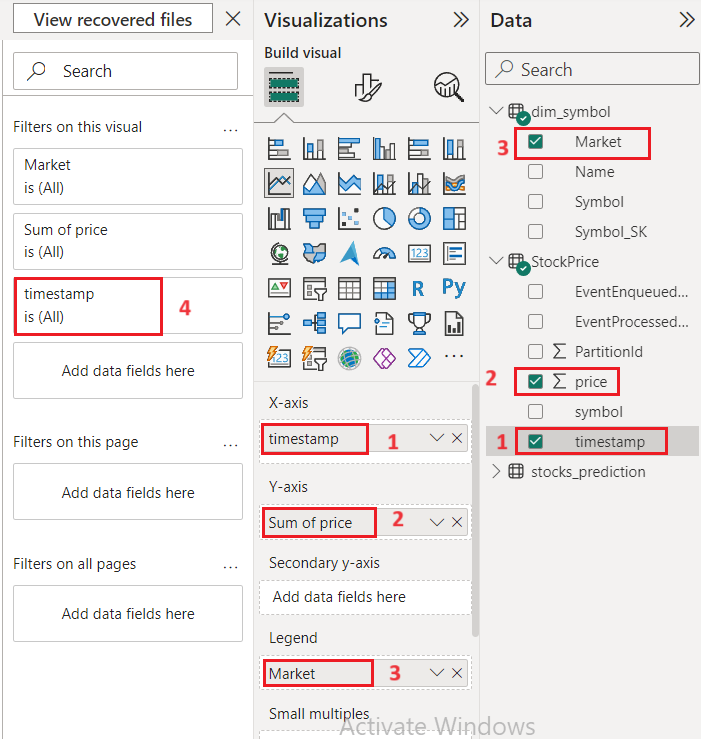
    
         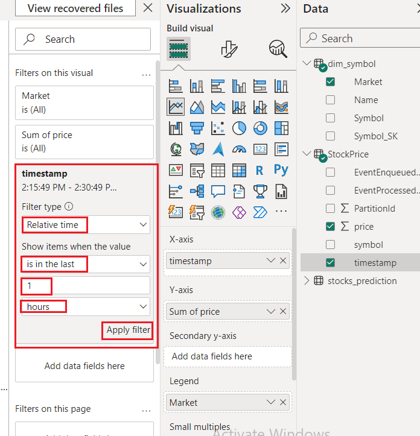
    
         

25. **Power BI** 페이지의 **Visualizations에서 Line chart** 아이콘을
    클릭하여 보고서에 **column chart를** 추가하세요.

    - **Data Pane**에서 **Stock_prediction을** 확장하고 **predict_time**
      옆의 확인란을 선택하세요. 그러면 열 차트가 만들어지고 필드가 **X축에**
      추가됩니다.
    
    - **Data Pane**에서 **Stock_prediction을** 확장하고 **yhat** 옆의
      확인란을 선택하세요. 그러면 필드가 **Y축에** 추가됩니다.
    
    - **Data Pane**에서 **Stock_prediction을** 확장하고 **symbol** 옆의
      확인란을 선택하세요. 그러면 **legend에** 필드가 추가됩니다.
    
    - **필터**: **predict_time** to ***Relative date*** *최근* **3일 *날짜로
      ***설정하세요

         
    
         
    
         
    
         

26. **Power BI** 페이지의 **Data에서 *stocks_prediction ***테이블을
    마우스 오른쪽 버튼으로 클릭하고 ***New measure을***
    선택하세요.

     

27. 측정값은 Data Analysis Expressions (DAX) 언어로 작성된 수식이며, 이
    DAX 수식의 경우 **+++currdate = NOW()+++를** 입력하세요.

     

28. Prediction chart를 선택한 상태에서 additional visualization 옵션, 즉
    돋보기/차트 아이콘으로 이동하여 **new** X-Axis Constant Line을
   추가하세요.

      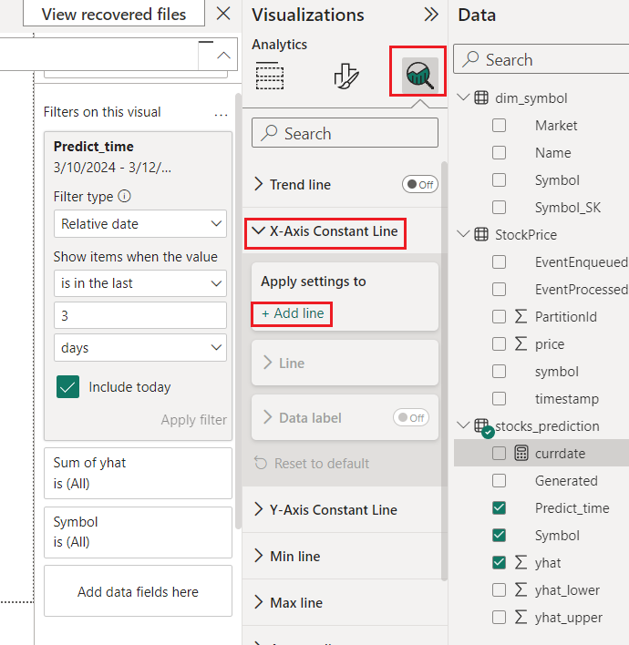

29. **Value** 아래에서 formula button**(fx)**을 사용하여 field를
    선택하세요.

     

30. **Value -Apply settings to** 페이지에서 **what field should we base
    this on?** 아래에 있는 드롭다운을 클릭한 다음 **stocks_prediction**
    드롭다운을 클릭하고 ***currdate* **measure을 선택하세요. 그런 다음
    **OK** 버튼을 클릭하세요.

     

     

31. 추가 시각화 옵션, 즉 돋보기/차트 아이콘으로 이동하여 **Shade area을
    켜세요**.
    

33. 테이블 간의 관계를 구성하면 모든 비주얼 자료가 교차 필터링되어야
    하며, 차트에서 기호나 시장을 선택하면 모든 비주얼 자료가 그에 따라
    반응해야 합니다. 아래 이미지와 같이 오른쪽 상단 시장 차트에서
    **NASDAQ** 시장이 선택되어 있습니다:

     

     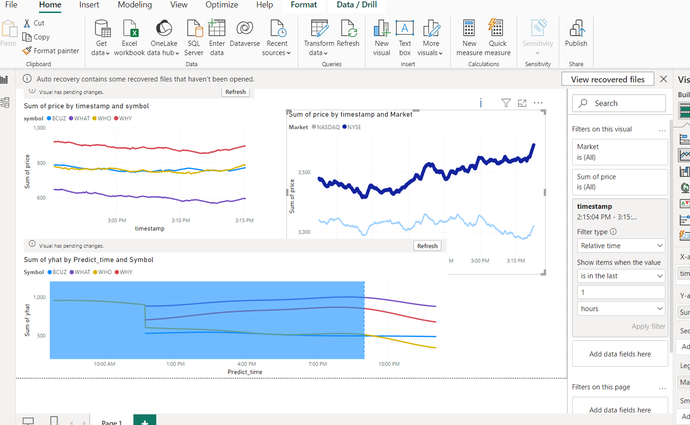

33. 명령줄에서 **Publish를** 클릭하세요.

      

34. **Microsoft Power BI Desktop톱** 대화 상자에서 **Save** 버튼을
    클릭하세요.

     
 
35. **Save this file** 대화 상자에서 **Prediction report로** 이름을
    입력하고 위치를 선택하세요. 그런 다음 **Save** 버튼을 클릭하세요.

     

## **요약**

이 실습에서는 데이터를 처리한 노트북을 가져와 실행하고, Prophet을
사용하여 데이터의 ML 모델을 생성하고, MLflow에 모델을 저장함으로써
Fabric에서 데이터 과학 솔루션에 접근하는 방법을 배웠습니다. 또한 교차
유효성 검사를 사용하여 모델을 평가하고 추가 데이터를 사용하여 모델을
테스트했습니다.

ML 모델을 사용하고, 예측을 생성하고, 해당 예측을 Lakehouse에 저장하여 ML
모델 생성에 대한 후속 작업을 수행했습니다. 모델을 구축하고 예측을
생성하는 프로세스를 한 단계로 개선하여 예측을 생성하고 모델 생성을
운영하는 프로세스를 간소화했습니다. 그런 다음 예측 값과 함께 현재 주가를
보여주는 보고서를 생성하여 비즈니스 사용자가 데이터를 사용할 수 있도록
합니다.
