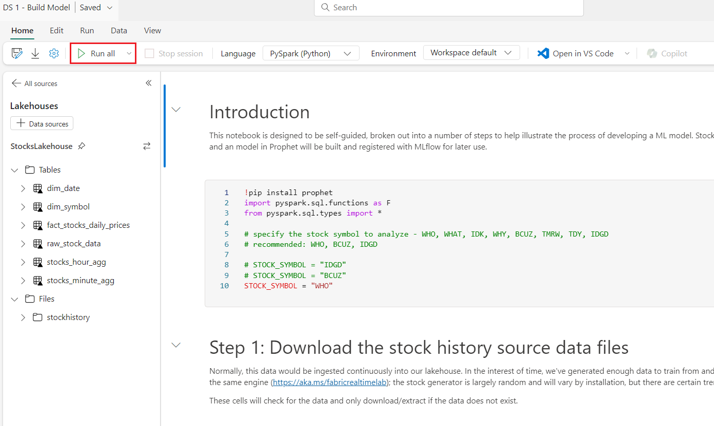
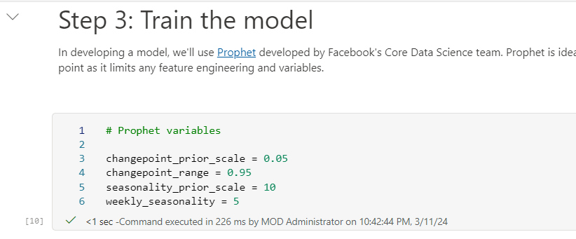
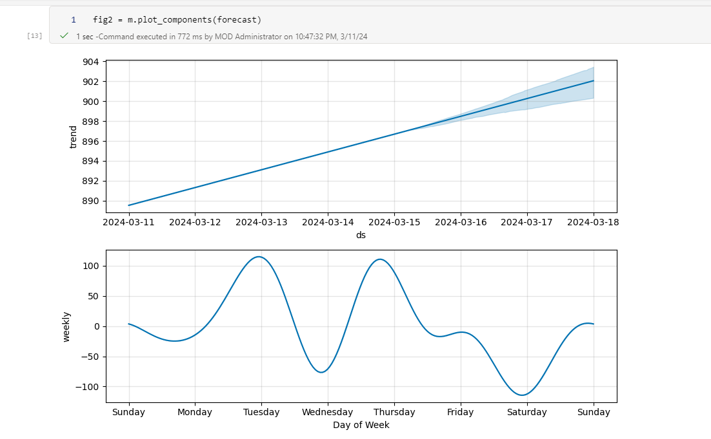
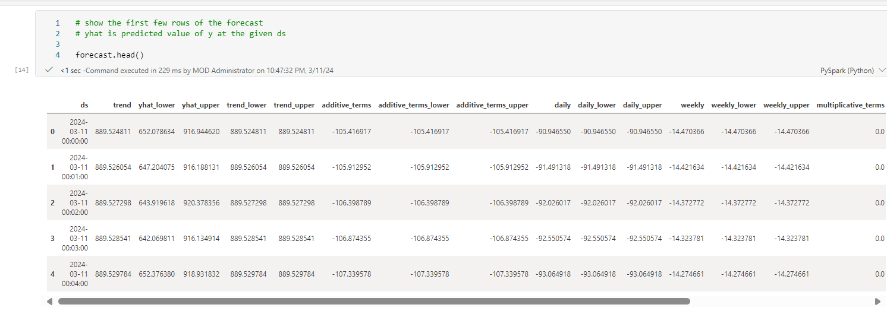
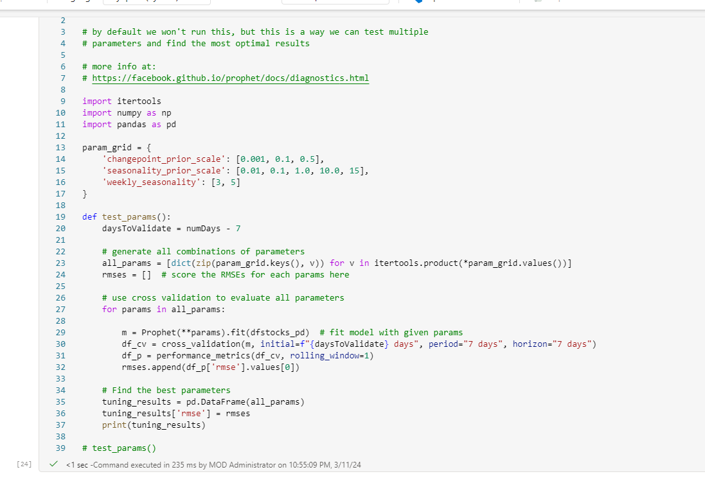
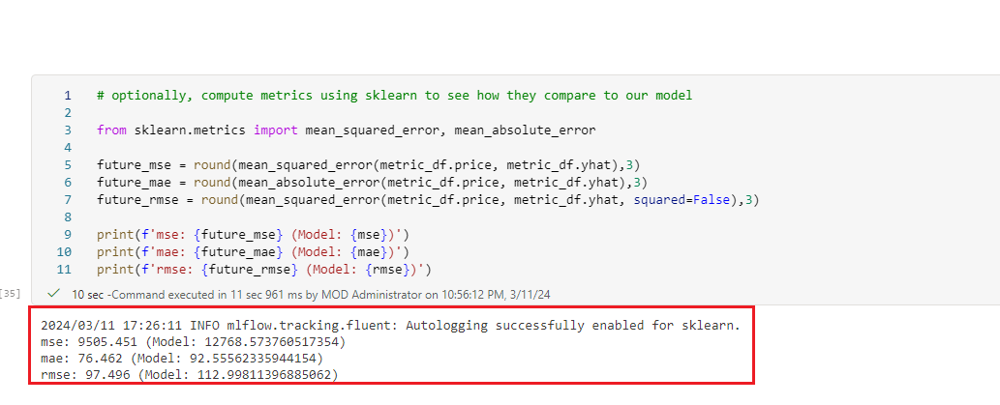

# Lab 04: Getting Started with Building a ML Model in Fabric

**Introduction**

As a refresher on the scenario, AbboCost Financial has been modernizing
their stock market reporting for their financial analysts. In previous
modules, we've developed the solution by creating real-time dashboards,
a data warehouse, and more.

In this module, AbboCost would like to explore predictive analytics to
help inform their advisors. The goal is to analyze historical data for
patterns that can be used to create forecasts of future values.
Microsoft Fabric's Data Science capability is the ideal place to do this
kind of exploration.

**Objectives**

- To import and configure notebooks for building and storing machine
  learning models.

- To explore and execute the DS 1-Build Model notebook for building and
  validating a stock prediction model.

- To examine model metadata and performance metrics in the
  RealTimeWorkspace.

- To open and explore the DS 2-Predict Stock Prices notebook for
  predicting stock prices.

- To run the notebook for generating predictions and storing them in the
  Lakehouse.

- To import and explore the DS 3-Forecast All notebook for generating
  predictions and storing them in the Lakehouse.

- To execute the notebook and verify the predictions in the Lakehouse
  schema.

- To build a semantic model in Power BI using the
  StockLakehousePredictions data and create visualizations in Power BI
  to analyze stock predictions and market trends.

- To configure relationships between tables and publish the prediction
  report.

# Exercise 1: Building and storing an ML model

## Task -1: Import the notebook

1.  In the **StockDimensionalModel** page, click on
    **RealTimeWorkspace** on the left-sided navigation menu.

     

2.  In the **Synapse Data Engineering** **RealTimeWorkspace** page,
    navigate and click on **Import** button, then select **Notebook**
    and select the **From this computer as shown in the below image.**

     

3.  In the **Import status** pane that appear on the right side, click
    on **Upload** .

      

4.  Navigate to **C:\LabFiles\Lab 05** and select **DS 1-Build Model, DS
    2-Predict Stock Prices and DS 3-Forecast All** notebooks, then click
    on the **Open** button.

      
5.  You will see a notification stating - **Imported successfully.**

      

      

6.  In the **RealTimeWorkspace**, click on **DS 1-Build Model**
    notebook.

      

7.  Under the Explorer, select **Lakehouse** and click on the
    **Add* *button.**

> ***Important*:** You will need to add the Lakehouse to every imported
> notebook -- do this each time you open a notebook for the first time.
     
     

8.  In the **Add Lakehouse** dialog box, select **Existing lakehouse**
    radio button, then click on the **Add** button.
     

9.  On the OneLake data hub window, select the ***StockLakehouse*** and
    click on the **Add** button.
     
     

## Task 2: Explore and run the notebook

The *DS 1* notebook is documented throughout the notebook, but in short,
the notebook carries out the following tasks:

- Allows us to configure a stock to analyze (such as WHO or IDGD)

- Downloads historical data to analyze in CSV format

- Reads the data into a dataframe

- Completes some basic data cleansing

- Loads [Prophet](https://facebook.github.io/prophet/), a module for
  conducting time series analysis and prediction

- Builds a model based on historical data

- Validates the model

- Stores the model using MLflow

- Completes a future prediction

The routine that generates the stock data is largely random, but there
are some trends that should emerge. Because we don't know when you might
be doing this lab, we've generated several years’ worth of data. The
notebook will load the data and will truncate future data when building
the model. As part of an overall solution, we'd then supplement the
historical data with new real-time data in our Lakehouse, re-training
the model as necessary (daily/weekly/monthly).

1.  In 1st cell uncomment the STOCK_SYMBOL=”IDGD” and
    STOCK_SYMBOL=”BCUZ”, then select and **Run** the cell.

     

2.  Click ***Run all*** in the top toolbar and follow along as the work
    progresses.

3.  The notebook will take roughly **15-20** minutes to execute -- some
    steps, like **training the model** and **cross validation**, will
    take some time.

      
      
      
      
      
      
      
      
      
      
      
      
      
      
      
      
      
      
      
      
      
      
      
      
      
      
      
      
      
      
      
      
      
      

##  Task 3: Examine the model and runs

1.  Now, click on **RealTimeWorkspace** on the left-sided navigation
    menu.

2.  Experiments and runs can be viewed in the workspace resource list.

3.  In the **RealTimeWorkspace** page, select
    **WHO-stock-prediction-model** of ML model type.

4.  Metadata, in our case, includes input parameters we may tune for our
    model, as well as metrics on the model's accuracy, such as root mean
    square error (RMSE). RMSE represents the average error -- a zero
    would be a perfect fit between model and actual data, while higher
    numbers show an increase error. While lower numbers are better, a
    "good" number is subjective based on the scenario.

# Exercise 2-Using models, saving to Lakehouse, building a report

## Task 1: Open and explore the Predict Stock Prices notebook

The notebook has been broken out into function definitions, such as *def
write_predictions*, which help encapsulate logic into smaller steps.
Notebooks can include other libraries (as you've seen already at the top
of most notebooks), and can also execute other notebooks. This notebook
completes these tasks at a high level:

- Creates the stock predictions table in the Lakehouse, if it doesn't
  exist

- Gets a list of all stock symbols

- Creates a prediction list by examining available ML models in MLflow

- Loops through the available ML models:

  - Generates predictions

  - Stores predictions in the lakehouse

1.  Now,click on **RealTimeWorkspace** on the left-sided navigation
    pane.

2.  In the **RealTimeWorkspace**, click on the **DS 2-Predict Stock
    Prices** notebook.

3.  Under the Explorer, select the **Lakehouse**, then click on the
    **Add* ***button*.*

4.  In the **Add Lakehouse** dialog box, select **Existing lakehouse**
    radio button, then click on the **Add** button.

5.  On the OneLake data hub window, select the ***StockLakehouse*** and
    click on the **Add** button.

## Task 2: Run the notebook

1.  Creates the stock predictions table in the Lakehouse, select and
    **Run** the 1st and 2nd cells.

2.  Gets a list of all stock symbols, select and **Run** the
    3rd and 4th cells.

3.  Creates a prediction list by examining available ML models in
    MLflow, select and **Run** the 7th, 8th ,
    9th , and 10th cells.

4.  To build predictions for each model store in Lakehouse , select and
    **Run** the 11th and 12th cells.

5.  When all cells have been run, refresh the schema by clicking on the
    three dots **(...)** beside *Tables,* then navigate and click on
    ***Refresh*.**

# Exercise 3: Solution in practice

The first two sections in this module are common approaches to
developing a data science solution. The first section covered the
development of the model (exploration, feature engineering, tuning,
etc.), building, and then deploying the model. The second section
covered the consumption of the model, which is typically a separate
process and may even be done by different teams.

However, in this specific scenario, there is little benefit to creating
the model and generating predictions separately because the model we
developed is time-based univariate - the predictions that the model
generates will not change without retraining the model with new data.

Most ML models are multivariate, for example, consider a travel time
estimator that calculates travel time between two locations such model
could have dozens of input variables, but two major variables would
certainly include the time of day and weather conditions. Because the
weather is changing frequently, we'd pass this data into the model to
generate new travel time predictions (inputs: time of day and weather,
output: travel time).

Therefore, we should generate our predictions immediately after creating
the model. For practical purposes, this section shows how we could
implement the ML model building and forecasting in a single step.
Instead of using the downloaded historical data, this process will use
the aggregation tables built in module 06. Our data flow can be
visualizad like so:

## Task 1: Import the notebook

Take some time exploring the *DS 3 - Forecast All* notebook, and notice
a few key things:

- Stock data is read from the stock_minute_agg table.

- All symbols are loaded, and predictions are made on each.

- The routine will check MLflow for matching models, and load their
  parameters. This allows data science teams to build optimal
  parameters.

- Predictions for each stock are logged to the stock_predicitions table.
  There is no persistence of the model.

- There is no cross validation or other steps performed in 07a. While
  these steps are useful for the data scientist, it's not needed here.

1.  Now, click on **RealTimeWorkspace** on the left-sided navigation
    menu.

2.  *In the **RealTimeWorkspace***, click on the **DS 3-Forecast All**
    notebook.

3.  Under the Explorer select the **Lakehouse** and click on the
    ***Add .***

4.  In the **Add Lakehouse** dialog box, select **Existing lakehouse**
    radio button, then click on the **Add** button.

5.  On the OneLake data hub window, select the ***StockLakehouse*** and
    click on the **Add** button.

6.  Select and **Run** the 1st cell.

7.  Click ***Run all*** in the command and follow along as the work
    progresses.

8.  Running the notebook for all symbols could take 10 minutes.
    

9.  When all cells have been run, refresh the schema by clicking the
    three dots **(...)** dots to the right of the *Tables*, then
    navigate and click on ***Refresh*.**

# Exercise 4: Building a Prediction Report

## Task 1: Build a semantic model

In this step, we'll build a semantic model (formerly called Power BI
datasets) to use in our Power BI report. A semantic model represents
data that is ready for reporting and acts as an abstraction on top of a
data source. Typically, a semantic model will be purpose built (serving
a specific reporting need) and may have transformations, relationships,
and enrichments like measures to make developing reports easier

1.  Click on **RealTimeWorkspace** on the left-sided navigation menu.

2.  To create a semantic model, navigate and click on the Lakehouse
    i.e., **StackLakehouse.**

3.  In the ***StocksLakehouse*** page*,* click on ***New semantic
    model*** in the command bar.

4.  In the **New semantic model** pane **Name** field, enter the name of
    the model as ***StocksLakehousePredictions***, select the
    **stock_prediction**, and **dim_symbol** tables. Then, click on the
    **Confirm** button as shown in the below image.

5.  When the semantic model opens, we need to define relationships
    between the stock_prediction and dim_symbol tables.

6.  From the **stock_prediction** table, drag the ***Symbol***  field
    and drop it on the ***Symbol***  field in the **dim_Symbol** table
    to create a relationship. The **New relationship** dialog box
    appears.

7.  In the **New relationship** dialog box:

- **From table** is populated with **stock_prediction** and the column
  of **Symbol.**

- **To table** is populated with **dim_symbol**  and the column of
  **Symbol.**

- Cardinality: **Many to one (\*:1)**

- Cross filter direction: **Single**

- Leave the box next to **Make this relationship active** selected.

- Select **Save**

## Task 2: Build the report in Power BI Desktop

1.  Open your browser, navigate to the address bar, and type or paste
    the following URL: <https://powerbi.microsoft.com/en-us/desktop/> ,
    then press the **Enter** button.

2.  Click on the **Download now** button.

>  style="width:6.49167in;height:3.76667in" />

3.  In case, **This site is trying to open Microsoft Store** dialog box
    appears, then click on **Open** button.

4.  Under **Power BI Desktop**, click on the **Get** button.

5.  Now, click on the **Open** button.

6.  Enter your **Microsoft Office 365** **tenant** credentials and click
    on the **Next** button.

7.  Enter the **Administrative password** from the **Resources** tab and
    click on the **Sign in** button**.**

8.  In Power BI Desktop, select **Blank report.**

9.  , On the *Home* ribbon, click the ***OneLake data hub*** and select
    **KQL Database.**

10. On the **OneLake data hub** window, select the **StockDB**  and
    click on the **Connect** button.

11. Enter your **Microsoft Office 365** tenant credentials and click on
    the **Next** button.

12. Enter the **Administrative password** from the **Resources** tab and
    click on the **Sign in** button**.**

13. In the Navigator page, under **Display Options**, select
    **StockPrice** table, then click on the **Load** button.

14. In the ***Connection settings*** dialog box, select
    ***DirectQuery*** radio button and click on **OK** button.

15. On the ***Home*** ribbon, click the ***OneLake data hub*** and
    select **Power BI semantic models** as shown in the below image.

16. On the **OneLake data hub** window, select
    the **StockLakehousePredictions** from the list and click on the
    **Connect** button.

17. In the **Connect to your data** page, select **dim_symbol,
    stock_prediction**, and click on the **Submit** button.

18. In this case, we can dismiss the **Potential security risk** warning
    by clicking on the **OK** button.

19. Click on ***Modeling*** in the command bar, then click on ***Manage
    relationships.***

20. In the **Manage relationships** pane, select +**New relationship**
    as shown in the below image.

21. Create a **New relationship** between the ***StockPrice*** -**From
    table** and the ***stocks_prediction*** – ***To table* **(after
    selecting the table, ensure to select the symbol columns in each
    table). Set the cross filter direction to ***Both***, and make sure
    the cardinality is set to ***Many-to-many*.** Then, click on the
    **Save** button.

> 

22. In **Mange relationships** page, select ***StockPrice***,
    ***stocks_prediction*** tables and click on the **Close** button.

23. In the **Power BI** page, under **Visualizations**, click on the
    **Line chart** icon to add a **Column chart** to your report.

- On the **Data** pane, expand **StockPrice**  and check the box next
  to **timestamp**. This creates a column chart and adds the field to
  the **X-axis**.

- On the **Data** pane, expand **StockPrice** and check the box next
  to **Price**. This adds the field to the **Y-axis**.

- On the **Data** pane, expand **StockPrice** and check the box next
  to **Symbol**. This adds the field to the **Legend**.

- **Filter**: **timestamp** to ***Relative time** is in the last* **15
  minutes**.

24. In the **Power BI** page, under **Visualizations**, click on the
    **Line chart** icon to add a **Column chart** to your report.

- On the **Data** pane, expand **StockPrice**  and check the box next
  to **timestamp**. This creates a column chart and adds the field to
  the **X-axis**.

- On the **Data** pane, expand **StockPrice** and check the box next
  to **Price**. This adds the field to the **Y-axis**.

- On the **Data** pane, expand **dim_symbol** and check the box next
  to **Market**. This adds the field to the **Legend**.

- **Filter**: **timestamp** to ***Relative time** is in the last* **1
  hour**.

25. In the **Power BI** page, under **Visualizations**, click on the
    **Line chart** icon to add a **Column chart** to your report.

- On the **Data** pane, expand **Stock_prediction**  and check the box
  next to **predict_time**. This creates a column chart and adds the
  field to the **X-axis**.

- On the **Data** pane, expand **Stock_prediction**  and check the box
  next to **yhat**. This adds the field to the **Y-axis**.

- On the **Data** pane, expand **Stock_prediction** and check the box
  next to **Symbol**. This adds the field to the **Legend**.

- **Filter**: **predict_time** to ***Relative date** in the last* **3
  days**.

26. In the **Power BI** page, under **Data,** right click
    the ***stocks_prediction*** table and select ***New measure.***

27. Measures are formulas written in the Data Analysis Expressions (DAX)
    language; for this DAX formula, enter +++***currdate = NOW()+++* **

28. With the prediction chart selected, navigate to the additional
    visualization options i.e., the magnifying glass/chart icon and add
    a **new *X-Axis Constant Line***.

29. Under *Value*, use the formula button **(fx)** to choose a field.

30. In **Value -Apply settings to** page, click on the dropdown under
    **what field should we base this on?**, then click on the dropdown
    of **stocks_prediction**, select the ***currdate* **measure. Then,
    click on the **OK** button.

31. Navigate to the additional visualization options i.e., the
    magnifying glass/chart icon, turn On the **Shade
    area**.

32. Configured the relationships between tables, all visual should cross
    filter; when selecting either a symbol or market on a chart, all
    visuals should react accordingly. As shown in the below image, the
    **NASDAQ** market is selected on the upper-right market chart:

33. Click on the **Publish** in the command bar.

34. In **Microsoft Power BI Desktop** dialog box, click on the **Save**
    button.

35. In **Save this file** dialog box, enter the Name as **Prediction
    Report** and select the location. Then, click on the **Save**
    button.

## **Summary**

In this lab, you’ve learned how to approach a data science solution in
Fabric by importing and executing a notebook that processed data,
created a ML model of the data using Prophet, and stored the model in
MLflow. Additionally, you’ve evaluated the model using cross validation
and tested the model using additional data.

You’ve followed up on the creation of the ML model by consuming the ML
model, generating predictions, and storing those predictions in the
Lakehouse. Refined the process to build a model and generate predictions
in a single step, streamlining the process of creating predictions and
operationalizing the model generation. Then, you’ve created a report (or
reports) that show the current stock prices with predicted values,
making the data available for business users.
