# 실습 05: Pipelines를 사용한 Data Warehouse 구축하기

**소개**

이 실습에서는 Microsoft Fabric 내에서 Synapse Data Warehouse를 구축하여
KQL 데이터베이스의 데이터를 집계합니다. Microsoft Fabric에서 데이터
웨어하우스를 구축하는 방법에는 이 모듈의 초점인 Synapse Data Warehouse를
사용하는 방법과 Lakehouse를 사용하는 두 가지 기본 방법이 있습니다.

Synapse Data Warehouse는 데이터를 Lakehouse 테이블과 유사한
Delta/Parquet 형식으로 OneLake에 저장합니다. 그러나 Synapse Data
Warehouse만 T-SQL 엔드포인트에서 읽기/쓰기를 제공합니다. 데이터
웨어하우스를 마이그레이션하거나 T-SQL 개발에 더 익숙한 경우, Synapse
Data Warehouse를 사용하는 것이 논리적인 선택입니다.

레이크하우스든Synapse Data Warehouse든 어떤 것을 선택하든 최종 목표는
비슷합니다. 비즈니스 분석 요구 사항을 지원하기 위해 고도로 큐레이션된
데이터를 확보하는 것입니다. 이 작업은 차원 및 팩트 테이블이 있는 Star
schema에서 수행되는 경우가 많습니다. 이러한 테이블은 비즈니스에 대한
단일 데이터 소스 역할을 합니다.

샘플 앱의 데이터는 현재 주식 기호당 초당 1건의 요청 속도로 스트리밍되며,
그 결과 하루에 각 주식에 대해 86,400개의 값이 생성됩니다. 데이터
웨어하우스의 목적을 위해 이를 각 주식의 일일 고가, 일일 저가, 종가를
포함한 일일 값으로 축소하겠습니다. 이렇게 하면 행 수가 줄어듭니다.

ETL(extract, transform, and load) 프로세스에서는 현재 워터마크에 의해
결정된 대로 아직 가져오지 않은 모든 데이터를 준비 테이블로 추출합니다.
그런 다음 이 데이터를 요약한 다음 차원/팩트 테이블에 배치됩니다. 하나의
테이블(주가)만 가져오지만, 우리가 구축 중인 프레임워크는 여러 테이블에
대한 수집을 지원한다는 점에 유의하세요.

**목표**

- 데이터 처리 및 변환을 용이하게 하기 위해 Fabric 작업 공간 내에 Synapse
  Data Warehouse를 만들고 필수 스테이징 및 ETL 개체를 생성하기

- 소스 시스템에서 데이터를 효율적으로 추출, 변환 및 로드(ETL)하여 데이터
  정확성과 일관성을 보장하는 데이터 파이프라인을 구축하여 Synapse Data
  Warehouse로 가져오기.

- 데이터 웨어하우스 내에서 차원 및 팩트 테이블을 생성하여 분석 목적에
  맞게 구조화된 데이터를 효율적으로 구성하고 저장하기.

- 데이터 무결성을 유지하면서 대규모 데이터 세트를 효율적으로 처리할 수
  있도록 데이터 웨어하우스에 데이터를 점진적으로 로드하는 절차를
  구현하기.

- ETL 프로세스 중에 데이터 집계를 지원하는 뷰를 생성하여 데이터 처리를
  최적화하고 데이터 파이프라인 성능을 개선하기.

- Synapse Data Warehouse에서 시맨틱 모델을 만들고, 테이블 관계를
  정의하고, 데이터 시각화를 위한 Power BI 보고서를 생성하기.

# 연습 1: 웨어하우스 및 파이프라인 설정하기

## 작업 1: Fabric 작업 공간에서 Synapse Data Warehouse 만들기

시작하려면 먼저 작업 공간에 Synapse Data Warehouse를 만들어 보겠습니다.

1.  페이지 왼쪽 하단의 **Real-time Analytics 아이콘을** 클릭하고 아래
    이미지와 같이 **Data Warehouse로** 이동하여 클릭하세요.

     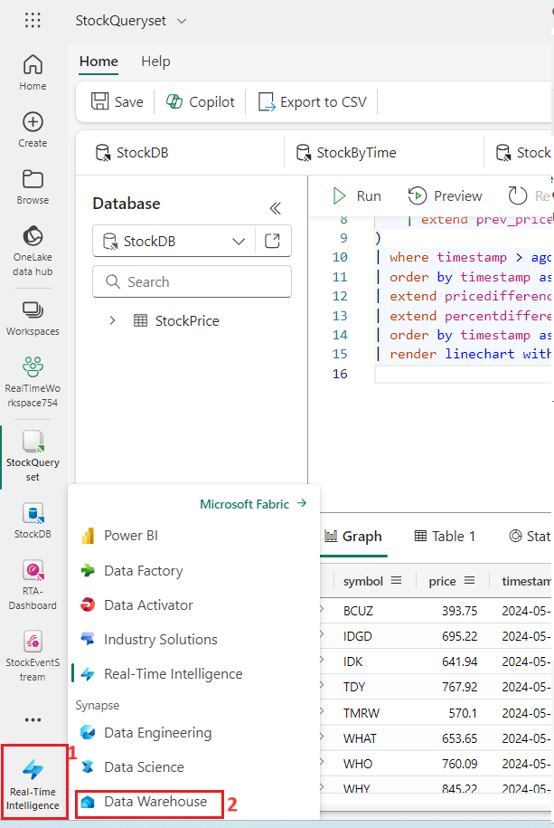

2.  **Warehouse** 타일을 선택하여 새 Synapse Data Warehouse를
    만드세요.

     

3.  **New warehouse** 대화 상자에서 ***+++StocksDW+++를*** 이름으로
    입력하고 **Create** 버튼을 클릭하세요.

      

4.  창고는 대부분 비어 있습니다.

      

5.  명령줄에서 ***New SQL query*** 드롭다운을 클릭한 다음 **Blank**
    섹션에서 **New SQL query를** 선택하세요. 다음 작업에서 스키마 구축을
    시작하겠습니다.

     

## 작업 2: 스테이징 및 ETL 개체 만들기

1.  다음 쿼리를 실행하여 ETL(Extract, Transform, and Load) 프로세스 중에
    데이터를 보관할 준비 테이블을 생성하세요. 이렇게 하면 사용되는 두
    가지 스키마(*stg* 및 *ETL*)도 생성됩니다. 스키마는 유형 또는
    기능별로 워크로드를 그룹화하는 데 도움이 됩니다. *stg* 스키마는
    스테이징용이며 ETL 프로세스를 위한 중간 테이블을 포함합니다. *ETL*
    스키마에는 데이터 이동에 사용되는 쿼리와 상태 추적을 위한 단일
    테이블이 포함되어 있습니다.

2.  워터마크의 시작 날짜는 모든 데이터가 캡처될 수 있도록 임의로 이전
    날짜(1/1/2022)로 선택되며, 이 날짜는 실행이 성공할 때마다
    업데이트됩니다.

3.  query editor에서 다음 코드를 복사하여 붙여넣으세요. **실행** 버튼을
    클릭하여 쿼리를 실행합니다. 쿼리가 실행되면 결과를 볼 수 있습니다.

> **복사**
```
/* 1 - Create Staging and ETL.sql */

-- STAGING TABLES
CREATE SCHEMA stg
GO

CREATE TABLE stg.StocksPrices
(
   symbol VARCHAR(5) NOT NULL
   ,timestamp VARCHAR(30) NOT NULL
   ,price FLOAT NOT NULL
   ,datestamp VARCHAR(12) NOT NULL
)
GO

-- ETL TABLES
CREATE SCHEMA ETL
GO
CREATE TABLE ETL.IngestSourceInfo
(
    ObjectName VARCHAR(50) NOT NULL
    ,WaterMark DATETIME2(6)
    ,IsActiveFlag VARCHAR(1)
)

INSERT [ETL].[IngestSourceInfo]
SELECT 'StocksPrices', '1/1/2022 23:59:59', 'Y'
```
   
    

4.  참조를 위해 쿼리 이름을 바꾸세요. **Explorer에서 SQL query 1을**
    마우스 오른쪽 버튼으로 클릭하고 **Rename를** 선택하세요.

      

5.  **Rename** 바꾸기 대화 상자의 **Name** 필드에 **+++ Create stocks
    and metadata +++를** 입력한 다음 **Rename** 버튼을 클릭하세요.

     

6.  명령줄에서 ***New SQL Query*** 드롭다운을 클릭한 다음 **Blank**
    섹션에서 New SQL Query**를** 선택하세요. 다음 단계에서 스키마 구축을
    시작하겠습니다:

     

7.  **sp_IngestSourceInfo_Update** 절차는 워터마크를 업데이트하여 이미
    가져온 레코드를 추적할 수 있습니다.

8.  query editor에서 다음 코드를 복사하여 붙여넣으세요. **Run** 버튼을
    클릭하여 쿼리를 실행하세요. 쿼리가 실행되면 결과를 볼 수 있습니다.

**복사**
```
/* 1 - Create Staging and ETL.sql */

CREATE PROC [ETL].[sp_IngestSourceInfo_Update]
@ObjectName VARCHAR(50)
,@WaterMark DATETIME2(6)
AS
BEGIN

UPDATE [ETL].[IngestSourceInfo]
    SET WaterMark = @WaterMark
WHERE 
    ObjectName  = @ObjectName

END

GO
```
   
     

6.  나중에 참조할 수 있도록 쿼리 이름을 바꾸세요. **Explorer에서 SQL
    Qquery 1을** 마우스 오른쪽 버튼으로 클릭하고 **Rename를**
    선택하세요.

     

7.  **Rename** 대화 상자의 **Name** 필드에
    **+++ETL.sql_IngestSource+++를** 입력한 다음 **Rename** 버튼을
    클릭하세요.

     

다음과 비슷하게 보일 것입니다:
    

## 작업 3: 데이터 파이프라인 만들기

1.  **StockDW** 페이지의 왼쪽 탐색 메뉴에서 **RealTimeWorkspace** 작업
    공간을 클릭하세요.

     

2.  **Synapse Data Warehouse RealTimeWorkhouse** 홈 페이지의
    **RealTimeWorkhouse** 아래에서 **+New를** 클릭한 다음 **Data
    pipeline을** 선택하세요.

     

3.  **New pipeline** 대화 상자가 나타나면 **Name** 필드에
    +++PL_Refresh_DWH+++를 입력한 다음 **Create** 버튼을 클릭하세요**.**

      

4.  **PL_Refresh_DWH** 페이지에서 **Build a data pipeline to organize
    and move your data로** 이동하고 **Pipeline activity을** 클릭하세요.

      

5.  그런 다음 아래 이미지와 같이 ***Lookup activity를*** 선택하세요.

      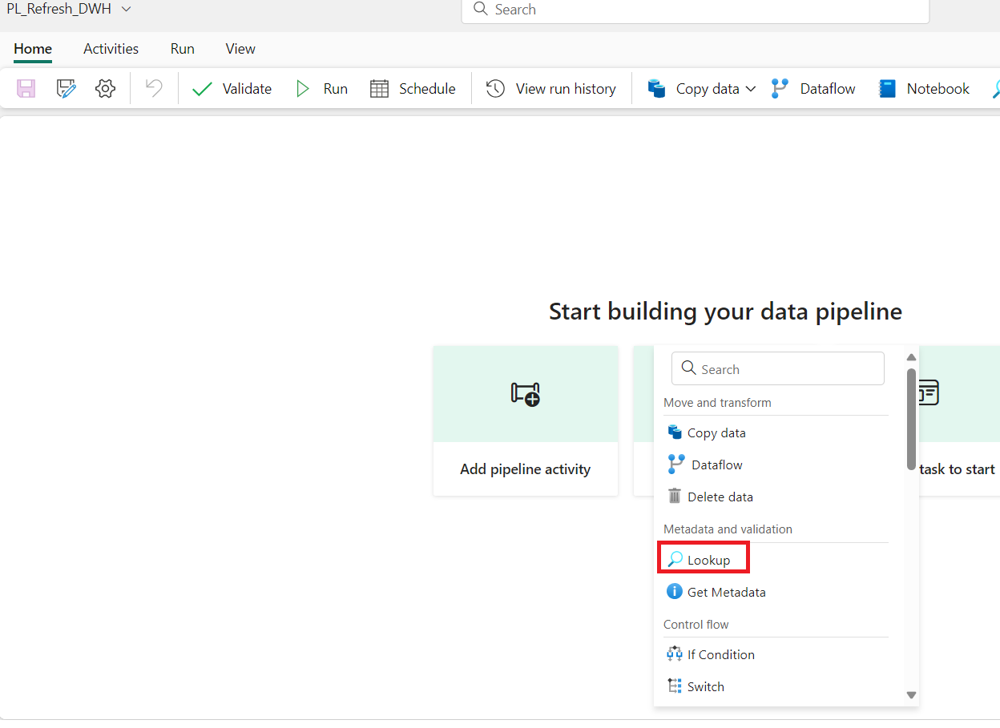

6.  **General** 탭의 Name field**에 *+++Get ***WaterMark+++를
    입력하세요.

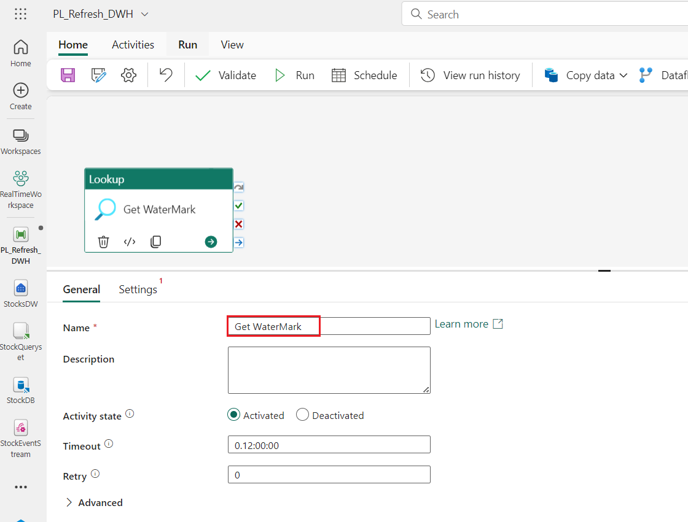

7.  **Settings** 탭을 클릭하고 아래 이미지와 같이 다음 세부 정보를
    입력하세요.


|   |   |
|-----|----|
|연결	|드롭다운을 클릭하고 목록에서 StocksDW를 선택하세요.|
|쿼리 사용	| 쿼리 |
|쿼리 |	+++SELECT * FROM [ETL].[IngestSourceInfo] WHERE IsActiveFlag = 'Y'+++|
|First row only |	선택하지 않음|

  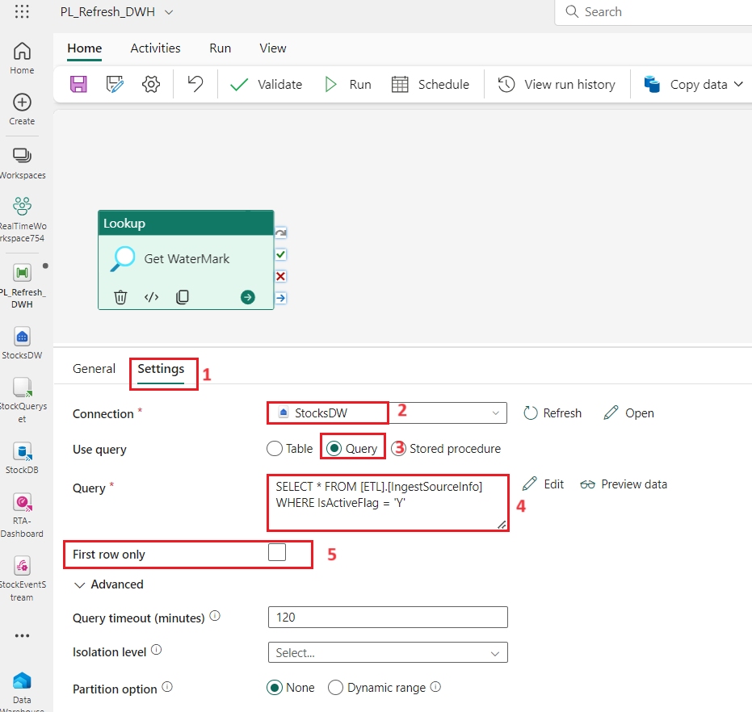

## 작업 4: ForEach activity 구축

이 작업은 단일 ForEach activity 내에 여러 활동을 구축하는 데 중점을
둡니다. ForEach activity는 하위 활동을 그룹으로 실행하는 컨테이너로, 이
경우 데이터를 가져올 소스가 여러 개 있는 경우 각 데이터 소스에 대해 이
단계를 반복합니다.

1.  **Lookup - Get WaterMark** 상자에서 오른쪽 화살표를 클릭하여 **Add
    an activity를** 클릭하세요. 그런 다음 아래 이미지와 같이 ***ForEach
    activity를*** 선택하세요.

     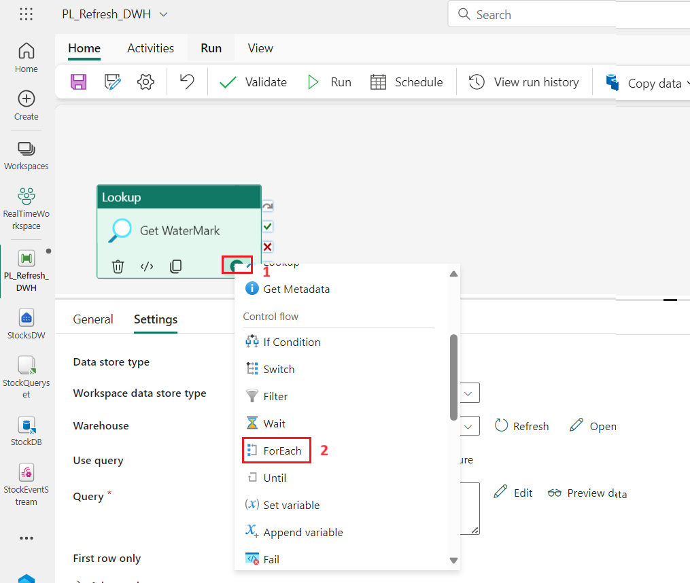

2.  **Settings** 탭을 클릭하고 +++ **@activity('Get
    WaterMark').output.**value+++로 항목을 입력하세요.

아래 이미지와 비슷하게 보일 것입니다:
    

3.  **ForEach** 상자에서 더하기(+) 기호를 클릭하여 새 활동을 추가하세요.

      

4.  **ForEach** 내에서 **Copy data** 활동을 선택하고 추가하세요.

      
5.  **Copy data1** 활동 아이콘을 선택하고 **General** 탭의 **Name
    field에** +++Copy KQL+++을 입력하세요.

      

6.  **Spurce** 탭을 클릭하고 다음 설정을 입력하세요.

|   |   |
|-----|----|
|연결 	|드롭다운에서 StocksDB를 선택하세요.|
|쿼리 사용|	쿼리 |
|쿼리 | 	+++@concat('StockPrice | where todatetime(timestamp) >= todatetime(''', item().WaterMark,''') 
         | order by timestamp asc
         | extend datestamp = substring(timestamp,0,10) 
         | project symbol, timestamp, price, datestamp 
         | take 500000 
         | where not(isnull(price))' ) +++ |


활동의 *소스* 탭은 다음과 비슷하게 보일 것입니다:

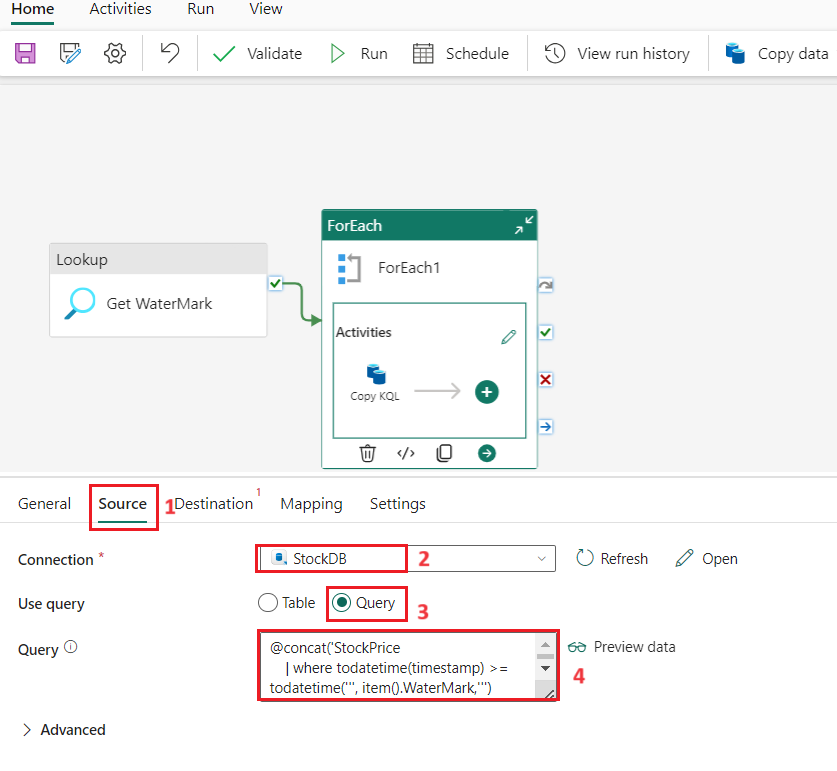

7.  **Destination** 탭을 클릭하고 다음 설정을 입력하세요.

[TABLE]

- *Advanced* 섹션에서 준비 테이블을 로드하기 전에 테이블을 지우려면 다음
  ***Pre-copy script*** ***를*** 입력하세요:

> **+++delete stg.StocksPrices+++**

이 단계에서는 먼저 스테이징 테이블에서 오래된 데이터를 삭제한 다음,
마지막 워터마크에서 데이터를 선택하여 스테이징 테이블에 삽입하는
방식으로 KQL 테이블에서 데이터를 복사합니다. 전체 테이블을 처리하지
않으려면 워터마크를 사용하는 것이 중요하며, 또한 KQL 쿼리의 최대 행 수는
500,000행입니다. 현재 수집되는 데이터의 속도를 고려할 때, 이는 하루의 약
3/4에 해당하는 양입니다.

활동의 *Destination tab*은 다음과 같이 보일 것입니다:

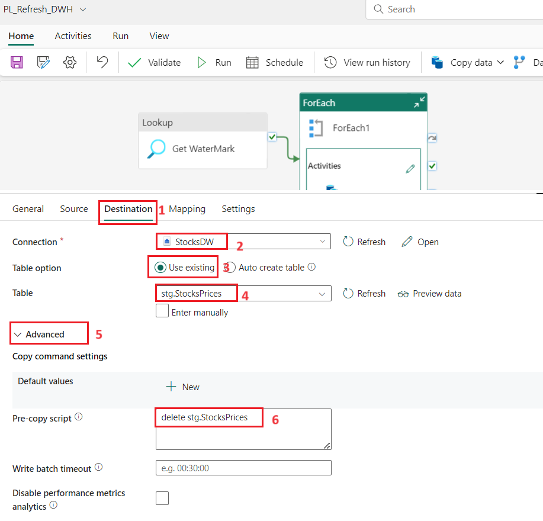

8.  *ForEach* 상자에서 더하기**(+)** 기호를 클릭하고 탐색하여 **Lookup
    activity를** 선택하세요.


9.  **Lookup1** 아이콘을 클릭하고 **General** 탭의 **Name field*에 +++새
    워터마크 ***가져오기 +++를 입력하세요.

> 

10. **Settings** 탭을 클릭하고 다음 설정을 입력하세요.

[TABLE]


11. *ForEach* 상자에서 더하기**(+)** 기호를 클릭하고 탐색하여 ***Save
    procedure activity를*** 선택하세요.

> 

12. **Stored procedure** 아이콘을 클릭하세요. **General** 탭의 **Name
    field에** +++ ***Update WaterMark*** +++를 입력하세요.

> 

13. **Settings** 탭을 클릭하고 다음 설정을 입력하세요.

[TABLE]

- 매개변수(*Import를* 클릭하면 매개변수 이름이 자동으로 추가됨):

[TABLE]

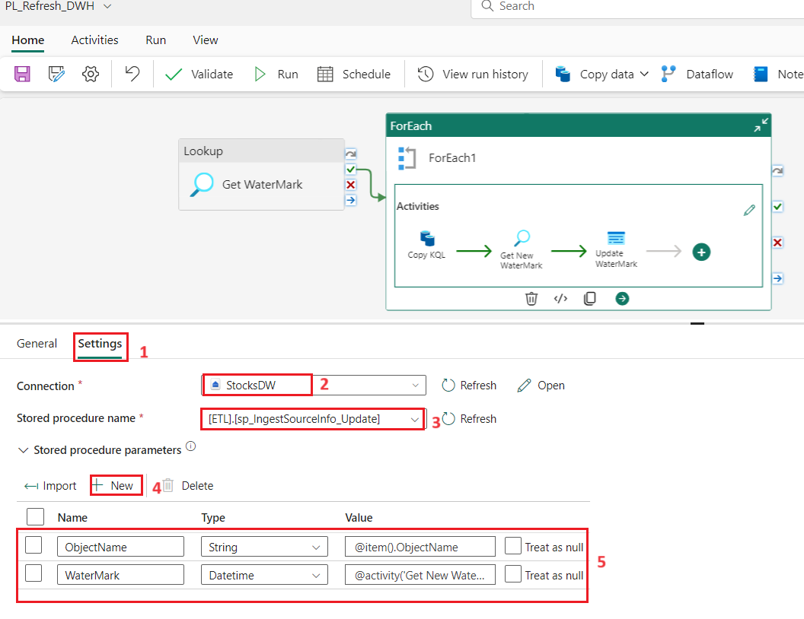

## 작업 5: 파이프라인 테스트

1.  파이프라인의 Home 탭에서 ***Run을*** 선택하세요.

> 

2.  **Save and run?** 대화 상자에서 **Save and run** 버튼을 클릭하세요.

> 

3.  그러면 먼저 파이프라인을 저장한 다음 유효성을 검사하여 구성 오류를
    찾으라는 메시지가 표시됩니다. 이 초기 실행에는 잠시 시간이 걸리며
    데이터를 스테이징 테이블에 복사합니다.


4.  **PL_Refresh_DWH** 페이지의 왼쪽 탐색 메뉴에서
    **RealTimeWorkspace**작업 공간을 클릭하세요.


5.  **Refresh** 버튼을 클릭하세요.


6.  데이터 웨어하우스에서 데이터는 준비 테이블에 표시되어야 합니다.
    데이터 웨어하우스 내에서 테이블을 선택하면 해당 테이블에 있는
    데이터의 미리 보기가 표시됩니다. 왼쪽 탐색 메뉴에서 StocksDW를
    클릭한 다음 Explorer에서 o **Schemas를** 클릭하세요. Schema에서 아래
    이미지와 같이 **stg를** 탐색하여 클릭한 다음 **StocksPrices를**
    클릭하세요.

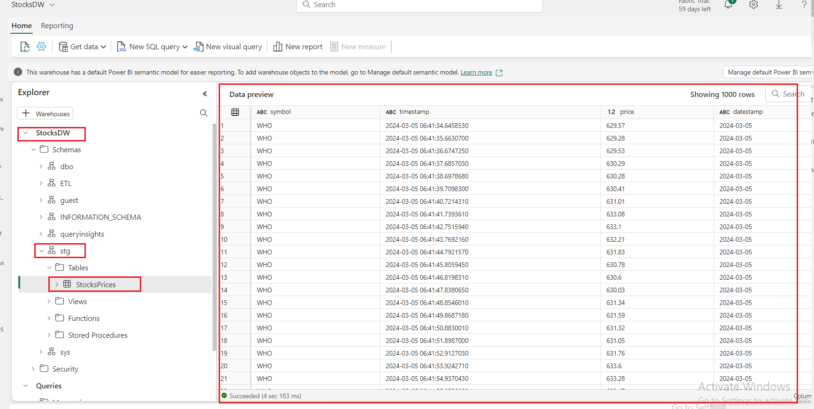

9.  명령줄에서 ***New SQL query*** 드롭다운을 클릭한 다음 **Blank**
    섹션에서 New **SQL query를** 선택하세요. 다음 단계에서 스키마 구축을
    시작하겠습니다:


8.  데이터 웨어하우스에 있는 동안 new SQL query창에서 아래 스크립트를
    실행하여 수집 프로세스를 재설정합니다. 증분 테스트를 허용하는 재설정
    스크립트가 있으면 개발 시 유용할 때가 많습니다. 이렇게 하면 날짜가
    재설정되고 준비 테이블에서 데이터가 삭제됩니다.

> ***참고:** 아직 팩트 또는 차원 테이블을 만들지 않았지만 스크립트는
> 여전히 작동합니다.*

9.  query editor에서 다음 코드를 복사하여 붙여넣으세요. **Run** 버튼을
    클릭하여 쿼리를 실행하세요. 쿼리가 실행되면 결과를 볼 수 있습니다.

> **복사**

-- Run this to 'RESET' the ingestion tables

exec ETL.sp_IngestSourceInfo_Update 'StocksPrices', '2022-01-01
23:59:59.000000'

GO

IF (EXISTS (SELECT \* FROM INFORMATION_SCHEMA.TABLES

WHERE TABLE_SCHEMA = 'stg' AND TABLE_NAME = 'StocksPrices'))

BEGIN

delete stg.StocksPrices

END

GO

IF (EXISTS (SELECT \* FROM INFORMATION_SCHEMA.TABLES

WHERE TABLE_SCHEMA = 'dbo' AND TABLE_NAME = 'fact_Stocks_Daily_Prices'))

BEGIN

delete dbo.fact_Stocks_Daily_Prices

END

GO

IF (EXISTS (SELECT \* FROM INFORMATION_SCHEMA.TABLES

WHERE TABLE_SCHEMA = 'dbo' AND TABLE_NAME = 'dim_Symbol'))

BEGIN

delete dbo.dim_Symbol

END

GO 

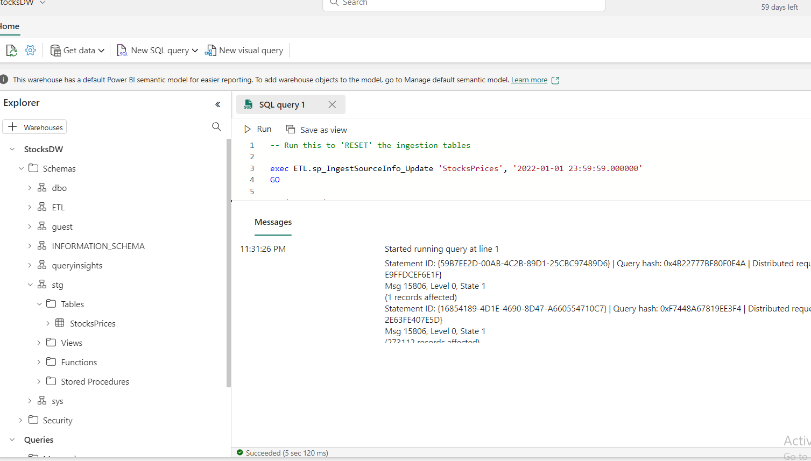

# 연습 2: Star schema 구축

날짜 차원의 경우, 가까운 미래에 충분한 값을 로드하겠습니다. 날짜 차원은
모든 구현에서 상당히 유사하며 일반적으로 요일, 월, 분기 등 특정 날짜
세부 정보를 보유합니다.

기호 차원은 파이프라인 중에 점진적으로 로드하므로, 어느 시점에 새 종목이
추가되면 파이프라인 실행 중에 기호 차원 테이블에 추가됩니다. 기호
차원에는 회사 이름, 거래되는 주식 시장 등과 같은 각 기호에 대한 추가
세부 정보가 들어 있습니다.

또한 주식의 최소, 최대, 종가를 집계하여 스테이징 테이블에서 데이터를 더
쉽게 로드할 수 있도록 하여 파이프라인을 지원하는 뷰를 만들 것입니다.

## 작업 1: 차원 및 팩트 테이블 만들기

1.  명령줄에서 ***New SQL query*** 드롭다운을 클릭한 다음 **Blank**
    섹션에서 **New SQL Query를** 선택하세요. 다음 단계에서 스키마 구축을
    시작하겠습니다.


2.  Data Warehouse에서 다음 SQL을 실행하여 팩트 및 차원 테이블을
    만드세요. 이전 단계와 마찬가지로 이 임시로 실행하거나 SQL 쿼리를
    만들어 나중에 사용할 수 있도록 쿼리를 저장할 수 있습니다.

3.  query editor에서 다음 코드를 복사하여 붙여넣으세요. **Run** 버튼을
    클릭하여 쿼리를 실행하세요. 쿼리가 실행되면 결과를 볼 수 있습니다.

> **복사**

/\* 2 - Create Dimension and Fact tables.sql \*/

-- Dimensions and Facts (dbo)

CREATE TABLE dbo.fact_Stocks_Daily_Prices

(

Symbol_SK INT NOT NULL

,PriceDateKey DATE NOT NULL

,MinPrice FLOAT NOT NULL

,MaxPrice FLOAT NOT NULL

,ClosePrice FLOAT NOT NULL

)

GO

CREATE TABLE dbo.dim_Symbol

(

Symbol_SK INT NOT NULL

,Symbol VARCHAR(5) NOT NULL

,Name VARCHAR(25)

,Market VARCHAR(15)

)

GO

CREATE TABLE dbo.dim_Date

(

\[DateKey\] DATE NOT NULL

,\[DayOfMonth\] int

,\[DayOfWeeK\] int

,\[DayOfWeekName\] varchar(25)

,\[Year\] int

,\[Month\] int

,\[MonthName\] varchar(25)

,\[Quarter\] int

,\[QuarterName\] varchar(2)

)

GO


4.  참조를 위해 쿼리 이름을 바꿉니다. 탐색기에서 **SQL query를** 마우스
    오른쪽 버튼으로 클릭하고 **Rename을** 선택하세요.


5.  **Rename** 대화 상자의 **Name** 필드에 +++ Create Dimension and Fact
    tables**+++를** 입력한 다음 **Rename** 버튼을 클릭하세요.


## 작업 2: 날짜 차원 로드하기

1.  창 상단에서 ***New SQL Query*** 클릭하세요. 명령줄에서 ***New SQL
    Query*** 드롭다운을 클릭한 다음 **Blank** 섹션에서 **New SQL Query**
    선택하세요. 다음 단계에서 스키마 구축을 시작하겠습니다:


2.  날짜 차원은 차별화되어 있으므로 필요한 모든 값을 한 번 로드할 수
    있습니다. 다음 스크립트를 실행하여 다양한 값으로 날짜 차원 테이블을
    채우는 절차를 만듭니다.

3.  query editor에서 다음 코드를 복사하여 붙여넣으세요. **Run** 버튼을
    클릭하여 쿼리를 실행하세요. 쿼리가 실행되면 결과를 볼 수 있습니다.

> **복사**

/\* 3 - Load Dimension tables.sql \*/

CREATE PROC \[ETL\].\[sp_Dim_Date_Load\]

@BeginDate DATE = NULL

,@EndDate DATE = NULL

AS

BEGIN

SET @BeginDate = ISNULL(@BeginDate, '2022-01-01')

SET @EndDate = ISNULL(@EndDate, DATEADD(year, 2, GETDATE()))

DECLARE @N AS INT = 0

DECLARE @NumberOfDates INT = DATEDIFF(day,@BeginDate, @EndDate)

DECLARE @SQL AS NVARCHAR(MAX)

DECLARE @STR AS VARCHAR(MAX) = ''

WHILE @N \<= @NumberOfDates

BEGIN

SET @STR = @STR + CAST(DATEADD(day,@N,@BeginDate) AS VARCHAR(10))

IF @N \< @NumberOfDates

BEGIN

SET @STR = @STR + ','

END

SET @N = @N + 1;

END

SET @SQL = 'INSERT INTO dbo.dim_Date (\[DateKey\]) SELECT CAST(\[value\]
AS DATE) FROM STRING_SPLIT(@STR, '','')';

EXEC sys.sp_executesql @SQL, N'@STR NVARCHAR(MAX)', @STR;

UPDATE dbo.dim_Date

SET

\[DayOfMonth\] = DATEPART(day,DateKey)

,\[DayOfWeeK\] = DATEPART(dw,DateKey)

,\[DayOfWeekName\] = DATENAME(weekday, DateKey)

,\[Year\] = DATEPART(yyyy,DateKey)

,\[Month\] = DATEPART(month,DateKey)

,\[MonthName\] = DATENAME(month, DateKey)

,\[Quarter\] = DATEPART(quarter,DateKey)

,\[QuarterName\] = CONCAT('Q',DATEPART(quarter,DateKey))

END

GO


4.  동일한 쿼리 창에서 다음 스크립트를 실행하여 위의 절차를 실행하새요.

> **복사**

/\* 3 - Load Dimension tables.sql \*/

Exec ETL.sp_Dim_Date_Load


5.  참조를 위해 쿼리 이름을 바꿉니다. 탐색기에서 **SQL query를** 마우스
    오른쪽 버튼으로 클릭하고 **Rename**을 선택하세요.


6.  **Rename** 대화 상자의 **Name** 필드에 +++ **Load Dimension
    tables+++를** 입력한 다음 **Rename** 버튼을 클릭하세요.


## 작업 3: 기호 차원을 로드하는 절차 만들기

1.  명령줄에서 ***New SQL Query*** 드롭다운을 클릭한 다음 **Blank**
    섹션에서 **New SQL Query** 선택하세요. 다음 단계에서 스키마 구축을
    시작하겠습니다.


2.  날짜 차원과 마찬가지로 각 주식 기호는 기호 차원 테이블의 행에
    해당합니다. 이 테이블에는 회사명, 주식이 상장된 시장 등 주식에 대한
    세부 정보가 들어 있습니다.

3.  query editor에서 다음 코드를 복사하여 붙여넣으세요. **Run** 버튼을
    클릭하여 쿼리를 실행하세요. 그러면 주식 기호 차원을 로드하는 절차가
    생성됩니다. 이 절차를 파이프라인에서 실행하여 피드에 새로 들어오는
    모든 종목을 처리할 것입니다.

> **복사**

/\* 3 - Load Dimension tables.sql \*/

CREATE PROC \[ETL\].\[sp_Dim_Symbol_Load\]

AS

BEGIN

DECLARE @MaxSK INT = (SELECT ISNULL(MAX(Symbol_SK),0) FROM
\[dbo\].\[dim_Symbol\])

INSERT \[dbo\].\[dim_Symbol\]

SELECT

Symbol_SK = @MaxSK + ROW_NUMBER() OVER(ORDER BY Symbol)

, Symbol

, Name

,Market

FROM

(SELECT DISTINCT

sdp.Symbol

, Name = 'Stock ' + sdp.Symbol

, Market = CASE SUBSTRING(Symbol,1,1)

WHEN 'B' THEN 'NASDAQ'

WHEN 'W' THEN 'NASDAQ'

WHEN 'I' THEN 'NYSE'

WHEN 'T' THEN 'NYSE'

ELSE 'No Market'

END

FROM

\[stg\].\[vw_StocksDailyPrices\] sdp

WHERE

sdp.Symbol NOT IN (SELECT Symbol FROM \[dbo\].\[dim_Symbol\])

) stg

END

GO


7.  참조를 위해 쿼리 이름을 바꾸세요. 탐색기에서 **SQL query를** 마우스
    오른쪽 버튼으로 클릭하고 **Rename를** 선택하세요.


8.  **Rename** 대화 상자의 **Name** 필드에 +++ **Load the stock symbol
    dimension +++를** 입력한 다음 **Rename** 버튼을 클릭하세요.


## **작업 4: 뷰 만들기**

1.  명령줄에서 ***New SQL Query*** 드롭다운을 클릭한 다음 **Blank**
    섹션에서 **New SQL Query** 선택하세요. 다음 단계에서 스키마 구축을
    시작하겠습니다.


2.  로드하는 동안 데이터 집계를 지원하는 보기를 만드세요. 파이프라인이
    실행되면 데이터가 KQL 데이터베이스에서 준비 테이블로 복사되어 각
    주식에 대한 모든 데이터를 매일의 최소, 최대 및 종가로 집계합니다.

3.  query editor에서 다음 코드를 복사하여 붙여넣으세요. **Run** 버튼을
    클릭하여 쿼리를 실행하세요.

/\* 4 - Create Staging Views.sql \*/

CREATE VIEW \[stg\].\[vw_StocksDailyPrices\]

AS

SELECT

Symbol = symbol

,PriceDate = datestamp

,MIN(price) as MinPrice

,MAX(price) as MaxPrice

,(SELECT TOP 1 price FROM \[stg\].\[StocksPrices\] sub

WHERE sub.symbol = prices.symbol and sub.datestamp = prices.datestamp

ORDER BY sub.timestamp DESC

) as ClosePrice

FROM

\[stg\].\[StocksPrices\] prices

GROUP BY

symbol, datestamp

GO

/\*\*\*\*\*\*\*\*\*\*\*\*\*\*\*\*\*\*\*\*\*\*\*\*\*\*\*\*\*\*\*\*\*\*\*\*\*\*/

CREATE VIEW stg.vw_StocksDailyPricesEX

AS

SELECT

ds.\[Symbol_SK\]

,dd.DateKey as PriceDateKey

,MinPrice

,MaxPrice

,ClosePrice

FROM

\[stg\].\[vw_StocksDailyPrices\] sdp

INNER JOIN \[dbo\].\[dim_Date\] dd

ON dd.DateKey = sdp.PriceDate

INNER JOIN \[dbo\].\[dim_Symbol\] ds

ON ds.Symbol = sdp.Symbol

GO


4.  참조를 위해 쿼리 이름을 바꾸세요. 탐색기에서 **SQL query를** 마우스
    오른쪽 버튼으로 클릭하고 **Rename를** 선택하세요.

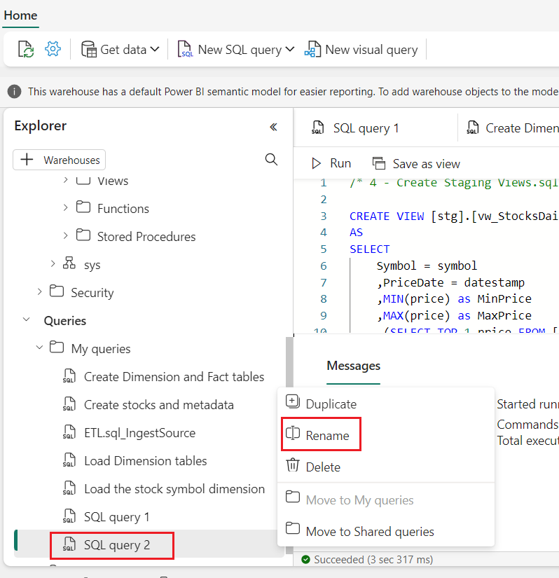

5.  **Rename** 대화 상자의 **Name** 필드에 +++ **Create Staging Views**
    **+++를** 입력한 다음 **Rename** 버튼을 클릭하세요.


## 작업 5: 기호를 로드하는 활동 추가

1.  **StockDW** 페이지의 왼쪽 탐색 메뉴에서 **PL_Refresh_DWH를**
    클릭하세요.


2.  Pipeline에서 주식 기호를 로드하는 절차를 실행하는 새 ***Stored
    Procedure*** activity인 ***Populate Symbols Dimension***을
    추가하세요.

3.  이것은 ForEach activity의 성공 출력에 연결되어야 합니다(ForEach
    activity 내부가 아님).

> 

4.  **General** 탭의 **Name 필드에** +++**Populate Symbols Dimension**
    +++를 입력하세요**.**

> 

5.  **Settings** 탭을 클릭하고 다음 설정을 입력하세요.

[TABLE]


## 작업 6: 일일 가격을 로드하는 절차 만들기

1.  **PL_Refresh_DWH** 페이지의 왼쪽 탐색 메뉴에서 **StockDW를**
    클릭하세요.


2.  명령줄에서 ***New SQL Query*** 드롭다운을 클릭한 다음 Blank 섹션에서
    **New SQL Query** 선택하세요. 다음 단계에서 스키마 구축을
    시작하겠습니다.


3.  그런 다음 아래 스크립트를 실행하여 팩트 테이블을 작성하는 절차를
    만드세요. 이 절차는 스테이징의 데이터를 팩트 테이블에 병합합니다.
    파이프라인이 하루 종일 실행되는 경우 최소, 최대 및 종가의 모든 변경
    사항을 반영하도록 값이 업데이트됩니다.

> **참고**: 현재 Fabric 데이터 웨어하우스는 T-SQL 병합 문을 지원하지
> 않으므로 필요에 따라 데이터를 업데이트한 다음 삽입해야 합니다.

4.  query editor에서 다음 코드를 복사하여 붙여넣으세요. **Run** 버튼을
    클릭하여 쿼리를 실행하세요.

/\* 5 - ETL.sp_Fact_Stocks_Daily_Prices_Load.sql \*/

CREATE PROCEDURE \[ETL\].\[sp_Fact_Stocks_Daily_Prices_Load\]

AS

BEGIN

BEGIN TRANSACTION

UPDATE fact

SET

fact.MinPrice = CASE

WHEN fact.MinPrice IS NULL THEN stage.MinPrice

ELSE CASE WHEN fact.MinPrice \< stage.MinPrice THEN fact.MinPrice ELSE
stage.MinPrice END

END

,fact.MaxPrice = CASE

WHEN fact.MaxPrice IS NULL THEN stage.MaxPrice

ELSE CASE WHEN fact.MaxPrice \> stage.MaxPrice THEN fact.MaxPrice ELSE
stage.MaxPrice END

END

,fact.ClosePrice = CASE

WHEN fact.ClosePrice IS NULL THEN stage.ClosePrice

WHEN stage.ClosePrice IS NULL THEN fact.ClosePrice

ELSE stage.ClosePrice

END

FROM \[dbo\].\[fact_Stocks_Daily_Prices\] fact

INNER JOIN \[stg\].\[vw_StocksDailyPricesEX\] stage

ON fact.PriceDateKey = stage.PriceDateKey

AND fact.Symbol_SK = stage.Symbol_SK

INSERT INTO \[dbo\].\[fact_Stocks_Daily_Prices\]

(Symbol_SK, PriceDateKey, MinPrice, MaxPrice, ClosePrice)

SELECT

Symbol_SK, PriceDateKey, MinPrice, MaxPrice, ClosePrice

FROM

\[stg\].\[vw_StocksDailyPricesEX\] stage

WHERE NOT EXISTS (

SELECT \* FROM \[dbo\].\[fact_Stocks_Daily_Prices\] fact

WHERE fact.PriceDateKey = stage.PriceDateKey

AND fact.Symbol_SK = stage.Symbol_SK

)

COMMIT

END

GO


6.  참조를 위해 쿼리 이름을 바꿉니다. 탐색기에서 **SQL Query를** 마우스
    오른쪽 버튼으로 클릭하고 **Rename를** 선택하세요.


7.  **Rename** 대화 상자의 **Name** 필드에 +++
    ETL.**sp_Fact_Stocks_Daily_Prices_Load+++를** 입력한 다음 **Rename**
    버튼을 클릭하세요.


## 작업 7: 파이프라인에 활동을 추가하여 일일 주가를 로드하기

1.  **StockDW** 페이지의 왼쪽 탐색 메뉴에서 **PL_Refresh_DWH를**
    클릭하세요.


2.  파이프라인에 Populate Fact Stocks Daily Prices라는 이름의 또 다른
    Stored procedure activty를 추가하여 스테이징에서 팩트 테이블로 주식
    가격을 로드하세요. *Populate Symbols Dimension의* 성공 출력을
    new *Populate Fact Stocks Daily Prices* activity에 연결하세요.

> 
>
> 

3.  **Settngs** 탭을 클릭하고 다음 설정을 입력하세요.

[TABLE]

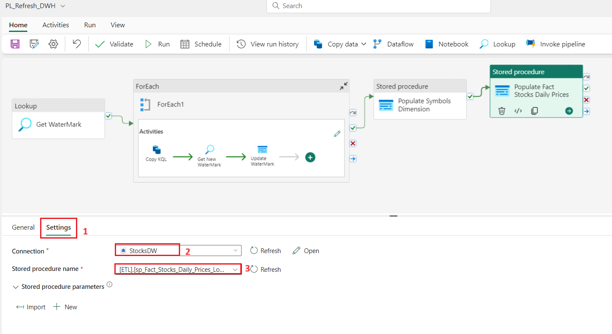

## 작업 8. 파이프라인 실행하기

1.  ***Run*** 버튼을 클릭하여 파이프라인을 실행하고 파이프라인 실행과
    팩트 및 차원 테이블이 로드되고 있는지 확인하세요.


2.  **Save and run?** 대화 상자에서 **Save and run** 버튼을 클릭하세요.

> 


## 작업 9: 파이프라인 예약하기

1.  다음으로 파이프라인을 주기적으로 실행하도록 예약합니다. 이는
    비즈니스 사례에 따라 다르지만 자주(몇 분마다) 또는 하루 종일 실행할
    수 있습니다.

> **참고**: 이 특정 사례의 경우 하루에 약 700만 개의 행이 발생하고 KQL은
> 쿼리 결과를 500만 개로 제한하므로 파이프라인을 최신 상태로 유지하려면
> 하루에 최소 두 번 실행해야 합니다.

2.  파이프라인을 예약하려면 *Run* 버튼 옆에 있는 ***Schedule*** 버튼을
    클릭하고 매시간 또는 몇 분마다 등의 반복 일정을 설정하세요.


# 연습 3: 시맨틱 모델링

마지막 단계는 시맨틱 모델을 만들고 Power BI에서 데이터를 확인하여
데이터를 운영화하는 것입니다.

## 작업 1: 시맨틱 모델 만들기

시맨틱 모델은 개념적으로 비즈니스 분석에서 사용할 수 있도록 데이터를
추상화한 것입니다. 일반적으로 Power BI에서 사용되는 시맨틱 모델을 통해
데이터 웨어하우스에 데이터를 노출합니다. 기본 수준에서는 테이블 간의
관계를 포함합니다.

*참고: Power BI 데이터세트는 최근 시맨틱 모델로 이름이 변경되었습니다.
경우에 따라 레이블이 업데이트되지 않았을 수 있습니다. 이 용어는 서로
바꿔서 사용할 수 있습니다. 이 변경 사항에 대한 자세한 내용은 [Power BI
블로그에서](https://powerbi.microsoft.com/en-us/blog/datasets-renamed-to-semantic-models/)
읽어 보세요.*

우리의 데이터 웨어하우스를 만들 때 기본 시맨틱 모델이 자동으로
만들어졌습니다. Power BI에서 이를 활용할 수 있지만, 여기에는 필요하지
않을 수 있는 테이블 아티팩트도 많이 포함되어 있습니다. 따라서 팩트
테이블과 2차원 테이블만으로 새 시멘틱 모델을 만들겠습니다.

1.  **PL_Refresh_DWH** 페이지의 왼쪽 탐색 메뉴에서 **StockDW를**
    클릭하세요.


2.  아래 이미지와 같이 **Refresh** 아이콘을 클릭하세요.


3.  StockDW 페이지에서 ***Reporting*** 탭을 선택한 다음 ***New Semantic
    Model을*** 선택하세요.

> 

4.  New semantic model 탭에서 이름을 ***StocksModel로*** 입력하고 사실
    및 차원 테이블, ***fact_Stocks_Daily_Prices*, *dim_Date*,
    and *dim_Symbol***만 선택하세요. **Confirm** 버튼을 클릭하세요.


## 작업 2. 관계 추가

1.  **StockDW** 페이지의 왼쪽 탐색 메뉴에서 **RealTimeWorkspace를**
    클릭하고 **StockModel을** 선택하세요.


2.  위의 시맨틱 모델을 만들면 모델 디자이너가 자동으로 열립니다. 그렇지
    않거나 나중에 디자이너로 돌아가려면 작업 공간의 리소스 목록에서
    모델을 연 다음 시맨틱 모델 항목에서 ***Open Data Model을*** 선택하면
    됩니다.


3.  팩트 테이블과 차원 테이블 간에 관계를 만들려면 팩트 테이블의 키를
    차원 테이블의 해당 키로 끌어다 놓으세요.

4.  이 데이터 모델의 경우 서로 다른 테이블에 있는 데이터를 기반으로
    보고서 및 시각화를 만들 수 있도록 서로 다른 테이블 간의 관계를
    정의해야 합니다. **fact_Stocks_Daily_Prices** 테이블에서
    **PriceDateKey** 필드를 **dim_Date** 테이블의 **DateKey** 필드에
    끌어 놓아 관계를 만드세요. **New relationship** 대화 상자가
    나타납니다.

> 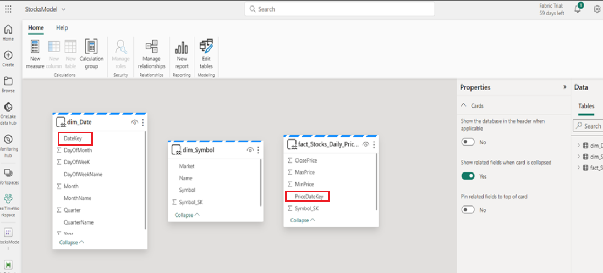

5.  **New relationship** 대화 상자에서:

- **From** Table은 fact_Stocks_Daily_Prices와 **PriceDateKey** 열로
  채워집니다**.**

- **To** table은 dim_Date와 DateKey의 열로 채워집니다.

- Cardinality: **다대일(\*:1)**

- 교차 필터 방향: **단일**

- **Make this relationship active**  옆의 상자를 선택된 상태로 두세요.

- **OK를** 선택하세요**.**


6.  **fact_Stocks_Daily_Prices** 테이블에서 **Symbol_SK** 필드를
    **dim_Symbol** 테이블의 **Symbol_SK** 필드에 끌어 놓아 관계를
    만드세요. **New relationship** 대화 상자가 나타납니다.


7.  **New relationship** 대화 상자에서:

- **From** table은 fact_Stocks_Daily_Prices와 **Symbol_Sk** 열로
  채워집니다**.**

- **To** table은 dim_Symabol과 Symbol_Sk 열로 채워집니다.

- Cardinaity: **다대일(\*:1)**

- 교차 필터 방향: **단일**

- **Make this relationship active**  옆의 상자를 선택된 상태로 두세요.

- **Ok를** 선택하세요**.**


## 작업 3. 간단한 보고서 만들기

1.  ***New Report를*** 클릭하여 Power BI에서 시맨틱 모델을 로드하세요.

> 

2.  아직 보고서를 만들기에는 데이터가 많지 않지만, 개념적으로는 아래와
    유사한 보고서를 만들 수 있으며, 이는 실험실이 일주일 정도 실행된
    후의 보고서를 보여줍니다(더 흥미로운 보고서를 만들기 위해 추가
    기록을 가져올 수 있는 Data Lakehouse 모듈이 있습니다). 위쪽 차트는
    매일 각 주식의 종가를 표시하고 아래쪽 차트는 WHO 주식의
    고가/저가/종가를 표시합니다.

3.  **Power BI** 페이지의 **Visualizations에서 Line chart** 아이콘을
    클릭하여 보고서에 **Column chart를** 추가하세요.

- **Data pane**에서 **fact_Stocks_Daily_Prices를** 확장하고
  **PriceDateKey** 옆의 확인란을 선택하세요. 그러면 열 차트가 만들어지고
  필드가 **X축에** 추가됩니다.

- **Data pane**에서 **fact_Stocks_Daily_Prices를** 확장하고
  **ClosePrice** 옆의 확인란을 선택하세요. 그러면 필드가 **Y축에**
  추가됩니다**.**

- **Data pane**에서 **dim_Symbol을** 확장하고 **Symbol** 옆의 확인란을
  선택하세요. 그러면 **Legend에** 필드가 추가됩니다.


4.  Ribbon에서 **파일** \> **저장을** 선택하세요**.**


5.  Save your report 대화 상자에서 +++ **semantic report** +++를 보고서
    이름으로 입력하고 **your workspace을** 선택하세요. **Save 버튼을**
    클릭하세요.

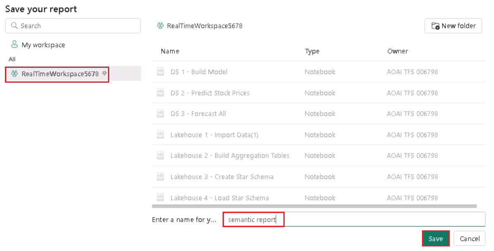


## **요약**

이 실습에서는 Fabric 작업 공간에서 Synapse Data Warehouse를 구성하고
데이터 처리를 위한 강력한 데이터 파이프라인을 구축했습니다. 이
실습에서는 Synapse Data Warehouse를 생성하는 것으로 시작한 다음 데이터
변환에 필요한 스테이징 및 ETL 개체를 생성했습니다. Dataflow를 효율적으로
관리하기 위해 스키마, 테이블, 저장 절차 및 데이터 파이프라인을
만들었습니다.

그런 다음 분석 목적으로 데이터를 효과적으로 구성하는 데 필수적인 차원 및
팩트 테이블을 작성하는 방법을 살펴봤습니다. 일일 주가, 기호 세부 정보 및
날짜 정보를 저장하기 위한 테이블을 만들었습니다. 또한 관련 데이터로 차원
테이블을 로드하고 일일 주가로 팩트 테이블을 채우는 절차도 개발했습니다.

필수 팩트 및 차원 테이블에 초점을 맞춘 시맨틱 모델을 Synapse Data
Warehouse에서 만들었습니다. 'StocksModel'이라는 시맨틱 모델을 설정한 후,
일관된 데이터 분석이 가능하도록 fact_Stocks_Daily_Prices 테이블과
dim_Date 및 dim_Symbol 테이블 간의 관계를 설정했습니다. 전반적으로 이
실습에서는 데이터 웨어하우스 환경 설정과 분석을 위한 안정적인 데이터
파이프라인 구축에 대한 포괄적인 이해를 제공합니다.
