# Laboratorio 05: Creación de un Data Warehouse mediante Data Pipelines

**Introducción**

En este laboratorio, construirá un Synapse Data Warehouse dentro de
Microsoft Fabric para agregar datos de la base de datos KQL. En
Microsoft Fabric, hay dos formas principales de construir un almacén de
datos: utilizando un Synapse Data Warehouse, el enfoque de este módulo,
y un Lakehouse.

Un Synapse Data Warehouse almacena sus datos en OneLake en formato
Delta/Parquet similar a las tablas Lakehouse. Sin embargo, sólo Synapse
Data Warehouse ofrece lectura / escritura en el punto final de T-SQL. Si
está migrando un Data Warehouse o está más familiarizado con el
desarrollo T-SQL, el uso de un Synapse Data Warehouse es una opción
lógica.

Tanto si elige un Data Lakehouse como un Synapse Data Warehouse, los
objetivos finales son similares: disponer de datos altamente curados
para dar soporte a los requisitos de análisis empresarial. A menudo,
esto se hace en un esquema en estrella con tablas de dimensiones y
hechos. Estas tablas sirven como única fuente de verdad para la empresa.

Los datos de nuestra aplicación de ejemplo se transmiten actualmente a
un ritmo de 1 solicitud por segundo por símbolo bursátil, lo que da como
resultado 86.400 valores diarios para cada acción. Para los fines de
nuestro almacén, reduciremos esta cantidad a valores diarios que
incluyan un máximo diario, un mínimo diario y el precio de cierre de
cada acción. Esto reduce el número de filas.

En nuestro proceso ETL (extraer, transformar y cargar), extraeremos
todos los datos que aún no se hayan importado, según determine la marca
de agua actual en una tabla de preparación. A continuación, estos datos
se resumirán y se colocarán en las tablas de dimensiones/hechos. Tenga
en cuenta que, aunque sólo estamos importando una tabla (precios de las
acciones), el marco que estamos construyendo admite la ingesta de
múltiples tablas.

**Objetivos**

- Crear un Synapse Data Warehouse dentro del espacio de trabajo de
  Fabric y cree objetos esenciales de staging y ETL para facilitar el
  procesamiento y la transformación de los datos.

- Crear una canalización de datos para extraer, transformar y cargar
  (ETL) datos de forma eficaz desde los sistemas de origen al Synapse
  Data Warehouse, garantizando la precisión y coherencia de los datos.

- Crear tablas de dimensiones y hechos dentro del almacén de datos para
  organizar y almacenar datos estructurados de forma eficaz con fines
  analíticos.

- Implantar procedimientos para cargar datos de forma incremental en el
  almacén de datos, garantizando la gestión eficaz de grandes conjuntos
  de datos al tiempo que se mantiene la integridad de los mismos.

- Crear vistas para apoyar la agregación de datos durante el proceso
  ETL, optimizando el procesamiento de datos y mejorando el rendimiento
  de la canalización.

- Crear un modelo semántico en Synapse Data Warehouse, defina las
  relaciones entre tablas y genere un informe de Power BI para la
  visualización de datos.

# Ejercicio 1: Configurar almacén y canalización

## Tarea 1: Crear un Synapse Data Warehouse en el espacio de trabajo de Fabric.

Para empezar, primero crearemos el Synapse Data Warehouse en nuestro
espacio de trabajo.

1.  Haga clic en el **icono Real-time Analytics** en la parte inferior
    izquierda de la página, navegue y haga clic en **Data Warehouse**
    como se muestra en la imagen inferior.

      

2.  Seleccione el mosaico ***Warehouse*** para crear un nuevo Synapse
    Data Warehouse.

       

3.  En el cuadro de diálogo **New warehouse**, introduzca
    ***+++StocksDW+++*** como nombre y haga clic en el botón **Create**.
       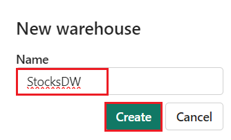

4.  El almacén está prácticamente vacío.

       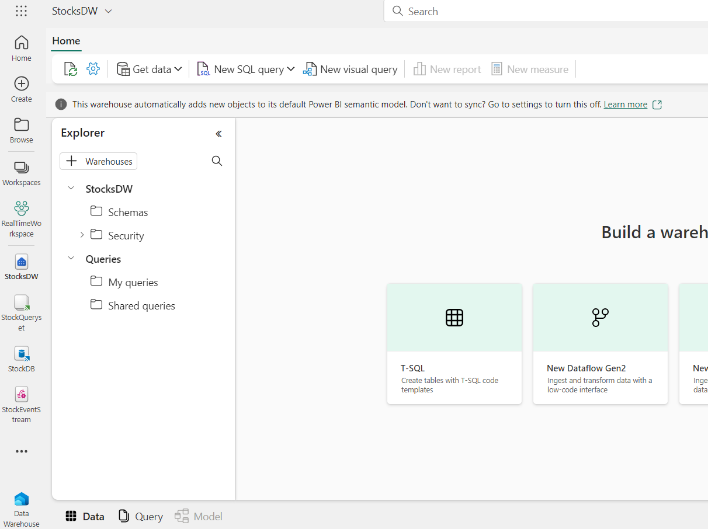

5.  Haga clic en el menú desplegable **New SQL query** de la barra de
    comandos y, a continuación, seleccione **New SQL query** en la
    sección **Blank**. Empezaremos a construir nuestro esquema en la
    siguiente tarea.

       

## Tarea 2: Crear los objetos staging y ETL

1.  Ejecute la siguiente consulta que crea las tablas de preparación que
    contendrán los datos durante el proceso ETL (Extraer, Transformar y
    Cargar). Esto también creará los dos esquemas utilizados: **stg** y
    **ETL**; los esquemas ayudan a agrupar las cargas de trabajo por tipo
    o función. El esquema *stg* es para la puesta en escena y contiene
    tablas intermedias para el proceso ETL. El esquema *ETL* contiene
    consultas utilizadas para el movimiento de datos, así como una única
    tabla para el seguimiento del estado.

2.  Tenga en cuenta que la fecha de inicio de la marca de agua se elige
    arbitrariamente como una fecha anterior (1/1/2022), para garantizar
    que se capturan todos los datos; esta fecha se actualizará en cada
    ejecución correcta.

3.  En el editor de consultas, copie y pegue el siguiente código. Haga
    clic en el botón **Run** para ejecutar la consulta. Una vez
    ejecutada la consulta, verá los resultados.
```
/* 1 - Create Staging and ETL.sql */

-- STAGING TABLES
CREATE SCHEMA stg
GO

CREATE TABLE stg.StocksPrices
(
   symbol VARCHAR(5) NOT NULL
   ,timestamp VARCHAR(30) NOT NULL
   ,price FLOAT NOT NULL
   ,datestamp VARCHAR(12) NOT NULL
)
GO

-- ETL TABLES
CREATE SCHEMA ETL
GO
CREATE TABLE ETL.IngestSourceInfo
(
    ObjectName VARCHAR(50) NOT NULL
    ,WaterMark DATETIME2(6)
    ,IsActiveFlag VARCHAR(1)
)

INSERT [ETL].[IngestSourceInfo]
SELECT 'StocksPrices', '1/1/2022 23:59:59', 'Y'
```
   
      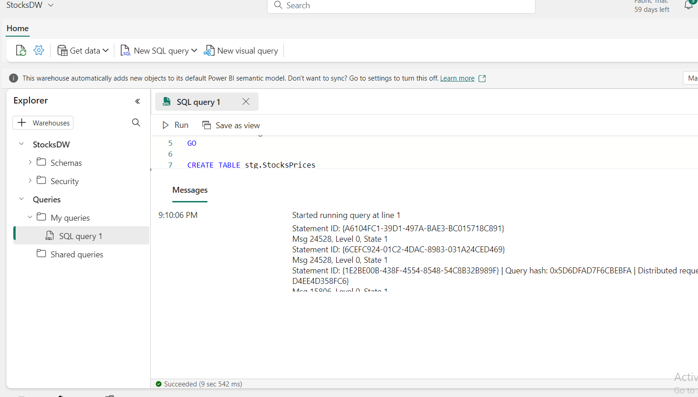
 
4.  Cambie el nombre de la consulta como referencia. Haga clic con el
    botón derecho en la **consulta SQL 1** en **el Explorer** y
    seleccione **Rename**.

      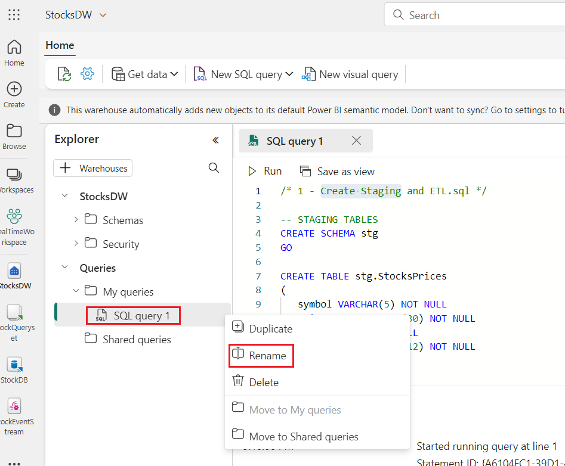

5.  En el cuadro de diálogo **Rename**, en el campo **Name**, introduzca
    **+++Create stocks and metadata+++** y, a continuación, haga clic
    en el botón **Rename**.

     

6.  Haga clic en el menú desplegable **New SQL query** de la barra de
    comandos y, a continuación, seleccione **New SQL query** en la
    sección **Blank**. Empezaremos a construir nuestro esquema en el
    siguiente paso:

      

7.  El procedimiento *sp_IngestSourceInfo_Update* actualiza la marca de
    agua; esto asegura que estamos haciendo un seguimiento de los
    registros que ya han sido importados

8.  En el editor de consultas, copie y pegue el siguiente código. Haga
    clic en el botón **Run** para ejecutar la consulta. Una vez
    ejecutada la consulta, verá los resultados.
```
/* 1 - Create Staging and ETL.sql */

CREATE PROC [ETL].[sp_IngestSourceInfo_Update]
@ObjectName VARCHAR(50)
,@WaterMark DATETIME2(6)
AS
BEGIN

UPDATE [ETL].[IngestSourceInfo]
    SET WaterMark = @WaterMark
WHERE 
    ObjectName  = @ObjectName

END

GO
```
  
     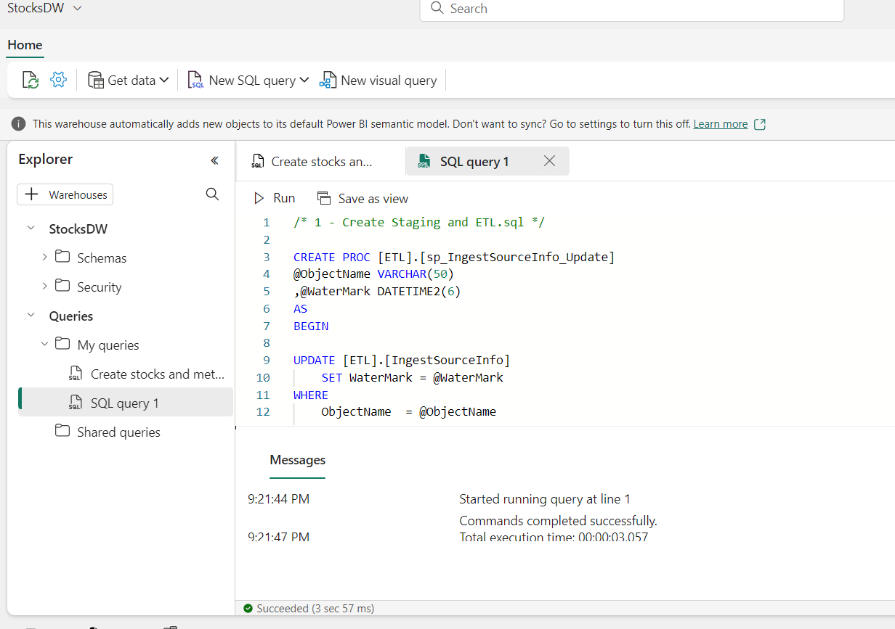
6.  Cambie el nombre de la consulta para poder consultarla más tarde.
    Haga clic con el botón derecho en **SQL query 1** en **el Explorer**
    y seleccione **Rename**.
      

7.  En el cuadro de diálogo **Rename**, en el campo **Name**, introduzca
    **+++ETL.sql_IngestSource+++** y, a continuación, haga clic en el
    botón **Rename**.

     

Esto debería parecerse a:
    

## Tarea 3: Crear el Data Pipeline

1.  En la página **StockDW**, haga clic en **RealTimeWorkspace**
    Workspace en el menú de navegación de la izquierda.

     

2.  En la página de inicio **de Synapse Data Warehouse
    RealTimeWorkhouse**, en **RealTimeWorkhouse**, haga clic en **+New**
    y, a continuación, seleccione **Data pipeline.**

      

3.  Aparecerá un cuadro de diálogo **New pipeline**, en el campo
    **Name**, introduzca +++ PL_Refresh_DWH+++ y haga clic en el botón
    **Create.**

     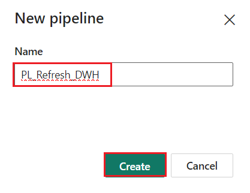

4.  En la página **PL_Refresh_DWH**, vaya a **Build a data pipeline to
    organize and move your data** sección y haga clic en **Pipeline
    activity**.

      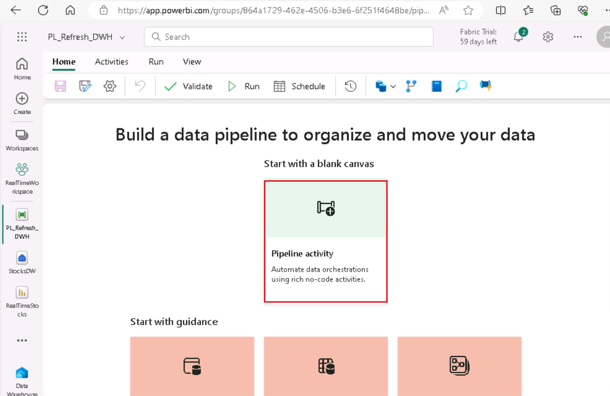

5.  A continuación, navegue y seleccione Actividad de ***Lookup*** como
    se muestra en la siguiente imagen.

      

6.  En la pestaña **General**, en el **campo Name,** introduzca
    **+++Get WaterMark+++**

       

7.  Haga clic en la pestaña **Settings**, introduzca los siguientes
    datos como se muestra en la siguiente imagen.

| **Connection** | Haga clic en el menú desplegable y seleccione **StocksDW** de la lista. |
|----|----|
| **Use query** | **Consulta** |
| **Query** | +++SELECT * FROM [ETL].[IngestSourceInfo] WHERE IsActiveFlag = 'Y'+++ |
| **First row only** | **sin marcar** |
    

## Tarea 4: Construir la actividad ForEach

Esta tarea se centra en la construcción de múltiples actividades dentro
de una única actividad ForEach. La actividad ForEach es un contenedor
que ejecuta actividades secundarias como grupo: en este caso, si
tuviéramos varias fuentes de las que extraer datos, repetiríamos estos
pasos para cada fuente de datos.

1.  En el cuadro **Lookup - Get WaterMark**, navegue y haga clic en la
    flecha derecha para **Add an activity**. Luego, navegue y seleccione
    ***ForEach*** activity como se muestra en la siguiente imagen.

      

2.  Haga clic en la ficha **Settings**, introduzca los elementos como
    +++@activity('Get WaterMark').output.value+++

El aspecto debería ser similar al de la imagen siguiente:

     

3.  En el cuadro *ForEach*, haga clic en el símbolo más (+) para añadir
    una nueva actividad.

      

4.  Seleccione y añada una actividad **Copy Data** dentro de
    **ForEach.**

     

5.  Seleccione el icono **Copy data1** Actividad, en la pestaña
    **General**, en el **campo Name,** introduzca +++Copy KQL+++

      

6.  Haga clic en la pestaña **Source**, introduzca la siguiente
    configuración.

<table>
<colgroup>
<col style="width: 36%" />
<col style="width: 63%" />
</colgroup>
<thead>
<tr class="header">
<th><strong>Connection</strong></th>
<th>Seleccione <strong>StocksDB</strong> en el menú desplegable.</th>
</tr>
</thead>
<tbody>
<tr class="odd">
<td><strong>Use query</strong></td>
<td><strong>Query</strong></td>
</tr>
<tr class="even">
<td><strong>Query</strong></td>
<td><p>+++@concat('StockPrice  
    | where todatetime(timestamp) >= todatetime(''', item().WaterMark,''') 
    | order by timestamp asc
    | extend datestamp = substring(timestamp,0,10) 
    | project symbol, timestamp, price, datestamp 
    | take 500000 
    | where not(isnull(price))
    ' )
</p></td>
</tr>
</tbody>
</table>

La pestaña *Source* de la actividad debería tener un aspecto similar a:


7.  Haga clic en la pestaña **Destino** e introduzca los siguientes
    parámetros

| **Connection**   | seleccione **StocksDW** de la lista. |
|------------------|--------------------------------------|
| **Table option** | **Use existing**                     |
| **Table**        | stg.StocksPrices                     |

- En la sección *Avanzadas*, introduzca el siguiente ***script de
  precopia*** para truncar la tabla antes de cargar la tabla de
  preparación:

> **+++delete stg.StocksPrices+++**

Este paso elimina primero los datos antiguos de la tabla de preparación
y, a continuación, copia los datos de la tabla KQL, seleccionando los
datos de la última marca de agua e insertándolos en la tabla de
preparación. El uso de una marca de agua es importante para evitar el
procesamiento de toda la tabla; además, las consultas KQL tienen un
recuento de filas máximo de 500.000 filas. Dado el ritmo actual de
ingesta de datos, esto equivale aproximadamente a 3/4 de un día.

La pestaña **Destination** de la actividad debería tener el siguiente
aspecto:
     

8.  En el cuadro **ForEach**, haga clic en el símbolo más **(+)**, navegue
    y seleccione Actividad de **Lookup**.

     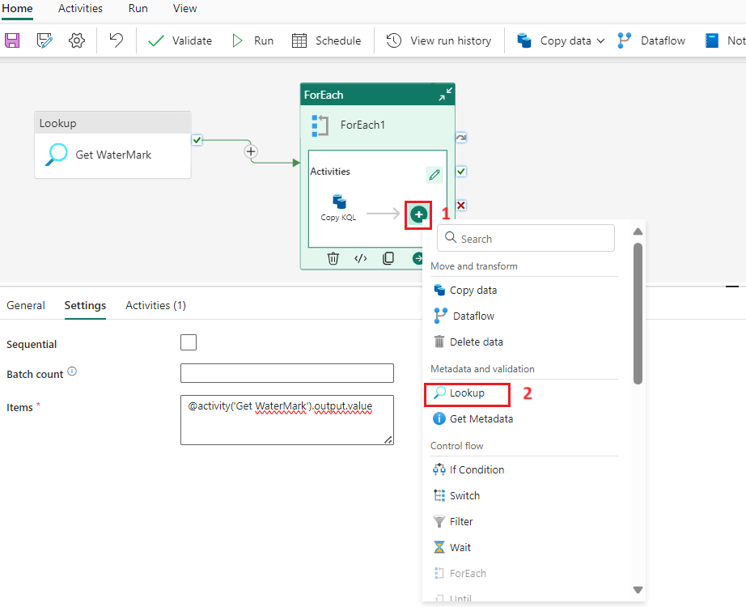

9.  Haga clic en el icono **Lookup1**, en la pestaña **General**,
    **campo Name,** introduzca +++Get new WaterMark+++

      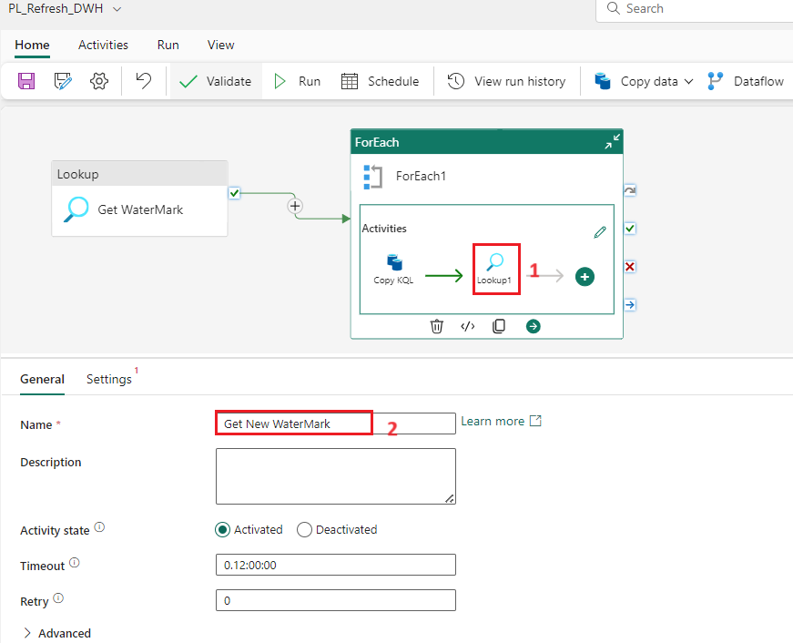

10. Haga clic en la pestaña **Configuración** e introduzca los
    siguientes parámetros

| **Connection** | seleccione **StocksDW** de la lista. |
|----|----|
| **Use query** | **Query** |
| **Query** | +++@concat('Select Max(timestamp) as WaterMark from stg.', item().ObjectName)+++ |
      

11. En el cuadro **ForEach**, haga clic en el símbolo más **(+)**, navegue
    y seleccione **Stored Procedure** activity.

      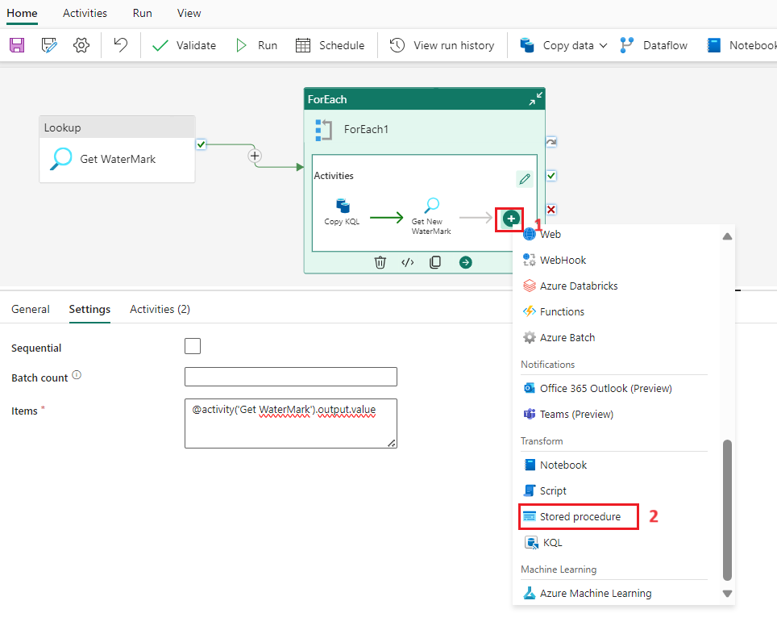

12. Haga clic en el icono **Stored procedure**. En la pestaña
    **General**, en el **campo Name,** introduzca +++Update
    WaterMark+++.

      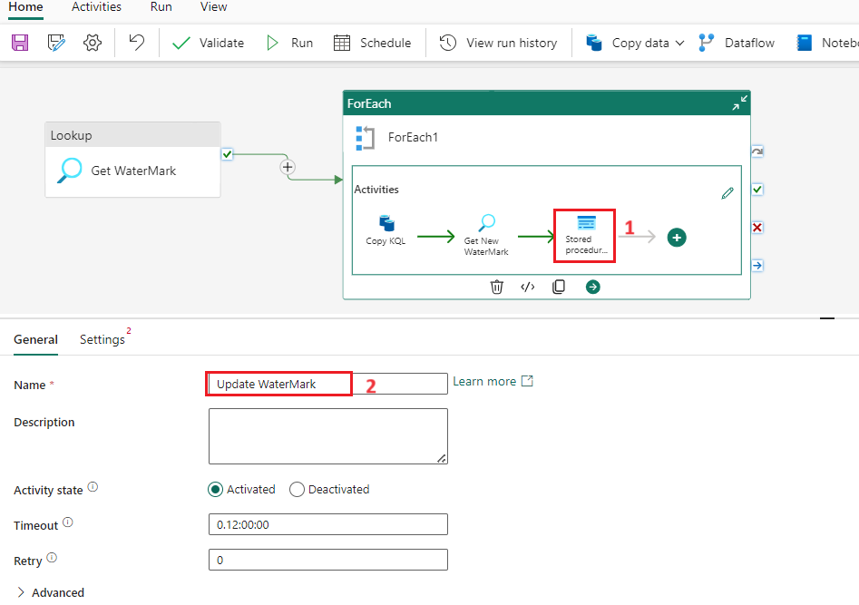

13. Haga clic en la pestaña **Settings** e introduzca los siguientes
    parámetros.

| **Workspace**             | **StocksDW**                   |
|---------------------------|--------------------------------|
| **Stored procedure name** | ETL.sp_IngestSourceInfo_Update |

- Parámetros (haga clic en **Importar** para añadir automáticamente los
  nombres de los parámetros):

| **Nombre** | **Tipo** | **Valor** |
|----|----|----|
| ObjectName | String | @item().ObjectName |
| WaterMark | DateTime | @activity('Get New WaterMark').output.firstRow.WaterMark |
    

## Tarea 5: Probar la pipeline

1.  En la pestaña ***Home*** del pipeline, seleccione ***Run***.
     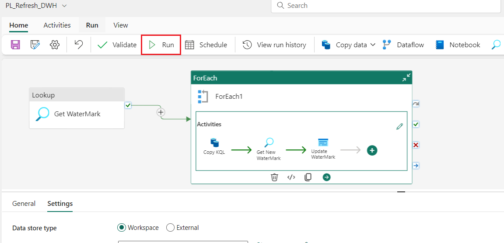
2.  En el cuadro de diálogo **Save and run?**, haga clic en el botón
    **Save and run**
      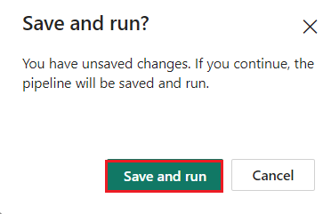

3.  Esto le pedirá que primero guarde el pipeline, y luego lo valide
    para encontrar cualquier error de configuración. Esta ejecución
    inicial tardará unos instantes y copiará los datos en la tabla de
    preparación.

      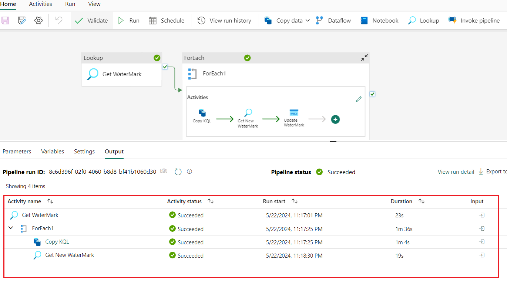

4.  En la página **PL_Refresh_DWH**, haga clic en **RealTimeWorkspace**
    Workspace en el menú de navegación de la izquierda.

       

5.  Pulse el botón **Refresh**.

      

6.  En el almacén de datos, los datos deben ser visibles en la tabla de
    preparación. Dentro del Data Warehouse, al seleccionar una tabla se
    mostrará una vista previa de los datos de la tabla. Haga clic en
    StocksDW en el menú de navegación de la izquierda, luego haga clic
    en o **Schemas** en el Explorer. En Schemas, navegue y haga clic en
    **stg**, luego haga clic en **StocksPrices** como se muestra en la
    siguiente imagen.

       
7.  Haga clic en el menú desplegable **New SQL query** de la barra de
    comandos y, a continuación, seleccione**New SQL query** en la
    sección **Blank**. Empezaremos a construir nuestro esquema en el
    siguiente paso:

      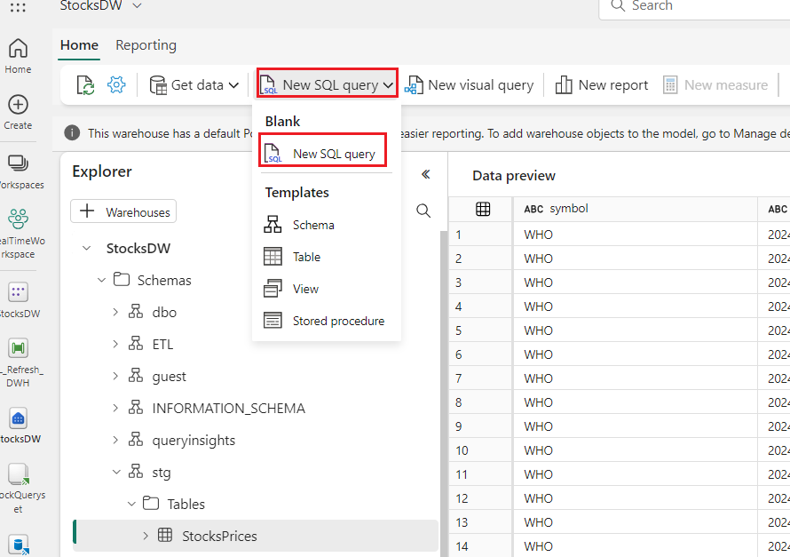

8.  Mientras estamos en el almacén de datos, ejecute la secuencia de
    comandos a continuación en una nueva ventana de consulta SQL para
    restablecer el proceso de ingestión. A menudo es útil en el
    desarrollo tener un script de reinicio para permitir pruebas
    incrementales. Esto restablecerá la fecha y eliminará los datos de
    la tabla de preparación.

> **Nota:** Aún no hemos creado la tabla de hechos o dimensiones, pero
> el script debería funcionar.*

9.  En el editor de consultas, copie y pegue el siguiente código. Haga
    clic en el botón **Run** para ejecutar la consulta. Una vez
    ejecutada la consulta, verá los resultados.
```    
-- Ejecutar esto para 'RESET' las tablas de ingestión

exec ETL.sp_IngestSourceInfo_Update 'StocksPrices', '2022-01-01 23:59:59.000000'
exec ETL.sp_IngestSourceInfo_Update 'StocksPrices', '2022-01-01 23:59:59.000000'
GO

IF (EXISTS (SELECT * FROM INFORMATION_SCHEMA.TABLES 
    WHERE TABLE_SCHEMA = 'stg' AND TABLE_NAME = 'StocksPrices'))
BEGIN
    delete stg.StocksPrices
END
GO

IF (EXISTS (SELECT * FROM INFORMATION_SCHEMA.TABLES 
    WHERE TABLE_SCHEMA = 'dbo' AND TABLE_NAME = 'fact_Stocks_Daily_Prices'))
BEGIN
    delete dbo.fact_Stocks_Daily_Prices
END
GO

IF (EXISTS (SELECT * FROM INFORMATION_SCHEMA.TABLES 
    WHERE TABLE_SCHEMA = 'dbo' AND TABLE_NAME = 'dim_Symbol'))
BEGIN
    delete dbo.dim_Symbol
END
GO
```
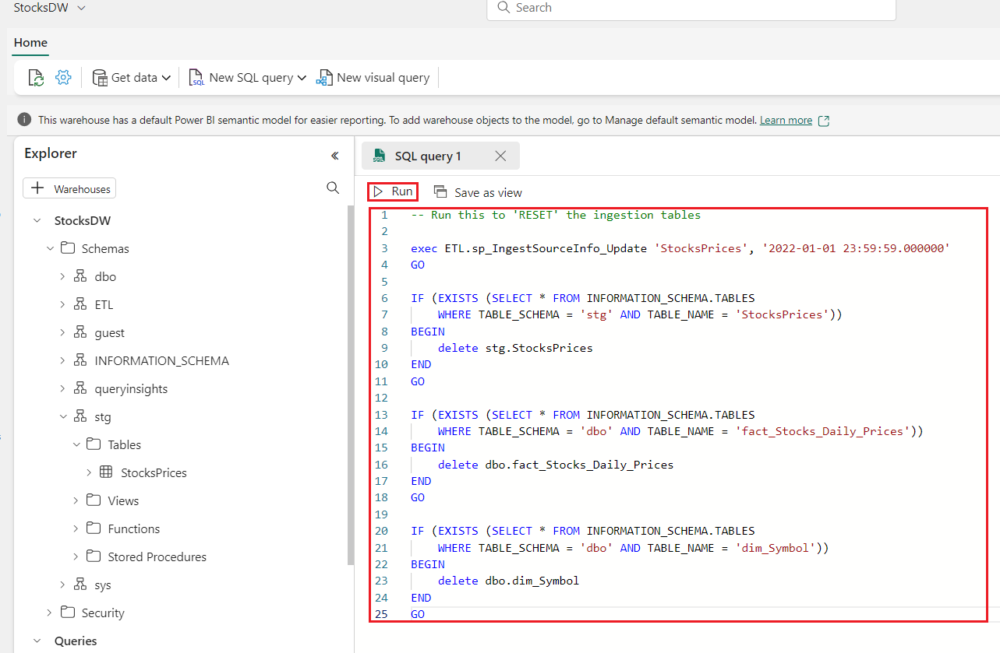


# Ejercicio 2: Construir Star Schema

Para la dimensión fecha, cargaremos valores suficientes para el futuro
inmediato. Las dimensiones de fecha son bastante similares en todas las
implementaciones y suelen contener detalles específicos de la fecha: el
día de la semana, el mes, el trimestre, etc.

Para la dimensión Símbolo, la cargaremos de forma incremental durante la
canalización. De este modo, si se añaden nuevas acciones en algún
momento, se añadirán a la tabla de dimensión Símbolo durante la
ejecución de la canalización. La dimensión Símbolo contiene detalles
adicionales sobre cada símbolo, como el nombre de la empresa, el mercado
de valores en el que cotiza, etc.

También crearemos vistas para facilitar la carga de datos desde la tabla
de preparación, agregando el precio mínimo, máximo y de cierre de la
acción.

## Tarea 1: Crear las tablas de dimensiones y de hechos

1.  Haga clic en el menú desplegable **New SQL query**  de la barra de
    comandos y, a continuación, seleccione **New SQL query**  en la
    sección **Blank**. Empezaremos a construir nuestro esquema en el
    siguiente paso.

       

2.  En nuestro data warehouse, ejecute el siguiente SQL para crear las
    tablas de hechos y dimensiones. Al igual que en el paso anterior,
    puede ejecutar este ad-hoc o crear una consulta SQL para guardar la
    consulta para su uso futuro.

3.  En el editor de consultas, copie y pegue el siguiente código. Haga
    clic en el botón **Run** para ejecutar la consulta. Una vez
    ejecutada la consulta, verá los resultados.
```
/* 2 - Create Dimension and Fact tables.sql */

-- Dimensions and Facts (dbo)
CREATE TABLE dbo.fact_Stocks_Daily_Prices
(
   Symbol_SK INT NOT NULL
   ,PriceDateKey DATE NOT NULL
   ,MinPrice FLOAT NOT NULL
   ,MaxPrice FLOAT NOT NULL
   ,ClosePrice FLOAT NOT NULL
)
GO

CREATE TABLE dbo.dim_Symbol
(
    Symbol_SK INT NOT NULL
    ,Symbol VARCHAR(5) NOT NULL
    ,Name VARCHAR(25)
    ,Market VARCHAR(15)
)
GO

CREATE TABLE dbo.dim_Date 
(
    [DateKey] DATE NOT NULL
    ,[DayOfMonth] int
    ,[DayOfWeeK] int
    ,[DayOfWeekName] varchar(25)
    ,[Year] int
    ,[Month] int
    ,[MonthName] varchar(25)
    ,[Quarter] int
    ,[QuarterName] varchar(2)
)
GO
```
  
    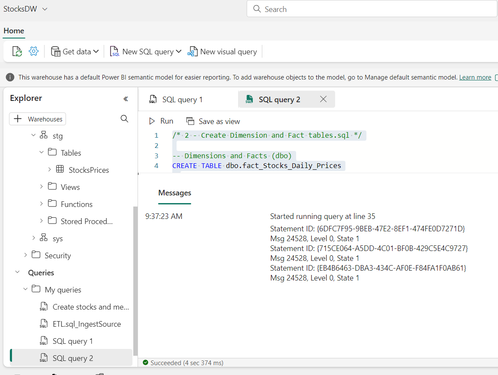

4.  Cambie el nombre de la consulta como referencia. Haga clic con el
    botón derecho en **SQL query** en el Explorer y seleccione
    **Rename**.


5.  En el cuadro de diálogo **Rename**, en el campo **Name**, introduzca
    Create Dimension and Fact tables**+++** y, a continuación, haga clic
    en el botón **Rename**.


## Tarea 2: Cargar la dimensión fecha

1.  Haga clic en ***New SQL query*** en la parte superior de la ventana.
    Haga clic en el menú desplegable ***New SQL query*** de la barra de
    comandos y, a continuación, seleccione ***New SQL query***  en la
    sección **Blank**. Empezaremos a construir nuestro esquema en el
    siguiente paso:


2.  La dimensión fecha es diferenciada; puede cargarse una vez con todos
    los valores que necesitaríamos. Ejecute el siguiente script, que
    crea un procedimiento para rellenar la tabla de dimensión fecha con
    un amplio rango de valores.

3.  En el editor de consultas, copie y pegue el siguiente código. Haga
    clic en el botón **Run** para ejecutar la consulta. Una vez
    ejecutada la consulta, verá los resultados.

> **Copie**

/\* 3 - Load Dimension tables.sql \*/

CREATE PROC \[ETL\].\[sp_Dim_Date_Load\]

@BeginDate DATE = NULL

,@EndDate DATE = NULL

AS

BEGIN

SET @BeginDate = ISNULL(@BeginDate, '2022-01-01')

SET @EndDate = ISNULL(@EndDate, DATEADD(year, 2, GETDATE()))

DECLARE @N AS INT = 0

DECLARE @NumberOfDates INT = DATEDIFF(day,@BeginDate, @EndDate)

DECLARE @SQL AS NVARCHAR(MAX)

DECLARE @STR AS VARCHAR(MAX) = ''

WHILE @N \<= @NumberOfDates

BEGIN

SET @STR = @STR + CAST(DATEADD(day,@N,@BeginDate) AS VARCHAR(10))

IF @N \< @NumberOfDates

BEGIN

SET @STR = @STR + ','

END

SET @N = @N + 1;

END

SET @SQL = 'INSERT INTO dbo.dim_Date (\[DateKey\]) SELECT CAST(\[value\]
AS DATE) FROM STRING_SPLIT(@STR, '','')';

EXEC sys.sp_executesql @SQL, N'@STR NVARCHAR(MAX)', @STR;

UPDATE dbo.dim_Date

SET

\[DayOfMonth\] = DATEPART(day,DateKey)

,\[DayOfWeeK\] = DATEPART(dw,DateKey)

,\[DayOfWeekName\] = DATENAME(weekday, DateKey)

,\[Year\] = DATEPART(yyyy,DateKey)

,\[Month\] = DATEPART(month,DateKey)

,\[MonthName\] = DATENAME(month, DateKey)

,\[Quarter\] = DATEPART(quarter,DateKey)

,\[QuarterName\] = CONCAT('Q',DATEPART(quarter,DateKey))

END

GO


4.  Desde la misma ventana de consulta, ejecute el procedimiento
    anterior ejecutando el siguiente script.

> **Copie**

/\* 3 - Load Dimension tables.sql \*/

Exec ETL.sp_Dim_Date_Load


5.  Cambie el nombre de la consulta como referencia. Haga clic con el
    botón derecho en **SQL query** en el Explorador y seleccione
    **Rename.**


6.  En el cuadro de diálogo **Rename**, en el campo **Name**, introduzca
    +++ **Load Dimension tables +++** y, a continuación, haga clic en el
    botón **Rename.**


## Tarea 3: Crear el procedimiento para cargar la dimensión Símbolo

1.  Haga clic en el menú desplegable ***New*** ***SQL Query*** de la
    barra de comandos y, a continuación, seleccione ***New*** ***SQL
    Query*** en la sección **Blank**. Empezaremos a construir nuestro
    esquema en el siguiente paso.


2.  De forma similar a la dimensión fecha, cada símbolo bursátil
    corresponde a una fila de la tabla de dimensión Símbolos. Esta tabla
    contiene detalles de la acción, como el nombre de la empresa y el
    mercado en el que cotiza.

3.  En el editor de consultas, copie y pegue el siguiente código. Haga
    clic en el botón **Run** para ejecutar la consulta. Esto creará el
    procedimiento que cargará la dimensión del símbolo de la acción.
    Ejecutaremos esto en el canal para manejar cualquier acción nueva
    que pueda entrar en el canal.

> **Copia**

/\* 3 - Load Dimension tables.sql \*/

CREATE PROC \[ETL\].\[sp_Dim_Symbol_Load\]

AS

BEGIN

DECLARE @MaxSK INT = (SELECT ISNULL(MAX(Symbol_SK),0) FROM
\[dbo\].\[dim_Symbol\])

INSERT \[dbo\].\[dim_Symbol\]

SELECT

Symbol_SK = @MaxSK + ROW_NUMBER() OVER(ORDER BY Symbol)

, Symbol

, Name

,Market

FROM

(SELECT DISTINCT

sdp.Symbol

, Name = 'Stock ' + sdp.Symbol

, Market = CASE SUBSTRING(Symbol,1,1)

WHEN 'B' THEN 'NASDAQ'

WHEN 'W' THEN 'NASDAQ'

WHEN 'I' THEN 'NYSE'

WHEN 'T' THEN 'NYSE'

ELSE 'No Market'

END

FROM

\[stg\].\[vw_StocksDailyPrices\] sdp

WHERE

sdp.Symbol NOT IN (SELECT Symbol FROM \[dbo\].\[dim_Symbol\])

) stg

END

GO


7.  Cambie el nombre de la consulta como referencia. Haga clic con el
    botón derecho en **SQL query** en el Explorador y seleccione
    **Rename**.


8.  En el cuadro de diálogo **Rename**, en el campo **Name**, introduzca
    +++ **Load the stock symbol dimension +++** y, a continuación, pulse
    el botón **Rename**.


## **Tarea 4: Crear las vistas**

1.  Haga clic en el menú desplegable ***New SQL query*** de la barra de
    comandos y, a continuación, seleccione ***New SQL query*** en la
    sección **Blank**. Empezaremos a construir nuestro esquema en el
    siguiente paso.


2.  Crear vistas que soporten la agregación de los datos durante la
    carga. Cuando se ejecuta la pipeline, los datos se copian de la base
    de datos KQL a nuestra tabla de preparación, donde agregaremos todos
    los datos de cada acción en un precio mínimo, máximo y de cierre
    para cada día.

3.  En el editor de consultas, copie y pegue el siguiente código. Haga
    clic en el botón **Run** para ejecutar la consulta.

/\* 4 - Create Staging Views.sql \*/

CREATE VIEW \[stg\].\[vw_StocksDailyPrices\]

AS

SELECT

Symbol = symbol

,PriceDate = datestamp

,MIN(price) as MinPrice

,MAX(price) as MaxPrice

,(SELECT TOP 1 price FROM \[stg\].\[StocksPrices\] sub

WHERE sub.symbol = prices.symbol and sub.datestamp = prices.datestamp

ORDER BY sub.timestamp DESC

) as ClosePrice

FROM

\[stg\].\[StocksPrices\] prices

GROUP BY

symbol, datestamp

GO

/\*\*\*\*\*\*\*\*\*\*\*\*\*\*\*\*\*\*\*\*\*\*\*\*\*\*\*\*\*\*\*\*\*\*\*\*\*\*/

CREATE VIEW stg.vw_StocksDailyPricesEX

AS

SELECT

ds.\[Symbol_SK\]

,dd.DateKey as PriceDateKey

,MinPrice

,MaxPrice

,ClosePrice

FROM

\[stg\].\[vw_StocksDailyPrices\] sdp

INNER JOIN \[dbo\].\[dim_Date\] dd

ON dd.DateKey = sdp.PriceDate

INNER JOIN \[dbo\].\[dim_Symbol\] ds

ON ds.Symbol = sdp.Symbol

GO


4.  Cambie el nombre de la consulta como referencia. Haga clic con el
    botón derecho en **SQL query** en el Explorer y seleccione
    **Rename**.


5.  En el cuadro de diálogo **Rename**, en el campo **Name**, introduzca
    +++ **Create Staging Views** **+++** y, a continuación, haga clic en
    el botón **Rename**.


## Tarea 5: Añadir actividad para cargar símbolos

1.  En la página **StockDW**, haga clic en **PL_Refresh_DWH** en el menú
    de navegación de la izquierda.


2.  En el pipeline, agregue una nueva actividad ***de Stored
    Procedure*** llamada ***Populate Symbols Dimension*** que ejecuta el
    procedimiento, el cual carga los símbolos de las acciones.

3.  Esto debe conectarse a la salida de éxito de la actividad ForEach
    (no dentro de la actividad ForEach).

>  alt="A screenshot of a computer Description automatically generated" />

4.  En la pestaña **General**, en el **campo Name,** introduzca +++
    **Populate Symbols Dimension** +++

>  alt="A screenshot of a computer Description automatically generated" />

5.  Haga clic en la pestaña **Settings** e introduzca los siguientes
    parámetros.

| **Connection**            | **Workspace**                  |
|---------------------------|--------------------------------|
| **S**tored procedure name | \[ETL\].\[sp_Dim_Symbol_Load\] |


## Tarea 6: Crear el procedimiento para cargar los precios diarios

1.  En la página **PL_Refresh_DWH**, haga clic en **StockDW** en el menú
    de navegación de la izquierda.


2.  Haga clic en el menú desplegable ***New SQL query*** de la barra de
    comandos y, a continuación, seleccione ***New SQL query***  en la
    sección **Blank**. Empezaremos a construir nuestro esquema en el
    siguiente paso.


3.  A continuación, ejecute el siguiente script para crear el
    procedimiento que construye la tabla de hechos. Este procedimiento
    fusiona los datos de la puesta en escena en la tabla de hechos. Si
    el proceso se ejecuta a lo largo del día, los valores se
    actualizarán para reflejar cualquier cambio en el precio mínimo,
    máximo y de cierre.

> **Nota**: Actualmente, el almacén de datos de Fabric no admite la
> sentencia merge T-SQL; por lo tanto, los datos se actualizarán y luego
> se insertarán según sea necesario.

4.  En el editor de consultas, copie y pegue el siguiente código. Haga
    clic en el botón **Run** para ejecutar la consulta.

/\* 5 - ETL.sp_Fact_Stocks_Daily_Prices_Load.sql \*/

CREATE PROCEDURE \[ETL\].\[sp_Fact_Stocks_Daily_Prices_Load\]

AS

BEGIN

BEGIN TRANSACTION

UPDATE fact

SET

fact.MinPrice = CASE

WHEN fact.MinPrice IS NULL THEN stage.MinPrice

ELSE CASE WHEN fact.MinPrice \< stage.MinPrice THEN fact.MinPrice ELSE
stage.MinPrice END

END

,fact.MaxPrice = CASE

WHEN fact.MaxPrice IS NULL THEN stage.MaxPrice

ELSE CASE WHEN fact.MaxPrice \> stage.MaxPrice THEN fact.MaxPrice ELSE
stage.MaxPrice END

END

,fact.ClosePrice = CASE

WHEN fact.ClosePrice IS NULL THEN stage.ClosePrice

WHEN stage.ClosePrice IS NULL THEN fact.ClosePrice

ELSE stage.ClosePrice

END

FROM \[dbo\].\[fact_Stocks_Daily_Prices\] fact

INNER JOIN \[stg\].\[vw_StocksDailyPricesEX\] stage

ON fact.PriceDateKey = stage.PriceDateKey

AND fact.Symbol_SK = stage.Symbol_SK

INSERT INTO \[dbo\].\[fact_Stocks_Daily_Prices\]

(Symbol_SK, PriceDateKey, MinPrice, MaxPrice, ClosePrice)

SELECT

Symbol_SK, PriceDateKey, MinPrice, MaxPrice, ClosePrice

FROM

\[stg\].\[vw_StocksDailyPricesEX\] stage

WHERE NOT EXISTS (

SELECT \* FROM \[dbo\].\[fact_Stocks_Daily_Prices\] fact

WHERE fact.PriceDateKey = stage.PriceDateKey

AND fact.Symbol_SK = stage.Symbol_SK

)

COMMIT

END

GO


6.  Cambie el nombre de la consulta como referencia. Haga clic con el
    botón derecho en **SQL query** en el Explorador y seleccione
    **Rename**.


7.  En el cuadro de diálogo **Rename**, en el campo **Name**, introduzca
    +++
    <span class="mark">ETL.</span>**sp_Fact_Stocks_Daily_Prices_Load+++**
    y, a continuación, haga clic en el botón **Rename**.


## Tarea 7: Añadir actividad al pipeline para cargar los precios diarios de las acciones

1.  En la página **StockDW**, haga clic en **PL_Refresh_DWH** en el menú
    de navegación de la izquierda.


2.  Agregue otra actividad ***Stored Procedure*** a la tubería llamada
    ***Populate Fact Stocks Daily Prices*** que cargue los precios de
    las acciones desde el staging a la tabla de hechos. Conecte la
    salida exitosa de la *Dimensión Populate Symbols* a la nueva
    actividad *Populate Fact Stocks Daily Prices*.

>  alt="A screenshot of a computer Description automatically generated" />
>
>  alt="A screenshot of a computer Description automatically generated" />

3.  Haga clic en la pestaña **Settings** e introduzca los siguientes
    parámetros.

| **Connection**            | Seleccione **StocksDW** en la lista desplegable |
|---------------------------|-------------------------------------------------|
| **Stored procedure name** | \[ETL\].\[sp_Fact_Stocks_Daily_Prices_Load\]    |


## Tarea 8. Ejecutar la pipeline

1.  Ejecute la canalización haciendo clic en el botón ***run*** y
    compruebe que se ejecuta y que se cargan las tablas de hechos y
    dimensiones.


2.  En el cuadro de diálogo **Save and run?**, haga clic en el botón
    **Save and run**

>  alt="A screenshot of a computer Description automatically generated" />


## Tarea 9: Programar la pipeline

1.  A continuación, programe la canalización para que se ejecute
    periódicamente. Esto variará según el caso de negocio, pero podría
    ejecutarse con frecuencia (cada pocos minutos) o a lo largo del día.

> **Nota**: En este caso concreto, como hay unas 700.000 filas al día y
> KQL limita los resultados de la consulta a 500.000, la canalización
> debe ejecutarse al menos dos veces al día para mantenerse actualizada.

2.  Para programar la canalización, haga clic en el botón ***Schedule***
    (junto al botón *Ejecutar*) y establezca una programación periódica,
    por ejemplo, cada hora o cada pocos minutos.


# Ejercicio 3: Modelización semántica

Un último paso consiste en operacionalizar los datos creando un modelo
semántico y visualizando los datos en Power BI.

## Tarea 1: Crear un modelo semántico

Un modelo semántico, conceptualmente, proporciona una abstracción de
nuestros datos para su consumo en análisis de negocio. Normalmente,
exponemos los datos de nuestro almacén de datos a través de un modelo
semántico que se utiliza en Power BI. A un nivel básico, incluirán las
relaciones entre tablas.

*Nota: Los conjuntos de datos de Power BI han pasado a llamarse
recientemente Modelos semánticos. En algunos casos, es posible que las
etiquetas no se hayan actualizado. Los términos pueden utilizarse
indistintamente. Más información sobre este cambio [en el blog de Power
BI](https://powerbi.microsoft.com/en-us/blog/datasets-renamed-to-semantic-models/).*

Cuando creamos nuestro Data Warehouse, se creó automáticamente un modelo
semántico por defecto. Podemos aprovecharlo en Power BI, pero también
incluye muchos artefactos de la tabla que puede que no necesitemos. Por
lo tanto, crearemos un nuevo modelo semántico con sólo nuestras tablas
de hechos y de dos dimensiones.

1.  En la página **PL_Refresh_DWH**, haga clic en **StockDW** en el menú
    de navegación de la izquierda.


2.  Haga clic en el icono de **actualización** como se muestra en la
    siguiente imagen.


3.  En la página StockDW, seleccione la pestaña ***Reporting*** y, a
    continuación, seleccione ***New semantic model***.

>  alt="A screenshot of a computer Description automatically generated" />

4.  En la pestaña Nuevo modelo semántico, introduzca el nombre como
    ***StocksModel*,** y seleccione sólo la tabla de hechos y
    dimensiones, ya que lo que nos interesa es
    ***fact_Stocks_Daily_Prices*, *dim_Date*, y *dim_Symbol***. Haga
    clic en el botón **Confirm**.


## Tarea 2. Añadir relaciones

1.  En la página **StockDW**, haga clic en **RealTimeWorkspace** en el
    menú de navegación de la izquierda y seleccione **StockModel**.


2.  El diseñador de modelos debería abrirse automáticamente tras crear
    el modelo semántico anterior. Si no lo hace, o si desea volver al
    diseñador en otro momento, puede hacerlo abriendo el modelo en la
    lista de recursos del área de trabajo y seleccionando ***Open Data
    Model*** en el elemento del modelo semántico.


3.  Para crear relaciones entre las tablas de hechos y dimensiones,
    arrastre la clave de la tabla de hechos a la clave correspondiente
    de la tabla de dimensiones.

4.  Para este Data Model, es necesario definir la relación entre
    diferentes tablas para poder crear informes y visualizaciones
    basados en datos procedentes de diferentes tablas. Desde la tabla
    **fact_Stocks_Daily_Prices**, arrastre el campo **PriceDateKey** y
    suéltelo sobre el campo **DateKey** de la tabla **dim_Date** para
    crear una relación. Aparecerá el cuadro de diálogo **New
    relationship**.

>  style="width:6.49167in;height:2.94167in" />

5.  En el cuadro de diálogo **New relationship**:

- **La tabla From** se rellena con **fact_Stocks_Daily_Prices** y la
  columna **PriceDateKey.**

- **La tabla To** se rellena con **dim_Date** y la columna de DateKey

- Cardinalidad: **Many to one (\*:1)**

- Dirección del filtro transversal: **Single**

- Deje seleccionada la casilla junto a **Make this relationship
  active**.

- Seleccione **Ok.**


6.  Desde la tabla **fact_Stocks_Daily_Prices**, arrastre el campo
    **Symbol_SK** y suéltelo en el campo **Symbol_SK** de la tabla
    **dim_Symbol** para crear una relación. Aparecerá el cuadro de
    diálogo **New relationship**.


7.  En el cuadro de diálogo **New relationship**:

- **La tabla From** se rellena con **fact_Stocks_Daily_Prices** y la
  columna **Symbol_Sk.**

- **La tabla To** se rellena con **dim_Symbol** y la columna de
  Symbol_Sk

- Cardinalidad: **Many to one (\*:1)**

- Dirección del filtro transversal: **Simple**

- Deje seleccionada la casilla junto a **Make this relationship
  active**.

- Seleccione **Ok.**


## Tarea 3. Crear un informe sencillo

1.  Haga clic en ***New Report*** para cargar el modelo semántico en
    Power BI.

>  alt="A screenshot of a computer Description automatically generated" />

2.  Aunque todavía no dispondremos de muchos datos para elaborar un
    informe, conceptualmente, podemos construir un informe similar al
    que se muestra a continuación, que muestra un informe después de que
    el laboratorio haya estado funcionando durante una semana más o
    menos (El módulo Lakehouse importará historial adicional para
    permitir informes más interesantes). El gráfico superior muestra el
    precio de cierre de cada acción en cada día, mientras que el
    inferior muestra el máximo/mínimo/cierre de la acción de la OMS.

3.  En la página de **Power BI**, en **Visualizations**, haga clic en el
    icono **Gráfico de líneas** para añadir un **gráfico de columnas** a
    su informe.

- En el panel **Data**, expanda **fact_Stocks_Daily_Prices** y marque la
  casilla junto a **PriceDateKey**. Esto crea un gráfico de columnas y
  añade el campo al **eje X**.

- En el panel de **data**, expanda **fact_Stocks_Daily_Prices** y marque
  la casilla junto a **ClosePrice**. Esto añade el campo al **eje Y.**

- En el panel **Data**, expanda **dim_Symbol** y marque la casilla junto
  a **Symbol**. Esto añade el campo a la **Legend**.


4.  En la cinta de opciones, seleccione **File** \> **Save.**


5.  En el cuadro de diálogo Guardar su informe, introduzca +++
    **semantic report** +++ como nombre de su informe y seleccione **su
    espacio de trabajo**. Haga clic en el **botón Save**.


## **Resumen**

En este laboratorio, ha configurado un Synapse Data Warehouse en el
espacio de trabajo de Fabric y ha establecido un sólido Data Pipeline
para el procesamiento de datos. Ha comenzado este laboratorio con la
creación de Synapse Data Warehouse y, a continuación, ha procedido a
crear los objetos de puesta en escena y ETL necesarios para la
transformación de datos. Ha creado esquemas, tablas, procedimientos
almacenados y canalizaciones para gestionar el flujo de datos de forma
eficaz.

A continuación, ha profundizado en la creación de tablas de dimensiones
y hechos esenciales para organizar los datos de forma eficaz con fines
analíticos. Ha creado tablas para almacenar los precios diarios de las
acciones, los detalles de los símbolos y la información de fechas.
Además, se han desarrollado procedimientos para cargar las tablas de
dimensiones con datos relevantes y rellenar las tablas de hechos con los
precios diarios de las acciones.

Ha creado un modelo semántico en Synapse Data Warehouse, centrándose en
las tablas de hechos y dimensiones esenciales. Después de establecer el
modelo semántico denominado "StocksModel", ha establecido relaciones
entre la tabla fact_Stocks_Daily_Prices y las tablas dim_Date y
dim_Symbol para permitir un análisis de datos cohesivo. En general, este
laboratorio proporciona una comprensión completa de la configuración de
un entorno de Data Warehouse y la creación de un Data Pipeline fiable
para el análisis.
