# Lab 05: Building a Data Warehouse using Pipelines

**Introduction**

In this lab, you will build a Synapse Data Warehouse inside Microsoft
Fabric to aggregate data from the KQL database. In Microsoft Fabric,
there are two primary ways to build a data warehouse: using a Synapse
Data Warehouse, the focus of this module, and a lakehouse.

A Synapse Data Warehouse stores its data in OneLake in Delta/Parquet
format similar to lakehouse tables. However, only Synapse Data Warehouse
offers read/write on the T-SQL endpoint. If you are migrating a data
warehouse or more familiar with T-SQL development, using a Synapse Data
Warehouse is a logical choice.

Whether you choose a lakehouse or Synapse Data Warehouse, the end goals
are similar: to have highly curated data to support the business
analytics requirements. Often, this is done in a star-schema with
dimension and fact tables. These tables serve as a single source of
truth for the business.

The data from our sample app currently streams at the rate of 1 request
per second per stock symbol, resulting in 86,400 values for each stock
per day. For the purposes of our warehouse, we'll collapse that to daily
values including a daily high, daily low, and closing price of each
stock. This reduces the row count.

In our ETL (extract, transform, and load) process, we'll extract all
data that hasn't yet been imported, as determined by the current
watermark into a staging table. This data will then be summarized, and
then placed in the dimension/fact tables. Note that while we are
importing only one table (stock prices), the framework we are building
supports ingestion for multiple tables.

**Objectives**

- Create a Synapse Data Warehouse within the Fabric workspace and create
  essential staging and ETL objects to facilitate data processing and
  transformation.

- Build a data pipeline for efficiently extracting, transforming, and
  loading (ETL) data from source systems into the Synapse Data
  Warehouse, ensuring data accuracy and consistency.

- Create dimension and fact tables within the data warehouse to organize
  and store structured data efficiently for analytical purposes.

- Implement procedures to incrementally load data into the data
  warehouse, ensuring efficient handling of large datasets while
  maintaining data integrity.

- Create views to support data aggregation during the ETL process,
  optimizing data processing and improving pipeline performance.

- Create semantic model in Synapse Data Warehouse, define table
  relationships, and generate a Power BI report for data visualization.

# Exercise 1: Setup Warehouse and Pipeline

## Task 1: Create a Synapse Data Warehouse in the Fabric workspace

To get started, we'll first create the Synapse Data Warehouse in our
workspace.

1.  Click on the **Real Time Analytics  icon** at the bottom of the page
    on the left side, navigate and click on **Data Warehouse** as shown
    in the below image.

     
2.  Select the **Warehouse**tile to create a new Synapse Data
    Warehouse.
     

3.  On the **New warehouse** dialog box, enter +++***StocksDW+++*** as
    the name and click on the **Create** button.

     

4.  The warehouse is largely empty.

     

5.  Click on ***New SQL query*** dropdown in the command bar, then
    select **New SQL query** under **Blank** section. We'll start
    building our schema in the next task.

     
## Task 2: Create the staging and ETL objects

1.  Run the following query that creates the staging tables that will
    hold the data during the ETL (Extract, Transform, and Load) process.
    This will also create the two schemas used -- *stg* and *ETL*;
    schemas help group workloads by type or function. The *stg* schema
    is for staging and contains intermediate tables for the ETL process.
    The *ETL* schema contains queries used for data movement, as well as
    a single table for tracking state.

2.  Note that the begin date for the watermark is arbitrarily chosen as
    some previous date (1/1/2022), ensuring all data is captured -- this
    date will be updated on each successful run.

3.  In the query editor, copy and paste the following code. Click on
    the **Run** button to execute the query. After the query is
    executed, you will see the results.
```
/* 1 - Create Staging and ETL.sql */

-- STAGING TABLES
CREATE SCHEMA stg
GO

CREATE TABLE stg.StocksPrices
(
   symbol VARCHAR(5) NOT NULL
   ,timestamp VARCHAR(30) NOT NULL
   ,price FLOAT NOT NULL
   ,datestamp VARCHAR(12) NOT NULL
)
GO

-- ETL TABLES
CREATE SCHEMA ETL
GO
CREATE TABLE ETL.IngestSourceInfo
(
    ObjectName VARCHAR(50) NOT NULL
    ,WaterMark DATETIME2(6)
    ,IsActiveFlag VARCHAR(1)
)

INSERT [ETL].[IngestSourceInfo]
SELECT 'StocksPrices', '1/1/2022 23:59:59', 'Y'
```
   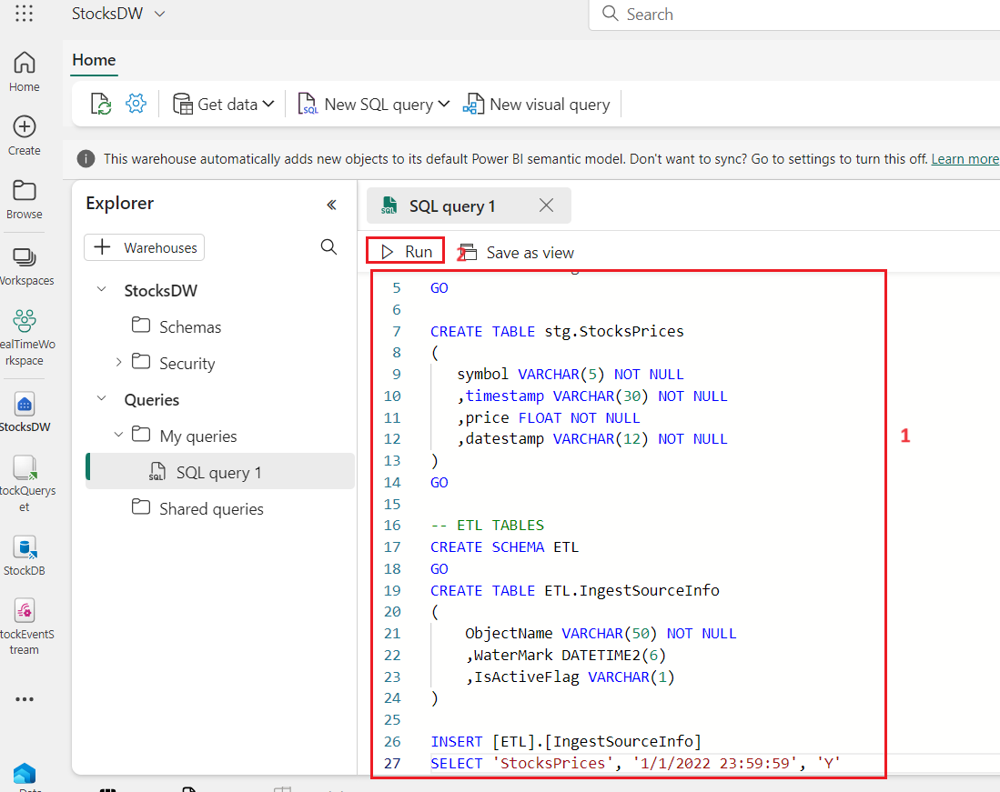
   

4.  Rename the query for reference. Right-click on **SQL query 1** in
    **Explorer** and select **Rename**.
    
5.  In the **Rename** dialog box, under the **Name** field, enter
    **Create stocks and metadata**, then click on the **Rename**
    button. 
     
6.  Click on ***New SQL query*** dropdown in the command bar, then
    select **New SQL query** under **Blank** section. We'll start
    building our schema in the next step:
     
7.  The **sp_IngestSourceInfo_Update** procedure updates the watermark;
    this ensures we are keeping track of which records have already been
    imported

8.  In the query editor, copy and paste the following code. Click on
    the **Run** button to execute the query. After the query is
    executed, you will see the results.
```
/* 1 - Create Staging and ETL.sql */

CREATE PROC [ETL].[sp_IngestSourceInfo_Update]
@ObjectName VARCHAR(50)
,@WaterMark DATETIME2(6)
AS
BEGIN

UPDATE [ETL].[IngestSourceInfo]
    SET WaterMark = @WaterMark
WHERE 
    ObjectName  = @ObjectName

END

GO
```
   
    
6.  Rename the query for reference later. Right-click on **SQL query 1**
    in **Explorer** and select **Rename**.

     
7.  In the **Rename** dialog box, under the **Name** field, enter
    **ETL.sql_IngestSource**, then click on the **Rename**
    button. 

     

This should look similar to:
      

## Task 3: Create the data pipeline

1.  On the **StockDW** page, click on **RealTimeWorkspace** Workspace on
    the left-sided navigation menu.

     

2.  On the **Synapse Data Warehouse RealTimeWorkhouse** home page, under
    **RealTimeWorkhouse**, click on **+New**, then select **Data
    pipeline.**

     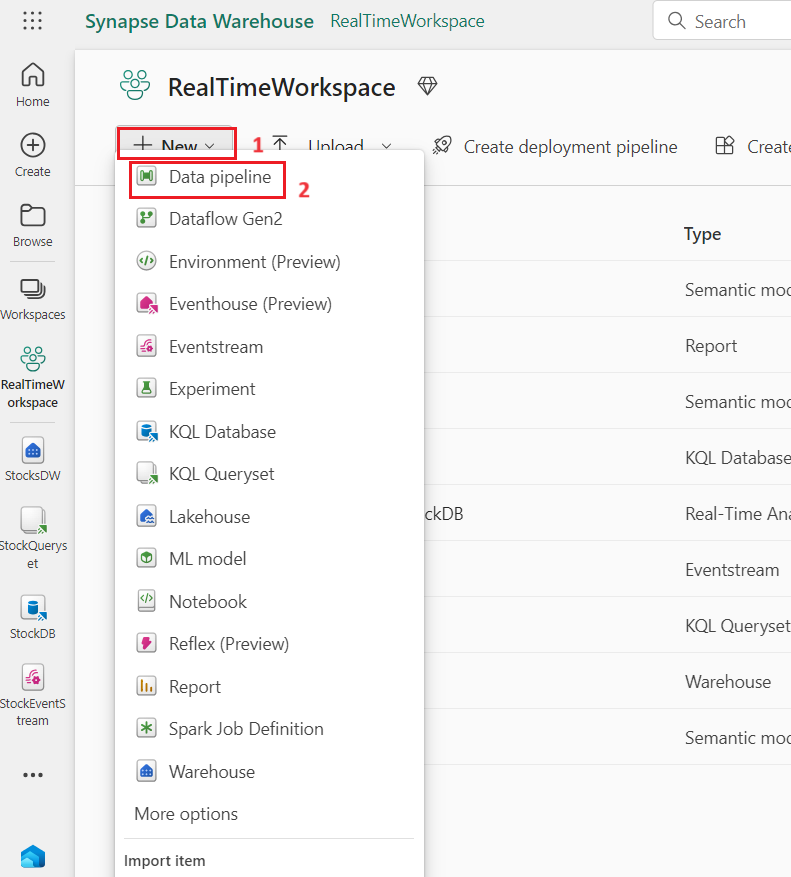

3.  A **New pipeline** dialog box will appear, in the **Name**  field,
    enter  ***PL_Refresh_DWH*** and click on the **Create**
    button.
     
4.  In the ***PL_Refresh_DWH*** page, navigate to **Build a data
    pipeline to organize and move your data** section and click on
    **P**i**peline activity**.

      

5.  Then, navigate and select ***Lookup*** activity as shown in the
    below image.

      
   
6.  On the **General** tab, in the **Name field,** enter +++Get
    WaterMark+++

     

7.  Click on the **Settings** tab, enter the following details as shown
    in the below image.

| **Connection** | Click on the dropdown and select **StocksDW** from the list. |
|----|----|
| **Use query** | **Query** |
| **Query** | **SELECT \* FROM \[ETL\].\[IngestSourceInfo\] WHERE IsActiveFlag = 'Y'** |
| **First row only* *** | ***unchecked*.** |

      

## Task 4: Build ForEach activity

This task focuses on building multiple activities within a single
ForEach activity. The ForEach activity is a container that executes
child activities as a group: in this case, if we had multiple sources to
pull data from, we'd repeat these steps for each data source.

1.  In the **Lookup - Get WaterMark** box, navigate and click on the
    right arrow to **Add an activity**. Then, navigate and
    select ***ForEach*** activity as shown in the below image.

     
2.  Click on the **Settings** tab, enter the items as 
    +++@activity('Get WaterMark').output.value+++

     This should look similar to the below image:

     

3.  In the *ForEach*  box, click on the plus (+) symbol to add a new
    activity.

     
4.  Select and add a ***Copy Data*** activity within *ForEach.*

     

5.  Select **Copy data1** Activity icon, on the **General** tab, in the
    **Name field,** enter +++Copy KQL+++

     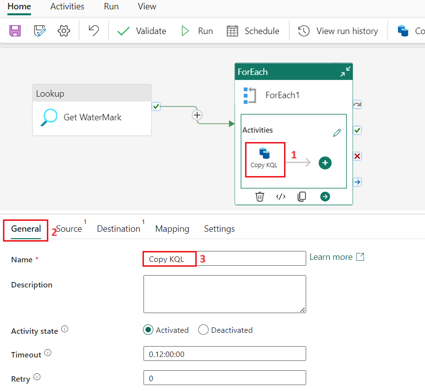

6.  Click on the **Source** tab, enter the following settings.

<table>
<colgroup>
<col style="width: 36%" />
<col style="width: 63%" />
</colgroup>
<thead>
<tr class="header">
<th><strong>Connection</strong></th>
<th>Select <strong>StocksDB</strong> from the dropdown.</th>
</tr>
</thead>
<tbody>
<tr class="odd">
<td><strong>Use query</strong></td>
<td><strong>Query</strong></td>
</tr>
<tr class="even">
<td><strong>Query</strong></td>
<td><p><strong>@concat('StockPrice</strong></p>
<p><strong>| where todatetime(timestamp) &gt;= todatetime(''',
item().WaterMark,''')</strong></p>
<p><strong>| order by timestamp asc</strong></p>
<p><strong>| extend datestamp = substring(timestamp,0,10)</strong></p>
<p><strong>| project symbol, timestamp, price, datestamp</strong></p>
<p><strong>| take 500000</strong></p>
<p><strong>| where not(isnull(price))</strong></p>
<p><strong>' )</strong> </p></td>
</tr>
</tbody>
</table>

The *Source* tab of the activity should look similar to:
     

7.  Click on the **Destination** tab, enter the following settings

| **Connection**   | drop down, select **StocksDW** from the list |
|------------------|----------------------------------------------|
| **Table option** | **Use existing**                             |
| **Table**        | stg.StocksPrices                             |

- Under the *Advanced* section, enter the following ***Pre-copy
  script*** to truncate the table before loading the staging table:

> **delete stg.StocksPrices**

This step first deletes old data from the staging table, and then copies
the data from the KQL table, selecting data from the last watermark and
inserting it into the staging table. Using a watermark is important to
avoid processing the entire table; additionally, KQL queries have a
maximum rowcount of 500,000 rows. Given the current rate of data
ingested, this equates to about 3/4 of one day.

The *Destination* tab of the activity should look like:
     

8.  In the *ForEach*  box, click on the plus **(+)** symbol, navigate
    and select **Lookup** activity.
      

9.  Click on **Lookup1** icon, in the **General** tab, **Name field,**
    enter +++Get New WaterMark+++

     

10. Click on the **Settings** tab, enter the following settings

| **Connection** | drop down, select **StocksDW** from the list |
|----|----|
| **Use query** | **Query** |
| **Query** | @concat('Select Max(timestamp) as WaterMark from stg.', item().ObjectName) |
     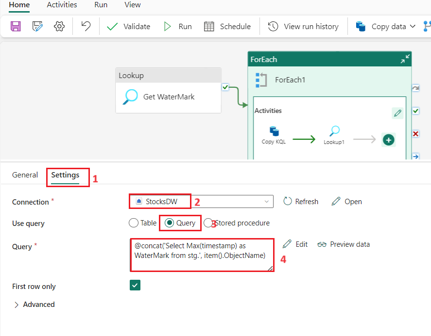

11. In the *ForEach* box, click on the plus **(+)** symbol, navigate and
    select ***Stored Procedure***  activity.

      

12. Click on the **Stored procedure** icon. On the **General** tab, in
    the **Name field,** enter  ***Update WaterMark*** 
     
13. Click on the **Settings** tab, enter the following settings.

| **Workspace**             | **StocksDW**                   |
|---------------------------|--------------------------------|
| **Stored procedure name** | ETL.sp_IngestSourceInfo_Update |

- Parameters (click *Import* to automatically add the parameter names):

| **Name** | **Type** | **Value** |
|----|----|----|
| ObjectName | String | @item().ObjectName |
| WaterMark | DateTime | @activity('Get New WaterMark').output.firstRow.WaterMark |
     

## Task 5: Test the Pipeline

1.  From the ***Home*** tab in the pipeline, select ***Run***.

      
2.  In the **Save and run?** dialog box, click on **Save and run**
    button

      

3.  This will prompt to first save the pipeline, and then validate to
    find any configuration errors. This initial run will take a few
    moments and will copy the data into the staging table.

      

4.  On the **PL_Refresh_DWH** page, click on **RealTimeWorkspace**
    Workspace on the left-sided navigation menu.

      

5.  Click on the **Refresh** button.

      
6.  In the data warehouse, data should be visible in the staging table.
    Within the data warehouse, selecting a table will show a preview of
    the data in the table. Click on StocksDW on the left-sided
    navigation menu, then click o **Schemas** in Explorer. Under
    Schemas, navigate and click on **stg**, then click on
    **StocksPrices** as shown in the below image.

      

9.  Click on ***New SQL query*** dropdown in the command bar, then
    select **New SQL query** under **Blank** section. We'll start
    building our schema in the next step:

       

8.  While we're in the data warehouse, run the script below in new SQL
    query window to reset the ingestion process. It's often handy in
    development to have a reset script to allow for incremental testing.
    This will reset the date and delete the data from the staging table.

> ***Note:** We haven't created the fact or dimensions table yet, but
> the script should still work.*

9.  In the query editor, copy and paste the following code. Click on
    the **Run** button to execute the query. After the query is
    executed, you will see the results.
```
-- Run this to 'RESET' the ingestion tables

exec ETL.sp_IngestSourceInfo_Update 'StocksPrices', '2022-01-01 23:59:59.000000'
GO

IF (EXISTS (SELECT * FROM INFORMATION_SCHEMA.TABLES 
    WHERE TABLE_SCHEMA = 'stg' AND TABLE_NAME = 'StocksPrices'))
BEGIN
    delete stg.StocksPrices
END
GO

IF (EXISTS (SELECT * FROM INFORMATION_SCHEMA.TABLES 
    WHERE TABLE_SCHEMA = 'dbo' AND TABLE_NAME = 'fact_Stocks_Daily_Prices'))
BEGIN
    delete dbo.fact_Stocks_Daily_Prices
END
GO

IF (EXISTS (SELECT * FROM INFORMATION_SCHEMA.TABLES 
    WHERE TABLE_SCHEMA = 'dbo' AND TABLE_NAME = 'dim_Symbol'))
BEGIN
    delete dbo.dim_Symbol
END
GO
```
   
   

# Exercise 2: Build Star Schema

For the date dimension, we'll load enough values for the foreseeable
future. Date dimensions are fairly similar across all implementations
and typically hold specific date details: the day of week, month,
quarter, etc.

For the symbol dimension, we'll incrementally load that during the
pipeline -- this way, if new stocks are added at some point, they will
get added to the Symbol dimension table during the execution of the
pipeline. The symbol dimension holds additional details about each
symbol, such as company name, the stock market it trades on, etc.

We'll also create views to support the pipeline by making it easier to
load data from the staging table by aggregating the min, max, and
closing price of the stock.

## Task 1: Create the dimension and fact tables

1.  Click on ***New SQL query*** dropdown in the command bar, then
    select **New SQL query** under **Blank** section. We'll start
    building our schema in the next step.

      

2.  In our data warehouse, run the following SQL to create the fact and
    dimension tables. As in the previous step, you can run this ad-hoc
    or create a SQL query to save the query for future use.

3.  In the query editor, copy and paste the following code. Click on
    the **Run** button to execute the query. After the query is
    executed, you will see the results.
```
/* 2 - Create Dimension and Fact tables.sql */

-- Dimensions and Facts (dbo)
CREATE TABLE dbo.fact_Stocks_Daily_Prices
(
   Symbol_SK INT NOT NULL
   ,PriceDateKey DATE NOT NULL
   ,MinPrice FLOAT NOT NULL
   ,MaxPrice FLOAT NOT NULL
   ,ClosePrice FLOAT NOT NULL
)
GO

CREATE TABLE dbo.dim_Symbol
(
    Symbol_SK INT NOT NULL
    ,Symbol VARCHAR(5) NOT NULL
    ,Name VARCHAR(25)
    ,Market VARCHAR(15)
)
GO

CREATE TABLE dbo.dim_Date 
(
    [DateKey] DATE NOT NULL
    ,[DayOfMonth] int
    ,[DayOfWeeK] int
    ,[DayOfWeekName] varchar(25)
    ,[Year] int
    ,[Month] int
    ,[MonthName] varchar(25)
    ,[Quarter] int
    ,[QuarterName] varchar(2)
)
GO
```
  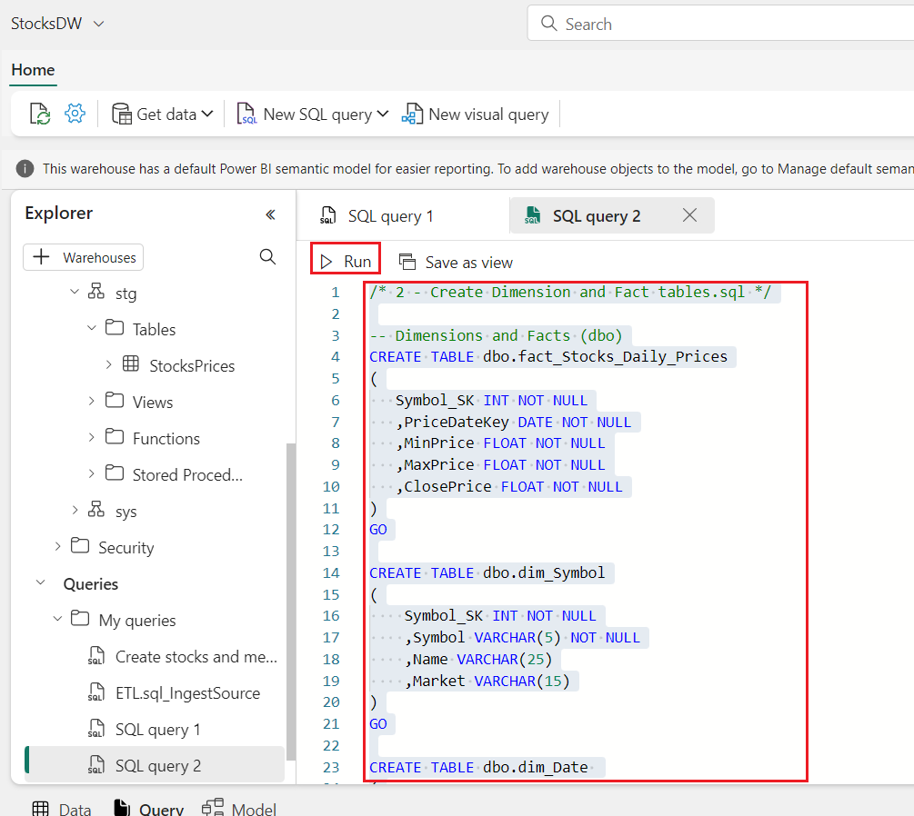
  

4.  Rename the query for reference. Right-click on **SQL query** in
    Explorer and select **Rename**.

     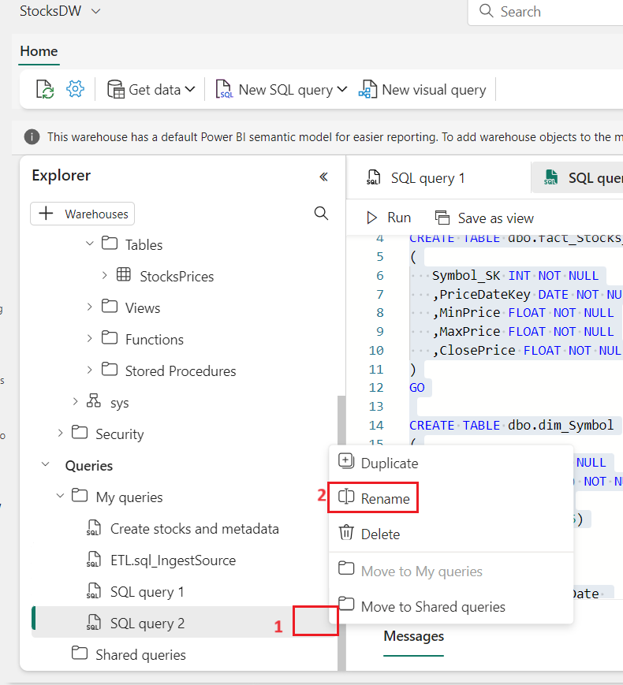
5.  In the **Rename** dialog box, under the **Name** field, enter 
    ***Create Dimension and Fact tables***, then click on the
    **Rename** button. 

     

## Task 2: Load the date dimension

1.  Click ***New SQL query*** at the top of the window. Click on ***New
    SQL query*** dropdown in the command bar, then select **New SQL
    query** under **Blank** section. We'll start building our schema in
    the next step:

      
2.  The date dimension is differentiated; it can be loaded once with all
    the values we'd need. Run the following script, which creates a
    procedure to populate the date dimension table with a broad range of
    values.

3.  In the query editor, copy and paste the following code. Click on
    the **Run** button to execute the query. After the query is
    executed, you will see the results.
```
/* 3 - Load Dimension tables.sql */

CREATE PROC [ETL].[sp_Dim_Date_Load]
@BeginDate DATE = NULL
,@EndDate DATE = NULL
AS
BEGIN

SET @BeginDate = ISNULL(@BeginDate, '2022-01-01')
SET @EndDate = ISNULL(@EndDate, DATEADD(year, 2, GETDATE()))

DECLARE @N AS INT = 0
DECLARE @NumberOfDates INT = DATEDIFF(day,@BeginDate, @EndDate)
DECLARE @SQL AS NVARCHAR(MAX)
DECLARE @STR AS VARCHAR(MAX) = ''

WHILE @N <= @NumberOfDates
    BEGIN
    SET @STR = @STR + CAST(DATEADD(day,@N,@BeginDate) AS VARCHAR(10)) 
    
    IF @N < @NumberOfDates
        BEGIN
            SET @STR = @STR + ','
        END

    SET @N = @N + 1;
    END

SET @SQL = 'INSERT INTO dbo.dim_Date ([DateKey]) SELECT CAST([value] AS DATE) FROM STRING_SPLIT(@STR, '','')';

EXEC sys.sp_executesql @SQL, N'@STR NVARCHAR(MAX)', @STR;

UPDATE dbo.dim_Date
SET 
    [DayOfMonth] = DATEPART(day,DateKey)
    ,[DayOfWeeK] = DATEPART(dw,DateKey)
    ,[DayOfWeekName] = DATENAME(weekday, DateKey)
    ,[Year] = DATEPART(yyyy,DateKey)
    ,[Month] = DATEPART(month,DateKey)
    ,[MonthName] = DATENAME(month, DateKey)
    ,[Quarter] = DATEPART(quarter,DateKey)
    ,[QuarterName] = CONCAT('Q',DATEPART(quarter,DateKey))

END
GO
```
   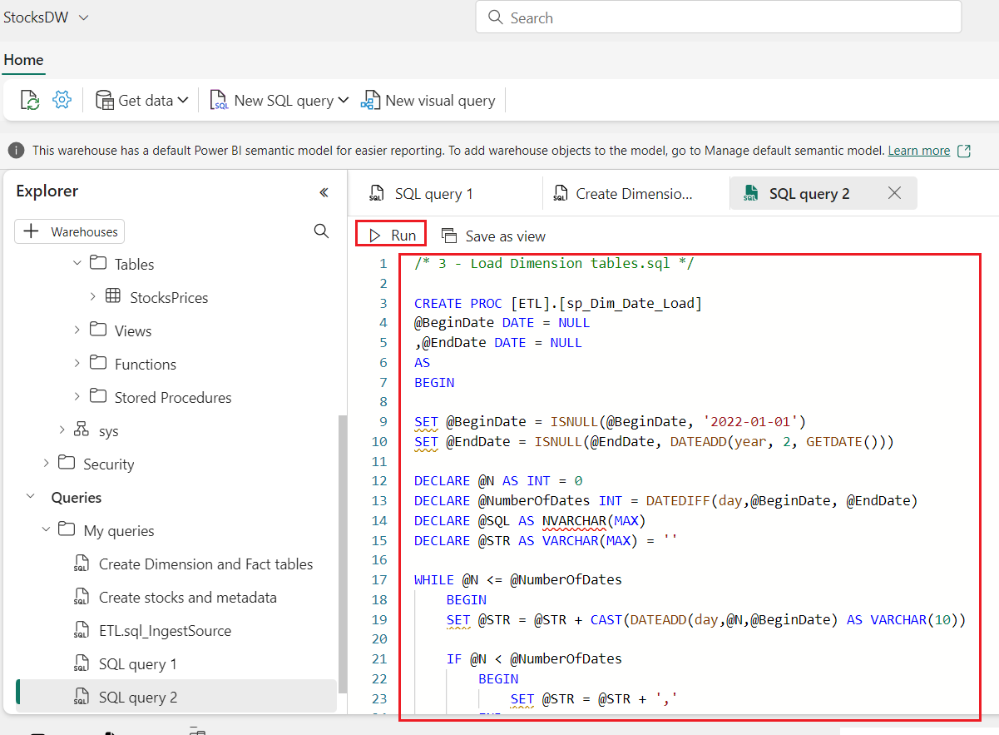
   
4.  From same query window, execute the above procedure by running the
    following script.
```
/* 3 - Load Dimension tables.sql */
Exec ETL.sp_Dim_Date_Load
```
   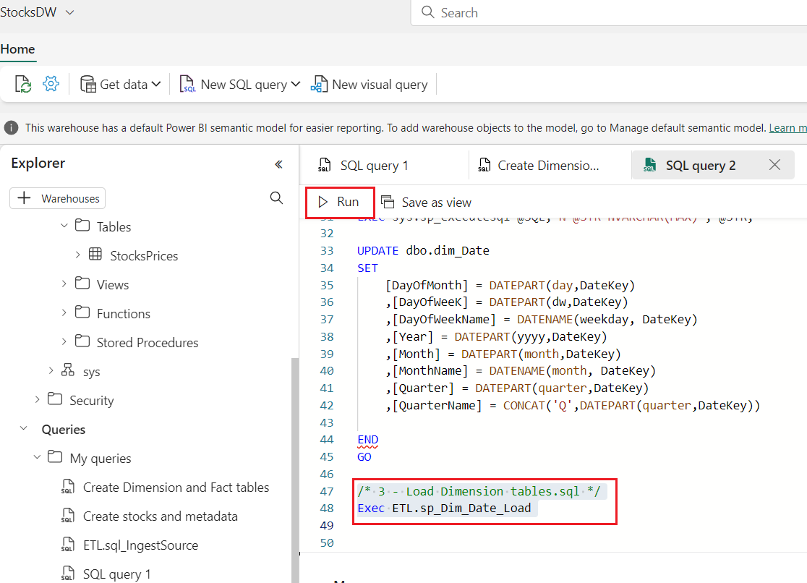
   
5.  Rename the query for reference. Right-click on **SQL query** in
    Explorer and select **Rename**.
     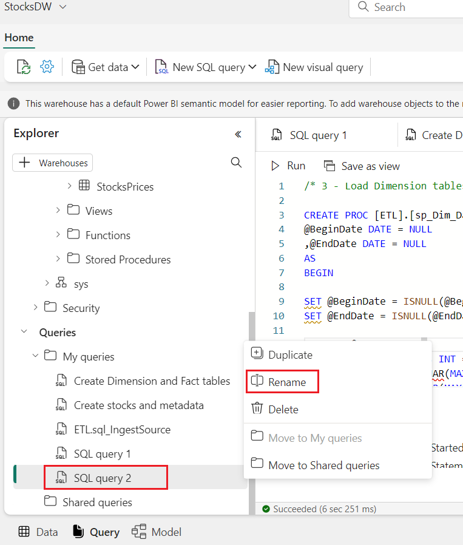
6.  In the **Rename** dialog box, under the **Name** field, enter 
    **Load Dimension tables**, then click on the **Rename** button. 
     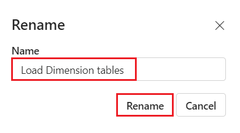
## Task 3: Create the procedure to load the Symbol dimension

1.  Click on ***New SQL query*** dropdown in the command bar, then
    select **New SQL query** under **Blank** section. We'll start
    building our schema in the next step.
      
2.  Similar to the date dimension, each stock symbol corresponds to a
    row in the Symbols dimension table. This table holds details of the
    stock, such as company name, and the market the stock is listed
    with.

3.  In the query editor, copy and paste the following code. Click on
    the **Run** button to execute the query. This will create the
    procedure that will load the stock symbol dimension. We'll execute
    this in the pipeline to handle any new stocks that might enter the
    feed.
```
/* 3 - Load Dimension tables.sql */

CREATE PROC [ETL].[sp_Dim_Symbol_Load]
AS
BEGIN

DECLARE @MaxSK INT = (SELECT ISNULL(MAX(Symbol_SK),0) FROM [dbo].[dim_Symbol])

INSERT [dbo].[dim_Symbol]
SELECT  
    Symbol_SK = @MaxSK + ROW_NUMBER() OVER(ORDER BY Symbol)  
    , Symbol
    , Name
    ,Market
FROM 
    (SELECT DISTINCT
    sdp.Symbol 
    , Name  = 'Stock ' + sdp.Symbol 
    , Market = CASE SUBSTRING(Symbol,1,1)
                    WHEN 'B' THEN 'NASDAQ'
                    WHEN 'W' THEN 'NASDAQ'
                    WHEN 'I' THEN 'NYSE'
                    WHEN 'T' THEN 'NYSE'
                    ELSE 'No Market'
                END
    FROM 
        [stg].[vw_StocksDailyPrices] sdp
    WHERE 
        sdp.Symbol NOT IN (SELECT Symbol FROM [dbo].[dim_Symbol])
    ) stg

END
GO
```
  
    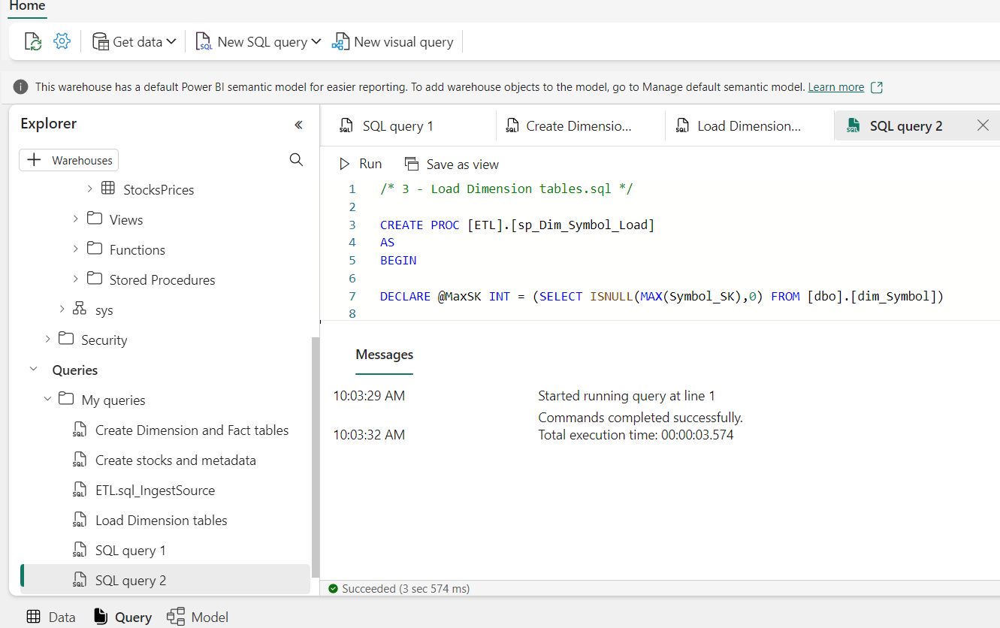
7.  Rename the query for reference. Right-click on **SQL query** in
    Explorer and select **Rename**.

      
8.  In the **Rename** dialog box, under the **Name** field, enter 
    **Load the stock symbol dimension**, then click on the
    **Rename** button. 
      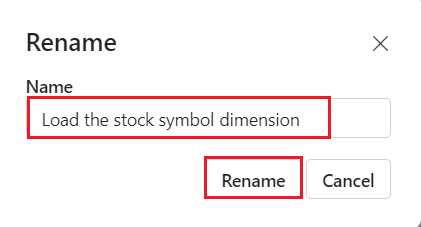
## **Task 4: Create the views**

1.  Click on ***New SQL query*** dropdown in the command bar, then
    select **New SQL query** under **Blank** section. We'll start
    building our schema in the next step.


2.  Create views that support the aggregation of the data during the
    load. When the pipeline runs, data is copied from the KQL database
    into our staging table, where we'll aggregate all of the data for
    each stock into a min, max, and closing price for each day.

3.  In the query editor, copy and paste the following code. Click on
    the **Run** button to execute the query.
>````
>/* 4 - Create Staging Views.sql */
>
>CREATE VIEW [stg].[vw_StocksDailyPrices] 
>AS 
>SELECT 
>    Symbol = symbol
>    ,PriceDate = datestamp
>    ,MIN(price) as MinPrice
>    ,MAX(price) as MaxPrice
>    ,(SELECT TOP 1 price FROM [stg].[StocksPrices] sub
>    WHERE sub.symbol = prices.symbol and sub.datestamp = prices.datestamp
>    ORDER BY sub.timestamp DESC
>    ) as ClosePrice
>FROM 
>    [stg].[StocksPrices] prices
>GROUP BY
>    symbol, datestamp
>GO
>/**************************************/
>CREATE VIEW stg.vw_StocksDailyPricesEX
>AS
>SELECT
>    ds.[Symbol_SK]
>    ,dd.DateKey as PriceDateKey
>    ,MinPrice
>    ,MaxPrice
>    ,ClosePrice
>FROM 
>    [stg].[vw_StocksDailyPrices] sdp
>INNER JOIN [dbo].[dim_Date] dd
>    ON dd.DateKey = sdp.PriceDate
>INNER JOIN [dbo].[dim_Symbol] ds
>    ON ds.Symbol = sdp.Symbol
>GO


4.  Rename the query for reference. Right-click on **SQL query** in
    Explorer and select **Rename**.


5.  In the **Rename** dialog box, under the **Name** field, enter 
    **Create Staging Views**, then click on the **Rename**
    button. 


## Task 5: Add activity to load symbols

1.  On the **StockDW** page, click on **PL_Refresh_DWH** on the
    left-sided navigation menu.


2.  In the pipeline, add a new ***Stored Procedure*** activity
    named ***Populate Symbols Dimension*** that executes the procedure,
    which loads the stock symbols.

3.  This should be connected to the success output of the ForEach
    activity (not within the ForEach activity).

>  alt="A screenshot of a computer Description automatically generated" />

4.  On the **General** tab, in the **Name field,** enter +++**Populate
    Symbols Dimension** +++

>  alt="A screenshot of a computer Description automatically generated" />

5.  Click on the **Settings** tab, enter the following settings.

| **Connection**            | **Workspace**                  |
|---------------------------|--------------------------------|
| **Stored procedure name** | \[ETL\].\[sp_Dim_Symbol_Load\] |


## Task 6: Create the procedure to load daily prices

1.  On the **PL_Refresh_DWH** page, click on **StockDW** on the
    left-sided navigation menu.


2.  Click on ***New SQL query*** dropdown in the command bar, then
    select **New SQL query** under **Blank** section. We'll start
    building our schema in the next step.


3.  Next, run the below script to create the procedure that builds the
    fact table. This procedure merges data from staging into the fact
    table. If the pipeline is running throughout the day, the values
    will be updated to reflect any changes in the min, max, and closing
    price.

> **Note**: Currently, Fabric data warehouse does not support the T-SQL
> merge statement; therefore, data will be updated and then inserted as
> needed.

4.  In the query editor, copy and paste the following code. Click on
    the **Run** button to execute the query.

>````//* 5 - ETL.sp_Fact_Stocks_Daily_Prices_Load.sql */
>
>CREATE PROCEDURE [ETL].[sp_Fact_Stocks_Daily_Prices_Load]
>AS
>BEGIN
>BEGIN TRANSACTION
>
>    UPDATE fact
>    SET 
>        fact.MinPrice = CASE 
>                        WHEN fact.MinPrice IS NULL THEN stage.MinPrice
>                        ELSE CASE WHEN fact.MinPrice < stage.MinPrice THEN fact.MinPrice ELSE stage.MinPrice END
>                    END
>        ,fact.MaxPrice = CASE 
>                        WHEN fact.MaxPrice IS NULL THEN stage.MaxPrice
>                        ELSE CASE WHEN fact.MaxPrice > stage.MaxPrice THEN fact.MaxPrice ELSE stage.MaxPrice END
>                    END
>        ,fact.ClosePrice = CASE 
>                        WHEN fact.ClosePrice IS NULL THEN stage.ClosePrice
>                        WHEN stage.ClosePrice IS NULL THEN fact.ClosePrice
>                        ELSE stage.ClosePrice
>                    END 
>    FROM [dbo].[fact_Stocks_Daily_Prices] fact  
>    INNER JOIN [stg].[vw_StocksDailyPricesEX] stage
>        ON fact.PriceDateKey = stage.PriceDateKey
>        AND fact.Symbol_SK = stage.Symbol_SK
>
>    INSERT INTO [dbo].[fact_Stocks_Daily_Prices]  
>        (Symbol_SK, PriceDateKey, MinPrice, MaxPrice, ClosePrice)
>    SELECT
>        Symbol_SK, PriceDateKey, MinPrice, MaxPrice, ClosePrice
>    FROM 
>        [stg].[vw_StocksDailyPricesEX] stage
>    WHERE NOT EXISTS (
>        SELECT * FROM [dbo].[fact_Stocks_Daily_Prices] fact
>        WHERE fact.PriceDateKey = stage.PriceDateKey
>            AND fact.Symbol_SK = stage.Symbol_SK
>    )
>
>COMMIT
>
>END
>GO


6.  Rename the query for reference. Right-click on **SQL query** in
    Explorer and select **Rename**.


7.  In the **Rename** dialog box, under the **Name** field, enter 
    ***ETL.sp_Fact_Stocks_Daily_Prices_Load</span>***,
    then click on the **Rename** button. 


## Task 7: Add activity to the pipeline to load daily stock prices

1.  On the **StockDW** page, click on **PL_Refresh_DWH** on the
    left-sided navigation menu.


2.  Add another ***Stored Procedure*** activity to the pipeline
    named ***Populate Fact Stocks Daily Prices*** that loads the stocks
    prices from staging into the fact table. Connect the success output
    of the *Populate Symbols Dimension* to the new *Populate Fact Stocks
    Daily Prices* activity.

>  alt="A screenshot of a computer Description automatically generated" />
>
>  alt="A screenshot of a computer Description automatically generated" />

3.  Click on the **Settings** tab, enter the following settings.

| **Connection**            | Select **StocksDW** from the dropdown list   |
|---------------------------|----------------------------------------------|
| **Stored procedure name** | \[ETL\].\[sp_Fact_Stocks_Daily_Prices_Load\] |


## Task 8. Run the pipeline

1.  Run the pipeline by clicking on the ***Run*** button, and verify the
    pipeline runs and fact and dimension tables are being loaded.


2.  In the **Save and run?** dialog box, click on **Save and run**
    button

>  alt="A screenshot of a computer Description automatically generated" />


## Task 9: Schedule the pipeline

1.  Next, schedule the pipeline to run periodically. This will vary by
    business case, but this could be run frequently (every few minutes)
    or throughout the day.

> **Note**: In this specific case, as there are roughly 700k rows per
> day, and KQL limits the query results to 500k, the pipeline must run
> at least twice per day to stay current.

2.  To schedule the pipeline, click the ***Schedule* **button (next to
    the *Run* button) and set up a recurring schedule, such as hourly or
    every few minutes.


# Exercise 3: Semantic Modeling

One last step is to operationalize the data by creating a semantic model
and viewing the data in Power BI. 

## Task 1: Create a semantic model

A semantic model, conceptually, provides an abstraction of our data for
consumption in business analytics. Typically, we expose data in our data
warehouse via semantic model that is used in Power BI. At a basic level,
they will include the relationships between tables.

*Note: Power BI Datasets have recently been renamed to Semantic Models.
In some cases, labels may not have been updated. The terms can be used
interchangeably. Read more about this change [on the Power BI
Blog](https://powerbi.microsoft.com/en-us/blog/datasets-renamed-to-semantic-models/).*

When we created our data warehouse, a default semantic model was created
automatically. We can leverage this in Power BI, but it also includes
many artifacts of the table we may not need. So, we'll create a new
semantic model with just our fact and two-dimension tables.

1.  On the **PL_Refresh_DWH** page, click on **StockDW** on the
    left-sided navigation menu.


2.  Click on the **refresh** icon as shown in the below image.


3.  In StockDW page, select the ***Reporting* **tab and then
    select ***New semantic model***.

>  alt="A screenshot of a computer Description automatically generated" />

4.  In the New semantic model tab, enter the name as ***StocksModel*,**
    and select only the fact and dimensions table, as we are concerned
    with ***fact_Stocks_Daily_Prices*, *dim_Date*, and *dim_Symbol***.
    Click on the **Confirm** button.


## Task 2. Add relationships

1.  On the **StockDW** page, click on **RealTimeWorkspace** on the
    left-sided navigation menu and select **StockModel**.


2.  The model designer should automatically open after creating the
    semantic model above. If it doesn't, or if you'd like to return to
    the designer at a later time, you can do so by opening the model
    from the list of resources in the workspace, and then
    selecting ***Open Data Model*** from the semantic model item.


3.  To create relationships between the fact and dimension tables, drag
    the key from the fact table to the corresponding key in the
    dimension table.

4.  For this data model, you need to define the relationship between
    different tables so that you can create reports and visualizations
    based on data coming across different tables. From
    the **fact_Stocks_Daily_Prices** table, drag
    the **PriceDateKey** field and drop it on the **DateKey** field in
    the **dim_Date** table to create a relationship. The **New
    relationship** dialog box appears.

>  style="width:6.49167in;height:2.94167in" />

5.  In the **New relationship** dialog box:

- **From table** is populated with **fact_Stocks_Daily_Prices** and the
  column of **PriceDateKey.**

- **To table** is populated with **dim_Date**  and the column of
  **DateKey**

- Cardinality: **Many to one (\*:1)**

- Cross filter direction: **Single**

- Leave the box next to **Make this relationship active** selected.

- Select **Ok.**


6.  From the **fact_Stocks_Daily_Prices** table, drag
    the **Symbol_SK** field and drop it on the **Symbol_SK**  field in
    the **dim_Symbol** table to create a relationship. The **New
    relationship** dialog box appears.


7.  In the **New relationship** dialog box:

- **From table** is populated with **fact_Stocks_Daily_Prices** and the
  column of **Symbol_Sk.**

- **To table** is populated with **dim_Symabol**  and the column of
  **Symbol_Sk**

- Cardinality: **Many to one (\*:1)**

- Cross filter direction: **Single**

- Leave the box next to **Make this relationship active** selected.

- Select **Ok.**


## Task 3. Create a simple report

1.  Click on ***New Report*** to load the semantic model in Power BI.

>  alt="A screenshot of a computer Description automatically generated" />

2.  While we won't have much data yet to make much of a report,
    conceptually, we can build a report similar to below, which shows a
    report after the lab has been running for a week or so (The
    lakehouse module will import additional history to allow for more
    interesting reports). The top chart shows the closing price for each
    stock on each day, while the bottom one shows the high/low/close of
    the WHO stock.

3.  In the **Power BI** page, under **Visualizations**, click to the
    **Line chart** icon to add a **Column chart** to your report.

- On the **Data** pane, expand **fact_Stocks_Daily_Prices**  and check
  the box next to **PriceDateKey**. This creates a column chart and adds
  the field to the **X-axis**.

- On the **Data** pane, expand **fact_Stocks_Daily_Prices** and check
  the box next to **ClosePrice**. This adds the field to the **Y-axis.**

- On the **Data** pane, expand **dim_Symbol** and check the box next
  to **Symbol**. This adds the field to the **Legend**.


4.  From the ribbon, select **File** \> **Save.**


5.  In the Save your report dialog box, enter +++ **semantic
    report** +++ as the name of your report and select **your
    workspace**. Click on the **Save button**.


## **Summary**

In this lab, you’ve configured a Synapse Data Warehouse in the Fabric
workspace and established a robust data pipeline for data processing.
You’ve begun this lab with creating the Synapse Data Warehouse and then
proceeded to create staging and ETL objects necessary for data
transformation. You’ve created schemas, tables, stored procedures, and
pipelines to manage data flow efficiently.

Then, you’ve delved into building dimension and fact tables essential
for organizing data effectively for analytical purposes. You’ve created
tables for storing daily stock prices, symbol details, and date
information. Additionally, procedures are developed to load dimension
tables with relevant data and populate fact tables with daily stock
prices.

You’ve created a semantic model in Synapse Data Warehouse, focusing on
essential fact and dimension tables. After establishing the semantic
model named "StocksModel," you’ve established relationships between the
fact_Stocks_Daily_Prices table and the dim_Date and dim_Symbol tables to
enable cohesive data analysis. Overall, this lab provides a
comprehensive understanding of setting up a data warehouse environment
and building a reliable data pipeline for analytics.
