# Lab 06 - Data Activator(선택 사항)

**소개**

Data Activator는 데이터 스트림에서 특정 조건(또는 패턴)이 감지되면
자동으로 모니터링하고 조치를 취하기 위한 통합 가시성 도구입니다.
일반적인 사용 사례로는 IoT 디바이스, 판매 데이터, 성능 카운터 및 시스템
상태 모니터링이 있습니다. 작업은 일반적으로 알림(예: 전자 메일 또는
Teams 메시지)이지만, 예를 들어 Power Automate 워크플로를 시작하도록
사용자 지정할 수도 있습니다.

현재 Data Activator는 Power BI와 Fabric Eventstreams(예: Azure Event
Hubs, Kafka 등)의 데이터를 사용할 수 있습니다. 향후에는 추가 소스(예:
KQL 쿼리 집합)와 더 고급 트리거링이 추가될 예정입니다. 자세한 내용은
[Data Activator
로드맵을](https://learn.microsoft.com/en-us/fabric/release-plan/data-activator)
참조하세요.

이 실습에서는 Data Activator를 사용하여 Eventstreams 및 Power BI
보고서를 모두 모니터링할 것입니다. Data Activator를 구성할 때 하나
이상의 *Reflex를* 설정합니다. Data Activator Reflex는 데이터 연결,
이벤트 및 트리거에 대해 필요한 모든 정보를 담고 있는 컨테이너입니다.

**목표**

- 주식 기호의 가격 상승을 감지하도록 Data Activator를 구성하기

- 가격 변동에 따라 알림을 트리거하도록 Data Activator에서 Reflex를
  설정하기

- Eventstream 데이터를 활용하여 실시간으로 주가 변화를 모니터링하고
  분석하기

- Power BI 보고서의 조건에 의해 트리거되는 Data Activator Reflex를
  만들기

- 최적의 가독성과 Data Activator와의 호환성을 위해 Power BI 보고서
  비주얼을 사용자 지정하기

- 데이터의 중요한 변경 사항을 사용자에게 알리 위한Data Activator에서
  임계값을 설정하고 알림을 구성하기

# 연습 1: Data Activator를 Eventstream과 함께 사용

이 연습에서는 주식 종목의 가격이 크게 상승하면 이를 감지하여 알림을
보내도록 Data Activator를 구성해 보겠습니다.

## 작업 1: 보고서 준비

1.  **RealTimeStocks** 페이지의 왼쪽 탐색 메뉴에서 **RealTimeWorkspace**
    Workspace를 클릭하세요.

     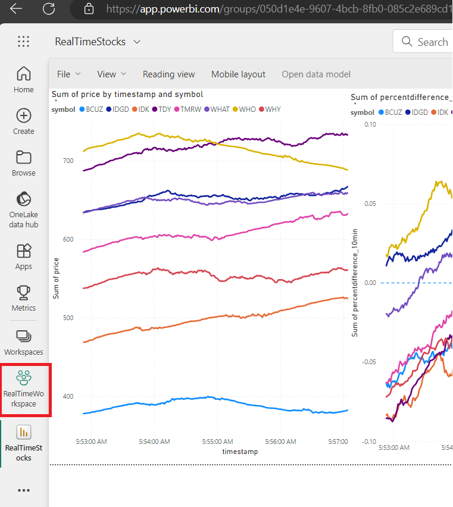

2.  **RealTimeWorkspace**창에서 **StockEventStream을** 탐색하고
    클릭하세요**.**

     

3.  **Eventstream에서 Edit** 버튼을 클릭하세요.

     

4.  **StockEventstream** 페이지에서 **Add Destination** 드롭다운을
    통해 새 출력을 추가하고 아래 이미지와 같이 ***Reflex를***
    선택하세요.

      

5.  Reflex를 다음과 같이 구성한 다음 ***Save*** 버튼을 클릭하세요**:**

- 대상 이름: **+++Reflex+++**

- 작업 공간: **RealTimeWorkspace**(또는 작업 공간의 이름)

- **+++EventstreamReflex+++라는** 이름의 새 reflex를 생성하고 Done
  버튼을 클릭하세요.

     

6.  대상 "Reflex"가 **성공적으로 추가되었다는** 알림을 받게 될 것입니다.

     

7.  StockEventStream과 **Reflex를** 연결하세요**. Publish** 버튼을
    클릭하세요.

      

8.  대상 "Reflex"가 **성공적으로 게시되었다는** 알림을 받게 됩니다.

      

9.  Reflex가 추가되면 아래 이미지와 같이 페이지 하단의 **open item**
    링크를 클릭하여 Reflex를 여세요.

      
>
> **참고**: Reflex 상태에 오류가 표시되는 경우 몇 분간 기다렸다가
> 페이지를 새로고침 하세요.
>
     

## 작업 2: 개체 구성

1.  **StockEventStram-Reflex** 창의 **Assign your data**창에서 다음 세부
    정보를 입력합니다*.* 그런 다음 ***Save를 클릭하고 Save and go to
    design mode를 클릭하세요.***

- Object name - **기호**

- Assign key column **- 기호**

- Assign properties - **가격, 타임스탬프** 선택

     

     

2.  저장되면 Reflex가 로드됩니다. 속성 아래에서 ***Price를***
    선택하세요.

      

      

3.  그러면 이벤트가 들어오는 대로 각 기호의 가격 속성 보기가 로드됩니다.
    페이지 오른쪽에서 ***Add*** 옆의 드롭다운을 클릭한 다음 아래
    이미지와 같이 ***Summarize* \> *Average over time을 ***탐색하여
    선택하세요.

    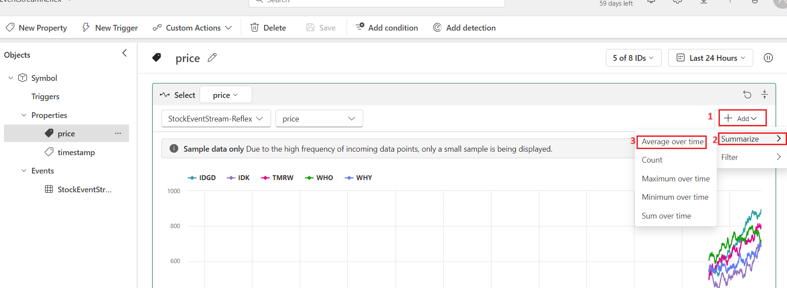

4.  ***Average over time을* 10분으로** 구성하세요. 페이지의 오른쪽
    상단에서 아래 이미지와 같이 시간 창을 ***Last Hour로*** 설정하세요.
    이 단계에서는 10분 단위로 데이터를 평균화하므로 가격의 큰 변동을
    찾는 데 도움이 됩니다.

      

      

5.  새 트리거를 추가하려면 상단 탐색 모음에서 ***New trigger*** 버튼을
    클릭하세요. **Unsaved change**대화 상자에서 **Save** 버튼을
    클릭하세요.

     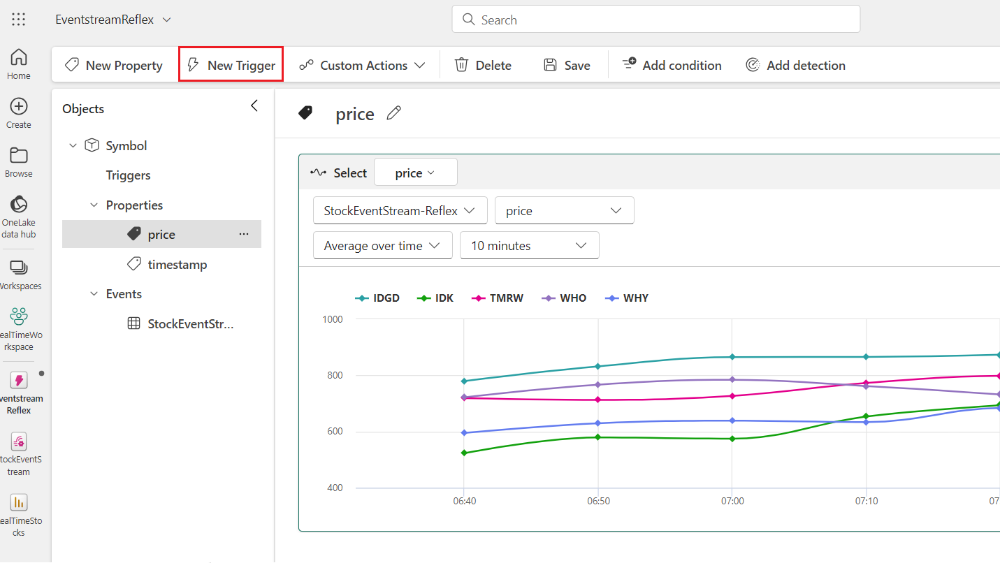

    

     

6.  새 트리거 페이지가 로드되면 아래 이미지와 같이 트리거의 이름을
    ***Price Increase으로*** 변경하세요.

     

7.  Price Increase 페이지에서 **Select a property or event column**옆의
    드롭다운을 클릭한 다음 **Existing property** \> **price를**
    선택하세요.

      

      

8.  오른쪽 상단의 시간 창이 *last hour로* 설정되어 있는지
    확인하고(필요한 경우 변경하세요).

      

9.  ***Price chart*는** 10분 간격으로 데이터를 평균한 요약 보기를
    유지해야 합니다. **Detect** 섹션에서 감지 유형을
    **Numeric** \> **Increases by로** 구성하세요.

      

10. 증가 유형을 **Percentage로** 설정하세요. 약 **6의** 값으로
    시작하지만 데이터의 변동성에 따라 이 값을 수정해야 합니다. 아래
    그림과 같이 ***From last measurement***  및 ***Each time로***
    설정하세요:

      

11. 아래로 스크롤하여 **Act** 옆의 드롭다운을 클릭하고 **Email을**
    선택하세요. 그런 다음 Additional information 필드에서 드롭다운을
    클릭하고 **price** 및 **timestamp** 확인란을 선택하세요. 그런 다음
    명령줄에서 **save** 버튼을 클릭하세요.

     

12. **Trigger saved라는** 알림을 받게 됩니다.

      

13. **Send me a test alert를** 클릭하세요.

      

**중요 참고:** 평가판 계정을 사용하는 사용자에게는 알림이 전송되지
않습니다.

# 연습 2: Power BI에서 Data Activator 사용

이 연습에서는 Power BI 보고서를 기반으로 Data Activator Reflex를 만들어
보겠습니다. 이 접근 방식의 장점은 더 많은 조건에서 트리거할 수 있다는
것입니다. 당연히 여기에는 다른 데이터 원본에서 로드되거나, DAX
expressions를 통해 보강된 Eventstream의 데이터 등이 포함될 수 있습니다.
현재 한 가지 제한 사항이 있습니다(Data Activator가 성숙해짐에 따라
변경될 수 있음): Data Activator는 매시간 데이터에 대한 Power BI 보고서를
모니터링합니다. 이로 인해 데이터의 특성에 따라 허용할 수 없는 지연이
발생할 수 있습니다.

## 작업 1: 보고서 준비

각 보고서의 이름을 변경하여 각 비주얼의 레이블을 수정합니다. 이름을
바꾸면 Power BI에서 보고서를 더 쉽게 읽을 수 있게 되지만 Data
Activator에서도 더 쉽게 읽을 수 있게 됩니다.

1.  이제 왼쪽 탐색 메뉴에서 **RealTimeWorkspace를** 클릭하세요.

     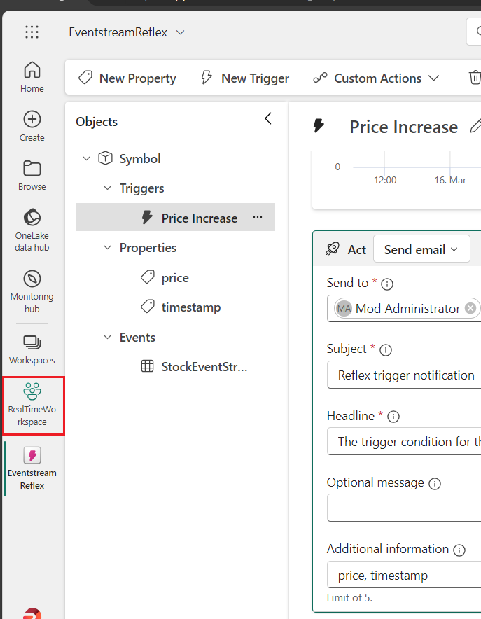

2.  아래 이미지와 같이 **RealTimeWorkspace** 창에서 **RealTimeStocks을**
    탐색하여 클릭하세요.

     

     

3.  **RealTimeStock** 페이지에서 명령줄의 **Edit** 버튼을 클릭하여
    보고서 편집기를 여세요.

     

4.  보고서를 수정하는 동안에는 일시적으로 자동 새로 고침을 사용하지
    않도록 설정하는 것이 가장 좋습니다. 시각화에서 공식 페이지를
    선택하고 **Page refresh을 off로** 선택하세요**.**

      

5.  **RealTimeStock** 페이지에서 **Sum of price by timestamp and
    symbol을** 선택하세요.

6.  이제 각 필드에서 드롭다운을 선택하고 **Rename for this visual**
    바꾸기를 선택하여 이름을 **변경하세요.** 다음과 유사하게 이름을
    바꿉니다:

- **timestamp** to **Timestamp**

    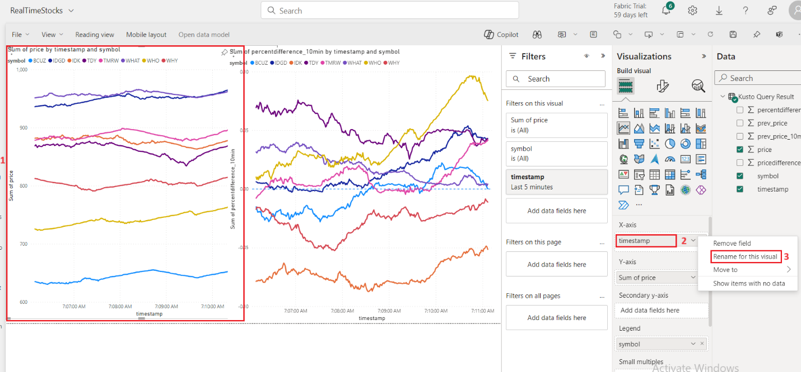
    

- **sum of price** to **Price**

     
      

- **symbol** to **Symbol**

     

     

7.  **RealTimeStock** 페이지에서 **Sum of percentdifference_10min by
    timestamp and symbol를** 선택하세요.

      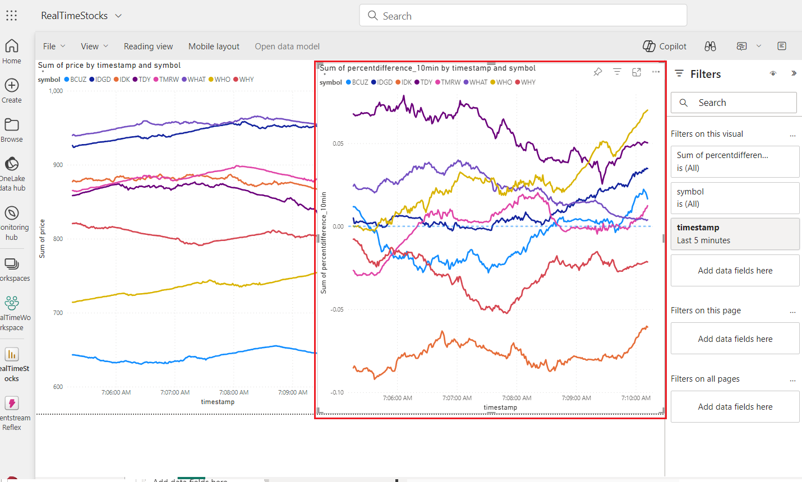

8.  이제 각 필드에서 드롭다운을 선택하고 ***Rename for this visual을***
    선택하여 이름을 **변경하세요.** 다음과 유사하게 이름을 바꾸세요:

- timestamp to **Timestamp** 

- symbol to **Symbol** 

- avg of percentdifference_10min to **Percent Change**

     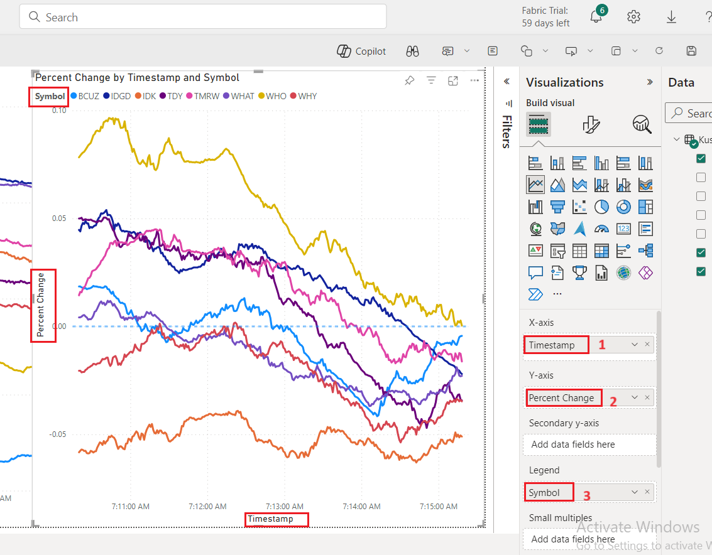

9.  이제 **필터** 섹션에서 **Clear filter** 버튼을 클릭하여
    **Timestamp** 필터(가장 최근 5분만 표시하도록 설정)를 일시적으로
    제거합니다.

     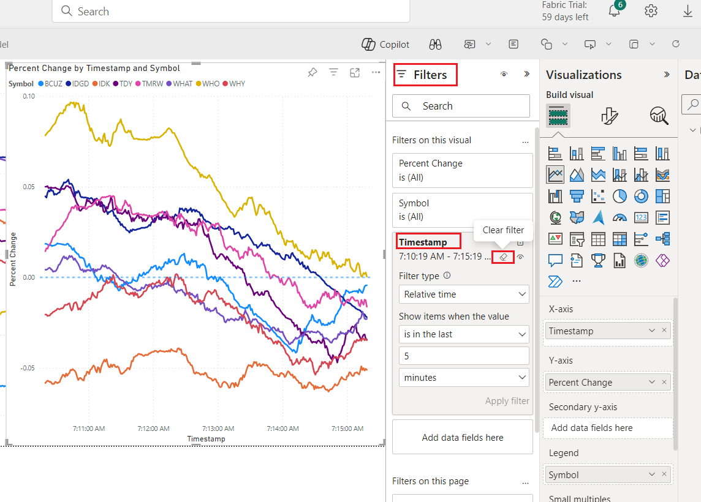

10. Data Activator는 1시간에 한 번씩 보고서 데이터를 가져오며, Reflex가
    구성되면 필터도 구성에 적용됩니다. Reflex를 구성한 후 필터를 다시
    추가할 수 있으므로 최소 한 시간 분량의 데이터가 있어야 합니다.

     

## 작업 2: 트리거 만들기

Percent Change 값이 특정 임계값(약 0.05) 이상으로 이동하면 알림을
트리거하도록 Data Activator를 구성하겠습니다.

1.  **새 Reflex** 및 **trigger를** 만들려면 아래 이미지와 같이 **가로
    줄임표를** 클릭하고 탐색한 후 ***Set alert를*** 클릭하세요.

     

2.  *Set an alert* 창에서는 대부분의 설정이 미리 선택되어 있을 것입니다.
    아래 이미지에 표시된 대로 다음 설정을 사용합니다:

- Visual: **Precent Change by Timestamp and Symbol**

- Measure: **Percent Change**

- Condition: **Becomes greater than**

- Threshold: **0.05** (나중에 병경됨)

- Filters: **verify there are no filters affecting the visual**

- Notification type: **Email**

- **Start my alert** **을** 선택 취소하고 **Create alert**버튼을
  클릭하세요.

     
 
    

3.  Reflex가 저장되면 알림에 Reflex를 편집할 수 있는 링크가 포함되며,
    링크를 클릭하면 Reflex를 열 수 있습니다. Reflex는 워크스페이스 항목
    목록에서도 열 수 있습니다.

    

    

## 작업 3: Reflex 구성하기

1.  New trigger페이지가 로드되면 제목의 연필 아이콘을 클릭하고 제목을
    ***Percent Change High로*** 변경하세요.

      
 
      

2.  지난 24시간을 선택하세요.

     

3.  다음으로 Symbom 및 Timestamp에 대한 두 가지 속성을 추가하세요.

4.  페이지 왼쪽 상단에서 ***New Property*** 를 클릭하고 Select a
    property or even column \> Column from an event stream or record \>
    Percent Change \> Symbol 옆의 드롭다운을 클릭하세요.

     
     

5.  마찬가지로 아래 이미지와 같이 Select a property or even column \>
    Column from an event stream or record \> Percent Change \>
    **timestamp** 옆의 드롭다운을 클릭하세요. 타임스탬프 옆의 연필
    아이콘을 클릭하고 이름을 Timestamp으로 변경하세요.

     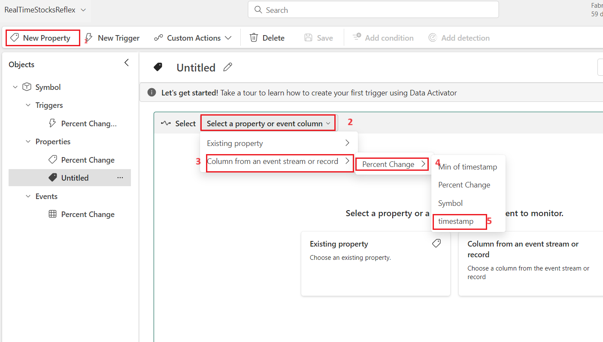
  
      

6.  Objects \> Triggers list에서 Percent Change High trigge를
    클릭하세요. 상단 창에는 지난 4시간 동안의 데이터가 표시되며 매시간
    업데이트됩니다. 두 번째 창은 감지 임계값을 정의합니다. 이 값을
    수정하여 더 제한적이거나 덜 제한적으로 설정해야 할 수도 있습니다. 이
    값을 높이면 감지 횟수가 줄어드는데, 아래 이미지와 비슷하게 감지
    횟수가 줄어들도록 이 값을 변경하면 됩니다. 구체적인 값은 데이터
    변동성에 따라 조금씩 달라집니다.

      
 
      
 
      
  
      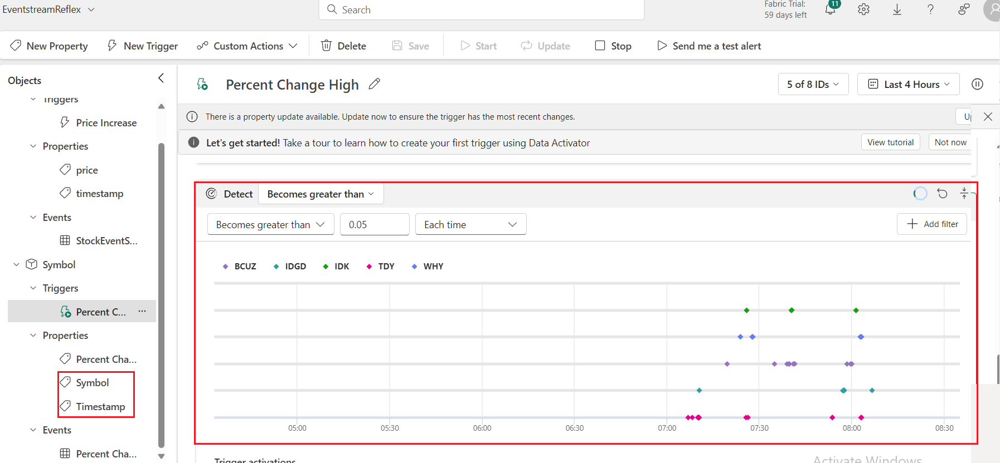

## 작업 4: 알림 구성하기

1.  마지막으로, 이전 Reflex에서 수행한 것처럼 메시지를 보내도록 Act를
    구성하세요. **Additional information** 필드를 클릭하고 **Percent
    Change**, **Symbol**, **Timestamp를** 선택한 다음 아래 이미지와 같이
    **Save** 버튼을 클릭하세요.

      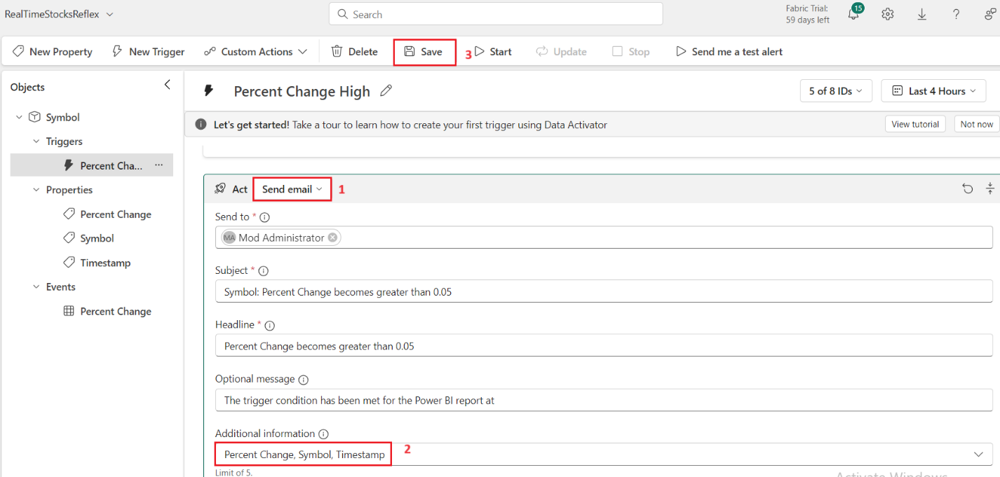

2.  **Send me a test alert를** 클릭하세요.

      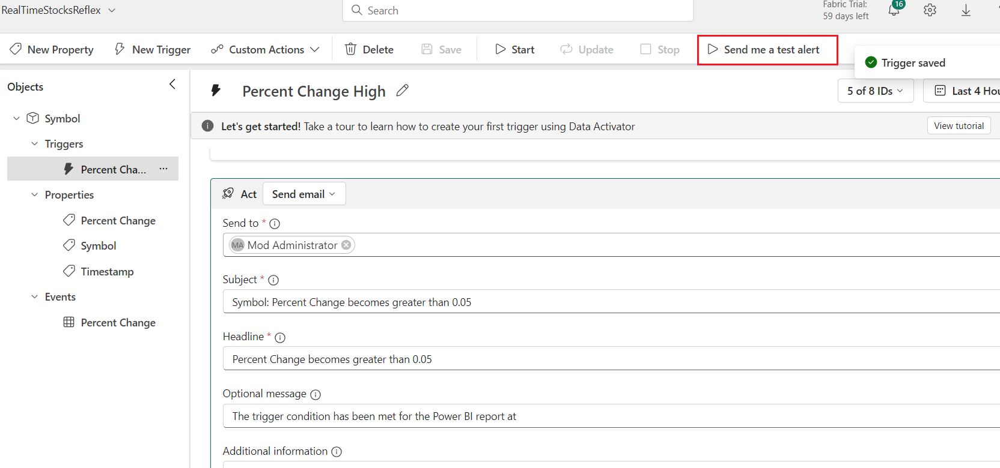

**중요 참고:** 평가판 계정을 사용하는 사용자에게는 알림이 전송되지
않습니다.

## **요약**

이 실습에서는 미리 정의된 기준에 따라 주가 변동 및 트리거된 알림을
모니터링하도록 Data Activator를 구성했습니다. 필요한 작업 공간을
설정하고 RealTimeStocks 페이지로 이동했습니다. 그런 다음
StockEventStream에 Reflex 출력을 추가하고 큰 가격 상승을 감지하도록
구성했습니다. Reflex는 10분 간격으로 가격 데이터를 분석하고 중요한 가격
변동이 감지되면 이메일 알림을 보내도록 구성되었습니다. 또한 Reflex가
제대로 작동하는지 확인하기 위해 테스트하는 방법도 배웠습니다.

그런 다음 Power BI 보고서 내의 조건에 의해 트리거되는 Data Activator
Reflex를 만들었습니다. Data Activator와의 호환성을 보장하고 각 시각적
요소에 적절한 레이블을 설정하기 위해 Power BI 보고서 시각적 요소를
수정했습니다. 그런 다음 주가의 상당한 비율 변화와 같은 특정 임계값이
초과될 때 알림을 트리거하도록 Data Activator에서 경고를 구성했습니다.
또한 Reflex를 테스트하고 타임스탬프 및 기호와 같은 관련 정보를
포함하도록 알림 콘텐츠를 사용자 지정하는 방법도 배웠습니다.
