# Laboratorio 06 - Data Activator (Opcional)

**Introducción**

Data Activator es una herramienta de observabilidad para supervisar y
tomar medidas automáticamente cuando se detectan determinadas
condiciones (o patrones) en un flujo de datos. Los casos de uso comunes
incluyen la supervisión de dispositivos IoT, datos de ventas, contadores
de rendimiento y estado del sistema. Las acciones suelen ser
notificaciones (como correos electrónicos o mensajes de Teams), pero
también se pueden personalizar para iniciar flujos de trabajo de Power
Automate, por ejemplo.

Actualmente, Data Activator puede consumir datos de Power BI y Fabric
Eventstreams (como Azure Event Hubs, Kafka, etc.). En el futuro, se
añadirán fuentes adicionales (como conjuntos de consultas KQL) y una
activación más avanzada. Lea la [hoja de ruta de Data
Activator](https://learn.microsoft.com/en-us/fabric/release-plan/data-activator)
para obtener más información.

En este laboratorio, utilizaremos Data Activator para monitorizar tanto
Eventstreams como informes de Power BI. Cuando configuramos Data
Activator, establecemos uno o más *Reflejos*. Un reflejo de Data
Activator es el contenedor que contiene toda la información necesaria
sobre la conexión de datos, los eventos y los disparadores.

**Objetivos**

- Configurar Data Activator para detectar subidas de precio
  significativas en los símbolos bursátiles.

- Configurar un reflejo en Data Activator para activar notificaciones
  basadas en las fluctuaciones de precios.

- Utilizar los datos de Eventstreams para supervisar y analizar las
  variaciones de las cotizaciones bursátiles en tiempo real.

- Crear un Reflejo de Data Activator disparado por condiciones en un
  informe de Power BI.

- Personalizar los visuales de los informes de Power BI para una
  legibilidad y compatibilidad óptimas con Data Activator.

- Establecer umbrales y configure alertas en Data Activator para
  notificar a los usuarios cambios significativos en los datos.

# Ejercicio 1: Uso de Data Activator con un Eventstream

En este ejercicio, configuraremos Data Activator para que detecte un
gran aumento en el precio de un símbolo de stock y envíe una
notificación.

## Tarea 1: Preparar el informe

1.  En la página **RealTimeStocks**, haga clic en **RealTimeWorkspace**
    Workspace en el menú de navegación de la izquierda.

2.  En la ventana **RealTimeWorkspace**, navegue y haga clic en
    **StockEventStream.**

3.  En el **Eventstreams**, haga clic en el botón **Edit**

4.  En la página ***StockEventstream***, añada una nueva salida
    desplegando el botón **Add destination**, y seleccione ***Reflex***
    como se muestra en la imagen inferior.

> 

5.  Configure el Reflex como se indica a continuación y pulse el botón
    ***Save*:**

- Nombre de destino: **+++Reflex+++**

- Espacio de trabajo: **RealTimeWorkspace** (o el nombre de su espacio
  de trabajo)

- Cree un nuevo Reflejo llamado **+++EventstreamReflex+++** y haga clic
  en el botón **Done**.

> 

6.  Recibirá una notificación de que el destino "Reflex" **Successfully
    added**.

> 

6.  Conecte **StockEventStream** y **Reflex.** Haga clic en el botón
    **Publish**.

> 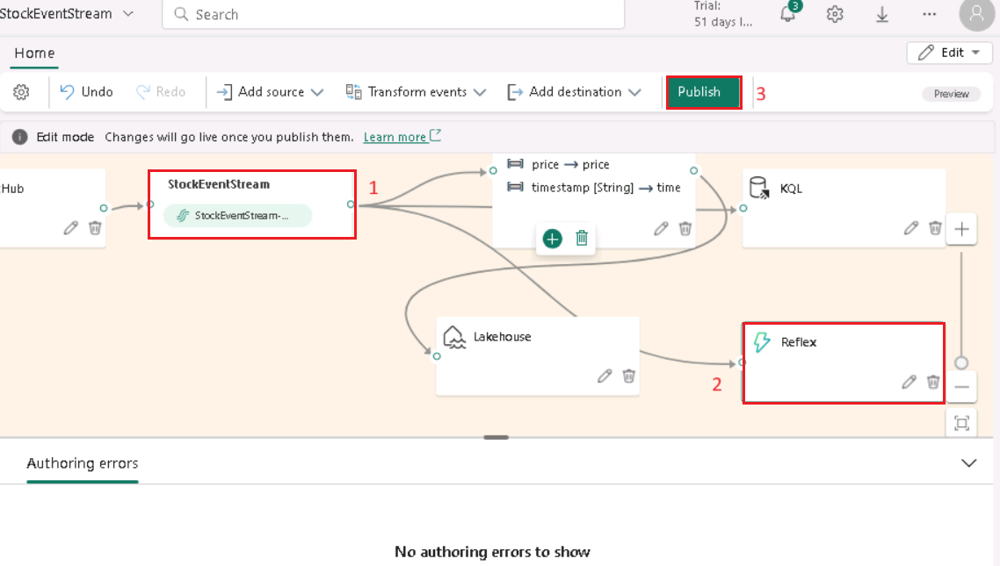

7.  Recibirá una notificación de que el destino "Reflex" **Successfully
    published**.

> 

8.  Una vez añadido el reflex, ábralo haciendo clic en el **enlace *Open
    item* **situado en la parte inferior de la página, como se muestra
    en la imagen siguiente.

> 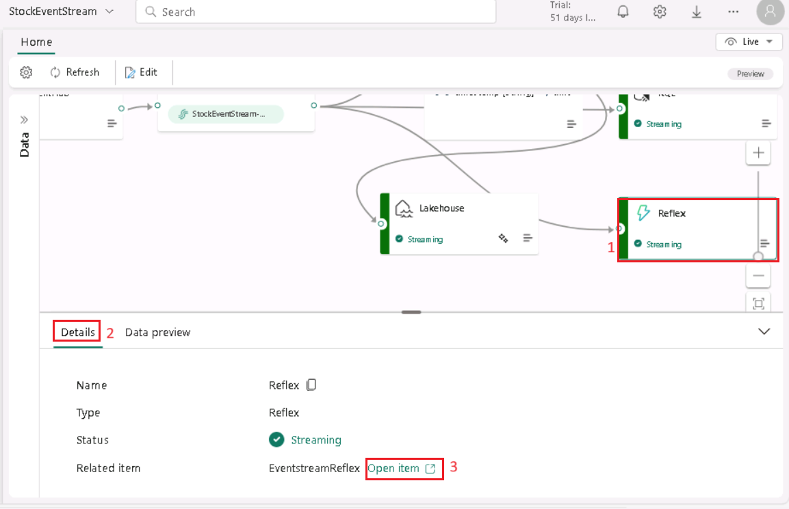
>
> **Nota**: En caso de que aparezca un error en el estado de Reflex,
> espere unos minutos y actualice la página.
>
> 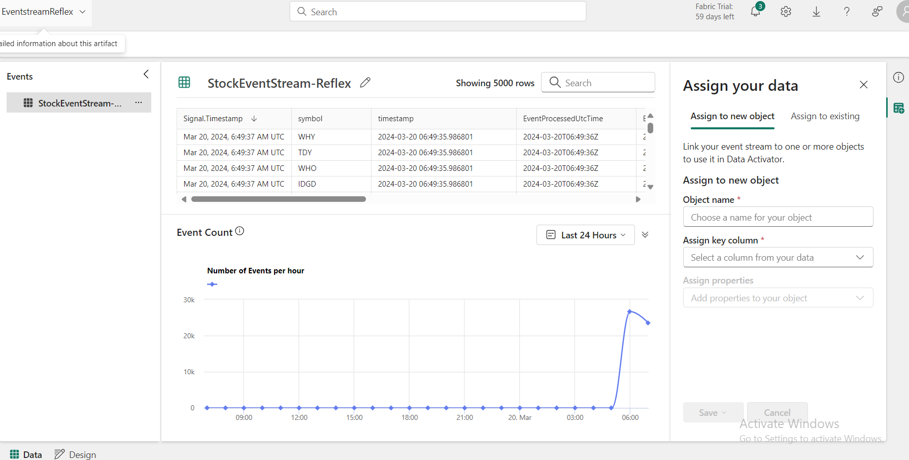

## Tarea 2: Configurar el objeto

1.  En la ventana **StockEventStram-Reflex**, introduzca los siguientes
    datos en el panel **Assign your data***.* A continuación, haga clic
    en ***Save** y* seleccione ***Save and go to design mode***.

- Object name - **Symbol**

- Assign key column **- symbol**

- Assign properties - select **price,timestamp**

2.  Una vez guardado, se cargará el Reflex. Seleccione el ***price*** en
    la propiedad.

> 

3.  Esto cargará una vista de la propiedad del precio para cada símbolo
    a medida que vayan llegando los eventos. En la parte derecha de la
    página, haga clic en el menú desplegable junto a ***Add***, luego
    navegue y seleccione ***Summarize* \> *Average over time ***como se
    muestra en la siguiente imagen.

4.  Configure el ***Average over time*** en **10 minutes**. En la
    esquina superior derecha de la página, establezca la ventana de
    tiempo en ***Last hour***, como se muestra en la imagen siguiente.
    Este paso promedia los datos en bloques de 10 minutos - esto ayudará
    a encontrar grandes oscilaciones en el precio.

5.  Para añadir un nuevo disparador, en la barra de navegación superior,
    haga clic en el botón ***New trigger***. En el cuadro de diálogo
    **Unsaved change**, haga clic en el botón **Save**.

6.  Cuando se cargue la página del nuevo disparador, cambie el nombre
    del disparador a ***Price increase***, como se muestra en la imagen
    siguiente.

7.  En la página Incremento de precios, haga clic en el desplegable
    situado junto a la **Select a property or event columna** y, a
    continuación, seleccione **Existing property** \> **price.**

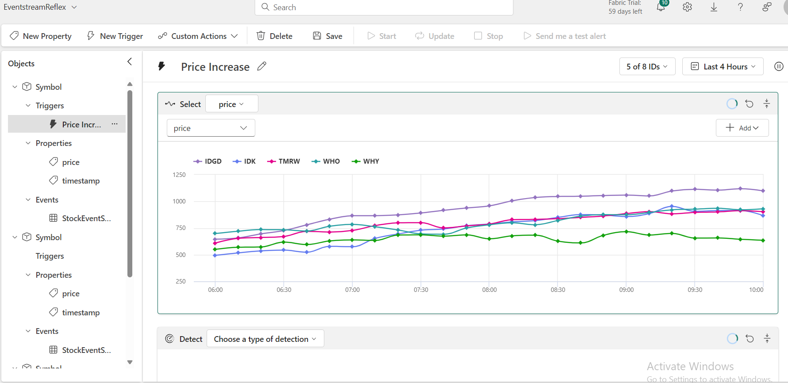

8.  Compruebe (y cambie si es necesario) que la ventana de tiempo de la
    parte superior derecha está ajustada en *Last hour*.

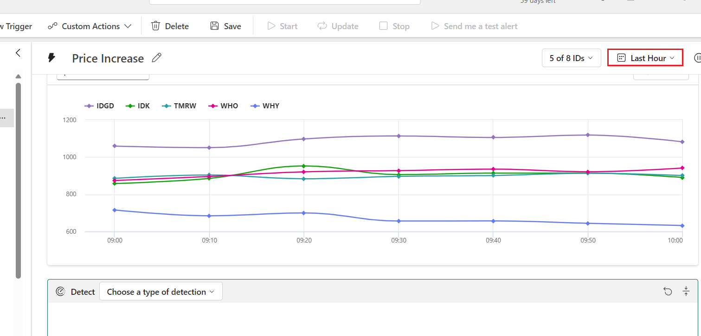

9.  Observe que el **gráfico de *precios ***debe conservar la vista
    resumida, promediando los datos en intervalos de 10 minutos. En la
    sección ***Detect***, configure el tipo de detección a
    ***Numeric*** \> ***Increases by.***

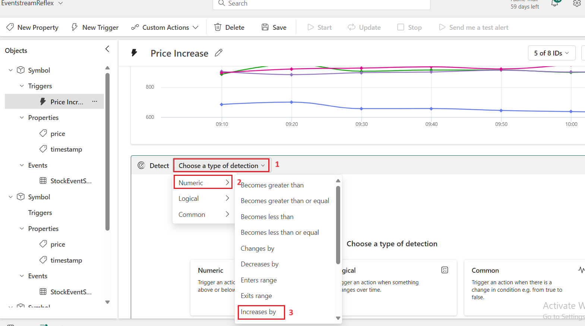

10. Establezca el tipo de incremento en ***Percentage***. Empiece con un
    valor de aproximadamente **6**, pero tendrá que modificarlo en
    función de la volatilidad de sus datos. Establezca este valor en
    ***From last measurement*** y ***Each time***, como se muestra a
    continuación:

11. Desplácese hacia abajo, haga clic en el desplegable junto a **Act**
    y seleccione **Email**. A continuación, haga clic en el desplegable
    del campo **Additional information** y selecciona las casillas de
    **price** y **timestamp**. A continuación, haga clic en el botón
    **Save** de la barra de comandos.

12. Recibirá una notificación como **Trigger saved**.

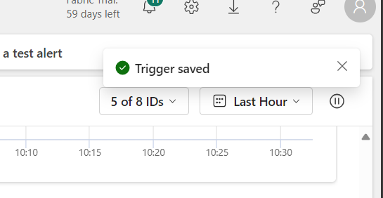

13. A continuación, haga clic en **Send me a test alert**.

**Nota importante:** Los usuarios que tengan una cuenta de prueba no
recibirán notificaciones.

# Ejercicio 2: Uso de Data Activator en Power BI

En este ejercicio, crearemos un Data Activator Reflex basado en un
informe de Power BI. La ventaja de este enfoque es la capacidad de
desencadenar a partir de más condiciones. Naturalmente, esto podría
incluir datos del Eventstream, cargados desde otras fuentes de datos,
aumentados con expresiones DAX, etc. Una limitación actual (que puede
cambiar a medida que Data Activator madure): Data Activator monitoriza
los informes de Power BI en busca de datos cada hora. Esto puede
introducir un retraso inaceptable, dependiendo de la naturaleza de los
datos.

## Tarea 1: Preparar el informe

Para cada informe, modifique las etiquetas de cada visual
renombrándolas. Aunque cambiarles el nombre obviamente hace que el
informe sea más legible en Power BI, esto también hará que sean más
legibles en Data Activator.

1.  Ahora, haga clic en **RealTimeWorkspace** en el menú de navegación
    de la izquierda.

2.  En el panel **RealTimeWorkspace**, navegue y haga clic en
    **RealTimeStocks** como se muestra en la imagen inferior.

3.  En la página **RealTimeStock**, haga clic en el botón **Edit** de la
    barra de comandos para abrir el editor de informes.

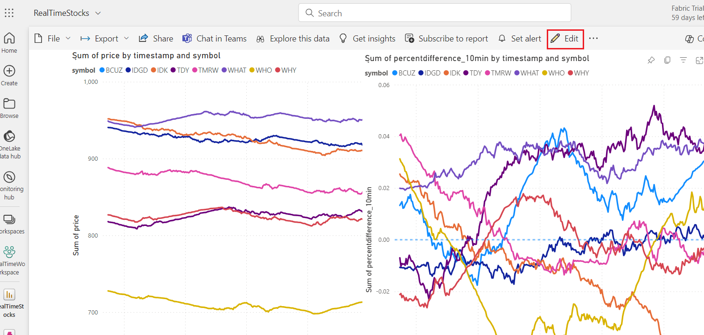

4.  Mientras se modifica el informe, es mejor desactivar temporalmente
    la actualización automática. Seleccione Página formal en
    Visualización y seleccione **Page refresh** como **Off.**

5.  En la página **RealTimeStock**, seleccione la opción **Sum of price
    by timestamp and symbol**.

6.  Ahora renómbralos seleccionando el desplegable de cada campo,
    seleccionando ***Rename for this visual*.** Renómbralos de forma
    similar a

- *timestamp* a **Timestamp**

>

- *sum of price* a *Price*

>
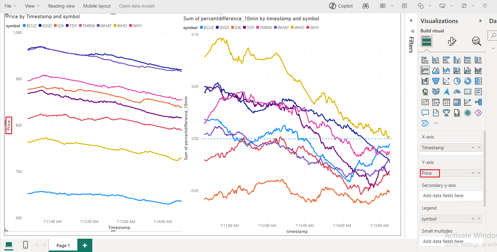

- *symbol* a **symbol**

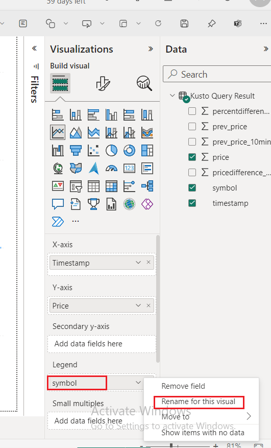

7.  En la página **RealTimeStock**, seleccione la opción **Sum of
    percentdifference_10min by timestamp and symbol**.

8.  Ahora renómbralos seleccionando el desplegable de cada campo,
    seleccionando **Rename for this visual** .Renómbralos de forma
    similar a

- timestamp a **Timestamp**

- symbol to **Symbol** 

- avg of percentdifference_10min a **Percent Change**

9.  Ahora, elimine temporalmente el filtro **Timestamp** (configurado
    para mostrar sólo los 5 minutos más recientes) haciendo clic en el
    botón ***Clear filter***  de la sección **Filters**.

10. Data Activator extraerá los datos del informe una vez cada hora;
    cuando se configura el Reflejo, los filtros también se aplican a la
    configuración. Queremos asegurarnos de que hay al menos una hora de
    datos para el Reflex; el filtro se puede volver a añadir después de
    configurar el Reflex.

## Tarea 2: Crear el activador

Configuraremos Data Activator para que active una alerta cuando el valor
de Cambio porcentual supere un determinado umbral (probablemente en
torno a 0,05).

1.  Para crear un **new Reflex** y **trigger**, haga clic en la
    **elipsis horizontal**, navegue y haga clic en ***Set alert*** como
    se muestra en la siguiente imagen.

2.  En el panel *Establecer una alerta*, la mayoría de los ajustes
    estarán preseleccionados. Utilice los siguientes ajustes como se
    muestra en la siguiente imagen:

- Visual: **Precent Change by Timestamp and Symbol**

- Measure: **Percent Change**

- Condition: **Becomes greater than**

- Threshold**: 0.05** (this will be changed later)

- Filters: **verify there are no filters affecting the visual**

- Notification type**: Email**

- Desmarque ***start my alert*** y haga clic en el botón ***Create
  alert***.

> 
>
> 

3.  Una vez guardado el reflejo, la notificación incluirá un enlace para
    editarlo: haga clic en el enlace para abrir el reflejo. El reflejo
    también puede abrirse desde la lista de elementos del espacio de
    trabajo.

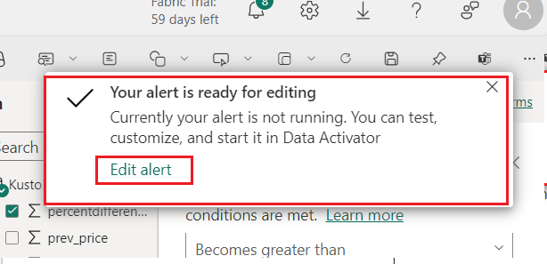

## Tarea 3: Configurar el Reflex

1.  Cuando se cargue la nueva página de activación, haga clic en el
    icono de lápiz del título y cambie el título a ***Percent Change
    High***.

> 
>
> 

2.  Seleccione Last 24 hours.

> 

3.  A continuación, añada dos propiedades para Symbol y Timestamp.

4.  Haga clic en ***new property*** en la esquina superior izquierda de
    la página, haga clic en el desplegable junto a Select a property or
    even column \> Column from an event stream or record \> Percent
    Change \> Symbol.

> 
>
> 

5.  Del mismo modo, haga clic en el menú desplegable junto a Select a
    property or even column \> Column from an event stream or record \>
    Percent Change \> **timestamp** como se muestra en las siguientes
    imágenes. Haga clic en el icono del lápiz junto a timestamp y cambie
    el nombre a Timestamp.

> 
>
> 

6.  Haga clic en el activador Percent Change High en la lista Objects \>
    Triggers. La ventana superior mostrará los datos de las últimas 4
    horas y se actualizará cada hora. La segunda ventana define el
    umbral de detección. Puede que necesite modificar este valor para
    hacerlo más o menos restrictivo. Aumentar el valor reducirá el
    número de detecciones -- cambie este valor para que haya pocas
    detecciones, similar a la imagen de abajo. Los valores específicos
    cambiarán ligeramente con la volatilidad de sus datos.

> 
>
> 
>
> 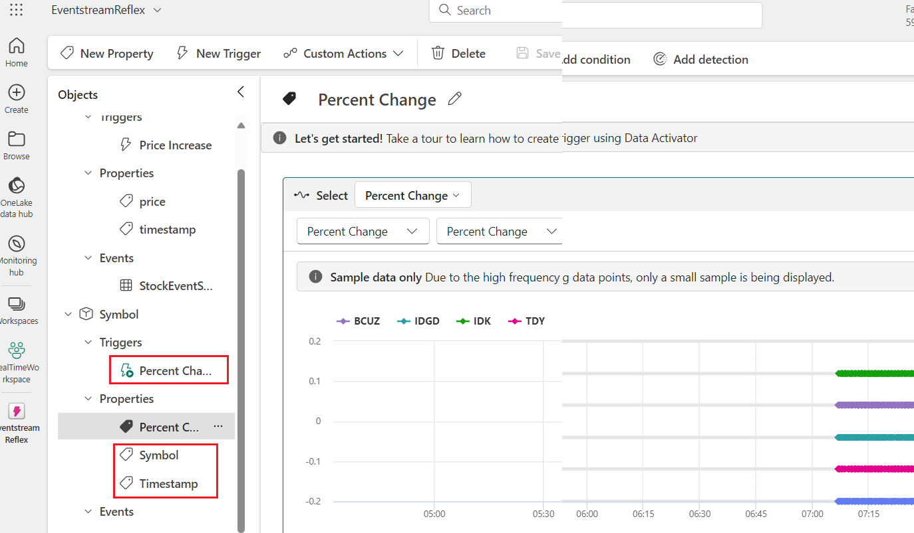
>
> 

## Tarea 4: Configurar la notificación

1.  Por último, configure la *Ley* para enviar un mensaje, tal y como se
    hizo en el Reflejo anterior. Haga clic en el campo **Additional
    information** y seleccione **Percent Change**, **Symbol**,
    **Timestamp** y, a continuación, haga clic en el botón **Save**,
    como se muestra en la imagen siguiente.

> 

2.  Haga clic en **Send me a test alert**.

> 

**Nota importante:** Los usuarios que tengan una cuenta de prueba no
recibirán notificaciones.

## **Resumen**

En este laboratorio, ha configurado Data Activator para supervisar los
cambios en el precio de las acciones y activar notificaciones basadas en
criterios predefinidos. Ha configurado el espacio de trabajo necesario y
ha navegado hasta la página RealTimeStocks. A continuación, ha añadido
una salida Reflex al StockEventStream y la ha configurado para detectar
grandes subidas de precios. El Reflex se configuró para analizar los
datos de precios en intervalos de 10 minutos y enviar notificaciones por
correo electrónico cuando se detectan cambios significativos en los
precios. También ha aprendido a probar el Reflex para garantizar su
correcto funcionamiento.

A continuación, ha creado un reflejo de Data Activator activado por
condiciones dentro de un informe de Power BI. Ha modificado los
elementos visuales del informe de Power BI para garantizar la
compatibilidad con Data Activator y ha establecido las etiquetas
adecuadas para cada elemento visual. A continuación, ha configurado
alertas en Data Activator para activar notificaciones cuando se superan
umbrales específicos, como un cambio porcentual significativo en los
precios de las acciones. Además, ha aprendido a probar el reflejo y a
personalizar el contenido de la notificación para incluir información
relevante como la marca de tiempo y el símbolo.
