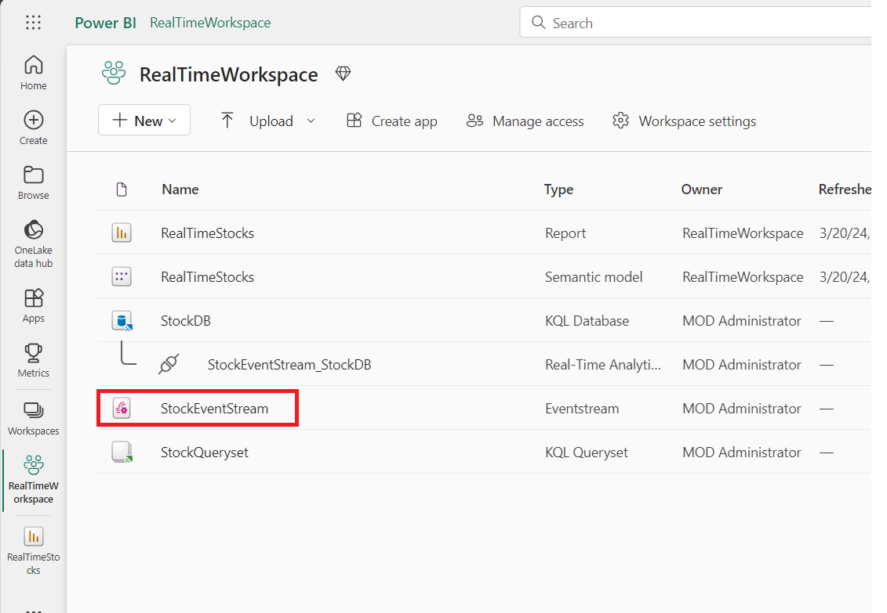
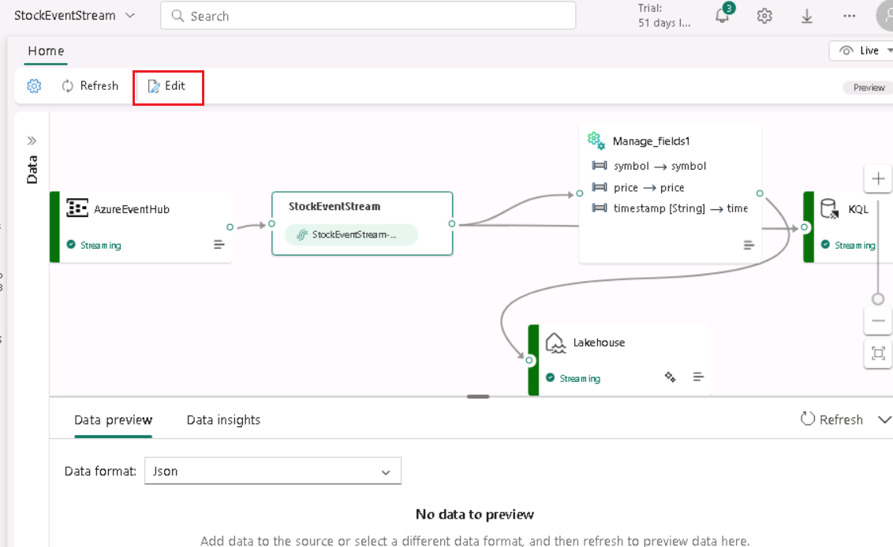
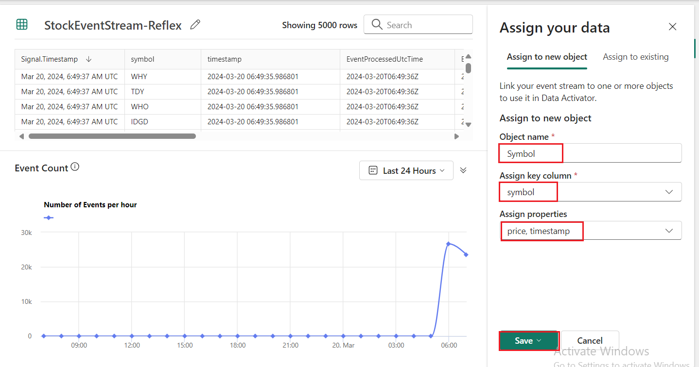
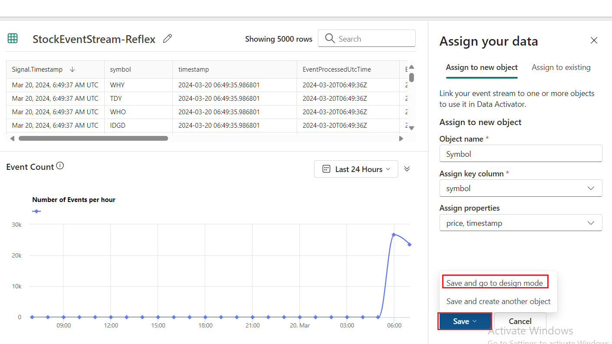
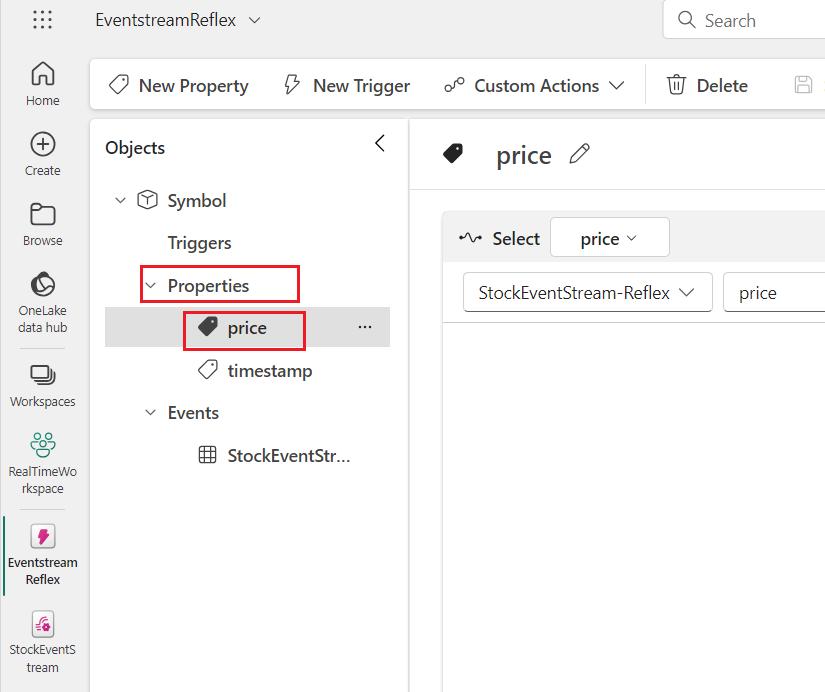
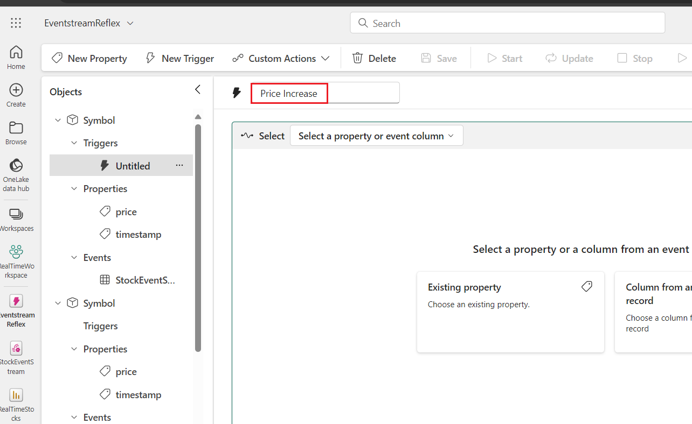
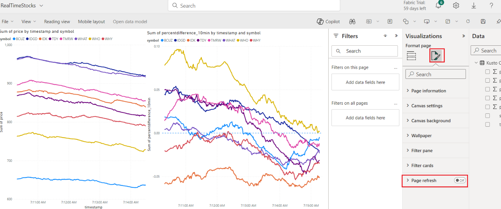

# Lab 06 - Data Activator (Optional)

**Introduction**

Data Activator is an observability tool for automatically monitoring and
taking actions when certain conditions (or patterns) are detected in a
datastream. Common use cases include monitoring IoT devices, sales data,
performance counters, and system health. Actions are typically
notifications (such as e-mails or Teams messages) but can also be
customized to launch Power Automate workflows, for example.

Currently, Data Activator can consume data from Power BI and Fabric
Eventstreams (such as Azure Event Hubs, Kafka, etc.). In the future,
additional sources (like KQL querysets) and more advanced triggering
will be added. Read the [Data Activator
roadmap](https://learn.microsoft.com/en-us/fabric/release-plan/data-activator) for
more information.

In this lab, we'll use Data Activator to monitor both Eventstreams and
Power BI reports. When we configure Data Activator, we set up one or
more *Reflexes*. A Data Activator Reflex is the container that holds all
of the information needed about the data connection, the events, and
triggers.

**Objectives**

- Configure Data Activator to detect significant price increases in
  stock symbols.

- Set up a Reflex in Data Activator to trigger notifications based on
  price fluctuations.

- Utilize Eventstream data to monitor and analyze stock price changes in
  real-time.

- Create a Data Activator Reflex triggered by conditions in a Power BI
  report.

- Customize Power BI report visuals for optimal readability and
  compatibility with Data Activator.

- Set thresholds and configure alerts in Data Activator to notify users
  of significant changes in data.

# Exercise 1: Using Data Activator with an Eventstream

In this exercise, we'll configure Data Activator to detect a large
increase in price of a stock symbol and send a notification.

## Task 1: Prepare the report

1.  On the **RealTimeStocks** page, click on **RealTimeWorkspace**
    Workspace on the left-sided navigation menu.
     

2.  In **RealTimeWorkspace** window, navigate and click on
    **StockEventStream** .
    
3.  On the **Eventstream**, click on the **Edit** button
     

4.  On the ***StockEventstream*** page, add a new output by dropdown the
    **Add destination**, and select **Reflex** as shown in the below
    image.
     
5.  Configure the Reflex as follows and then click on the ***Save***
    button**:**

- Destination name: **+++Reflex+++**

- Workspace: **RealTimeWorkspace** (or the name of your workspace)

- Create a new Reflex named **+++EventstreamReflex+++** and click on
  **Done** button.
     

6.  You will get a notification that the destination “Reflex” was
    **Successfully added**.
    

6.  Connect **StockEventStream** and **Reflex.** Click on **Publish**
    button.
     

7.  You will get a notification that the destination **“Reflex”** was
    **Successfully published**.

      

8.  After the Reflex is added, open the Reflex by clicking the **Open
    item link** at the bottom of the page as shown in the below image.
     

> **Note**: In case, you see Error in the Status of Reflex, then wait
> for few minutes and refresh the page.
>
  

## Task 2: Configure the object

1.  In **StockEventStram-Reflex** window, enter the following details in
    the **Assign your data*** *pane*.* Then, click on ***Save*** and
    select ***Save and go to design mode***.

- Object name - **Symbol**

- Assign key column **- symbol**

- Assign properties - select **price,timestamp**

    
    

2.  Once saved, the Reflex will load. Select ***price* **under property.
      
      

3.  This will load a view of the price property for each symbol as the
    events are coming in. On the right side of the page, click on the
    dropdown beside **Add**, then navigate and
    select **Summarize** \> Average over time as shown in the below
    image.
      

4.  Configure the **Average over time** to **10 minutes**. In the
    upper right corner of the page, set the time window to the **Last
    Hour**, as shown in the below image. This step averages the data
    over 10 minute blocks - this will help in finding larger swings in
    price.
     
     

5.  To add a new trigger, in the top navigation bar, click on the **New
    Trigger** button. In the **Unsaved change** dialog box, click on
    the **Save** button.
      
      
      

6.  When the new trigger page loads, change the name of the trigger
    to **Price Increase** as shown in the below image.
     

7.  In the Price Increase page, click on the dropdown beside **Select a
    property or event column**, then select **Existing property** \>
    **price** .
      

      

8.  Verify (and change if needed) the time window in the upper right is
    set to *Last Hour*.

      
9.  Notice that the ***price* chart** should retain the summarized view,
    averaging data in 10 minute intervals. In the ***Detect*** section,
    configure the type of detection to ***Numeric*** \> **Increases
    by**.

      

10. Set the type of increase to ***Percentage***. Start with a value of
    about **6**, but you will need to modify this depending on the
    volatility of your data. Set this value to ***From last
    measurement*** and ***Each time***, as shown below:

     

11. Scroll down, click on the dropdown beside **Act** and select
    **Email**. Then, click on the dropdown in the **Additional
    information** field and select the checkboxes of **price** and
    **timestamp**. Then, click on the **Save** button in the command
    bar.
     

12. You will receive a notification as **Trigger saved**.
    

13. Then, click on **Send me a test alert**.
    

**Important Note:**  Users having a trial account won't receive
notifications.

# Exercise 2: Using Data Activator in Power BI

In this exercise, we'll create a Data Activator Reflex based off a Power
BI report. The advantage in this approach is the ability to trigger off
of more conditions. Naturally, this might include data from the
Eventstream, loaded from other data sources, augmented with DAX
expressions, and so forth. One current limitation (which may change as
Data Activator matures): Data Activator monitors Power BI reports for
data every hour. This may introduce an unacceptable delay, depending on
the nature of the data.

## Task 1: Prepare the report

For each report, modify the labels for each visual by renaming them.
While renaming them obviously makes the report more readable in Power
BI, this will also make them more readable in Data Activator.

1.  Now, click on **RealTimeWorkspace** on the left-sided navigation
    menu.
    
2.  In the **RealTimeWorkspace** pane, navigate and click on
    **RealTimeStocks** as shown in the below image.
     
     

3.  On the **RealTimeStock** page, click on the **Edit** button in the
    command bar to open the report editor.
     
4.  While modifying the report, it's best to disable auto-refresh
    temporarily. Select Formal page under Visualization and select the
    **Page refresh** as **Off.**
     

5.  On the **RealTimeStock** page ,select the **Sum of price by
    timestamp and symbol**.

6.  Now rename them by selecting the drop-down on each field,
    selecting **Rename for this visual**. Rename them similar to:

- timestamp to **Timestamp**
      
      

- **sum of price** to **Price**
      
      

- **symbol** to **Symbol**
     
     

7.  On the **RealTimeStock** page, select the **Sum of
    percentdifference_10min by timestamp and symbol**.
     

8.  Now rename them by selecting the drop-down on each field,
    selecting ***Rename for this visual** .Rename them similar to:

- timestamp to **Timestamp** 

- symbol to **Symbol** 

- avg of percentdifference_10min to **Percent Change**

      

9.  Now, temporarily remove the **Timestamp** filter (set to display
    only the most recent 5 minutes) by clicking on the **Clear
    filter** button under **Filters** section.
     
10. Data Activator will pull report data once every hour; when the
    Reflex is configured, filters are also applied to the configuration.
    We want to make sure there's at least an hour of data for the
    Reflex; the filter can be added back after the Reflex is configured.
      

## Task 2: Create the trigger

We'll configure Data Activator to trigger an alert when the Percent
Change value moves above a certain threshold (likely around 0.05).

1.  To create a **new Reflex** and **trigger**, click on the
    **horizontal** **ellipsis**, navigate and click on **Set alert**
    as shown in the below image.
      
2.  In the *Set an alert* pane, most settings will be pre-selected. Use
    the following settings as shown in the below image:

- Visual: **Precent Change by Timestamp and Symbol**

- Measure: **Percent Change**

- Condition: **Becomes greater than**

- Threshold**: 0.05** (this will be changed later)

- Filters: **verify there are no filters affecting the visual**

- Notification type**: Email**

- Uncheck **Start my alert** and click on **Create alert** button.
     
     
3.  After the Reflex is saved, the notification should include a link to
    edit the Reflex -- click on the link to open the Reflex. The Reflex
    can also be opened from the workspace items list.
     
     

## Task 3: Configure the Reflex

1.  When the new trigger page loads, click on the pencil icon on the
    title and change the title to **Percent Change High**.

     
     
2.  Select the Last 24 Hours.
     

3.  Next, add two properties for Symbol and Timestamp.

4.  Click on **New Property** in the upper left corner of the page,
    click on the dropdown beside Select a property or even column \>
    Column from an event stream or record \> Percent Change \> Symbol.
     
     
5.  Similarly, click on the dropdown beside Select a property or even
    column \> Column from an event stream or record \> Percent Change \>
    **timestamp** as shown in the below images. Click on the pencil icon
    beside timestamp and change the name to Timestamp.
     
     

6.  Click on the Percent Change High trigger under the Objects \>
    Triggers list. The top window will show data for the past 4 hours,
    and will be updated every hour. The second window defines the
    detection threshold. You may need to modify this value to make it
    either more or less restrictive. Increasing the value will reduce
    the number of detections -- change this value so there are a few
    detections, similar to the image below. The specific values will
    change slightly with your data volatility.
      
      
      
      
## Task 4: Configure the notification

1.  Finally, configure the *Act* to send an message, as done in the
    previous Reflex. Click in the **Additional information** field and
    select **Percent Change**, **Symbol**, **Timestamp**, then click on
    the **Save** button as shown in the below image.

     
2.  Click on **Send me a test alert**.
     
**Important Note:**  Users having a trial account won't receive
notifications.

## **Summary**

In this lab, you’ve configured Data Activator to monitor stock price
changes and triggered notifications based on predefined criteria. You’ve
set up the necessary workspace and navigated to the RealTimeStocks page.
Then, you’ve added a Reflex output to the StockEventStream and
configured it to detect large price increases. The Reflex was configured
to analyze price data over 10-minute intervals and sent email
notifications when significant price changes are detected. You’ve also
learned how to test the Reflex to ensure proper functionality.

Then, you’ve created a Data Activator Reflex triggered by conditions
within a Power BI report. You’ve modified the Power BI report visuals to
ensure compatibility with Data Activator and set appropriate labels for
each visual element. Then, you’ve configured alerts in Data Activator to
trigger notifications when specific thresholds are exceeded, such as a
significant percentage change in stock prices. Additionally, you’ve
learned how to test the Reflex and customize the notification content to
include relevant information such as timestamp and symbol.
