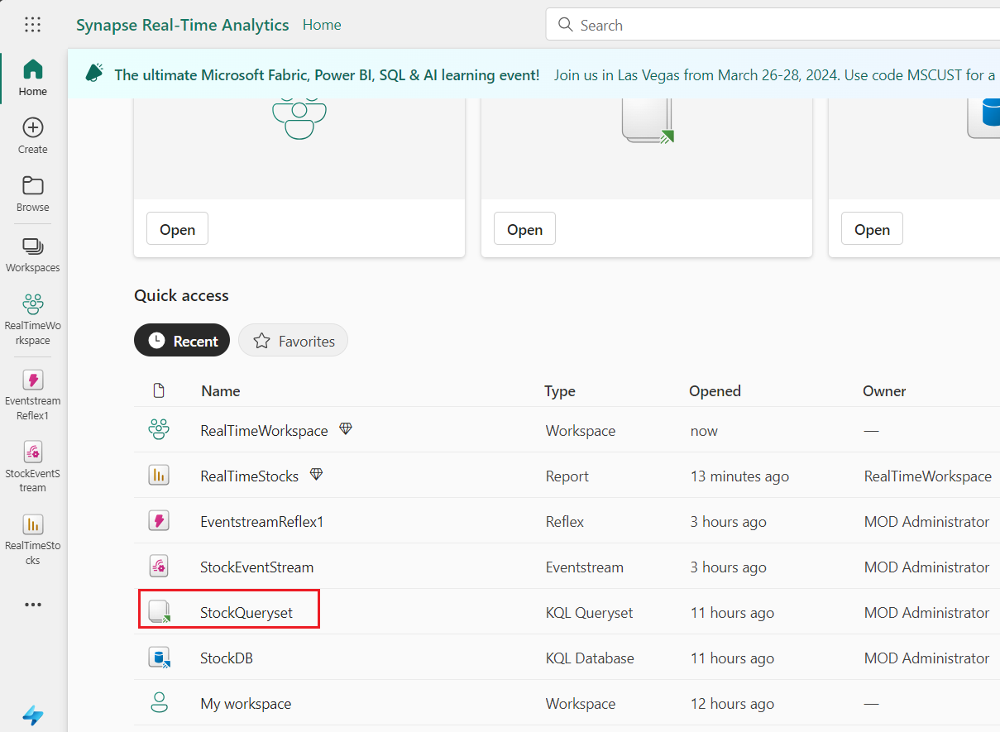
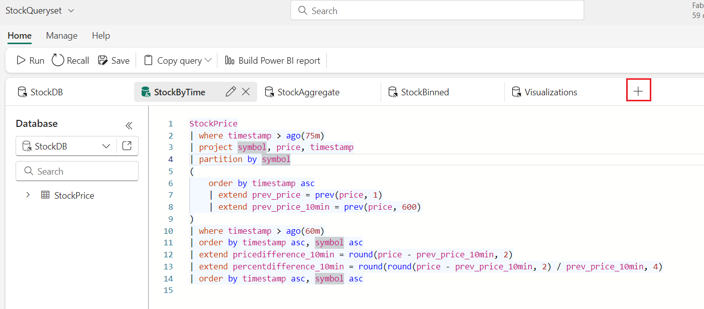
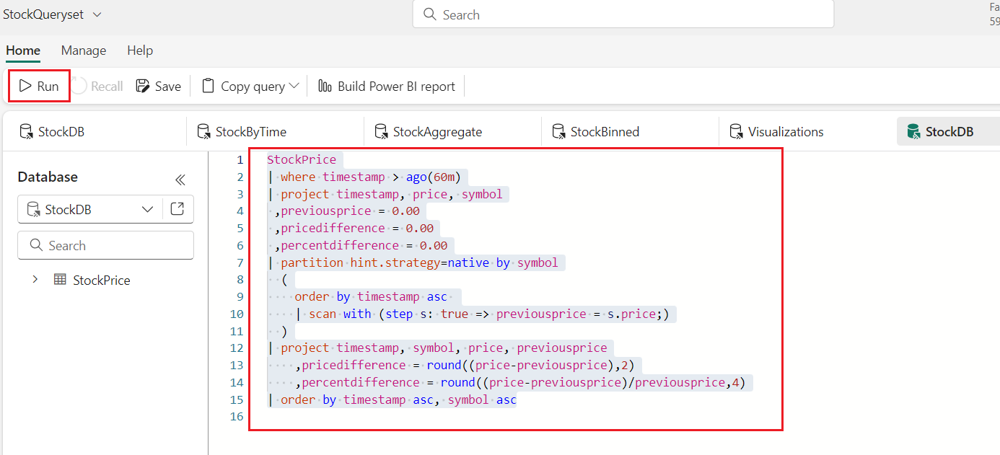
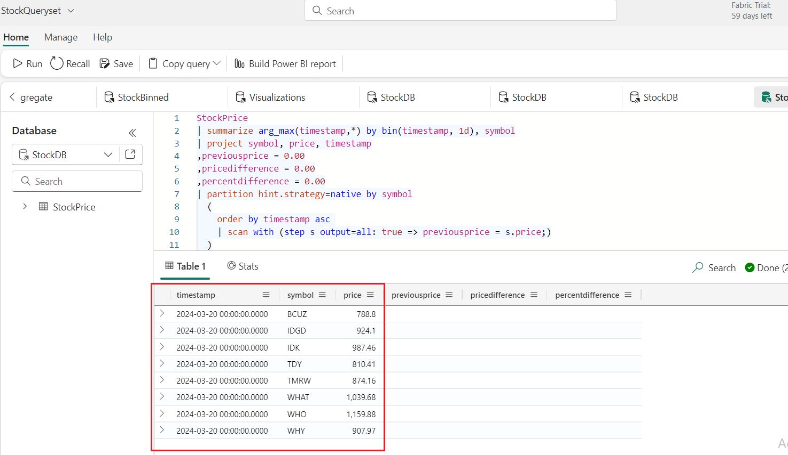
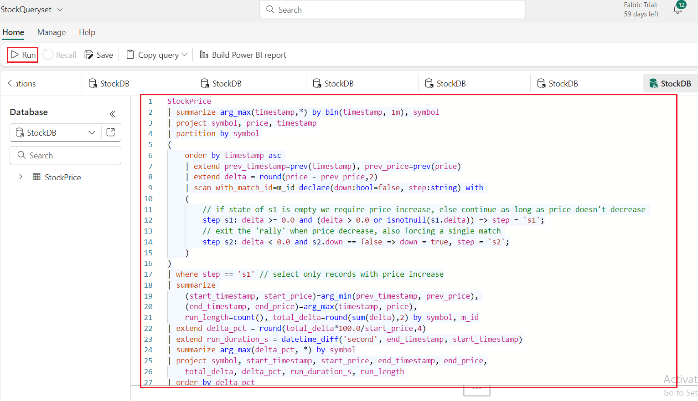

**Introducción**

En este laboratorio, explorará conceptos adicionales de KQL.

**Objetivos**

- Examinar la estructura y ejecución de una consulta KQL original,
  utilizar el operador de escaneo y realizar minería de datos utilizando
  el operador de escaneo.

- Explorar la aplicación de la función bin para agregar datos en grupos
  más amplios.

- Combinar los operadores bin y scan para examinar las concentraciones
  en cualquier intervalo de tiempo.

## Tarea 1: Examinar la consulta original

1.  Haga clic en **RealTimeWorkspace** Workspace en el menú de
    navegación de la izquierda.

     

2.  En el panel **RealTimeWorkspace**, seleccione **StockQueryset** de
    tipo KQL Queryset.

     

     

3.  Recupere la consulta **StockByTime** original, seleccione la
    consulta y haga clic en el botón **Run** para ejecutar la consulta.
    Después de que la consulta se ejecute correctamente, verá los
    resultados.
```
StockPrice
| where timestamp > ago(75m)
| project symbol, price, timestamp
| partition by symbol
(
    order by timestamp asc
    | extend prev_price = prev(price, 1)
    | extend prev_price_10min = prev(price, 600)
)
| where timestamp > ago(60m)
| order by timestamp asc, symbol asc
| extend pricedifference_10min = round(price - prev_price_10min, 2)
| extend percentdifference_10min = round(round(price - prev_price_10min, 2) / prev_price_10min, 4)
| order by timestamp asc, symbol asc
```
   

4.  Esta consulta aprovecha tanto la partición como las funciones
    anteriores. Los datos se particionan para garantizar que la función
    anterior sólo tenga en cuenta las filas que coincidan con el mismo
    símbolo.

     
## Tarea 2: Utilizar el operador de exploración

Muchas de las consultas que nos gustaría utilizar necesitan información
adicional en forma de agregaciones o valores anteriores. En SQL, es
posible recordar que las agregaciones se hacen a menudo a través *de
group by*, y las búsquedas se pueden hacer a través de una *correlated
subquery*. KQL no tiene subconsultas correlacionadas directamente, pero
afortunadamente puede manejar esto de varias maneras, y la más flexible
en este caso es usar una combinación de la [sentencia
partition](https://learn.microsoft.com/en-us/azure/data-explorer/kusto/query/partitionoperator)
y el [operador
scan](https://learn.microsoft.com/en-us/azure/data-explorer/kusto/query/scan-operator).

El operador de partición, como hemos visto, crea subtablas basadas en la
clave especificada, mientras que el operador de escaneo empareja
registros de acuerdo con predicados especificados. Aunque sólo
necesitamos una regla muy simple (hacer coincidir la fila anterior para
cada símbolo), el operador de escaneo puede ser muy potente, ya que
estos pasos y predicados pueden encadenarse.

1.  Considere la siguiente consulta KQL, que dará resultados similares a
    nuestra consulta KQL anterior que utiliza la función prev():

2.  Cree una nueva pestaña dentro del conjunto de consultas haciendo
    clic en el **icono +** situado en la parte superior de la ventana.

    

3.  En el editor de consultas, copie y pegue el siguiente código. Haga
    clic en el botón **Run** para ejecutar la consulta.
```
StockPrice
| where timestamp > ago(60m)
| project timestamp, price, symbol
 ,previousprice = 0.00
 ,pricedifference = 0.00
 ,percentdifference = 0.00
| partition hint.strategy=native by symbol
  (
    order by timestamp asc 
    | scan with (step s: true => previousprice = s.price;)
  )
| project timestamp, symbol, price, previousprice
    ,pricedifference = round((price-previousprice),2)
    ,percentdifference = round((price-previousprice)/previousprice,4)
| order by timestamp asc, symbol asc
```

    

4.  Esta consulta es similar en estructura a nuestra consulta original,
    excepto que en lugar de utilizar la función prev() para buscar en la
    fila anterior de los datos particionados, el operador scan puede
    escanear las filas anteriores.

     

## Tarea 3: Extraer los datos con el escáner

El operador de exploración puede contener cualquier número de pasos que
exploren las filas que coincidan con los predicados especificados. El
poder viene del hecho de que estos pasos pueden encadenar el estado
aprendido de los pasos anteriores. Esto nos permite hacer minería de
procesos en los datos;

Por ejemplo, supongamos que queremos encontrar repuntes bursátiles: se
producen cuando hay un aumento continuo del precio de las acciones.
Puede que el precio haya subido mucho en poco tiempo o que haya subido
lentamente durante mucho tiempo. Mientras el precio siga subiendo, nos
gustaría examinar estos rallies.

1.  Basándonos en los ejemplos anteriores, primero utilizamos la función
    prev() para obtener el precio anterior de la acción. Utilizando el
    operador scan, el primer paso (*s1*) busca un incremento desde el
    precio anterior. Esto continúa mientras el precio aumente. Si la
    acción disminuye, el paso *s2* marca la variable *hacia abajo*,
    esencialmente reiniciando el estado y terminando el rally:

2.  Cree una nueva pestaña dentro del conjunto de consultas haciendo
    clic en el **icono +** situado en la parte superior de la ventana.

      

3.  En el editor de consultas, copie y pegue el siguiente código. Haga
    clic en el botón **Run** para ejecutar la consulta.
```
StockPrice
| project symbol, price, timestamp
| partition by symbol
(
    order by timestamp asc 
    | extend prev_timestamp=prev(timestamp), prev_price=prev(price)
    | extend delta = round(price - prev_price,2)
    | scan with_match_id=m_id declare(down:bool=false, step:string) with 
    (
        // if state of s1 is empty we require price increase, else continue as long as price doesn't decrease 
        step s1: delta >= 0.0 and (delta > 0.0 or isnotnull(s1.delta)) => step = 's1';
        // exit the 'rally' when price decrease, also forcing a single match 
        step s2: delta < 0.0 and s2.down == false => down = true, step = 's2';
    )
)
| where step == 's1' // select only records with price increase
| summarize 
    (start_timestamp, start_price)=arg_min(prev_timestamp, prev_price), 
    (end_timestamp, end_price)=arg_max(timestamp, price),
    run_length=count(), total_delta=round(sum(delta),2) by symbol, m_id
| extend delta_pct = round(total_delta*100.0/start_price,4)
| extend run_duration_s = datetime_diff('second', end_timestamp, start_timestamp)
| summarize arg_max(delta_pct, *) by symbol
| project symbol, start_timestamp, start_price, end_timestamp, end_price,
    total_delta, delta_pct, run_duration_s, run_length
| order by delta_pct
```


         

4.  El resultado anterior busca la mayor ganancia porcentual en un
    rally, independientemente de su duración. Si queremos ver el rally
    más largo, podemos cambiar el resumen:

5.  Cree una nueva pestaña dentro del conjunto de consultas haciendo
    clic en el **icono +**, como se muestra en la imagen siguiente.

     

6.  En el editor de consultas, copie y pegue el siguiente código.
    Seleccione el botón **Ejecutar** para ejecutar la consulta
```
StockPrice
| project symbol, price, timestamp
| partition by symbol
(
    order by timestamp asc 
    | extend prev_timestamp=prev(timestamp), prev_price=prev(price)
    | extend delta = round(price - prev_price,2)
    | scan with_match_id=m_id declare(down:bool=false, step:string) with 
    (
        // if state of s1 is empty we require price increase, else continue as long as price doesn't decrease 
        step s1: delta >= 0.0 and (delta > 0.0 or isnotnull(s1.delta)) => step = 's1';
        // exit the 'rally' when price decrease, also forcing a single match 
        step s2: delta < 0.0 and s2.down == false => down = true, step = 's2';
    )
)
| where step == 's1' // select only records with price increase
| summarize 
    (start_timestamp, start_price)=arg_min(prev_timestamp, prev_price), 
    (end_timestamp, end_price)=arg_max(timestamp, price),
    run_length=count(), total_delta=round(sum(delta),2) by symbol, m_id
| extend delta_pct = round(total_delta*100.0/start_price,4)
| extend run_duration_s = datetime_diff('second', end_timestamp, start_timestamp)
| summarize arg_max(run_duration_s, *) by symbol
| project symbol, start_timestamp, start_price, end_timestamp, end_price,
    total_delta, delta_pct, run_duration_s, run_length
| order by run_duration_s

```

    

## Tarea 4: Añadir la papelera a la mezcla

En esta tarea, vamos a examinar más detenidamente una sentencia de
agregación fundamental de KQL: [la función
bin](https://learn.microsoft.com/en-us/azure/data-explorer/kusto/query/binfunction).
La función bin nos permite crear grupos de un tamaño determinado
especificado por los parámetros bin. Esto es especialmente potente con
los tipos *datetime* y *timespan*, ya que podemos combinarla con el
operador *summarize* para crear vistas más amplias de nuestros datos.

1.  Por ejemplo, nuestros datos bursátiles tienen una precisión por
    segundos, útil para nuestro cuadro de mandos en tiempo real, pero
    demasiados datos para la mayoría de los informes. Supongamos que
    queremos agregarlos en grupos más amplios, como días, horas o
    incluso minutos. Además, supongamos que el último precio de cada día
    (probablemente 23:59:59 para nuestros datos) servirá como "precio de
    cierre".

2.  Para obtener el precio de cierre de cada día, podemos basarnos en
    nuestras consultas anteriores y añadir una papelera.

3.  Cree una nueva pestaña dentro del conjunto de consultas haciendo
    clic en el **icono +** situado en la parte superior de la ventana.


4.  En el editor de consultas, copie y pegue el siguiente código.
    Seleccione el botón **Ejecutar** para ejecutar la consulta
```
StockPrice
| summarize arg_max(timestamp,*) by bin(timestamp, 1d), symbol
| project symbol, price, timestamp
,previousprice = 0.00
,pricedifference = 0.00
,percentdifference = 0.00
| partition hint.strategy=native by symbol
  (
    order by timestamp asc 
    | scan with (step s output=all: true => previousprice = s.price;)
  )
| project timestamp, symbol, price, previousprice
    ,pricedifference = round((price-previousprice),2)
    ,percentdifference = round((price-previousprice)/previousprice,4)
| order by timestamp asc, symbol asc
```


5.  Esta consulta aprovecha las sentencias *summarize* y *bin* para
    agrupar los datos por día y símbolo. El resultado es el precio de
    cierre de cada acción por día. También podemos añadir precios
    mínimos/máximos/medios según sea necesario, y alterar el tiempo de
    agrupación según sea necesario.

      

## Tarea 5: Combinar papelera y escáner

1.  Aunque la búsqueda de repuntes por segundo es muy útil para nuestros
    datos de corta duración, puede que no sea demasiado realista.
    Podemos combinar la consulta de repuntes con el bin para agrupar los
    datos en periodos de tiempo más largos, buscando así repuntes en
    cualquier intervalo que deseemos.

2.  Cree una nueva pestaña dentro del conjunto de consultas haciendo
    clic en el **icono +**.

       

3.  En el editor de consultas, copie y pegue el siguiente código. Haga
    clic en el botón **Run** para ejecutar la consulta.
```
StockPrice
| summarize arg_max(timestamp,*) by bin(timestamp, 1m), symbol
| project symbol, price, timestamp
| partition by symbol
(
    order by timestamp asc 
    | extend prev_timestamp=prev(timestamp), prev_price=prev(price)
    | extend delta = round(price - prev_price,2)
    | scan with_match_id=m_id declare(down:bool=false, step:string) with 
    (
        // if state of s1 is empty we require price increase, else continue as long as price doesn't decrease 
        step s1: delta >= 0.0 and (delta > 0.0 or isnotnull(s1.delta)) => step = 's1';
        // exit the 'rally' when price decrease, also forcing a single match 
        step s2: delta < 0.0 and s2.down == false => down = true, step = 's2';
    )
)
| where step == 's1' // select only records with price increase
| summarize 
    (start_timestamp, start_price)=arg_min(prev_timestamp, prev_price), 
    (end_timestamp, end_price)=arg_max(timestamp, price),
    run_length=count(), total_delta=round(sum(delta),2) by symbol, m_id
| extend delta_pct = round(total_delta*100.0/start_price,4)
| extend run_duration_s = datetime_diff('second', end_timestamp, start_timestamp)
| summarize arg_max(delta_pct, *) by symbol
| project symbol, start_timestamp, start_price, end_timestamp, end_price,
    total_delta, delta_pct, run_duration_s, run_length
| order by delta_pct
```

  

  

## **Resumen**

Este laboratorio tiene como objetivo mejorar su comprensión y
competencia en el uso de Kusto Query Language (KQL) dentro del entorno
RealTimeWorkspace, centrándose en técnicas avanzadas para el análisis de
datos de precios de acciones.

En este laboratorio, ha ejecutado la consulta StockByTime original, que
emplea las funciones partitioning y previous para analizar los precios
de las acciones a lo largo del tiempo. A continuación, ha utilizado el
operador de exploración como alternativa a la función prev(). Ha
realizado la minería de datos utilizando el operador de exploración para
identificar los repuntes de las acciones, demostrando su flexibilidad
para detectar patrones específicos en los datos.

Ha explorado la función bin, una sentencia de agregación fundamental de
KQL, para agregar datos bursátiles en grupos más amplios basados en
intervalos de tiempo especificados. A continuación, ha combinado los
operadores bin y scan para agrupar los datos en periodos más largos,
facilitando la identificación de repuntes en cualquier intervalo
deseado. Ha adquirido experiencia práctica en la combinación de
múltiples operadores KQL para llevar a cabo tareas de análisis
exhaustivo de conjuntos de datos de precios de acciones.
