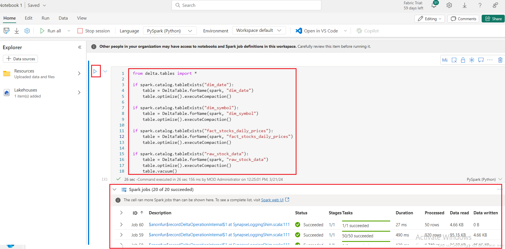

**실습 08-델타 파일 유지 관리**

**소개**

실시간 데이터를 Data Lakehouse로 수집할 때, Delta 테이블은 여러 개의
작은 Parquet 파일에 분산되어 있는 경향이 있습니다. 작은 파일이 많으면
대량의 I/O 오버헤드가 발생하여 쿼리 실행 속도가 느려지는데, 이를 흔히
"작은 파일 문제"라고 합니다. 이 모듈에서는 Delta 테이블 최적화에 대해
살펴봅니다.

**목표**

- Delta Lake에서 작은 파일 압축을 수행하기

## 연습 1: 작은 파일 압축

Eventstream이 계속해서 Data Lakehouse에 데이터를 쓰면 매일 수천 개의
파일이 생성되어 쿼리를 실행할 때 전체 성능에 영향을 미칩니다. 노트북을
실행할 때, 진단 엔진에서 테이블이 작은 파일 압축(작은 파일을 여러 개의
큰 파일로 결합하는 프로세스)을 통해 이점을 얻을 수 있다는 경고가 표시될
수 있습니다.

1.  왼쪽 탐색 메뉴에서 **RealTimeWorkspace를** 클릭하세요.

2.  Delta Lake를 사용하면 작은 파일 압축을 매우 쉽게 수행할 수 있으며,
    Spark SQL, Python 또는 Scala에서 실행할 수 있습니다.
    *raw_stock_data* 테이블은 일상적인 유지 관리가 필요한 기본
    테이블이지만, 모든 테이블은 필요에 따라 모니터링하고 최적화해야
    합니다.

3.  Python을 사용해 작은 파일을 압축하려면 **Synapse Data Engineering**
    workspace 페이지에서 **+New** 버튼을 클릭한 다음 **Notebook을**
    선택하세요**.**

> 

4.  탐색기에서 **Lakehouse를** 선택한 다음 ***Add*** 버튼을 클릭하세요.

> 
>
> 

5.  Add Lakehouse 대화 상자에서 **Existing lakehouse** 라디오 버튼을
    선택하고 **Add** 버튼을 클릭하세요.

6.  **OneLake data hub** 창에서 StockLakehouse를 선택하고 **Add** 버튼을
    클릭하세요. 

7.  쿼리 편집기에서 다음 코드를 복사하여 붙여넣으세요. 셀을 선택하고
    **Run하여** 쿼리를 실행하세요. 쿼리가 성공적으로 실행되면 결과를 볼
    수 있습니다.

> from delta.tables import \*
>
> raw_stock_data = DeltaTable.forName (spark, "raw_stock_data”)
>
> raw_stock_data.optimize().executeCompaction()
>
> 

8.  작은 파일 압축을 임시로 실행하려면 Fabric 작업 공간에서 Lakehouse로
    이동하여 테이블 이름 오른쪽에 있는 줄임표를 클릭하고 *Maintenance를*
    선택하세요.

9.  셀 출력 아래의 **+ code** 아이콘을 사용하여 다음 코드를 추가하고 셀
    왼쪽의 **▷ Run cell** 버튼을 사용하여 실행하세요.

> 
>
> **복사**
>
> from delta.tables import \*
>
> if spark.catalog.tableExists("dim_date"):
>
> table = DeltaTable.forName(spark, "dim_date")
>
> table.optimize().executeCompaction()
>
> if spark.catalog.tableExists("dim_symbol"):
>
> table = DeltaTable.forName(spark, "dim_symbol")
>
> table.optimize().executeCompaction()
>
> if spark.catalog.tableExists("fact_stocks_daily_prices"):
>
> table = DeltaTable.forName(spark, "fact_stocks_daily_prices")
>
> table.optimize().executeCompaction()
>
> if spark.catalog.tableExists("raw_stock_data"):
>
> table = DeltaTable.forName(spark, "raw_stock_data")
>
> table.optimize().executeCompaction()
>
> table.vacuum()
>
> 
>
> *raw_stock_data* 테이블은 최적화하는 데 가장 많은 시간이 걸리며,
> 정기적으로 최적화해야 하는 가장 중요한 것입니다. 또한 *Vacuum을*
> 사용하는 것도 주목하세요. *Vacuum* 명령은 기본적으로 7일인 보존
> 기간보다 오래된 파일을 제거합니다. 오래된 파일을 제거해도 더 이상
> 사용하지 않으므로 성능에는 거의 영향을 미치지 않지만 스토리지 비용이
> 증가하고 해당 파일 백업 등을 처리하는 작업에 영향을 미칠 수 있습니다.

## **요약**

이 실습에서는 Synapse Data Engineering 작업 공간 내에서 Python을
사용하여 작은 파일 압축을 수행했습니다....
