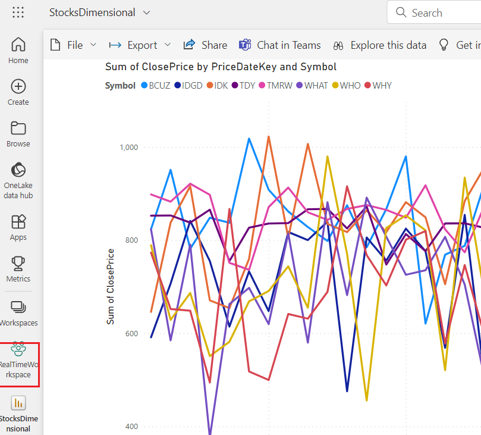
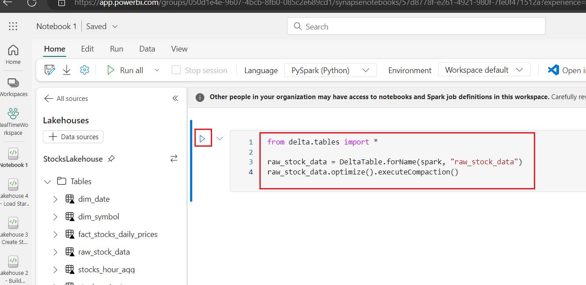
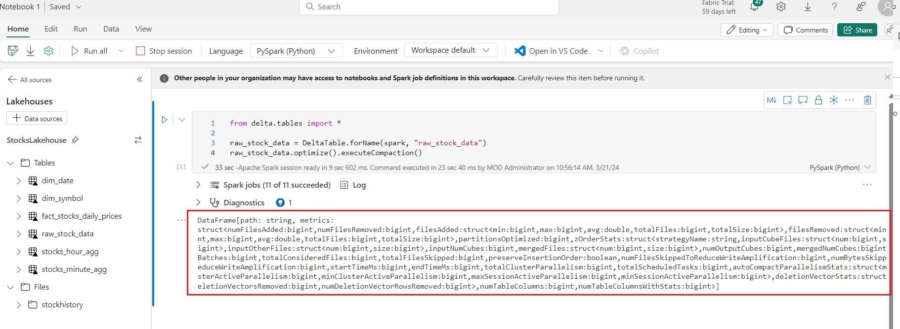
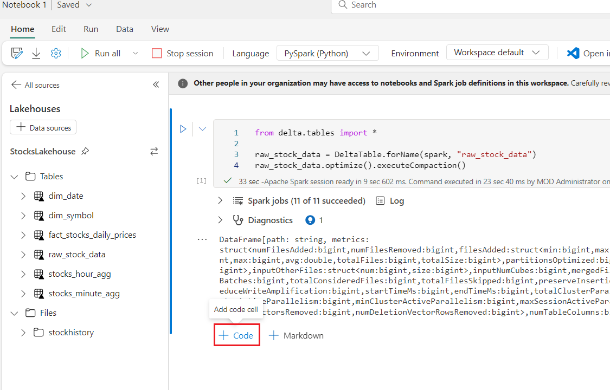

**Laboratorio 08-Mantenimiento de archivos Delta**

**Introducción**

Cuando se introducen datos en tiempo real en Lakehouse, Delta tables
tienden a estar repartidas en muchos archivos Parquet pequeños. Tener
muchos archivos pequeños hace que las consultas se ejecuten más
lentamente al introducir una gran cantidad de sobrecarga de I/O,
casualmente conocido como el "problema del archivo pequeño". Este módulo
trata de la optimización de las tablas Delta.

**Objetivo**

- Para realizar la compactación de archivos pequeños en Delta Lake.

## Ejercicio 1: Compactación de archivos pequeños

Con el Eventstream escribiendo continuamente datos en Lakehouse, se
generarán miles de archivos al día que afectarán al rendimiento general
cuando se ejecuten consultas. Al ejecutar notebooks, es posible que
aparezca una advertencia del motor de diagnóstico indicando que una
tabla puede beneficiarse de la compactación de archivos pequeños, un
proceso que combina muchos archivos pequeños en archivos más grandes.

1.  Haga clic en **RealTimeWorkspace** en el menú de navegación de la
    izquierda.

      

2.  Delta Lake facilita la compactación de archivos pequeños y puede
    ejecutarse en Spark SQL, Python o Scala. La tabla *raw_stock_data*
    es la principal tabla que requiere un mantenimiento rutinario, pero
    todas las tablas deben supervisarse y optimizarse según sea
    necesario.

3.  Para compactar archivos pequeños usando Python, en la página del
    espacio de trabajo de **Synapse Data Engineering**, navegue y haga
    clic en el botón **+New**, luego seleccione **Notebook.**

      

4.  En el Explorador, seleccione el **Lakehouse** y haga clic en el
    botón ***Add***.

     
>
     

5.  En el cuadro de diálogo **Add Lakehouse**, seleccione el botón de
    opción **Existing** **Lakehouse existente** y haga clic en el botón
    **Add**.

      

6.  En la ventana **OneLake data hub**, seleccione ***StockLakehouse***
    y haga clic en el botón **Add**. 

7.  En el editor de consultas, copia y pega el siguiente código.
    Seleccione y **Ejecute** la celda para ejecutar la consulta. Después
    de que la consulta se ejecute correctamente, verá los resultados.
```
from delta.tables import *
raw_stock_data = DeltaTable.forName (spark, "raw_stock_data")
raw_stock_data.optimize().executeCompaction()
```
   
     

8.  Ejecute la compactación ad-hoc de archivos pequeños navegando hasta
    Lakehouse en su espacio de trabajo de Fabric, y haga clic en la
    elipsis a la derecha del nombre de la tabla y seleccione
    *Maintenance*.

9.  Utilice el icono **+ Code** situado debajo de la output de la celda
    para añadir el siguiente código y utilice el botón **▷ Run cell**
    situado a la izquierda de la celda para ejecutarlo.

     
```
from delta.tables import *

if spark.catalog.tableExists("dim_date"):
    table = DeltaTable.forName(spark, "dim_date")
    table.optimize().executeCompaction()

if spark.catalog.tableExists("dim_symbol"):
    table = DeltaTable.forName(spark, "dim_symbol")
    table.optimize().executeCompaction()

if spark.catalog.tableExists("fact_stocks_daily_prices"):
    table = DeltaTable.forName(spark, "fact_stocks_daily_prices")
    table.optimize().executeCompaction()

if spark.catalog.tableExists("raw_stock_data"):
    table = DeltaTable.forName(spark, "raw_stock_data")
    table.optimize().executeCompaction()
    table.vacuum()
```

     
>
> La tabla *raw_stock_data* es la que tardará más tiempo en optimizarse,
> y también es la más importante para optimizar con regularidad. Fíjese
> también en el uso de *vacuum*. El comando *vacuum* elimina los
> archivos más antiguos que el periodo de retención, que es de 7 días
> por defecto. Aunque la eliminación de archivos antiguos debería tener
> poco impacto en el rendimiento (ya que ya no se utilizan), pueden
> aumentar los costes de almacenamiento y afectar potencialmente a los
> trabajos que podrían procesar las copias de seguridad de esos
> archivos, etc.

## **Resumen**

En este laboratorio, ha realizado la compactación de archivos pequeños
utilizando Python dentro del espacio de trabajo de Synapse Data
Engineering..
