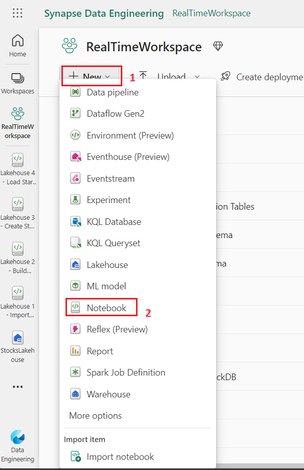

# Lab 08-Delta File Maintenance

**Introduction**

When ingesting real-time data into the Lakehouse, Delta tables will tend
to be spread over many small Parquet files. Having many small files
causes the queries to run slower by introducing a large amount of I/O
overhead, casually referred to as the "small file problem." This module
looks at optimizing Delta tables.

**Objective**

- To perform small file compaction in Delta Lake.

## Exercise 1: Small File Compaction

With the Eventstream continually writing data to the Lakehouse,
thousands of files will be generated daily and impact overall
performance when running queries. When running notebooks, you may see a
warning from the diagnostics engine indicating a table may benefit from
small file compaction, a process that combines many small files into
larger files.

1.  Click on **RealTimeWorkspace** on the left-sided navigation menu.

      

2.  Delta Lake makes performing small file compaction very easy and can
    be executed in either Spark SQL, Python, or Scala.
    The *raw_stock_data* table is the main table that requires routine
    maintenance, but all tables should be monitored and optimized as
    needed.

3.  To compact small files using Python, in the **Synapse Data
    Engineering** workspace page, navigate and click on **+New** button,
    then select **Notebook.**
    
      

5.  Under the Explorer, select the **Lakehouse**, then click on the
    **Add** button.

      
      

6.  In the **Add Lakehouse** dialog box, select the **Existing
    lakehouse** radio button and click on the **Add** button.
      

7.  On the **OneLake data hub** window, select ***StockLakehouse*** and
    click on the **Add** button.
      

8.  In the query editor, copy and paste the following code. Select and
    **Run** the cell to execute the query. After the query is
    successfully executed, you will see the results.
```
from delta.tables import *
raw_stock_data = DeltaTable.forName (spark, "raw_stock_data”)
raw_stock_data.optimize().executeCompaction()
```
   
   

8.  Run small file compaction ad-hoc by navigating to the Lakehouse in
    your Fabric workspace, and click the ellipsis to the right of the
    table name and select *Maintenance*.

9.  Use the **+ Code** icon below the cell output to add the following
    code and use the **▷ Run cell** button on the left of the cell to
    run it.

      
```    
from delta.tables import *

if spark.catalog.tableExists("dim_date"):
    table = DeltaTable.forName(spark, "dim_date")
    table.optimize().executeCompaction()

if spark.catalog.tableExists("dim_symbol"):
    table = DeltaTable.forName(spark, "dim_symbol")
    table.optimize().executeCompaction()

if spark.catalog.tableExists("fact_stocks_daily_prices"):
    table = DeltaTable.forName(spark, "fact_stocks_daily_prices")
    table.optimize().executeCompaction()

if spark.catalog.tableExists("raw_stock_data"):
    table = DeltaTable.forName(spark, "raw_stock_data")
    table.optimize().executeCompaction()
    table.vacuum()
```

> The *raw_stock_data* table will take the most time to optimize, and is
> also the most important to optimize regularly. Also, notice the use
> of *vacuum*. The *vacuum* command removes files older than the
> retention period, which is 7 days by default. While removing old files
> should have little impact on performance (as they are no longer used),
> they can increase storage costs and potentially impact jobs that might
> process those files backups, etc.

## **Summary**

In this lab, you’ve performed small file compaction using Python within
the Synapse Data Engineering workspace..
